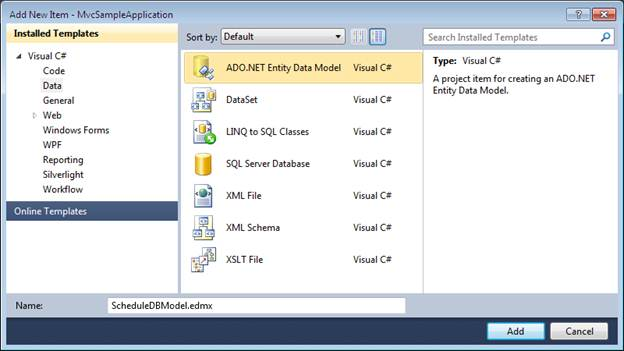
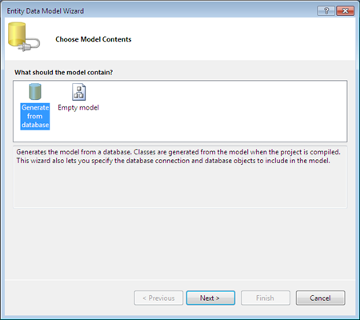
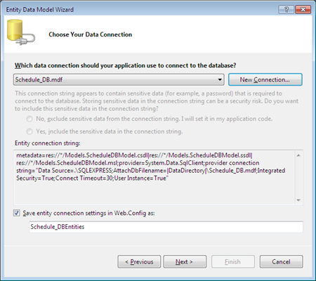
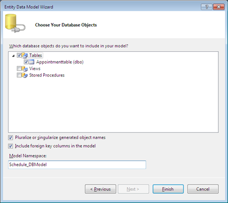
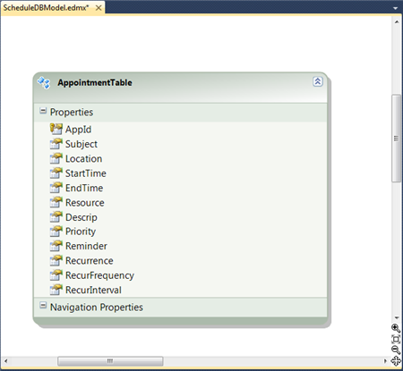

::: {style="DISPLAY: none"}
{#d2h_url_template}{#d2h_package_url style="WIDTH: 0px; DISPLAY: none; HEIGHT: 0px"}
:::

::::: {#nsbanner .d2h_main_nsbanner style="BORDER-BOTTOM: #999999 1px solid; POSITION: relative; PADDING-BOTTOM: 0px; BACKGROUND-COLOR: transparent; PADDING-LEFT: 0px; PADDING-RIGHT: 0px; DISPLAY: none; BORDER-TOP: #999999 1px solid; PADDING-TOP: 0px; LEFT: 0px"}
:::: {#TitleRow .d2h_main_titlerow style="PADDING-BOTTOM: 4px; BACKGROUND-COLOR: transparent; PADDING-LEFT: 22px; WIDTH: 100%; PADDING-RIGHT: 10px; DISPLAY: none; PADDING-TOP: 4px"}
::: {#ienav .d2h_main_ienav style="DISPLAY: none"}
{#D2HPrevious .D2HPreviousEnabled}  {#D2HNext .D2HNextEnabled}
:::
::::
:::::

:::: {#nstext .d2h_main_nstext style="PADDING-BOTTOM: 10px; BACKGROUND-COLOR: transparent; PADDING-LEFT: 22px; PADDING-RIGHT: 10px; HEIGHT: 100%; OVERFLOW: auto; PADDING-TOP: 5px" hasuserbackground="true" valign="bottom"}
::: {#d2h_breadcrumbs .d2h_breadcrumbs}
[Essential Studio User Guide Documentation](ms-xhelp:///?Id=12457748-09e3-4d74-a240-8e049cedf030){.d2h_breadcrumbsNormal}[ \> ]{.d2h_breadcrumbsLinkSeparator}[User Interface Edition](ms-xhelp:///?Id=c29296b7-531c-413b-a0ec-488ca1f7f669){.d2h_breadcrumbsNormal}[ \> ]{.d2h_breadcrumbsLinkSeparator}[Essential ASP.NET MVC](ms-xhelp:///?Id=4b14e7d1-65c4-4f67-b1aa-2c37709905a5){.d2h_breadcrumbsNormal}[ \> ]{.d2h_breadcrumbsLinkSeparator}[Essential Schedule]{.d2h_breadcrumbsContentsOnly}[ \> ]{.d2h_breadcrumbsLinkSeparator}[How To](ms-xhelp:///?Id=84ce0346-a231-4679-a834-37b06c85ce69){.d2h_breadcrumbsNormal}
:::

## Creating the ADO.NET Entity Data Model {#creating-the-ado.net-entity-data-model style="tab-stops: 0pt"}

In order to use the Entity Framework, you need to create an Entity Data Model. You can take advantage of the Visual Studio *Entity Data Model Wizard* to generate an Entity Data Model from a database automatically.

 

To create the ADO.NET Entity Data Model:

[]{style="FONT-FAMILY: 'Calibri','sans-serif'"} 

1.   Right-click the **Models** folder in the **Solution Explorer** window and select the menu option **Add New Item**.

2.   In the **Add New Item** dialog, select the **Data category** (see Figure 107).

[]{style="FONT-FAMILY: 'Calibri','sans-serif'"} 

{border="0"}

Figure 155[: Creating a new Entity Data Model]{style="FONT-STYLE: normal"}

*[]{style="FONT-FAMILY: 'Calibri','sans-serif'; COLOR: black"}* 

3.   Select the **ADO.NET Entity Data Model** template, give the Entity Data Model the name ScheduleDBModel.edmx, and click **Add** . Clicking **Add,** launches the **Data Model Wizard**.

4.   In the **Choose Model Contents** step, choose the **Generate from a database** option and click **Next** (see Figure 108).

[]{style="FONT-FAMILY: 'Calibri','sans-serif'"} 

{border="0"}

Figure 156:[Choose Model Contents Step]{style="FONT-STYLE: normal"}

*[]{style="FONT-FAMILY: 'Calibri','sans-serif'; COLOR: black"}* 

5.   In the **Choose Your Data Connection** step, select the Schedule_DB.mdf database connection, enter the entities connection settings name Schedule_DBEntities, and click **Next** (see Figure 109).

[]{style="FONT-FAMILY: 'Calibri','sans-serif'"} 

{border="0"}

Figure 157[: Choose Your Data Connection]{style="FONT-STYLE: normal"}[]{style="FONT-STYLE: normal; FONT-FAMILY: 'Calibri','sans-serif'"}

*[]{style="FONT-FAMILY: 'Calibri','sans-serif'; COLOR: black"}* 

6.   In the **Choose Your Database Objects** step, select  all the database appointment tables and click **Finish**  (see Figure110).

[]{style="FONT-FAMILY: 'Calibri','sans-serif'"} 

{border="0"}

Figure 158[: Choose Your Database Objects]{style="FONT-STYLE: normal"}

**[]{style="FONT-FAMILY: 'Calibri','sans-serif'"}** 

When you have completed you should have something like this:

[]{style="FONT-FAMILY: 'Calibri','sans-serif'"} 

{border="0"}

Figure 159[: ScheduleDbEntity Model]{style="FONT-STYLE: normal"}

*[]{style="FONT-FAMILY: 'Calibri','sans-serif'; COLOR: black"}* 

[]{#related-topics}
::::
