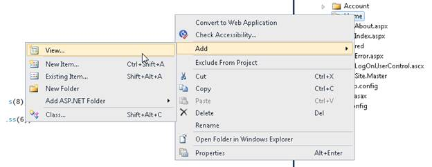
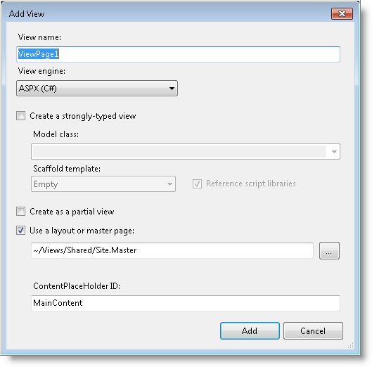

::: {style="DISPLAY: none"}
{#d2h_url_template}{#d2h_package_url style="WIDTH: 0px; DISPLAY: none; HEIGHT: 0px"}
:::

::::: {#nsbanner .d2h_main_nsbanner style="BORDER-BOTTOM: #999999 1px solid; POSITION: relative; PADDING-BOTTOM: 0px; BACKGROUND-COLOR: transparent; PADDING-LEFT: 0px; PADDING-RIGHT: 0px; DISPLAY: none; BORDER-TOP: #999999 1px solid; PADDING-TOP: 0px; LEFT: 0px"}
:::: {#TitleRow .d2h_main_titlerow style="PADDING-BOTTOM: 4px; BACKGROUND-COLOR: transparent; PADDING-LEFT: 22px; WIDTH: 100%; PADDING-RIGHT: 10px; DISPLAY: none; PADDING-TOP: 4px"}
::: {#ienav .d2h_main_ienav style="DISPLAY: none"}
{#D2HPrevious .D2HPreviousEnabled}  {#D2HNext .D2HNextEnabled}
:::
::::
:::::

:::: {#nstext .d2h_main_nstext style="PADDING-BOTTOM: 10px; BACKGROUND-COLOR: transparent; PADDING-LEFT: 22px; PADDING-RIGHT: 10px; HEIGHT: 100%; OVERFLOW: auto; PADDING-TOP: 5px" hasuserbackground="true" valign="bottom"}
::: {#d2h_breadcrumbs .d2h_breadcrumbs}
[Essential Studio User Guide Documentation](ms-xhelp:///?Id=12457748-09e3-4d74-a240-8e049cedf030){.d2h_breadcrumbsNormal}[ \> ]{.d2h_breadcrumbsLinkSeparator}[User Interface Edition](ms-xhelp:///?Id=c29296b7-531c-413b-a0ec-488ca1f7f669){.d2h_breadcrumbsNormal}[ \> ]{.d2h_breadcrumbsLinkSeparator}[Essential ASP.NET MVC](ms-xhelp:///?Id=4b14e7d1-65c4-4f67-b1aa-2c37709905a5){.d2h_breadcrumbsNormal}[ \> ]{.d2h_breadcrumbsLinkSeparator}[Essential Chart]{.d2h_breadcrumbsContentsOnly}[ \> ]{.d2h_breadcrumbsLinkSeparator}[Getting Started](ms-xhelp:///?Id=30fbb064-4c5c-425c-8c35-28b16d94c58d){.d2h_breadcrumbsNormal}[ \> ]{.d2h_breadcrumbsLinkSeparator}[Adding Essential Chart to the Application](ms-xhelp:///?Id=e0c4d55f-b8db-4833-b317-501af9caf88a){.d2h_breadcrumbsNormal}
:::

### Creating the Chart control in the View {#creating-the-chart-control-in-the-view style="tab-stops: 0pt"}

The following are the steps to create the **Chart** control in the **View** are:*[]{style="COLOR: #4f81bd"}*

1.   Right-click the **Views/Home** folder.

2.   Select **Add \> View**.

 

{border="0"}

Figure 1: Add View Menu

 

The **Add View** dialog will open.

{border="0"}

3.   Name the View as needed. For example **SimpleChart**.

4.   Add the following code in the **SimpleChart.aspx** file, to create the Chart control in the View page.

[]{style="FONT-FAMILY: 'Calibri','sans-serif'; COLOR: black"} 

+-------------------------------------------------------------------------------------------------------------------------------------------------------------------------------------------------------+
| **[View\[ASPX\]]{style="FONT-FAMILY: 'Courier New'"}**                                                                                                                                                |
|                                                                                                                                                                                                       |
| [    [\<%]{style="BACKGROUND: yellow"}[=]{style="COLOR: blue"} Html.Chart([\"SimpleChart\"]{style="COLOR: #a31515"})]{style="FONT-FAMILY: 'Courier New'"}                                             |
|                                                                                                                                                                                                       |
| [        .Skins([ChartModelSkins]{style="COLOR: #2b91af"}.Office2007Blue)]{style="FONT-FAMILY: 'Courier New'"}                                                                                        |
|                                                                                                                                                                                                       |
| [        .ShowLegend([false]{style="COLOR: blue"})]{style="FONT-FAMILY: 'Courier New'"}                                                                                                               |
|                                                                                                                                                                                                       |
| [        .SmoothingMode(System.Drawing.Drawing2D.[SmoothingMode]{style="COLOR: #2b91af"}.AntiAlias)]{style="FONT-FAMILY: 'Courier New'"}                                                              |
|                                                                                                                                                                                                       |
| [        .BorderAppearance(borderApp =\> {            borderApp.SkinStyle(Syncfusion.Windows.Forms.Chart.[ChartBorderSkinStyle]{style="COLOR: #2b91af"}.Pinned);]{style="FONT-FAMILY: 'Courier New'"} |
|                                                                                                                                                                                                       |
| [        })]{style="FONT-FAMILY: 'Courier New'"}                                                                                                                                                      |
|                                                                                                                                                                                                       |
| [    [%\>]{style="BACKGROUND: yellow"}]{style="FONT-FAMILY: 'Courier New'"}[]{style="FONT-FAMILY: Consolas; COLOR: blue; FONT-SIZE: 9.5pt"}                                                           |
+-------------------------------------------------------------------------------------------------------------------------------------------------------------------------------------------------------+

[]{style="FONT-FAMILY: 'Calibri','sans-serif'"} 

1.   Open \~/Controllers/HomeController.cs.

2.   Include the following namespaces in the HomeController:

 

[·      ]{style="FONT-FAMILY: Symbol"}Syncfusion.Mvc.Chart

[·      ]{style="FONT-FAMILY: Symbol"}Syncfusion.Mvc.Shared

[·      ]{style="FONT-FAMILY: Symbol"}Syncfusion.Windows.Forms.Chart

[]{style="FONT-FAMILY: Consolas; FONT-SIZE: 9.5pt"} 

+--------------------------------------------------------------------------------------------------------------------------------+
| **[\[C#\]]{style="FONT-FAMILY: 'Courier New'"}**                                                                               |
|                                                                                                                                |
| **[]{style="FONT-FAMILY: 'Courier New'"}**                                                                                     |
|                                                                                                                                |
| [using]{style="FONT-FAMILY: 'Courier New'; COLOR: blue"}[ Syncfusion.Mvc.Chart;]{style="FONT-FAMILY: 'Courier New'"}           |
|                                                                                                                                |
| [using]{style="FONT-FAMILY: 'Courier New'; COLOR: blue"}[ Syncfusion.Mvc.Shared;]{style="FONT-FAMILY: 'Courier New'"}          |
|                                                                                                                                |
| [using]{style="FONT-FAMILY: 'Courier New'; COLOR: blue"}[ Syncfusion.Windows.Forms.Chart;]{style="FONT-FAMILY: 'Courier New'"} |
|                                                                                                                                |
| []{style="FONT-FAMILY: Consolas; COLOR: blue; FONT-SIZE: 9.5pt"}                                                               |
+--------------------------------------------------------------------------------------------------------------------------------+

[]{style="FONT-FAMILY: 'Calibri','sans-serif'"} 

3.   Add the action displayed below.

[]{style="FONT-FAMILY: 'Calibri','sans-serif'"} 

+--------------------------------------------------------------------------------------------------------------------------------------------------------------------------------------------------------------------------------------------------------------------------------------------------------------------------------------------------------------------------------------------------------------------------------------------------+
| **[\[C#\]]{style="FONT-FAMILY: 'Courier New'"}**                                                                                                                                                                                                                                                                                                                                                                                                 |
|                                                                                                                                                                                                                                                                                                                                                                                                                                                  |
| **[]{style="FONT-FAMILY: 'Courier New'"}**                                                                                                                                                                                                                                                                                                                                                                                                       |
|                                                                                                                                                                                                                                                                                                                                                                                                                                                  |
| [///]{style="FONT-FAMILY: Consolas; COLOR: gray; FONT-SIZE: 9.5pt"}[ ]{style="FONT-FAMILY: Consolas; COLOR: green; FONT-SIZE: 9.5pt"}[\<summary\>]{style="FONT-FAMILY: Consolas; COLOR: gray; FONT-SIZE: 9.5pt"}[]{style="FONT-FAMILY: Consolas; FONT-SIZE: 9.5pt"}                                                                                                                                                                              |
|                                                                                                                                                                                                                                                                                                                                                                                                                                                  |
| [///]{style="FONT-FAMILY: Consolas; COLOR: gray; FONT-SIZE: 9.5pt"}[ Used to create the simple chart]{style="FONT-FAMILY: Consolas; COLOR: green; FONT-SIZE: 9.5pt"}[]{style="FONT-FAMILY: Consolas; FONT-SIZE: 9.5pt"}                                                                                                                                                                                                                          |
|                                                                                                                                                                                                                                                                                                                                                                                                                                                  |
| [///]{style="FONT-FAMILY: Consolas; COLOR: gray; FONT-SIZE: 9.5pt"}[ ]{style="FONT-FAMILY: Consolas; COLOR: green; FONT-SIZE: 9.5pt"}[\</summary\>]{style="FONT-FAMILY: Consolas; COLOR: gray; FONT-SIZE: 9.5pt"}[]{style="FONT-FAMILY: Consolas; FONT-SIZE: 9.5pt"}                                                                                                                                                                             |
|                                                                                                                                                                                                                                                                                                                                                                                                                                                  |
| [///]{style="FONT-FAMILY: Consolas; COLOR: gray; FONT-SIZE: 9.5pt"}[ ]{style="FONT-FAMILY: Consolas; COLOR: green; FONT-SIZE: 9.5pt"}[\<returns\>]{style="FONT-FAMILY: Consolas; COLOR: gray; FONT-SIZE: 9.5pt"}[View page, it displays the Chart]{style="FONT-FAMILY: Consolas; COLOR: green; FONT-SIZE: 9.5pt"}[\</returns\>]{style="FONT-FAMILY: Consolas; COLOR: gray; FONT-SIZE: 9.5pt"}[]{style="FONT-FAMILY: Consolas; FONT-SIZE: 9.5pt"} |
|                                                                                                                                                                                                                                                                                                                                                                                                                                                  |
| [public]{style="FONT-FAMILY: Consolas; COLOR: blue; FONT-SIZE: 9.5pt"}[ [ActionResult]{style="COLOR: #2b91af"} ]{style="FONT-FAMILY: Consolas; FONT-SIZE: 9.5pt"}[SimpleChart]{style="FONT-FAMILY: 'Calibri','sans-serif'"}[()]{style="FONT-FAMILY: Consolas; FONT-SIZE: 9.5pt"}                                                                                                                                                                 |
|                                                                                                                                                                                                                                                                                                                                                                                                                                                  |
| [{]{style="FONT-FAMILY: Consolas; FONT-SIZE: 9.5pt"}                                                                                                                                                                                                                                                                                                                                                                                             |
|                                                                                                                                                                                                                                                                                                                                                                                                                                                  |
| [return]{style="FONT-FAMILY: Consolas; COLOR: blue; FONT-SIZE: 9.5pt"}[ View();]{style="FONT-FAMILY: Consolas; FONT-SIZE: 9.5pt"}                                                                                                                                                                                                                                                                                                                |
|                                                                                                                                                                                                                                                                                                                                                                                                                                                  |
| [}]{style="FONT-FAMILY: Consolas; FONT-SIZE: 9.5pt"}                                                                                                                                                                                                                                                                                                                                                                                             |
|                                                                                                                                                                                                                                                                                                                                                                                                                                                  |
| []{style="FONT-FAMILY: Consolas; COLOR: blue; FONT-SIZE: 9.5pt"}                                                                                                                                                                                                                                                                                                                                                                                 |
+--------------------------------------------------------------------------------------------------------------------------------------------------------------------------------------------------------------------------------------------------------------------------------------------------------------------------------------------------------------------------------------------------------------------------------------------------+

 

4.   Run the application.

[]{style="FONT-FAMILY: 'Calibri','sans-serif'"} 

The following screenshot illustrates the sample output.

[]{style="FONT-FAMILY: 'Calibri','sans-serif'"} 

[]{style="FONT-FAMILY: 'Calibri','sans-serif'"} 

{border="0"}

*[]{style="FONT-FAMILY: 'Calibri','sans-serif'"}* 

Figure 46: Chart control added to the application

***[]{style="FONT-FAMILY: 'Calibri','sans-serif'"}*** 

[]{#related-topics}
::::
