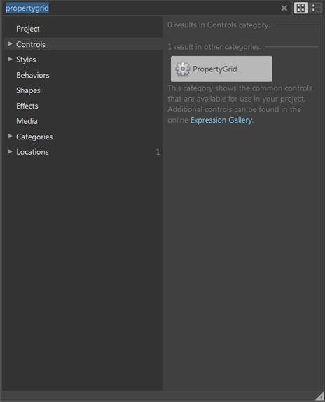
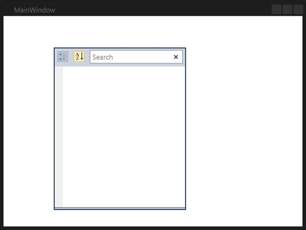

::: {style="DISPLAY: none"}
{#d2h_url_template}{#d2h_package_url style="WIDTH: 0px; DISPLAY: none; HEIGHT: 0px"}
:::

::: {.d2h_secondary_topic style="PADDING-BOTTOM: 10pt; MARGIN: 0pt; PADDING-LEFT: 0pt; PADDING-RIGHT: 0pt; PADDING-TOP: 0pt"}
#### Creating the Control through Expression Blend {#creating-the-control-through-expression-blend style="tab-stops: 0pt"}

The PropertyGrid control can also be created and configured using Microsoft Expression Blend. To create the control through Expression Blend:

6.  [Create a WPF project in Expression Blend and add the reference to the following assemblies:]{style="FONT-FAMILY: 'Arial','sans-serif'"}

[·      ]{style="FONT-FAMILY: Symbol"}Syncfusion.Tools.Wpf

[·      ]{style="FONT-FAMILY: Symbol"}Syncfusion.Shared.Wpf

[·      ]{style="FONT-FAMILY: Symbol"}Syncfusion.PropertyGrid.Wpf

[·      ]{style="FONT-FAMILY: Symbol"}Syncfusion.Core

[]{style="FONT-FAMILY: 'Arial','sans-serif'"} 

7.  [Search for the **PropertyGrid** in the **Toolbox**.]{style="FONT-FAMILY: 'Arial','sans-serif'"}

 

{border="0"}

Figure 809: PropertyGrid in Expression Blend Toolbox

3.   Drag and drop the PropertyGrid into the designer. The PropertyGrid control is created as shown in the following screenshot.

{border="0"}

Figure 810: PropertyGrid in Expression Blend Designer

The user can customize any part of the PropertyGrid using the template editing feature in Expression Blend.

[]{#related-topics}
:::
