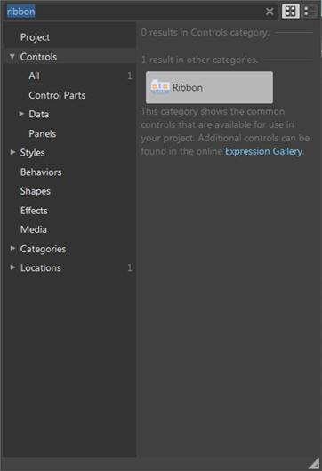
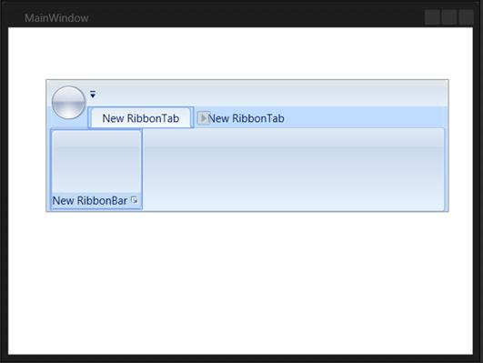
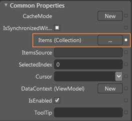
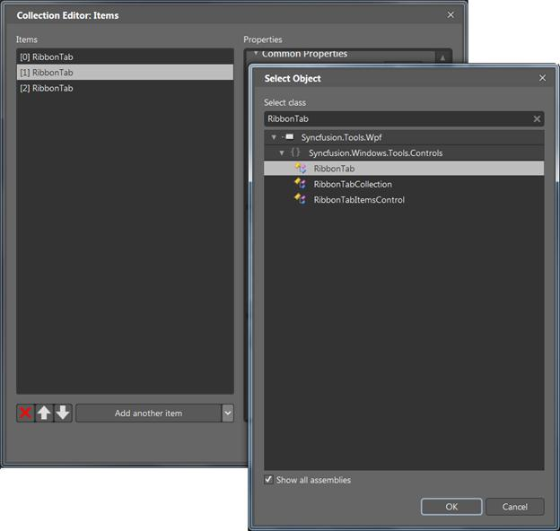

::: {style="DISPLAY: none"}
{#d2h_url_template}{#d2h_package_url style="WIDTH: 0px; DISPLAY: none; HEIGHT: 0px"}
:::

::: {.d2h_secondary_topic style="PADDING-BOTTOM: 10pt; MARGIN: 0pt; PADDING-LEFT: 0pt; PADDING-RIGHT: 0pt; PADDING-TOP: 0pt"}
#### Creating the Control through Expression Blend {#creating-the-control-through-expression-blend style="tab-stops: 0pt"}

Ribbon control can also be created and configured by using Expression Blend. To create control through the Expression Blend:

1.  Create a WPF project in the Expression Blend and add the reference to the following assemblies:

[·      ]{style="FONT-FAMILY: Symbol"}Syncfusion.Tools.Wpf

[·      ]{style="FONT-FAMILY: Symbol"}Syncfusion.Shared.Wpf

[·      ]{style="FONT-FAMILY: Symbol"}Syncfusion.Core

2.   Search the Ribbon in the toolbox.

{border="0"}

Figure 833: Ribbon in Expression Blend Toolbox

 

3.   Drag and drop the Ribbon into the designer. It will create the Ribbon control as shown below:

{border="0"}

Figure 834:Ribbon in Expression Blend Designer

 

4.   Add the Ribbon Tabs as follows:

[·      ]{style="FONT-FAMILY: Symbol"}Select the Ribbon and go to Properties area.

[·      ]{style="FONT-FAMILY: Symbol"}Click **Items (Collection)** under Common Properties

{border="0"}

Figure 835: Properties of Ribbon

 

The Collection Editor window opens:

{border="0"}

Figure 836: Collection Editor for Ribbon in Expression Blend

5.   Click **Add Another Item**. The Select Object window opens.

6.   Select the RibbonTab ( type RibbonTab in the search box )

7.   Click **OK**

8.   Edit the RibbonTab properties in the Collection Editor window

9.   Click **OK**

10.  Choose the RibbonTab and add the required RibbonBars

11.  Choose the RibbonBar and add the required controls

The control will be created.

 

 

 

[]{#related-topics}
:::
