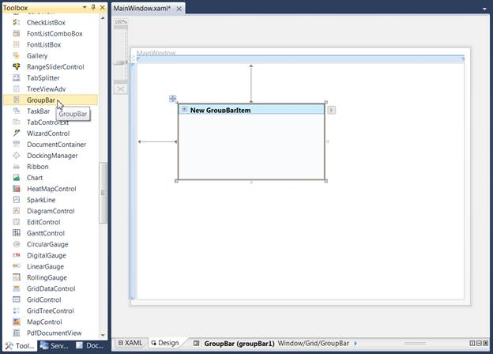
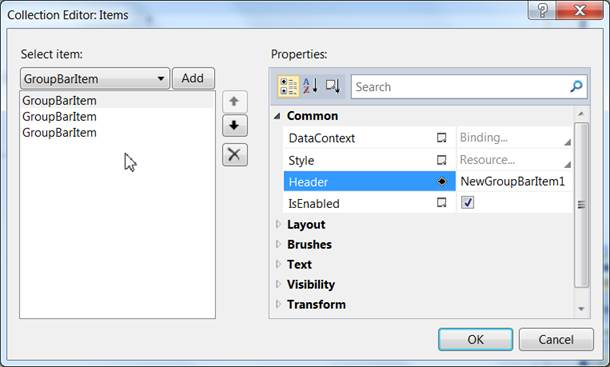
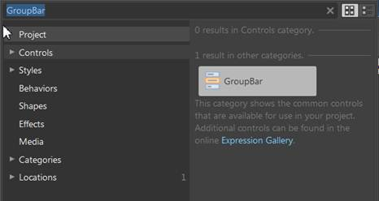
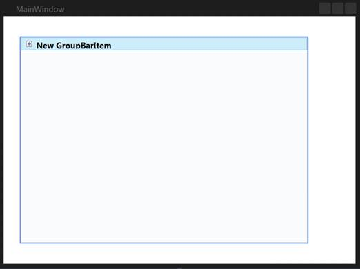
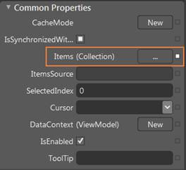
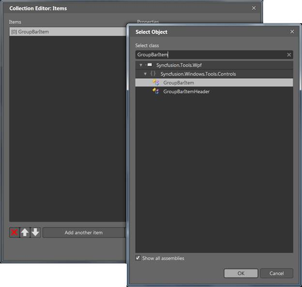

::: {style="DISPLAY: none"}
{#d2h_url_template}{#d2h_package_url style="WIDTH: 0px; DISPLAY: none; HEIGHT: 0px"}
:::

::: {.d2h_secondary_topic style="PADDING-BOTTOM: 10pt; MARGIN: 0pt; PADDING-LEFT: 0pt; PADDING-RIGHT: 0pt; PADDING-TOP: 0pt"}
#### Creating the Control through Visual Studio {#creating-the-control-through-visual-studio style="tab-stops: 0pt"}

 

The following steps describe how to create the GroupBar control via Visual Studio.

[]{style="FONT-SIZE: 9pt"} 

1.  Drag **GroupBar** from the Toolbox and drop it in the designer area. This will generate the GroupBar control.

[]{style="FONT-FAMILY: 'Trebuchet MS','sans-serif'; COLOR: #15428b; FONT-SIZE: 9pt"} 

{border="0"}

Figure 508: Design Time View of GroupBar Control

[]{style="FONT-FAMILY: 'Trebuchet MS','sans-serif'; COLOR: #15428b; FONT-SIZE: 9pt"} 

2\. To add items to GroupBarItems with the Collection Editor, select GroupBar and look at its properties. Click the button in the Items property. This will open the Collection Editor.

 

{border="0"}

Figure 509: Collection Editor for GroupBar

Using the Collection Editor, add the GroupBarItems and configure their properties.The GroupBar control can also be created and configured using Microsoft Expression Blend. Follow these steps to do so.

1.  Create a WPF project in Expression Blend and reference the following assemblies.

2.  Search for *GroupBar* in the toolbox.

 

{border="0"}

Figure 510: GroupBar in the Expression Blend Toolbox

3.  Drag **GroupBar** to the designer and drop it there. This will generate the control.

 

{border="0"}

Figure 511: GroupBar in the Expression Blend Designer

4.  To add items to the GroupBar control with the Collection Editor, select **GroupBar** and go to **Properties**. Next, click **Items (Collection)** under Common Properties.

{border="0"}

Figure 512:GroupBar properties

5.  Once the Collection Editor opens, click **Add Another Item** to open the **Select Object** window. Select the GroupBarItem by typing *GroupBarItem* in the search box and clicking OK.

 

{border="0"}

6.  Figure 513: Collection Editor for GroupBar in Expression BlendGroupBarItem using the properties in the Collection Editor.

You can also customize the appearance of the GroupBar control and its items by using the template-editing feature available in Expression Blend.

 

[]{#related-topics}
:::
