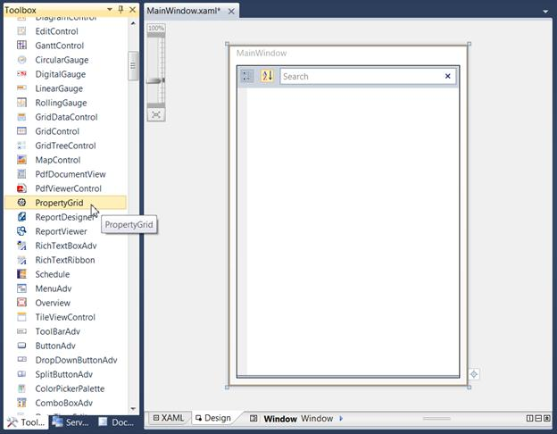

::: {style="DISPLAY: none"}
{#d2h_url_template}{#d2h_package_url style="WIDTH: 0px; DISPLAY: none; HEIGHT: 0px"}
:::

::: {.d2h_secondary_topic style="PADDING-BOTTOM: 10pt; MARGIN: 0pt; PADDING-LEFT: 0pt; PADDING-RIGHT: 0pt; PADDING-TOP: 0pt"}
#### Creating the Control through Visual Studio {#creating-the-control-through-visual-studio style="tab-stops: 0pt"}

To create the PropertyGrid control:

1.   Drag and drop the PropertyGrid from the Visual Studio **Toolbox** as shown below.

 

{border="0"}

Figure 808: PropertyGrid in VisualStudio Designer

 

2.   Configure the properties of the PropertyGrid using the VS **Properties** window.

 

[]{#related-topics}
:::
