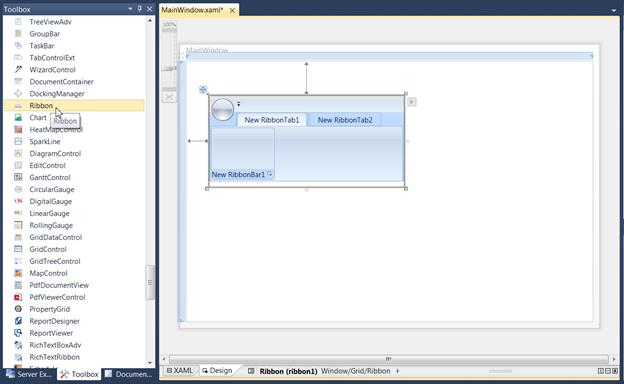
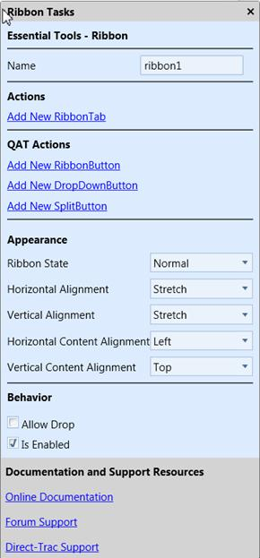
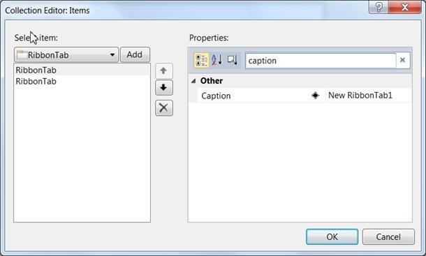

::: {style="DISPLAY: none"}
{#d2h_url_template}{#d2h_package_url style="WIDTH: 0px; DISPLAY: none; HEIGHT: 0px"}
:::

::: {.d2h_secondary_topic style="PADDING-BOTTOM: 10pt; MARGIN: 0pt; PADDING-LEFT: 0pt; PADDING-RIGHT: 0pt; PADDING-TOP: 0pt"}
#### Creating the Control through Visual Studio {#creating-the-control-through-visual-studio style="tab-stops: 0pt"}

To create a control using Visual Studio:

1.  Drag and drop the Ribbon control from toolbox to designer. It will generate the Ribbon as shown below:

{border="0"}

Figure 830:Ribbon In Visual Studio Designer

2.   Click on the **SmartTag** button in the Ribbon. The SmartTag opens as shown below:

{border="0"}

Figure 831: Smart Tag for Ribbon

 

The smart tag is used to add and configure items to the Ribbon. The Visual Studio's (VS's) property editor is used to configure ribbon properties. The Collection Editor shown in the following screenshot (can be opened by clicking the button in the Items property in the VS property grid) can be used to add items to the Ribbon:

{border="0"}

Figure 832:Collection Editor for Ribbon

 

[]{#related-topics}
:::
