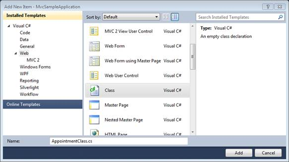

::: {style="DISPLAY: none"}
{#d2h_url_template}{#d2h_package_url style="WIDTH: 0px; DISPLAY: none; HEIGHT: 0px"}
:::

::::: {#nsbanner .d2h_main_nsbanner style="BORDER-BOTTOM: #999999 1px solid; POSITION: relative; PADDING-BOTTOM: 0px; BACKGROUND-COLOR: transparent; PADDING-LEFT: 0px; PADDING-RIGHT: 0px; DISPLAY: none; BORDER-TOP: #999999 1px solid; PADDING-TOP: 0px; LEFT: 0px"}
:::: {#TitleRow .d2h_main_titlerow style="PADDING-BOTTOM: 4px; BACKGROUND-COLOR: transparent; PADDING-LEFT: 22px; WIDTH: 100%; PADDING-RIGHT: 10px; DISPLAY: none; PADDING-TOP: 4px"}
::: {#ienav .d2h_main_ienav style="DISPLAY: none"}
{#D2HPrevious .D2HPreviousEnabled}  {#D2HNext .D2HNextEnabled}
:::
::::
:::::

:::: {#nstext .d2h_main_nstext style="PADDING-BOTTOM: 10px; BACKGROUND-COLOR: transparent; PADDING-LEFT: 22px; PADDING-RIGHT: 10px; HEIGHT: 100%; OVERFLOW: auto; PADDING-TOP: 5px" hasuserbackground="true" valign="bottom"}
::: {#d2h_breadcrumbs .d2h_breadcrumbs}
[Essential Studio User Guide Documentation](ms-xhelp:///?Id=12457748-09e3-4d74-a240-8e049cedf030){.d2h_breadcrumbsNormal}[ \> ]{.d2h_breadcrumbsLinkSeparator}[User Interface Edition](ms-xhelp:///?Id=c29296b7-531c-413b-a0ec-488ca1f7f669){.d2h_breadcrumbsNormal}[ \> ]{.d2h_breadcrumbsLinkSeparator}[Essential ASP.NET MVC](ms-xhelp:///?Id=4b14e7d1-65c4-4f67-b1aa-2c37709905a5){.d2h_breadcrumbsNormal}[ \> ]{.d2h_breadcrumbsLinkSeparator}[Essential Schedule]{.d2h_breadcrumbsContentsOnly}[ \> ]{.d2h_breadcrumbsLinkSeparator}[How To](ms-xhelp:///?Id=84ce0346-a231-4679-a834-37b06c85ce69){.d2h_breadcrumbsNormal}
:::

## Creating the Generic Collection Model {#creating-the-generic-collection-model style="tab-stops: 0pt"}

To create the Generic Collection Model:

1.   Right-click the **Models** folder in the **Solution Explorer** window and select the menu option **Add, New Item.**

2.   In the **Add New Item** dialog, select the Web category (see Figure 112).

[]{style="FONT-FAMILY: 'Calibri','sans-serif'"} 

{border="0"}

Figure 160: Select dialog

*[]{style="FONT-FAMILY: 'Calibri','sans-serif'; COLOR: black"}* 

3.   Select the **Class** file and give the class file name **AppointmentClass.cs** and click **Add**.

4.   Create an **Appointment** class  containing the  Id, Subject, StartTime, EndTime, Description and Owner as properties.

[]{style="FONT-FAMILY: 'Calibri','sans-serif'"} 

+-------------------------------------------------------------------------------------------------------------------------------------------------------------------------------------------+
| [    [///]{style="COLOR: gray"}[ ]{style="COLOR: green"}[\<summary\>]{style="COLOR: gray"}]{style="FONT-FAMILY: 'Calibri','sans-serif'"}                                                  |
|                                                                                                                                                                                           |
| [    [///]{style="COLOR: gray"}[ Appointment Class]{style="COLOR: green"}]{style="FONT-FAMILY: 'Calibri','sans-serif'"}                                                                   |
|                                                                                                                                                                                           |
| [    [///]{style="COLOR: gray"}[ ]{style="COLOR: green"}[\</summary\>]{style="COLOR: gray"}]{style="FONT-FAMILY: 'Calibri','sans-serif'"}                                                 |
|                                                                                                                                                                                           |
| [    [public]{style="COLOR: blue"} [class]{style="COLOR: blue"} [AppointmentClass]{style="COLOR: #2b91af"}]{style="FONT-FAMILY: 'Calibri','sans-serif'"}                                  |
|                                                                                                                                                                                           |
| [    {]{style="FONT-FAMILY: 'Calibri','sans-serif'"}                                                                                                                                      |
|                                                                                                                                                                                           |
| []{style="FONT-FAMILY: 'Calibri','sans-serif'"}                                                                                                                                           |
|                                                                                                                                                                                           |
| [        [private]{style="COLOR: blue"} [int]{style="COLOR: blue"} \_Id;]{style="FONT-FAMILY: 'Calibri','sans-serif'"}                                                                    |
|                                                                                                                                                                                           |
| []{style="FONT-FAMILY: 'Calibri','sans-serif'"}                                                                                                                                           |
|                                                                                                                                                                                           |
| [        [private]{style="COLOR: blue"} [string]{style="COLOR: blue"} \_Subject;]{style="FONT-FAMILY: 'Calibri','sans-serif'"}                                                            |
|                                                                                                                                                                                           |
| []{style="FONT-FAMILY: 'Calibri','sans-serif'"}                                                                                                                                           |
|                                                                                                                                                                                           |
| [        [private]{style="COLOR: blue"} [string]{style="COLOR: blue"} \_Location;]{style="FONT-FAMILY: 'Calibri','sans-serif'"}                                                           |
|                                                                                                                                                                                           |
| []{style="FONT-FAMILY: 'Calibri','sans-serif'"}                                                                                                                                           |
|                                                                                                                                                                                           |
| [        [private]{style="COLOR: blue"} System.[Nullable]{style="COLOR: #2b91af"}\<System.[DateTime]{style="COLOR: #2b91af"}\> \_StartTime;]{style="FONT-FAMILY: 'Calibri','sans-serif'"} |
|                                                                                                                                                                                           |
| []{style="FONT-FAMILY: 'Calibri','sans-serif'"}                                                                                                                                           |
|                                                                                                                                                                                           |
| [        [private]{style="COLOR: blue"} System.[Nullable]{style="COLOR: #2b91af"}\<System.[DateTime]{style="COLOR: #2b91af"}\> \_EndTime;]{style="FONT-FAMILY: 'Calibri','sans-serif'"}   |
|                                                                                                                                                                                           |
| []{style="FONT-FAMILY: 'Calibri','sans-serif'"}                                                                                                                                           |
|                                                                                                                                                                                           |
| [        [private]{style="COLOR: blue"} [string]{style="COLOR: blue"} \_Description;]{style="FONT-FAMILY: 'Calibri','sans-serif'"}                                                        |
|                                                                                                                                                                                           |
| []{style="FONT-FAMILY: 'Calibri','sans-serif'"}                                                                                                                                           |
|                                                                                                                                                                                           |
| [        [private]{style="COLOR: blue"} System.[Nullable]{style="COLOR: #2b91af"}\<[int]{style="COLOR: blue"}\> \_Owner;]{style="FONT-FAMILY: 'Calibri','sans-serif'"}                    |
|                                                                                                                                                                                           |
| []{style="FONT-FAMILY: 'Calibri','sans-serif'"}                                                                                                                                           |
|                                                                                                                                                                                           |
| [        [///]{style="COLOR: gray"}[ ]{style="COLOR: green"}[\<summary\>]{style="COLOR: gray"}]{style="FONT-FAMILY: 'Calibri','sans-serif'"}                                              |
|                                                                                                                                                                                           |
| [        [///]{style="COLOR: gray"}[ Gets or sets Appointment\'s Id]{style="COLOR: green"}]{style="FONT-FAMILY: 'Calibri','sans-serif'"}                                                  |
|                                                                                                                                                                                           |
| [        [///]{style="COLOR: gray"}[ ]{style="COLOR: green"}[\</summary\>]{style="COLOR: gray"}]{style="FONT-FAMILY: 'Calibri','sans-serif'"}                                             |
|                                                                                                                                                                                           |
| [        [public]{style="COLOR: blue"} [int]{style="COLOR: blue"} Id]{style="FONT-FAMILY: 'Calibri','sans-serif'"}                                                                        |
|                                                                                                                                                                                           |
| [        {]{style="FONT-FAMILY: 'Calibri','sans-serif'"}                                                                                                                                  |
|                                                                                                                                                                                           |
| [            [get]{style="COLOR: blue"}]{style="FONT-FAMILY: 'Calibri','sans-serif'"}                                                                                                     |
|                                                                                                                                                                                           |
| [            {]{style="FONT-FAMILY: 'Calibri','sans-serif'"}                                                                                                                              |
|                                                                                                                                                                                           |
| [                [return]{style="COLOR: blue"} [this]{style="COLOR: blue"}.\_Id;]{style="FONT-FAMILY: 'Calibri','sans-serif'"}                                                            |
|                                                                                                                                                                                           |
| [            }]{style="FONT-FAMILY: 'Calibri','sans-serif'"}                                                                                                                              |
|                                                                                                                                                                                           |
| [            [set]{style="COLOR: blue"}]{style="FONT-FAMILY: 'Calibri','sans-serif'"}                                                                                                     |
|                                                                                                                                                                                           |
| [            {]{style="FONT-FAMILY: 'Calibri','sans-serif'"}                                                                                                                              |
|                                                                                                                                                                                           |
| [                [if]{style="COLOR: blue"} (([this]{style="COLOR: blue"}.\_Id != [value]{style="COLOR: blue"}))]{style="FONT-FAMILY: 'Calibri','sans-serif'"}                             |
|                                                                                                                                                                                           |
| [                {]{style="FONT-FAMILY: 'Calibri','sans-serif'"}                                                                                                                          |
|                                                                                                                                                                                           |
| [                    [this]{style="COLOR: blue"}.\_Id = [value]{style="COLOR: blue"};]{style="FONT-FAMILY: 'Calibri','sans-serif'"}                                                       |
|                                                                                                                                                                                           |
| [                }]{style="FONT-FAMILY: 'Calibri','sans-serif'"}                                                                                                                          |
|                                                                                                                                                                                           |
| [            }]{style="FONT-FAMILY: 'Calibri','sans-serif'"}                                                                                                                              |
|                                                                                                                                                                                           |
| [        }]{style="FONT-FAMILY: 'Calibri','sans-serif'"}                                                                                                                                  |
|                                                                                                                                                                                           |
| [        [///]{style="COLOR: gray"}[ ]{style="COLOR: green"}[\<summary\>]{style="COLOR: gray"}]{style="FONT-FAMILY: 'Calibri','sans-serif'"}                                              |
|                                                                                                                                                                                           |
| [        [///]{style="COLOR: gray"}[ Gets or sets Appointment\'s Subject]{style="COLOR: green"}]{style="FONT-FAMILY: 'Calibri','sans-serif'"}                                             |
|                                                                                                                                                                                           |
| [        [///]{style="COLOR: gray"}[ ]{style="COLOR: green"}[\</summary\>]{style="COLOR: gray"}]{style="FONT-FAMILY: 'Calibri','sans-serif'"}                                             |
|                                                                                                                                                                                           |
| [        [public]{style="COLOR: blue"} [string]{style="COLOR: blue"} Subject]{style="FONT-FAMILY: 'Calibri','sans-serif'"}                                                                |
|                                                                                                                                                                                           |
| [        {]{style="FONT-FAMILY: 'Calibri','sans-serif'"}                                                                                                                                  |
|                                                                                                                                                                                           |
| [            [get]{style="COLOR: blue"}]{style="FONT-FAMILY: 'Calibri','sans-serif'"}                                                                                                     |
|                                                                                                                                                                                           |
| [            {]{style="FONT-FAMILY: 'Calibri','sans-serif'"}                                                                                                                              |
|                                                                                                                                                                                           |
| [                [return]{style="COLOR: blue"} [this]{style="COLOR: blue"}.\_Subject;]{style="FONT-FAMILY: 'Calibri','sans-serif'"}                                                       |
|                                                                                                                                                                                           |
| [            }]{style="FONT-FAMILY: 'Calibri','sans-serif'"}                                                                                                                              |
|                                                                                                                                                                                           |
| [            [set]{style="COLOR: blue"}]{style="FONT-FAMILY: 'Calibri','sans-serif'"}                                                                                                     |
|                                                                                                                                                                                           |
| [            {]{style="FONT-FAMILY: 'Calibri','sans-serif'"}                                                                                                                              |
|                                                                                                                                                                                           |
| [                [if]{style="COLOR: blue"} (([this]{style="COLOR: blue"}.\_Subject != [value]{style="COLOR: blue"}))]{style="FONT-FAMILY: 'Calibri','sans-serif'"}                        |
|                                                                                                                                                                                           |
| [                {]{style="FONT-FAMILY: 'Calibri','sans-serif'"}                                                                                                                          |
|                                                                                                                                                                                           |
| [                    [this]{style="COLOR: blue"}.\_Subject = [value]{style="COLOR: blue"};]{style="FONT-FAMILY: 'Calibri','sans-serif'"}                                                  |
|                                                                                                                                                                                           |
| [                }]{style="FONT-FAMILY: 'Calibri','sans-serif'"}                                                                                                                          |
|                                                                                                                                                                                           |
| [            }]{style="FONT-FAMILY: 'Calibri','sans-serif'"}                                                                                                                              |
|                                                                                                                                                                                           |
| [        }]{style="FONT-FAMILY: 'Calibri','sans-serif'"}                                                                                                                                  |
|                                                                                                                                                                                           |
| [        [///]{style="COLOR: gray"}[ ]{style="COLOR: green"}[\<summary\>]{style="COLOR: gray"}]{style="FONT-FAMILY: 'Calibri','sans-serif'"}                                              |
|                                                                                                                                                                                           |
| [        [///]{style="COLOR: gray"}[ Gets or sets Appointment\'s Location]{style="COLOR: green"}]{style="FONT-FAMILY: 'Calibri','sans-serif'"}                                            |
|                                                                                                                                                                                           |
| [        [///]{style="COLOR: gray"}[ ]{style="COLOR: green"}[\</summary\>]{style="COLOR: gray"}]{style="FONT-FAMILY: 'Calibri','sans-serif'"}                                             |
|                                                                                                                                                                                           |
| [        [public]{style="COLOR: blue"} [string]{style="COLOR: blue"} Location]{style="FONT-FAMILY: 'Calibri','sans-serif'"}                                                               |
|                                                                                                                                                                                           |
| [        {]{style="FONT-FAMILY: 'Calibri','sans-serif'"}                                                                                                                                  |
|                                                                                                                                                                                           |
| [            [get]{style="COLOR: blue"}]{style="FONT-FAMILY: 'Calibri','sans-serif'"}                                                                                                     |
|                                                                                                                                                                                           |
| [            {]{style="FONT-FAMILY: 'Calibri','sans-serif'"}                                                                                                                              |
|                                                                                                                                                                                           |
| [                [return]{style="COLOR: blue"} [this]{style="COLOR: blue"}.\_Location;]{style="FONT-FAMILY: 'Calibri','sans-serif'"}                                                      |
|                                                                                                                                                                                           |
| [            }]{style="FONT-FAMILY: 'Calibri','sans-serif'"}                                                                                                                              |
|                                                                                                                                                                                           |
| [            [set]{style="COLOR: blue"}]{style="FONT-FAMILY: 'Calibri','sans-serif'"}                                                                                                     |
|                                                                                                                                                                                           |
| [            {]{style="FONT-FAMILY: 'Calibri','sans-serif'"}                                                                                                                              |
|                                                                                                                                                                                           |
| [                [if]{style="COLOR: blue"} (([this]{style="COLOR: blue"}.\_Location != [value]{style="COLOR: blue"}))]{style="FONT-FAMILY: 'Calibri','sans-serif'"}                       |
|                                                                                                                                                                                           |
| [                {]{style="FONT-FAMILY: 'Calibri','sans-serif'"}                                                                                                                          |
|                                                                                                                                                                                           |
| [                    [this]{style="COLOR: blue"}.\_Location = [value]{style="COLOR: blue"};]{style="FONT-FAMILY: 'Calibri','sans-serif'"}                                                 |
|                                                                                                                                                                                           |
| [                }]{style="FONT-FAMILY: 'Calibri','sans-serif'"}                                                                                                                          |
|                                                                                                                                                                                           |
| [            }]{style="FONT-FAMILY: 'Calibri','sans-serif'"}                                                                                                                              |
|                                                                                                                                                                                           |
| [        }]{style="FONT-FAMILY: 'Calibri','sans-serif'"}                                                                                                                                  |
|                                                                                                                                                                                           |
| [        [///]{style="COLOR: gray"}[ ]{style="COLOR: green"}[\<summary\>]{style="COLOR: gray"}]{style="FONT-FAMILY: 'Calibri','sans-serif'"}                                              |
|                                                                                                                                                                                           |
| [        [///]{style="COLOR: gray"}[ Gets or sets Appointment\'s Start Time]{style="COLOR: green"}]{style="FONT-FAMILY: 'Calibri','sans-serif'"}                                          |
|                                                                                                                                                                                           |
| [        [///]{style="COLOR: gray"}[ ]{style="COLOR: green"}[\</summary\>]{style="COLOR: gray"}]{style="FONT-FAMILY: 'Calibri','sans-serif'"}                                             |
|                                                                                                                                                                                           |
| [        [public]{style="COLOR: blue"} System.[Nullable]{style="COLOR: #2b91af"}\<System.[DateTime]{style="COLOR: #2b91af"}\> StartTime]{style="FONT-FAMILY: 'Calibri','sans-serif'"}     |
|                                                                                                                                                                                           |
| [        {]{style="FONT-FAMILY: 'Calibri','sans-serif'"}                                                                                                                                  |
|                                                                                                                                                                                           |
| [            [get]{style="COLOR: blue"}]{style="FONT-FAMILY: 'Calibri','sans-serif'"}                                                                                                     |
|                                                                                                                                                                                           |
| [            {]{style="FONT-FAMILY: 'Calibri','sans-serif'"}                                                                                                                              |
|                                                                                                                                                                                           |
| [                [return]{style="COLOR: blue"} [this]{style="COLOR: blue"}.\_StartTime;]{style="FONT-FAMILY: 'Calibri','sans-serif'"}                                                     |
|                                                                                                                                                                                           |
| [            }]{style="FONT-FAMILY: 'Calibri','sans-serif'"}                                                                                                                              |
|                                                                                                                                                                                           |
| [            [set]{style="COLOR: blue"}]{style="FONT-FAMILY: 'Calibri','sans-serif'"}                                                                                                     |
|                                                                                                                                                                                           |
| [            {]{style="FONT-FAMILY: 'Calibri','sans-serif'"}                                                                                                                              |
|                                                                                                                                                                                           |
| [                [if]{style="COLOR: blue"} (([this]{style="COLOR: blue"}.\_StartTime != [value]{style="COLOR: blue"}))]{style="FONT-FAMILY: 'Calibri','sans-serif'"}                      |
|                                                                                                                                                                                           |
| [                {]{style="FONT-FAMILY: 'Calibri','sans-serif'"}                                                                                                                          |
|                                                                                                                                                                                           |
| [                    [this]{style="COLOR: blue"}.\_StartTime = [value]{style="COLOR: blue"};]{style="FONT-FAMILY: 'Calibri','sans-serif'"}                                                |
|                                                                                                                                                                                           |
| [                }]{style="FONT-FAMILY: 'Calibri','sans-serif'"}                                                                                                                          |
|                                                                                                                                                                                           |
| [            }]{style="FONT-FAMILY: 'Calibri','sans-serif'"}                                                                                                                              |
|                                                                                                                                                                                           |
| [        }]{style="FONT-FAMILY: 'Calibri','sans-serif'"}                                                                                                                                  |
|                                                                                                                                                                                           |
| [        [///]{style="COLOR: gray"}[ ]{style="COLOR: green"}[\<summary\>]{style="COLOR: gray"}]{style="FONT-FAMILY: 'Calibri','sans-serif'"}                                              |
|                                                                                                                                                                                           |
| [        [///]{style="COLOR: gray"}[ Gets or sets Appointment\'s End Time]{style="COLOR: green"}]{style="FONT-FAMILY: 'Calibri','sans-serif'"}                                            |
|                                                                                                                                                                                           |
| [        [///]{style="COLOR: gray"}[ ]{style="COLOR: green"}[\</summary\>]{style="COLOR: gray"}]{style="FONT-FAMILY: 'Calibri','sans-serif'"}                                             |
|                                                                                                                                                                                           |
| [        [public]{style="COLOR: blue"} System.[Nullable]{style="COLOR: #2b91af"}\<System.[DateTime]{style="COLOR: #2b91af"}\> EndTime]{style="FONT-FAMILY: 'Calibri','sans-serif'"}       |
|                                                                                                                                                                                           |
| [        {]{style="FONT-FAMILY: 'Calibri','sans-serif'"}                                                                                                                                  |
|                                                                                                                                                                                           |
| [            [get]{style="COLOR: blue"}]{style="FONT-FAMILY: 'Calibri','sans-serif'"}                                                                                                     |
|                                                                                                                                                                                           |
| [            {]{style="FONT-FAMILY: 'Calibri','sans-serif'"}                                                                                                                              |
|                                                                                                                                                                                           |
| [                [return]{style="COLOR: blue"} [this]{style="COLOR: blue"}.\_EndTime;]{style="FONT-FAMILY: 'Calibri','sans-serif'"}                                                       |
|                                                                                                                                                                                           |
| [            }]{style="FONT-FAMILY: 'Calibri','sans-serif'"}                                                                                                                              |
|                                                                                                                                                                                           |
| [            [set]{style="COLOR: blue"}]{style="FONT-FAMILY: 'Calibri','sans-serif'"}                                                                                                     |
|                                                                                                                                                                                           |
| [            {]{style="FONT-FAMILY: 'Calibri','sans-serif'"}                                                                                                                              |
|                                                                                                                                                                                           |
| [                [if]{style="COLOR: blue"} (([this]{style="COLOR: blue"}.\_EndTime != [value]{style="COLOR: blue"}))]{style="FONT-FAMILY: 'Calibri','sans-serif'"}                        |
|                                                                                                                                                                                           |
| [                {]{style="FONT-FAMILY: 'Calibri','sans-serif'"}                                                                                                                          |
|                                                                                                                                                                                           |
| [                    [this]{style="COLOR: blue"}.\_EndTime = [value]{style="COLOR: blue"};]{style="FONT-FAMILY: 'Calibri','sans-serif'"}                                                  |
|                                                                                                                                                                                           |
| [                }]{style="FONT-FAMILY: 'Calibri','sans-serif'"}                                                                                                                          |
|                                                                                                                                                                                           |
| [            }]{style="FONT-FAMILY: 'Calibri','sans-serif'"}                                                                                                                              |
|                                                                                                                                                                                           |
| [        }]{style="FONT-FAMILY: 'Calibri','sans-serif'"}                                                                                                                                  |
|                                                                                                                                                                                           |
| [        [///]{style="COLOR: gray"}[ ]{style="COLOR: green"}[\<summary\>]{style="COLOR: gray"}]{style="FONT-FAMILY: 'Calibri','sans-serif'"}                                              |
|                                                                                                                                                                                           |
| [        [///]{style="COLOR: gray"}[ Gets or sets Appointment\'s Description]{style="COLOR: green"}]{style="FONT-FAMILY: 'Calibri','sans-serif'"}                                         |
|                                                                                                                                                                                           |
| [        [///]{style="COLOR: gray"}[ ]{style="COLOR: green"}[\</summary\>]{style="COLOR: gray"}]{style="FONT-FAMILY: 'Calibri','sans-serif'"}                                             |
|                                                                                                                                                                                           |
| [        [public]{style="COLOR: blue"} [string]{style="COLOR: blue"} Description]{style="FONT-FAMILY: 'Calibri','sans-serif'"}                                                            |
|                                                                                                                                                                                           |
| [        {]{style="FONT-FAMILY: 'Calibri','sans-serif'"}                                                                                                                                  |
|                                                                                                                                                                                           |
| [            [get]{style="COLOR: blue"}]{style="FONT-FAMILY: 'Calibri','sans-serif'"}                                                                                                     |
|                                                                                                                                                                                           |
| [            {]{style="FONT-FAMILY: 'Calibri','sans-serif'"}                                                                                                                              |
|                                                                                                                                                                                           |
| [                [return]{style="COLOR: blue"} [this]{style="COLOR: blue"}.\_Description;]{style="FONT-FAMILY: 'Calibri','sans-serif'"}                                                   |
|                                                                                                                                                                                           |
| [            }]{style="FONT-FAMILY: 'Calibri','sans-serif'"}                                                                                                                              |
|                                                                                                                                                                                           |
| [            [set]{style="COLOR: blue"}]{style="FONT-FAMILY: 'Calibri','sans-serif'"}                                                                                                     |
|                                                                                                                                                                                           |
| [            {]{style="FONT-FAMILY: 'Calibri','sans-serif'"}                                                                                                                              |
|                                                                                                                                                                                           |
| [                [if]{style="COLOR: blue"} (([this]{style="COLOR: blue"}.\_Description != [value]{style="COLOR: blue"}))]{style="FONT-FAMILY: 'Calibri','sans-serif'"}                    |
|                                                                                                                                                                                           |
| [                {]{style="FONT-FAMILY: 'Calibri','sans-serif'"}                                                                                                                          |
|                                                                                                                                                                                           |
| [                    [this]{style="COLOR: blue"}.\_Description = [value]{style="COLOR: blue"};]{style="FONT-FAMILY: 'Calibri','sans-serif'"}                                              |
|                                                                                                                                                                                           |
| [                }]{style="FONT-FAMILY: 'Calibri','sans-serif'"}                                                                                                                          |
|                                                                                                                                                                                           |
| [            }]{style="FONT-FAMILY: 'Calibri','sans-serif'"}                                                                                                                              |
|                                                                                                                                                                                           |
| [        }]{style="FONT-FAMILY: 'Calibri','sans-serif'"}                                                                                                                                  |
|                                                                                                                                                                                           |
| [        [///]{style="COLOR: gray"}[ ]{style="COLOR: green"}[\<summary\>]{style="COLOR: gray"}]{style="FONT-FAMILY: 'Calibri','sans-serif'"}                                              |
|                                                                                                                                                                                           |
| [        [///]{style="COLOR: gray"}[ Gets or sets Appointment\'s Owner]{style="COLOR: green"}]{style="FONT-FAMILY: 'Calibri','sans-serif'"}                                               |
|                                                                                                                                                                                           |
| [        [///]{style="COLOR: gray"}[ ]{style="COLOR: green"}[\</summary\>]{style="COLOR: gray"}]{style="FONT-FAMILY: 'Calibri','sans-serif'"}                                             |
|                                                                                                                                                                                           |
| [        [public]{style="COLOR: blue"} System.[Nullable]{style="COLOR: #2b91af"}\<[int]{style="COLOR: blue"}\> Owner]{style="FONT-FAMILY: 'Calibri','sans-serif'"}                        |
|                                                                                                                                                                                           |
| [        {]{style="FONT-FAMILY: 'Calibri','sans-serif'"}                                                                                                                                  |
|                                                                                                                                                                                           |
| [            [get]{style="COLOR: blue"}]{style="FONT-FAMILY: 'Calibri','sans-serif'"}                                                                                                     |
|                                                                                                                                                                                           |
| [            {]{style="FONT-FAMILY: 'Calibri','sans-serif'"}                                                                                                                              |
|                                                                                                                                                                                           |
| [                [return]{style="COLOR: blue"} [this]{style="COLOR: blue"}.\_Owner;]{style="FONT-FAMILY: 'Calibri','sans-serif'"}                                                         |
|                                                                                                                                                                                           |
| [            }]{style="FONT-FAMILY: 'Calibri','sans-serif'"}                                                                                                                              |
|                                                                                                                                                                                           |
| [            [set]{style="COLOR: blue"}]{style="FONT-FAMILY: 'Calibri','sans-serif'"}                                                                                                     |
|                                                                                                                                                                                           |
| [            {]{style="FONT-FAMILY: 'Calibri','sans-serif'"}                                                                                                                              |
|                                                                                                                                                                                           |
| [                [if]{style="COLOR: blue"} (([this]{style="COLOR: blue"}.\_Owner != [value]{style="COLOR: blue"}))]{style="FONT-FAMILY: 'Calibri','sans-serif'"}                          |
|                                                                                                                                                                                           |
| [                {]{style="FONT-FAMILY: 'Calibri','sans-serif'"}                                                                                                                          |
|                                                                                                                                                                                           |
| [                    [this]{style="COLOR: blue"}.\_Owner = [value]{style="COLOR: blue"};]{style="FONT-FAMILY: 'Calibri','sans-serif'"}                                                    |
|                                                                                                                                                                                           |
| [                }]{style="FONT-FAMILY: 'Calibri','sans-serif'"}                                                                                                                          |
|                                                                                                                                                                                           |
| [            }]{style="FONT-FAMILY: 'Calibri','sans-serif'"}                                                                                                                              |
|                                                                                                                                                                                           |
| [        }]{style="FONT-FAMILY: 'Calibri','sans-serif'"}                                                                                                                                  |
|                                                                                                                                                                                           |
| [    }]{style="FONT-FAMILY: 'Calibri','sans-serif'"}                                                                                                                                      |
|                                                                                                                                                                                           |
| []{style="FONT-FAMILY: 'Calibri','sans-serif'"}                                                                                                                                           |
+-------------------------------------------------------------------------------------------------------------------------------------------------------------------------------------------+

[]{style="FONT-FAMILY: 'Calibri','sans-serif'"} 

5.   Create another **DataContext** class to generate the Appointments list as shown below.

[    ]{style="FONT-FAMILY: 'Calibri','sans-serif'"}

+--------------------------------------------------------------------------------------------------------------------------------------------------------------------------------------------------------------------------------------------------------------------------------+
| [///]{style="FONT-FAMILY: 'Calibri','sans-serif'; COLOR: gray"}[ ]{style="FONT-FAMILY: 'Calibri','sans-serif'; COLOR: green"}[\<summary\>]{style="FONT-FAMILY: 'Calibri','sans-serif'; COLOR: gray"}[]{style="FONT-FAMILY: 'Calibri','sans-serif'"}                            |
|                                                                                                                                                                                                                                                                                |
| [    [///]{style="COLOR: gray"}[ Appointment context class]{style="COLOR: green"}]{style="FONT-FAMILY: 'Calibri','sans-serif'"}                                                                                                                                                |
|                                                                                                                                                                                                                                                                                |
| [    [///]{style="COLOR: gray"}[ ]{style="COLOR: green"}[\</summary\>]{style="COLOR: gray"}]{style="FONT-FAMILY: 'Calibri','sans-serif'"}                                                                                                                                      |
|                                                                                                                                                                                                                                                                                |
| [    [public]{style="COLOR: blue"} [class]{style="COLOR: blue"} [AppointmentDataContext]{style="COLOR: #2b91af"}]{style="FONT-FAMILY: 'Calibri','sans-serif'"}                                                                                                                 |
|                                                                                                                                                                                                                                                                                |
| [    {]{style="FONT-FAMILY: 'Calibri','sans-serif'"}                                                                                                                                                                                                                           |
|                                                                                                                                                                                                                                                                                |
| [        [///]{style="COLOR: gray"}[ ]{style="COLOR: green"}[\<summary\>]{style="COLOR: gray"}]{style="FONT-FAMILY: 'Calibri','sans-serif'"}                                                                                                                                   |
|                                                                                                                                                                                                                                                                                |
| [        [///]{style="COLOR: gray"}[ Gets  Appointment collection]{style="COLOR: green"}]{style="FONT-FAMILY: 'Calibri','sans-serif'"}                                                                                                                                         |
|                                                                                                                                                                                                                                                                                |
| [        [///]{style="COLOR: gray"}[ ]{style="COLOR: green"}[\</summary\>]{style="COLOR: gray"}]{style="FONT-FAMILY: 'Calibri','sans-serif'"}                                                                                                                                  |
|                                                                                                                                                                                                                                                                                |
| [        [public]{style="COLOR: blue"} [List]{style="COLOR: #2b91af"}\<[AppointmentClass]{style="COLOR: #2b91af"}\> Appointments]{style="FONT-FAMILY: 'Calibri','sans-serif'"}                                                                                                 |
|                                                                                                                                                                                                                                                                                |
| [        {]{style="FONT-FAMILY: 'Calibri','sans-serif'"}                                                                                                                                                                                                                       |
|                                                                                                                                                                                                                                                                                |
| [            [get]{style="COLOR: blue"}]{style="FONT-FAMILY: 'Calibri','sans-serif'"}                                                                                                                                                                                          |
|                                                                                                                                                                                                                                                                                |
| [            {]{style="FONT-FAMILY: 'Calibri','sans-serif'"}                                                                                                                                                                                                                   |
|                                                                                                                                                                                                                                                                                |
| [                [List]{style="COLOR: #2b91af"}\<[AppointmentClass]{style="COLOR: #2b91af"}\> AppointmentCollection = [new]{style="COLOR: blue"} [List]{style="COLOR: #2b91af"}\<[AppointmentClass]{style="COLOR: #2b91af"}\>();]{style="FONT-FAMILY: 'Calibri','sans-serif'"} |
|                                                                                                                                                                                                                                                                                |
| [                [int]{style="COLOR: blue"} code = 1;]{style="FONT-FAMILY: 'Calibri','sans-serif'"}                                                                                                                                                                            |
|                                                                                                                                                                                                                                                                                |
| [                [for]{style="COLOR: blue"} ([int]{style="COLOR: blue"} i = 0; i \< 31; i++)]{style="FONT-FAMILY: 'Calibri','sans-serif'"}                                                                                                                                     |
|                                                                                                                                                                                                                                                                                |
| [                {]{style="FONT-FAMILY: 'Calibri','sans-serif'"}                                                                                                                                                                                                               |
|                                                                                                                                                                                                                                                                                |
| [                    [DateTime]{style="COLOR: #2b91af"} today = [new]{style="COLOR: blue"} [DateTime]{style="COLOR: #2b91af"}(2010, 1, i + 1);]{style="FONT-FAMILY: 'Calibri','sans-serif'"}                                                                                   |
|                                                                                                                                                                                                                                                                                |
| [                    [AppointmentClass]{style="COLOR: #2b91af"}\[\] s = [new]{style="COLOR: blue"} [AppointmentClass]{style="COLOR: #2b91af"}\[3\];]{style="FONT-FAMILY: 'Calibri','sans-serif'"}                                                                              |
|                                                                                                                                                                                                                                                                                |
| [                    s\[0\] = [new]{style="COLOR: blue"} [AppointmentClass]{style="COLOR: #2b91af"}()]{style="FONT-FAMILY: 'Calibri','sans-serif'"}                                                                                                                            |
|                                                                                                                                                                                                                                                                                |
| [                    {]{style="FONT-FAMILY: 'Calibri','sans-serif'"}                                                                                                                                                                                                           |
|                                                                                                                                                                                                                                                                                |
| [                        Id = code + 1,]{style="FONT-FAMILY: 'Calibri','sans-serif'"}                                                                                                                                                                                          |
|                                                                                                                                                                                                                                                                                |
| [                        Subject = [\"Build Test\"]{style="COLOR: #a31515"},]{style="FONT-FAMILY: 'Calibri','sans-serif'"}                                                                                                                                                     |
|                                                                                                                                                                                                                                                                                |
| [                        StartTime = [new]{style="COLOR: blue"} [DateTime]{style="COLOR: #2b91af"}(today.Year, today.Month, today.Day, 7, 0, 0),]{style="FONT-FAMILY: 'Calibri','sans-serif'"}                                                                                 |
|                                                                                                                                                                                                                                                                                |
| [                        EndTime = [new]{style="COLOR: blue"} [DateTime]{style="COLOR: #2b91af"}(today.Year, today.Month, today.Day, 9, 0, 0),]{style="FONT-FAMILY: 'Calibri','sans-serif'"}                                                                                   |
|                                                                                                                                                                                                                                                                                |
| [                        Description = [\"Build Test\"]{style="COLOR: #a31515"},]{style="FONT-FAMILY: 'Calibri','sans-serif'"}                                                                                                                                                 |
|                                                                                                                                                                                                                                                                                |
| [                        Owner = 1]{style="FONT-FAMILY: 'Calibri','sans-serif'"}                                                                                                                                                                                               |
|                                                                                                                                                                                                                                                                                |
| [                    };]{style="FONT-FAMILY: 'Calibri','sans-serif'"}                                                                                                                                                                                                          |
|                                                                                                                                                                                                                                                                                |
| [                    s\[1\] = [new]{style="COLOR: blue"} [AppointmentClass]{style="COLOR: #2b91af"}()]{style="FONT-FAMILY: 'Calibri','sans-serif'"}                                                                                                                            |
|                                                                                                                                                                                                                                                                                |
| [                    {]{style="FONT-FAMILY: 'Calibri','sans-serif'"}                                                                                                                                                                                                           |
|                                                                                                                                                                                                                                                                                |
| [                        Id = code + 2,]{style="FONT-FAMILY: 'Calibri','sans-serif'"}                                                                                                                                                                                          |
|                                                                                                                                                                                                                                                                                |
| [                        Subject = [\"Planning\"]{style="COLOR: #a31515"},]{style="FONT-FAMILY: 'Calibri','sans-serif'"}                                                                                                                                                       |
|                                                                                                                                                                                                                                                                                |
| [                        StartTime = [new]{style="COLOR: blue"} [DateTime]{style="COLOR: #2b91af"}(today.Year, today.Month, today.Day, 13, 0, 0),]{style="FONT-FAMILY: 'Calibri','sans-serif'"}                                                                                |
|                                                                                                                                                                                                                                                                                |
| [                        EndTime = [new]{style="COLOR: blue"} [DateTime]{style="COLOR: #2b91af"}(today.Year, today.Month, today.Day, 14, 30, 0),]{style="FONT-FAMILY: 'Calibri','sans-serif'"}                                                                                 |
|                                                                                                                                                                                                                                                                                |
| [                        Description = [\"Planning to develop control\"]{style="COLOR: #a31515"},]{style="FONT-FAMILY: 'Calibri','sans-serif'"}                                                                                                                                |
|                                                                                                                                                                                                                                                                                |
| [                        Owner = 1]{style="FONT-FAMILY: 'Calibri','sans-serif'"}                                                                                                                                                                                               |
|                                                                                                                                                                                                                                                                                |
| [                    };]{style="FONT-FAMILY: 'Calibri','sans-serif'"}                                                                                                                                                                                                          |
|                                                                                                                                                                                                                                                                                |
| [                    s\[2\] = [new]{style="COLOR: blue"} [AppointmentClass]{style="COLOR: #2b91af"}()]{style="FONT-FAMILY: 'Calibri','sans-serif'"}                                                                                                                            |
|                                                                                                                                                                                                                                                                                |
| [                    {]{style="FONT-FAMILY: 'Calibri','sans-serif'"}                                                                                                                                                                                                           |
|                                                                                                                                                                                                                                                                                |
| [                        Id = code + 3,]{style="FONT-FAMILY: 'Calibri','sans-serif'"}                                                                                                                                                                                          |
|                                                                                                                                                                                                                                                                                |
| [                        Subject = [\"Document\"]{style="COLOR: #a31515"},]{style="FONT-FAMILY: 'Calibri','sans-serif'"}                                                                                                                                                       |
|                                                                                                                                                                                                                                                                                |
| [                        StartTime = [new]{style="COLOR: blue"} [DateTime]{style="COLOR: #2b91af"}(today.Year, today.Month, today.Day, 15, 0, 0),]{style="FONT-FAMILY: 'Calibri','sans-serif'"}                                                                                |
|                                                                                                                                                                                                                                                                                |
| [                        EndTime = [new]{style="COLOR: blue"} [DateTime]{style="COLOR: #2b91af"}(today.Year, today.Month, today.Day, 18, 0, 0),]{style="FONT-FAMILY: 'Calibri','sans-serif'"}                                                                                  |
|                                                                                                                                                                                                                                                                                |
| [                        Description = [\"Prepare feature specification document\"]{style="COLOR: #a31515"},]{style="FONT-FAMILY: 'Calibri','sans-serif'"}                                                                                                                     |
|                                                                                                                                                                                                                                                                                |
| [                        Owner = 1]{style="FONT-FAMILY: 'Calibri','sans-serif'"}                                                                                                                                                                                               |
|                                                                                                                                                                                                                                                                                |
| [                    };]{style="FONT-FAMILY: 'Calibri','sans-serif'"}                                                                                                                                                                                                          |
|                                                                                                                                                                                                                                                                                |
| []{style="FONT-FAMILY: 'Calibri','sans-serif'"}                                                                                                                                                                                                                                |
|                                                                                                                                                                                                                                                                                |
| [                    [foreach]{style="COLOR: blue"} ([AppointmentClass]{style="COLOR: #2b91af"} app [in]{style="COLOR: blue"} s)]{style="FONT-FAMILY: 'Calibri','sans-serif'"}                                                                                                 |
|                                                                                                                                                                                                                                                                                |
| [                    {]{style="FONT-FAMILY: 'Calibri','sans-serif'"}                                                                                                                                                                                                           |
|                                                                                                                                                                                                                                                                                |
| [                        AppointmentCollection.Add(app);]{style="FONT-FAMILY: 'Calibri','sans-serif'"}                                                                                                                                                                         |
|                                                                                                                                                                                                                                                                                |
| [                    }]{style="FONT-FAMILY: 'Calibri','sans-serif'"}                                                                                                                                                                                                           |
|                                                                                                                                                                                                                                                                                |
| []{style="FONT-FAMILY: 'Calibri','sans-serif'"}                                                                                                                                                                                                                                |
|                                                                                                                                                                                                                                                                                |
| [                    code += 3;]{style="FONT-FAMILY: 'Calibri','sans-serif'"}                                                                                                                                                                                                  |
|                                                                                                                                                                                                                                                                                |
| [                }]{style="FONT-FAMILY: 'Calibri','sans-serif'"}                                                                                                                                                                                                               |
|                                                                                                                                                                                                                                                                                |
| []{style="FONT-FAMILY: 'Calibri','sans-serif'"}                                                                                                                                                                                                                                |
|                                                                                                                                                                                                                                                                                |
| [                [return]{style="COLOR: blue"} AppointmentCollection;]{style="FONT-FAMILY: 'Calibri','sans-serif'"}                                                                                                                                                            |
|                                                                                                                                                                                                                                                                                |
| [            }]{style="FONT-FAMILY: 'Calibri','sans-serif'"}                                                                                                                                                                                                                   |
|                                                                                                                                                                                                                                                                                |
| [        }]{style="FONT-FAMILY: 'Calibri','sans-serif'"}                                                                                                                                                                                                                       |
|                                                                                                                                                                                                                                                                                |
| []{style="FONT-FAMILY: 'Calibri','sans-serif'"}                                                                                                                                                                                                                                |
|                                                                                                                                                                                                                                                                                |
| [    }]{style="FONT-FAMILY: 'Calibri','sans-serif'"}                                                                                                                                                                                                                           |
|                                                                                                                                                                                                                                                                                |
| []{style="FONT-FAMILY: 'Calibri','sans-serif'"}                                                                                                                                                                                                                                |
+--------------------------------------------------------------------------------------------------------------------------------------------------------------------------------------------------------------------------------------------------------------------------------+

[]{style="FONT-FAMILY: 'Calibri','sans-serif'"} 

[]{#related-topics}
::::
