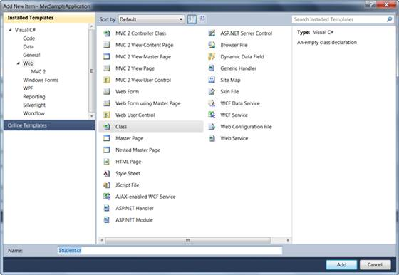

::: {style="DISPLAY: none"}
{#d2h_url_template}{#d2h_package_url style="WIDTH: 0px; DISPLAY: none; HEIGHT: 0px"}
:::

::::: {#nsbanner .d2h_main_nsbanner style="BORDER-BOTTOM: #999999 1px solid; POSITION: relative; PADDING-BOTTOM: 0px; BACKGROUND-COLOR: transparent; PADDING-LEFT: 0px; PADDING-RIGHT: 0px; DISPLAY: none; BORDER-TOP: #999999 1px solid; PADDING-TOP: 0px; LEFT: 0px"}
:::: {#TitleRow .d2h_main_titlerow style="PADDING-BOTTOM: 4px; BACKGROUND-COLOR: transparent; PADDING-LEFT: 22px; WIDTH: 100%; PADDING-RIGHT: 10px; DISPLAY: none; PADDING-TOP: 4px"}
::: {#ienav .d2h_main_ienav style="DISPLAY: none"}
{#D2HPrevious .D2HPreviousEnabled}  {#D2HNext .D2HNextEnabled}
:::
::::
:::::

:::: {#nstext .d2h_main_nstext style="PADDING-BOTTOM: 10px; BACKGROUND-COLOR: transparent; PADDING-LEFT: 22px; PADDING-RIGHT: 10px; HEIGHT: 100%; OVERFLOW: auto; PADDING-TOP: 5px" hasuserbackground="true" valign="bottom"}
::: {#d2h_breadcrumbs .d2h_breadcrumbs}
[Essential Studio User Guide Documentation](ms-xhelp:///?Id=12457748-09e3-4d74-a240-8e049cedf030){.d2h_breadcrumbsNormal}[ \> ]{.d2h_breadcrumbsLinkSeparator}[User Interface Edition](ms-xhelp:///?Id=c29296b7-531c-413b-a0ec-488ca1f7f669){.d2h_breadcrumbsNormal}[ \> ]{.d2h_breadcrumbsLinkSeparator}[Essential ASP.NET MVC](ms-xhelp:///?Id=4b14e7d1-65c4-4f67-b1aa-2c37709905a5){.d2h_breadcrumbsNormal}[ \> ]{.d2h_breadcrumbsLinkSeparator}[Essential Grid]{.d2h_breadcrumbsContentsOnly}[ \> ]{.d2h_breadcrumbsLinkSeparator}[How to](ms-xhelp:///?Id=0d8a7383-ca49-43db-8609-dca7963c87ab){.d2h_breadcrumbsNormal}
:::

## Creating the Generic Collection Model {#creating-the-generic-collection-model style="tab-stops: 0pt"}

 

1.   Right-click the **Models** folder in the **Solution Explorer** window and select the menu option **Add New Item**.

2.   In the **Add New Item** window, select the **Web** category (see Figure 345).

[]{style="FONT-FAMILY: 'Calibri','sans-serif'"} 

 

{border="0"}

[]{#_Ref311794775}[Figure]{#_Ref311794787} 345: Select Dialog

 

3.   Select the **Class** file and give the class file name **Student.cs** and click the **Add** button.

4.   Create a student class containing **University Code**, **Course Fees**, **CGPA**, **Course ID**, **Duration**, and **Course Title** as properties.

 

+-----------------------------------------------------------------------------------------------------------------------------------------------------------------------------------------------------------------+
| [///]{style="FONT-FAMILY: 'Courier New'; COLOR: gray"}[ ]{style="FONT-FAMILY: 'Courier New'; COLOR: green"}[\<summary\>]{style="FONT-FAMILY: 'Courier New'; COLOR: gray"}[]{style="FONT-FAMILY: 'Courier New'"} |
|                                                                                                                                                                                                                 |
| [    [///]{style="COLOR: gray"}[ Student class.]{style="COLOR: green"}]{style="FONT-FAMILY: 'Courier New'"}                                                                                                     |
|                                                                                                                                                                                                                 |
| [    [///]{style="COLOR: gray"}[ ]{style="COLOR: green"}[\</summary\>]{style="COLOR: gray"}]{style="FONT-FAMILY: 'Courier New'"}                                                                                |
|                                                                                                                                                                                                                 |
| [    [public]{style="COLOR: blue"} [class]{style="COLOR: blue"} [Student]{style="COLOR: #2b91af"}]{style="FONT-FAMILY: 'Courier New'"}                                                                          |
|                                                                                                                                                                                                                 |
| [    {]{style="FONT-FAMILY: 'Courier New'"}                                                                                                                                                                     |
|                                                                                                                                                                                                                 |
| [        #region]{style="FONT-FAMILY: 'Courier New'; COLOR: blue"}[ Properties]{style="FONT-FAMILY: 'Courier New'"}                                                                                             |
|                                                                                                                                                                                                                 |
| [        [///]{style="COLOR: gray"}[ ]{style="COLOR: green"}[\<summary\>]{style="COLOR: gray"}]{style="FONT-FAMILY: 'Courier New'"}                                                                             |
|                                                                                                                                                                                                                 |
| [        [///]{style="COLOR: gray"}[ Gets or sets the student name.]{style="COLOR: green"}]{style="FONT-FAMILY: 'Courier New'"}                                                                                 |
|                                                                                                                                                                                                                 |
| [        [///]{style="COLOR: gray"}[ ]{style="COLOR: green"}[\</summary\>]{style="COLOR: gray"}]{style="FONT-FAMILY: 'Courier New'"}                                                                            |
|                                                                                                                                                                                                                 |
| [        [public]{style="COLOR: blue"} [long]{style="COLOR: blue"} UniversityCode { [get]{style="COLOR: blue"}; [set]{style="COLOR: blue"}; }]{style="FONT-FAMILY: 'Courier New'"}                              |
|                                                                                                                                                                                                                 |
| []{style="FONT-FAMILY: 'Courier New'"}                                                                                                                                                                          |
|                                                                                                                                                                                                                 |
| [        [///]{style="COLOR: gray"}[ ]{style="COLOR: green"}[\<summary\>]{style="COLOR: gray"}]{style="FONT-FAMILY: 'Courier New'"}                                                                             |
|                                                                                                                                                                                                                 |
| [        [///]{style="COLOR: gray"}[ Gets or sets the course title.]{style="COLOR: green"}]{style="FONT-FAMILY: 'Courier New'"}                                                                                 |
|                                                                                                                                                                                                                 |
| [        [///]{style="COLOR: gray"}[ ]{style="COLOR: green"}[\</summary\>]{style="COLOR: gray"}]{style="FONT-FAMILY: 'Courier New'"}                                                                            |
|                                                                                                                                                                                                                 |
| [        [public]{style="COLOR: blue"} [string]{style="COLOR: blue"} Title { [get]{style="COLOR: blue"}; [set]{style="COLOR: blue"}; }]{style="FONT-FAMILY: 'Courier New'"}                                     |
|                                                                                                                                                                                                                 |
| []{style="FONT-FAMILY: 'Courier New'"}                                                                                                                                                                          |
|                                                                                                                                                                                                                 |
| [        [///]{style="COLOR: gray"}[ ]{style="COLOR: green"}[\<summary\>]{style="COLOR: gray"}]{style="FONT-FAMILY: 'Courier New'"}                                                                             |
|                                                                                                                                                                                                                 |
| [        [///]{style="COLOR: gray"}[ Gets or sets the duration in days of the course.]{style="COLOR: green"}]{style="FONT-FAMILY: 'Courier New'"}                                                               |
|                                                                                                                                                                                                                 |
| [        [///]{style="COLOR: gray"}[ ]{style="COLOR: green"}[\</summary\>]{style="COLOR: gray"}[                ]{style="COLOR: green"}]{style="FONT-FAMILY: 'Courier New'"}                                    |
|                                                                                                                                                                                                                 |
| [        [public]{style="COLOR: blue"} [int]{style="COLOR: blue"} Duration { [get]{style="COLOR: blue"}; [set]{style="COLOR: blue"}; }]{style="FONT-FAMILY: 'Courier New'"}                                     |
|                                                                                                                                                                                                                 |
| []{style="FONT-FAMILY: 'Courier New'"}                                                                                                                                                                          |
|                                                                                                                                                                                                                 |
| [        [///]{style="COLOR: gray"}[ ]{style="COLOR: green"}[\<summary\>]{style="COLOR: gray"}]{style="FONT-FAMILY: 'Courier New'"}                                                                             |
|                                                                                                                                                                                                                 |
| [        [///]{style="COLOR: gray"}[ Gets or sets course fees.]{style="COLOR: green"}]{style="FONT-FAMILY: 'Courier New'"}                                                                                      |
|                                                                                                                                                                                                                 |
| [        [///]{style="COLOR: gray"}[ ]{style="COLOR: green"}[\</summary\>]{style="COLOR: gray"}[        ]{style="COLOR: green"}]{style="FONT-FAMILY: 'Courier New'"}                                            |
|                                                                                                                                                                                                                 |
| [        [public]{style="COLOR: blue"} [double]{style="COLOR: blue"} CourseFees { [get]{style="COLOR: blue"}; [set]{style="COLOR: blue"}; }]{style="FONT-FAMILY: 'Courier New'"}                                |
|                                                                                                                                                                                                                 |
| []{style="FONT-FAMILY: 'Courier New'"}                                                                                                                                                                          |
|                                                                                                                                                                                                                 |
| [        [///]{style="COLOR: gray"}[ ]{style="COLOR: green"}[\<summary\>]{style="COLOR: gray"}]{style="FONT-FAMILY: 'Courier New'"}                                                                             |
|                                                                                                                                                                                                                 |
| [        [///]{style="COLOR: gray"}[ Gets or sets CGPA.]{style="COLOR: green"}]{style="FONT-FAMILY: 'Courier New'"}                                                                                             |
|                                                                                                                                                                                                                 |
| [        [///]{style="COLOR: gray"}[ ]{style="COLOR: green"}[\</summary\>]{style="COLOR: gray"}[        ]{style="COLOR: green"}]{style="FONT-FAMILY: 'Courier New'"}                                            |
|                                                                                                                                                                                                                 |
| [        [public]{style="COLOR: blue"} [double]{style="COLOR: blue"} CGPA { [get]{style="COLOR: blue"}; [set]{style="COLOR: blue"}; }]{style="FONT-FAMILY: 'Courier New'"}                                      |
|                                                                                                                                                                                                                 |
| []{style="FONT-FAMILY: 'Courier New'"}                                                                                                                                                                          |
|                                                                                                                                                                                                                 |
| [        #endregion]{style="FONT-FAMILY: 'Courier New'; COLOR: blue"}[]{style="FONT-FAMILY: 'Courier New'"}                                                                                                     |
|                                                                                                                                                                                                                 |
| [    }]{style="FONT-FAMILY: 'Courier New'"}                                                                                                                                                                     |
+-----------------------------------------------------------------------------------------------------------------------------------------------------------------------------------------------------------------+

[]{style="FONT-FAMILY: Consolas; FONT-SIZE: 9.5pt"} 

 

[5.   ]{style="COLOR: gray"}Create another **DataContext** class to generate the students list as shown below.[]{style="COLOR: gray"}

[]{style="COLOR: gray"} 

+-----------------------------------------------------------------------------------------------------------------------------------------------------------------------------------------------------------------------------------------------------------------------------------------------------------+
| [///]{style="FONT-FAMILY: Consolas; COLOR: gray; FONT-SIZE: 9.5pt"}[ ]{style="FONT-FAMILY: Consolas; COLOR: green; FONT-SIZE: 9.5pt"}[\<summary\>]{style="FONT-FAMILY: Consolas; COLOR: gray; FONT-SIZE: 9.5pt"}[]{style="FONT-FAMILY: Consolas; FONT-SIZE: 9.5pt"}                                       |
|                                                                                                                                                                                                                                                                                                           |
| [    [///]{style="COLOR: gray"}[ StudentDataContext class.]{style="COLOR: green"}]{style="FONT-FAMILY: Consolas; FONT-SIZE: 9.5pt"}                                                                                                                                                                       |
|                                                                                                                                                                                                                                                                                                           |
| [    [///]{style="COLOR: gray"}[ ]{style="COLOR: green"}[\</summary\>]{style="COLOR: gray"}]{style="FONT-FAMILY: Consolas; FONT-SIZE: 9.5pt"}                                                                                                                                                             |
|                                                                                                                                                                                                                                                                                                           |
| [    [public]{style="COLOR: blue"} [class]{style="COLOR: blue"} [StudentDataContext]{style="COLOR: #2b91af"}]{style="FONT-FAMILY: Consolas; FONT-SIZE: 9.5pt"}                                                                                                                                            |
|                                                                                                                                                                                                                                                                                                           |
| [    {]{style="FONT-FAMILY: Consolas; FONT-SIZE: 9.5pt"}                                                                                                                                                                                                                                                  |
|                                                                                                                                                                                                                                                                                                           |
| [        #region]{style="FONT-FAMILY: Consolas; COLOR: blue; FONT-SIZE: 9.5pt"}[ Properties]{style="FONT-FAMILY: Consolas; FONT-SIZE: 9.5pt"}                                                                                                                                                             |
|                                                                                                                                                                                                                                                                                                           |
| []{style="FONT-FAMILY: Consolas; FONT-SIZE: 9.5pt"}                                                                                                                                                                                                                                                       |
|                                                                                                                                                                                                                                                                                                           |
| [        [///]{style="COLOR: gray"}[ ]{style="COLOR: green"}[\<summary\>]{style="COLOR: gray"}]{style="FONT-FAMILY: Consolas; FONT-SIZE: 9.5pt"}                                                                                                                                                          |
|                                                                                                                                                                                                                                                                                                           |
| [        [///]{style="COLOR: gray"}[ Gets the courses in an IQueryable format.]{style="COLOR: green"}]{style="FONT-FAMILY: Consolas; FONT-SIZE: 9.5pt"}                                                                                                                                                   |
|                                                                                                                                                                                                                                                                                                           |
| [        [///]{style="COLOR: gray"}[ ]{style="COLOR: green"}[\</summary\>]{style="COLOR: gray"}]{style="FONT-FAMILY: Consolas; FONT-SIZE: 9.5pt"}                                                                                                                                                         |
|                                                                                                                                                                                                                                                                                                           |
| [        [public]{style="COLOR: blue"} [List]{style="COLOR: #2b91af"}\<[Student]{style="COLOR: #2b91af"}\> Student]{style="FONT-FAMILY: Consolas; FONT-SIZE: 9.5pt"}                                                                                                                                      |
|                                                                                                                                                                                                                                                                                                           |
| [        {]{style="FONT-FAMILY: Consolas; FONT-SIZE: 9.5pt"}                                                                                                                                                                                                                                              |
|                                                                                                                                                                                                                                                                                                           |
| [            [get]{style="COLOR: blue"}]{style="FONT-FAMILY: Consolas; FONT-SIZE: 9.5pt"}                                                                                                                                                                                                                 |
|                                                                                                                                                                                                                                                                                                           |
| [            {]{style="FONT-FAMILY: Consolas; FONT-SIZE: 9.5pt"}                                                                                                                                                                                                                                          |
|                                                                                                                                                                                                                                                                                                           |
| [                [List]{style="COLOR: #2b91af"}\<[Student]{style="COLOR: #2b91af"}\> student = [new]{style="COLOR: blue"} [List]{style="COLOR: #2b91af"}\<[Student]{style="COLOR: #2b91af"}\>();]{style="FONT-FAMILY: Consolas; FONT-SIZE: 9.5pt"}                                                        |
|                                                                                                                                                                                                                                                                                                           |
| [                [Student]{style="COLOR: #2b91af"} stu = [new]{style="COLOR: blue"} [Student]{style="COLOR: #2b91af"}();]{style="FONT-FAMILY: Consolas; FONT-SIZE: 9.5pt"}                                                                                                                                |
|                                                                                                                                                                                                                                                                                                           |
| [                [int]{style="COLOR: blue"} code = 10000;]{style="FONT-FAMILY: Consolas; FONT-SIZE: 9.5pt"}                                                                                                                                                                                               |
|                                                                                                                                                                                                                                                                                                           |
| [                [for]{style="COLOR: blue"} ([long]{style="COLOR: blue"} i = 0; i \< 100; i++)]{style="FONT-FAMILY: Consolas; FONT-SIZE: 9.5pt"}                                                                                                                                                          |
|                                                                                                                                                                                                                                                                                                           |
| [                {]{style="FONT-FAMILY: Consolas; FONT-SIZE: 9.5pt"}                                                                                                                                                                                                                                      |
|                                                                                                                                                                                                                                                                                                           |
| [                    [Student]{style="COLOR: #2b91af"}\[\] s = [new]{style="COLOR: blue"} [Student]{style="COLOR: #2b91af"}\[10\];]{style="FONT-FAMILY: Consolas; FONT-SIZE: 9.5pt"}                                                                                                                      |
|                                                                                                                                                                                                                                                                                                           |
| [                    s\[0\] = [new]{style="COLOR: blue"} [Student]{style="COLOR: #2b91af"}() { UniversityCode = code + 1, CourseFees = 2000.00, CGPA = 7.52, Duration = 90, Title = [\"Distributed Component Architecture\"]{style="COLOR: #a31515"} };]{style="FONT-FAMILY: Consolas; FONT-SIZE: 9.5pt"} |
|                                                                                                                                                                                                                                                                                                           |
| [                    s\[1\] = [new]{style="COLOR: blue"} [Student]{style="COLOR: #2b91af"}() { UniversityCode = code + 2, CourseFees = 1000.00, CGPA = 9.55, Duration = 60, Title = [\"Data Structures\"]{style="COLOR: #a31515"} };]{style="FONT-FAMILY: Consolas; FONT-SIZE: 9.5pt"}                    |
|                                                                                                                                                                                                                                                                                                           |
| [                    s\[2\] = [new]{style="COLOR: blue"} [Student]{style="COLOR: #2b91af"}() { UniversityCode = code + 3, CourseFees = 1750.00, CGPA = 9.03, Duration = 75, Title = [\"Neural Networks\"]{style="COLOR: #a31515"} };]{style="FONT-FAMILY: Consolas; FONT-SIZE: 9.5pt"}                    |
|                                                                                                                                                                                                                                                                                                           |
| [                    s\[3\] = [new]{style="COLOR: blue"} [Student]{style="COLOR: #2b91af"}() { UniversityCode = code + 4, CourseFees = 2000.00, CGPA = 8.91, Duration = 90, Title = [\"Genetic Algorithms\"]{style="COLOR: #a31515"} };]{style="FONT-FAMILY: Consolas; FONT-SIZE: 9.5pt"}                 |
|                                                                                                                                                                                                                                                                                                           |
| [                    s\[4\] = [new]{style="COLOR: blue"} [Student]{style="COLOR: #2b91af"}() { UniversityCode = code + 5, CourseFees = 1000.00, CGPA = 9.55, Duration = 30, Title = [\"Grid Computing\"]{style="COLOR: #a31515"} };]{style="FONT-FAMILY: Consolas; FONT-SIZE: 9.5pt"}                     |
|                                                                                                                                                                                                                                                                                                           |
| [                    s\[5\] = [new]{style="COLOR: blue"} [Student]{style="COLOR: #2b91af"}() { UniversityCode = code + 6, CourseFees = 2500.00, CGPA = 9.87, Duration = 60, Title = [\"Cloud Computing\"]{style="COLOR: #a31515"} };]{style="FONT-FAMILY: Consolas; FONT-SIZE: 9.5pt"}                    |
|                                                                                                                                                                                                                                                                                                           |
| [                    s\[6\] = [new]{style="COLOR: blue"} [Student]{style="COLOR: #2b91af"}() { UniversityCode = code + 7, CourseFees = 1500.00, CGPA = 9.75, Duration = 90, Title = [\"Enterprise Computing\"]{style="COLOR: #a31515"} };]{style="FONT-FAMILY: Consolas; FONT-SIZE: 9.5pt"}               |
|                                                                                                                                                                                                                                                                                                           |
| [                    s\[7\] = [new]{style="COLOR: blue"} [Student]{style="COLOR: #2b91af"}() { UniversityCode = code + 8, CourseFees = 1250.00, CGPA = 9.66, Duration = 45, Title = [\"Mobile Computing\"]{style="COLOR: #a31515"} };]{style="FONT-FAMILY: Consolas; FONT-SIZE: 9.5pt"}                   |
|                                                                                                                                                                                                                                                                                                           |
| [                    s\[8\] = [new]{style="COLOR: blue"} [Student]{style="COLOR: #2b91af"}() { UniversityCode = code + 9, CourseFees = 1000.00, CGPA = 8.33, Duration = 60, Title = [\"WAP and XML\"]{style="COLOR: #a31515"} };]{style="FONT-FAMILY: Consolas; FONT-SIZE: 9.5pt"}                        |
|                                                                                                                                                                                                                                                                                                           |
| [                    s\[9\] = [new]{style="COLOR: blue"} [Student]{style="COLOR: #2b91af"}() { UniversityCode = code + 10, CourseFees =1500.00, CGPA = 8.66, Duration = 75, Title = [\"Design Patterns\"]{style="COLOR: #a31515"} };]{style="FONT-FAMILY: Consolas; FONT-SIZE: 9.5pt"}                    |
|                                                                                                                                                                                                                                                                                                           |
| [                    [foreach]{style="COLOR: blue"} ([Student]{style="COLOR: #2b91af"} studnt [in]{style="COLOR: blue"} s)]{style="FONT-FAMILY: Consolas; FONT-SIZE: 9.5pt"}                                                                                                                              |
|                                                                                                                                                                                                                                                                                                           |
| [                    {]{style="FONT-FAMILY: Consolas; FONT-SIZE: 9.5pt"}                                                                                                                                                                                                                                  |
|                                                                                                                                                                                                                                                                                                           |
| [                        student.Add(studnt);]{style="FONT-FAMILY: Consolas; FONT-SIZE: 9.5pt"}                                                                                                                                                                                                           |
|                                                                                                                                                                                                                                                                                                           |
| [                    }]{style="FONT-FAMILY: Consolas; FONT-SIZE: 9.5pt"}                                                                                                                                                                                                                                  |
|                                                                                                                                                                                                                                                                                                           |
| []{style="FONT-FAMILY: Consolas; FONT-SIZE: 9.5pt"}                                                                                                                                                                                                                                                       |
|                                                                                                                                                                                                                                                                                                           |
| [                    code += 10;]{style="FONT-FAMILY: Consolas; FONT-SIZE: 9.5pt"}                                                                                                                                                                                                                        |
|                                                                                                                                                                                                                                                                                                           |
| [                }]{style="FONT-FAMILY: Consolas; FONT-SIZE: 9.5pt"}                                                                                                                                                                                                                                      |
|                                                                                                                                                                                                                                                                                                           |
| []{style="FONT-FAMILY: Consolas; FONT-SIZE: 9.5pt"}                                                                                                                                                                                                                                                       |
|                                                                                                                                                                                                                                                                                                           |
| [                [return]{style="COLOR: blue"} student;]{style="FONT-FAMILY: Consolas; FONT-SIZE: 9.5pt"}                                                                                                                                                                                                 |
|                                                                                                                                                                                                                                                                                                           |
| [            }]{style="FONT-FAMILY: Consolas; FONT-SIZE: 9.5pt"}                                                                                                                                                                                                                                          |
|                                                                                                                                                                                                                                                                                                           |
| [        }]{style="FONT-FAMILY: Consolas; FONT-SIZE: 9.5pt"}                                                                                                                                                                                                                                              |
|                                                                                                                                                                                                                                                                                                           |
| }                                                                                                                                                                                                                                                                                                         |
+-----------------------------------------------------------------------------------------------------------------------------------------------------------------------------------------------------------------------------------------------------------------------------------------------------------+

 

[]{#related-topics}
::::
