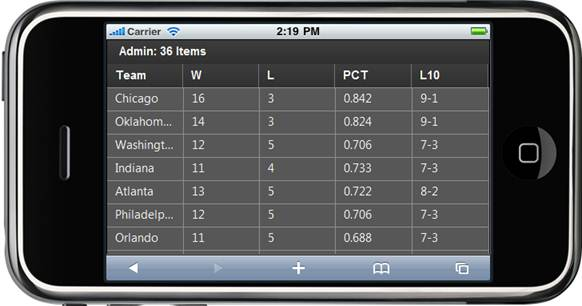

::: {style="DISPLAY: none"}
{#d2h_url_template}{#d2h_package_url style="WIDTH: 0px; DISPLAY: none; HEIGHT: 0px"}
:::

::::: {#nsbanner .d2h_main_nsbanner style="BORDER-BOTTOM: #999999 1px solid; POSITION: relative; PADDING-BOTTOM: 0px; BACKGROUND-COLOR: transparent; PADDING-LEFT: 0px; PADDING-RIGHT: 0px; DISPLAY: none; BORDER-TOP: #999999 1px solid; PADDING-TOP: 0px; LEFT: 0px"}
:::: {#TitleRow .d2h_main_titlerow style="PADDING-BOTTOM: 4px; BACKGROUND-COLOR: transparent; PADDING-LEFT: 22px; WIDTH: 100%; PADDING-RIGHT: 10px; DISPLAY: none; PADDING-TOP: 4px"}
::: {#ienav .d2h_main_ienav style="DISPLAY: none"}
{#D2HPrevious .D2HPreviousEnabled}  {#D2HNext .D2HNextEnabled}
:::
::::
:::::

:::: {#nstext .d2h_main_nstext style="PADDING-BOTTOM: 10px; BACKGROUND-COLOR: transparent; PADDING-LEFT: 22px; PADDING-RIGHT: 10px; HEIGHT: 100%; OVERFLOW: auto; PADDING-TOP: 5px" hasuserbackground="true" valign="bottom"}
::: {#d2h_breadcrumbs .d2h_breadcrumbs}
[Essential Studio User Guide Documentation](ms-xhelp:///?Id=12457748-09e3-4d74-a240-8e049cedf030){.d2h_breadcrumbsNormal}[ \> ]{.d2h_breadcrumbsLinkSeparator}[User Interface Edition](ms-xhelp:///?Id=c29296b7-531c-413b-a0ec-488ca1f7f669){.d2h_breadcrumbsNormal}[ \> ]{.d2h_breadcrumbsLinkSeparator}[Essential Mobile MVC](ms-xhelp:///?Id=74df42e3-5434-4590-9be6-3ae2f911cbbc){.d2h_breadcrumbsNormal}[ \> ]{.d2h_breadcrumbsLinkSeparator}[Essential Grid]{.d2h_breadcrumbsContentsOnly}[ \> ]{.d2h_breadcrumbsLinkSeparator}[Getting Started](ms-xhelp:///?Id=397f4d98-2e34-4dc5-8b77-1d56a317b150){.d2h_breadcrumbsNormal}[ \> ]{.d2h_breadcrumbsLinkSeparator}[Adding Essential Mobile Grid to the Razor Application](ms-xhelp:///?Id=e84cebdb-8c9e-4c07-a1be-3f559be3b842){.d2h_breadcrumbsNormal}
:::

### Creating the Grid Control in a Razor Application {#creating-the-grid-control-in-a-razor-application style="tab-stops: 0pt"}

[1.   Create a model in the application (Refer to ]{style="FONT-FAMILY: 'Arial','sans-serif'; FONT-SIZE: 10pt"}[[[Getting Started \> Adding a Model to the Razor Application]{style="FONT-FAMILY: 'Arial','sans-serif'; FONT-SIZE: 10pt"}]{.ughyperlink}](ms-xhelp:///?Id=a78221a2-2f66-41bd-925e-bb300459b813)[).]{style="FONT-FAMILY: 'Arial','sans-serif'; FONT-SIZE: 10pt"}

[2.   Create a strongly typed view (Refer to ]{style="FONT-FAMILY: 'Arial','sans-serif'; FONT-SIZE: 10pt"}[[[How to \> Strongly Typed View]{style="FONT-FAMILY: 'Arial','sans-serif'; FONT-SIZE: 10pt"}]{.ughyperlink}](ms-xhelp:///?Id=717b660b-758f-4d1f-adf1-797d6889091a)[).]{style="FONT-FAMILY: 'Arial','sans-serif'; FONT-SIZE: 10pt"}

[3.   In the view you can use its **Model** property in **Datasource()** in order to bind the data source. ]{style="FONT-FAMILY: 'Arial','sans-serif'; FONT-SIZE: 10pt"}

+-----------------------------------------------------------------------------------------------------------------------------------------------------------------------------------------------------------------------------------+
| **[View \[]{style="FONT-FAMILY: 'Courier New'; COLOR: black"}[cshtml[\]]{style="COLOR: black"}]{style="FONT-FAMILY: 'Courier New'"}**                                                                                             |
|                                                                                                                                                                                                                                   |
| [\@{]{style="FONT-FAMILY: Consolas; BACKGROUND: yellow; FONT-SIZE: 9.5pt"}[Html.MobSyncfusion().Grid\<[Standings]{style="COLOR: #2b91af"}\>([\"grid\"]{style="COLOR: #a31515"})]{style="FONT-FAMILY: Consolas; FONT-SIZE: 9.5pt"} |
|                                                                                                                                                                                                                                   |
| [           .Datasource(Model).Caption([\"Foot Ball Team Standings \"]{style="COLOR: #a31515"})]{style="FONT-FAMILY: Consolas; FONT-SIZE: 9.5pt"}                                                                                 |
|                                                                                                                                                                                                                                   |
| [           .ActionMode([MobActionMode]{style="COLOR: #2b91af"}.Server)]{style="FONT-FAMILY: Consolas; FONT-SIZE: 9.5pt"}                                                                                                         |
|                                                                                                                                                                                                                                   |
| [           .Column(col =\>]{style="FONT-FAMILY: Consolas; FONT-SIZE: 9.5pt"}                                                                                                                                                     |
|                                                                                                                                                                                                                                   |
| [           {]{style="FONT-FAMILY: Consolas; FONT-SIZE: 9.5pt"}                                                                                                                                                                   |
|                                                                                                                                                                                                                                   |
| [               col.Add(c =\> c.Team).HeaderText([\"Team\"]{style="COLOR: #a31515"});]{style="FONT-FAMILY: Consolas; FONT-SIZE: 9.5pt"}                                                                                           |
|                                                                                                                                                                                                                                   |
| [               col.Add(c =\> c.Won).HeaderText([\"W\"]{style="COLOR: #a31515"});]{style="FONT-FAMILY: Consolas; FONT-SIZE: 9.5pt"}                                                                                               |
|                                                                                                                                                                                                                                   |
| [               col.Add(c =\> c.Loss).HeaderText([\"L\"]{style="COLOR: #a31515"});]{style="FONT-FAMILY: Consolas; FONT-SIZE: 9.5pt"}                                                                                              |
|                                                                                                                                                                                                                                   |
| [               col.Add(c =\> c.Percent).HeaderText([\"PCT\"]{style="COLOR: #a31515"});]{style="FONT-FAMILY: Consolas; FONT-SIZE: 9.5pt"}                                                                                         |
|                                                                                                                                                                                                                                   |
| [               col.Add(c =\> c.L10).HeaderText([\"L10\"]{style="COLOR: #a31515"});]{style="FONT-FAMILY: Consolas; FONT-SIZE: 9.5pt"}                                                                                             |
|                                                                                                                                                                                                                                   |
| [           })]{style="FONT-FAMILY: Consolas; FONT-SIZE: 9.5pt"}                                                                                                                                                                  |
|                                                                                                                                                                                                                                   |
| [          ]{style="FONT-FAMILY: Consolas; FONT-SIZE: 9.5pt"}                                                                                                                                                                     |
|                                                                                                                                                                                                                                   |
| [              .Render();]{style="FONT-FAMILY: Consolas; FONT-SIZE: 9.5pt"}                                                                                                                                                       |
|                                                                                                                                                                                                                                   |
| [}]{style="FONT-FAMILY: Consolas; BACKGROUND: yellow; FONT-SIZE: 9.5pt"}[]{style="FONT-FAMILY: Consolas; FONT-SIZE: 9.5pt"}                                                                                                       |
+-----------------------------------------------------------------------------------------------------------------------------------------------------------------------------------------------------------------------------------+

 

4.  Set its data source and render the view

 

+-------------------------------------------------------------------------------------------------------------------------------------------------------------------------------------------------------------------------------+
|  **[Controller]{style="FONT-FAMILY: 'Courier New'; COLOR: black"}**                                                                                                                                                           |
|                                                                                                                                                                                                                               |
|                                                                                                                                                                                                                               |
|                                                                                                                                                                                                                               |
| [///]{style="FONT-FAMILY: 'Courier New'; COLOR: gray"}[ ]{style="FONT-FAMILY: 'Courier New'; COLOR: green"}[\<summary\>]{style="FONT-FAMILY: 'Courier New'; COLOR: gray"}                                                     |
|                                                                                                                                                                                                                               |
| [        [///]{style="COLOR: gray"}[ Used to bind the Grid.]{style="COLOR: green"}]{style="FONT-FAMILY: 'Courier New'"}                                                                                                       |
|                                                                                                                                                                                                                               |
| [        [///]{style="COLOR: gray"}[ ]{style="COLOR: green"}[\</summary\>]{style="COLOR: gray"}]{style="FONT-FAMILY: 'Courier New'"}                                                                                          |
|                                                                                                                                                                                                                               |
| [        [///]{style="COLOR: gray"}[ ]{style="COLOR: green"}[\<returns\>]{style="COLOR: gray"}[View page, it displays the Grid]{style="COLOR: green"}[\</returns\>]{style="COLOR: gray"}]{style="FONT-FAMILY: 'Courier New'"} |
|                                                                                                                                                                                                                               |
| [       ]{style="FONT-FAMILY: 'Courier New'"}[public]{style="FONT-FAMILY: Consolas; COLOR: blue; FONT-SIZE: 9.5pt"}[ [ActionResult]{style="COLOR: #2b91af"} Index()]{style="FONT-FAMILY: Consolas; FONT-SIZE: 9.5pt"}         |
|                                                                                                                                                                                                                               |
| [        {]{style="FONT-FAMILY: Consolas; FONT-SIZE: 9.5pt"}                                                                                                                                                                  |
|                                                                                                                                                                                                                               |
| [            [var]{style="COLOR: blue"} data = [StandingsDetails]{style="COLOR: #2b91af"}.GetData();]{style="FONT-FAMILY: Consolas; FONT-SIZE: 9.5pt"}                                                                        |
|                                                                                                                                                                                                                               |
| [            [return]{style="COLOR: blue"} View(data);]{style="FONT-FAMILY: Consolas; FONT-SIZE: 9.5pt"}                                                                                                                      |
|                                                                                                                                                                                                                               |
| []{style="FONT-FAMILY: Consolas; FONT-SIZE: 9.5pt"}                                                                                                                                                                           |
|                                                                                                                                                                                                                               |
| [        }]{style="FONT-FAMILY: Consolas; FONT-SIZE: 9.5pt"}                                                                                                                                                                  |
+-------------------------------------------------------------------------------------------------------------------------------------------------------------------------------------------------------------------------------+

 

5.  In order to work with paging and sorting actions, create a **Post** method for **Index** actions and bind the data source to the grid as shown in the following code.

 

+--------------------------------------------------------------------------------------------------------------------------------------------------------------------------------------------------------------------------------------+
| **[Controller]{style="FONT-FAMILY: 'Courier New'; COLOR: black"}**                                                                                                                                                                   |
|                                                                                                                                                                                                                                      |
|                                                                                                                                                                                                                                      |
|                                                                                                                                                                                                                                      |
| [  ///]{style="FONT-FAMILY: 'Courier New'; COLOR: gray"}[ ]{style="FONT-FAMILY: 'Courier New'; COLOR: green"}[\<summary\>]{style="FONT-FAMILY: 'Courier New'; COLOR: gray"}[]{style="FONT-FAMILY: 'Courier New'"}                    |
|                                                                                                                                                                                                                                      |
| [        [///]{style="COLOR: gray"}[ Paging/sorting Requests are mapped to this method. This method invokes the MobHtmlActionResult]{style="COLOR: green"}]{style="FONT-FAMILY: 'Courier New'"}                                      |
|                                                                                                                                                                                                                                      |
| [        [///]{style="COLOR: gray"}[ from the grid. Required response is generated.]{style="COLOR: green"}]{style="FONT-FAMILY: 'Courier New'"}                                                                                      |
|                                                                                                                                                                                                                                      |
| [        [///]{style="COLOR: gray"}[ ]{style="COLOR: green"}[\</summary\>]{style="COLOR: gray"}]{style="FONT-FAMILY: 'Courier New'"}                                                                                                 |
|                                                                                                                                                                                                                                      |
| [        [///]{style="COLOR: gray"}[ ]{style="COLOR: green"}[\<param name=\"args\"\>]{style="COLOR: gray"}[Contains paging properties. ]{style="COLOR: green"}[\</param\>]{style="COLOR: gray"}]{style="FONT-FAMILY: 'Courier New'"} |
|                                                                                                                                                                                                                                      |
| [        [///]{style="COLOR: gray"}[ ]{style="COLOR: green"}[\<returns\>]{style="COLOR: gray"}]{style="FONT-FAMILY: 'Courier New'"}                                                                                                  |
|                                                                                                                                                                                                                                      |
| [        [///]{style="COLOR: gray"}[ MobHtmlActionResult returns the data displayed on the grid.]{style="COLOR: green"}]{style="FONT-FAMILY: 'Courier New'"}                                                                         |
|                                                                                                                                                                                                                                      |
| [        [///]{style="COLOR: gray"}[ ]{style="COLOR: green"}[\</returns\>]{style="COLOR: gray"}]{style="FONT-FAMILY: 'Courier New'"}                                                                                                 |
|                                                                                                                                                                                                                                      |
| [        \[[AcceptVerbs]{style="COLOR: #2b91af"}([HttpVerbs]{style="COLOR: #2b91af"}.Post)\]]{style="FONT-FAMILY: 'Courier New'"}                                                                                                    |
|                                                                                                                                                                                                                                      |
| [       [public]{style="COLOR: blue"} [ActionResult]{style="COLOR: #2b91af"} Index([MobGridParams]{style="COLOR: #2b91af"} args)]{style="FONT-FAMILY: 'Courier New'"}                                                                |
|                                                                                                                                                                                                                                      |
| [        {]{style="FONT-FAMILY: 'Courier New'"}                                                                                                                                                                                      |
|                                                                                                                                                                                                                                      |
| [            [var]{style="COLOR: blue"} data = [StandingsDetails]{style="COLOR: #2b91af"}.GetData();]{style="FONT-FAMILY: 'Courier New'"}                                                                                            |
|                                                                                                                                                                                                                                      |
| [            [return]{style="COLOR: blue"} data.MobGridJSONActions\<[Standings]{style="COLOR: #2b91af"}\>();]{style="FONT-FAMILY: 'Courier New'"}                                                                                    |
|                                                                                                                                                                                                                                      |
| []{style="FONT-FAMILY: 'Courier New'"}                                                                                                                                                                                               |
|                                                                                                                                                                                                                                      |
| [        }]{style="FONT-FAMILY: 'Courier New'"}                                                                                                                                                                                      |
+--------------------------------------------------------------------------------------------------------------------------------------------------------------------------------------------------------------------------------------+

 

6.  Run the application. The grid will appear as shown below.

 

{border="0"}

Figure 31: Grid with Data

[]{#related-topics}
::::
