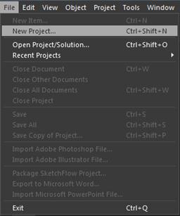
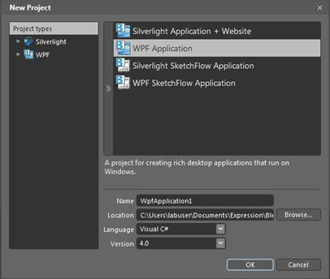
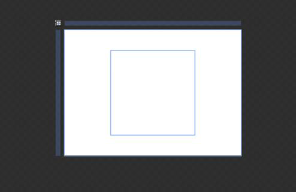

::: {style="DISPLAY: none"}
{#d2h_url_template}{#d2h_package_url style="WIDTH: 0px; DISPLAY: none; HEIGHT: 0px"}
:::

::: {.d2h_secondary_topic style="PADDING-BOTTOM: 10pt; MARGIN: 0pt; PADDING-LEFT: 0pt; PADDING-RIGHT: 0pt; PADDING-TOP: 0pt"}
#### Creating the RichTextBoxAdv Control in Expression Blend {#creating-the-richtextboxadv-control-in-expression-blend style="TEXT-JUSTIFY: inter-ideograph; TEXT-ALIGN: justify; tab-stops: 0pt"}

 To create a RichTextBoxAdv instance in Expression Blend:

1.   Open Expression Blend.

2.   On the **File** menu, select **New Project**. The **New Project** dialog box opens.

 

{border="0"}

Figure 911: File Menu

3.   In the **Project types** pane, select **WPF**, and then select **WPF Application**.

4.   In the **Name** field, type the name of the project, and then click **OK**.

 

{border="0"}

Figure 912: New Project Dialog Box

5.   On the **Window** menu, select **Assets**. The **Assets Library** dialog box opens.

6.   In the **Search** box, type **RichTextBoxAdv**. The search results are displayed.

7.   Drag the **RichTextBoxAdv** control to the **Design** view. An instance of the **RichTextBoxAdv** control is created.

 

{border="0"}

Figure 913: RichTextBoxAdv Control in Design View

[]{#related-topics}
:::
