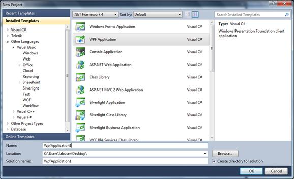
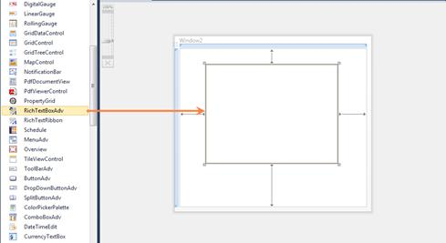

::: {style="DISPLAY: none"}
{#d2h_url_template}{#d2h_package_url style="WIDTH: 0px; DISPLAY: none; HEIGHT: 0px"}
:::

::: {.d2h_secondary_topic style="PADDING-BOTTOM: 10pt; MARGIN: 0pt; PADDING-LEFT: 0pt; PADDING-RIGHT: 0pt; PADDING-TOP: 0pt"}
#### Creating the RichTextBoxAdv Control in Visual Studio {#creating-the-richtextboxadv-control-in-visual-studio style="tab-stops: 0pt"}

 To create a RichTextBoxAdv instance in Visual Studio:

1.   Open Visual Studio.

2.   On the **File** menu, select **New**, and then select **Project**. The **New Project** dialog box is displayed.

{border="0"}

Figure 908: File Menu

3.   In the **New Project** dialog box, select **WPF Application**.

4.   In the **Name** field, type the name of the project.

5.   Click **OK**.

 

{border="0"}

Figure 909: New Project Dialog Box

6.   Drag the **RichTextBoxAdv** control from the **Toolbox** window to the **Design View**. An instance of the **RichTextBoxAdv** control is created in **Design** view.

 

{border="0"}

Figure 910: RichTextBoxAdv Control after Being Dragged to Design View

[]{#related-topics}
:::
