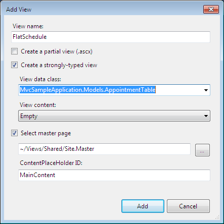
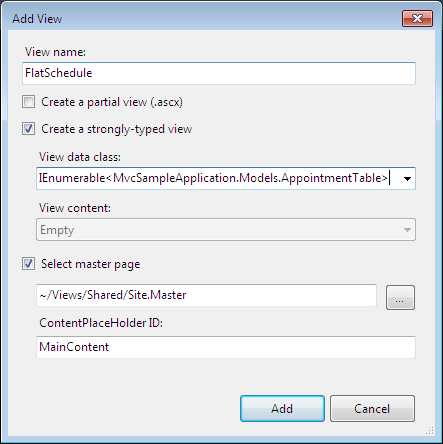
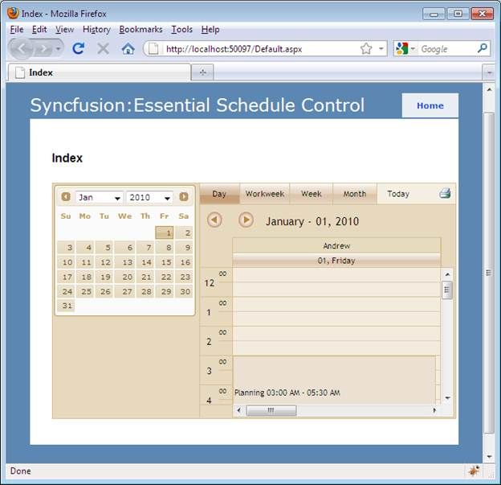

::: {style="DISPLAY: none"}
{#d2h_url_template}{#d2h_package_url style="WIDTH: 0px; DISPLAY: none; HEIGHT: 0px"}
:::

::::: {#nsbanner .d2h_main_nsbanner style="BORDER-BOTTOM: #999999 1px solid; POSITION: relative; PADDING-BOTTOM: 0px; BACKGROUND-COLOR: transparent; PADDING-LEFT: 0px; PADDING-RIGHT: 0px; DISPLAY: none; BORDER-TOP: #999999 1px solid; PADDING-TOP: 0px; LEFT: 0px"}
:::: {#TitleRow .d2h_main_titlerow style="PADDING-BOTTOM: 4px; BACKGROUND-COLOR: transparent; PADDING-LEFT: 22px; WIDTH: 100%; PADDING-RIGHT: 10px; DISPLAY: none; PADDING-TOP: 4px"}
::: {#ienav .d2h_main_ienav style="DISPLAY: none"}
{#D2HPrevious .D2HPreviousEnabled}  {#D2HNext .D2HNextEnabled}
:::
::::
:::::

::::: {#nstext .d2h_main_nstext style="PADDING-BOTTOM: 10px; BACKGROUND-COLOR: transparent; PADDING-LEFT: 22px; PADDING-RIGHT: 10px; HEIGHT: 100%; OVERFLOW: auto; PADDING-TOP: 5px" hasuserbackground="true" valign="bottom"}
::: {#d2h_breadcrumbs .d2h_breadcrumbs}
[Essential Studio User Guide Documentation](ms-xhelp:///?Id=12457748-09e3-4d74-a240-8e049cedf030){.d2h_breadcrumbsNormal}[ \> ]{.d2h_breadcrumbsLinkSeparator}[User Interface Edition](ms-xhelp:///?Id=c29296b7-531c-413b-a0ec-488ca1f7f669){.d2h_breadcrumbsNormal}[ \> ]{.d2h_breadcrumbsLinkSeparator}[Essential ASP.NET MVC](ms-xhelp:///?Id=4b14e7d1-65c4-4f67-b1aa-2c37709905a5){.d2h_breadcrumbsNormal}[ \> ]{.d2h_breadcrumbsLinkSeparator}[Essential Schedule]{.d2h_breadcrumbsContentsOnly}[ \> ]{.d2h_breadcrumbsLinkSeparator}[Getting Started](ms-xhelp:///?Id=b686dbe4-808e-405b-8e03-33b17be71f0d){.d2h_breadcrumbsNormal}[ \> ]{.d2h_breadcrumbsLinkSeparator}[Adding Essential Schedule to the Application](ms-xhelp:///?Id=e4f32654-cbef-4829-8c06-f1b2f5ecfb45){.d2h_breadcrumbsNormal}
:::

### Creating the Schedule Control Using View Customization {#creating-the-schedule-control-using-view-customization style="tab-stops: 0pt"}

To create the Schedule control using View customization:

1.   Right-click the **View-\>Home** folder.

2.   Click **Add**, and then select **View**.

3.   Name the **View FlatSchedule**.

4.   Check the box that says **Create a strongly-typed view**, and on the drop down menu select your model. In this case, it is "MvcSampleApplication.AppointmentTable".

[]{style="FONT-FAMILY: 'Calibri','sans-serif'"} 

{border="0"}[]{style="FONT-FAMILY: 'Calibri','sans-serif'"}

[]{style="FONT-FAMILY: 'Calibri','sans-serif'"} 

Figure 47: Strogly-typed View

::: {style="BORDER-BOTTOM: windowtext 1pt solid; BORDER-LEFT: medium none; PADDING-BOTTOM: 1pt; MARGIN-TOP: 9pt; PADDING-LEFT: 0pt; PADDING-RIGHT: 0pt; MARGIN-BOTTOM: 9pt; BORDER-TOP: windowtext 1pt solid; BORDER-RIGHT: medium none; PADDING-TOP: 1pt"}
{border="0"}Note: The View Data class drop-down list will be empty until you successfully build your application. It is a good idea to select the menu option build, build solution before opening the Add New dialog.
:::

[]{style="FONT-FAMILY: 'Calibri','sans-serif'"} 

5.   In a **View Data Class**, make the model as IEnumerable collections as given below:

[]{style="FONT-FAMILY: 'Calibri','sans-serif'; COLOR: blue"} 

[]{style="FONT-FAMILY: 'Calibri','sans-serif'; COLOR: blue"} 

{border="0"}[]{style="FONT-FAMILY: 'Calibri','sans-serif'; COLOR: blue"}

[]{style="FONT-FAMILY: 'Calibri','sans-serif'"} 

Figure 48: View Data classes as IEumerable collection

[]{style="FONT-FAMILY: 'Calibri','sans-serif'; COLOR: blue"} 

6.   Add the following code in the **FlatSchedule.aspx** file, to create the **Schedule** control in **View**:

[]{style="FONT-FAMILY: 'Calibri','sans-serif'"} 

+---------------------------------------------------------------------------------------------------------------------------------------------------------------------------------------------------------------------------------------+
| [\[View\]]{style="FONT-FAMILY: 'Calibri','sans-serif'"}                                                                                                                                                                               |
|                                                                                                                                                                                                                                       |
| [  ]{style="FONT-FAMILY: 'Calibri','sans-serif'"}[    [\<%]{style="BACKGROUND: yellow"}[=]{style="COLOR: blue"}Html.Syncfusion().Schedule()([\"FlatSchedule\"]{style="COLOR: #a31515"})]{style="FONT-FAMILY: 'Calibri','sans-serif'"} |
|                                                                                                                                                                                                                                       |
| [        .DataSource(([IEnumerable]{style="COLOR: #2b91af"})Model)]{style="FONT-FAMILY: 'Calibri','sans-serif'"}                                                                                                                      |
|                                                                                                                                                                                                                                       |
| [       .BindList(columns =\>]{style="FONT-FAMILY: 'Calibri','sans-serif'"}                                                                                                                                                           |
|                                                                                                                                                                                                                                       |
| [       {]{style="FONT-FAMILY: 'Calibri','sans-serif'"}                                                                                                                                                                               |
|                                                                                                                                                                                                                                       |
| [           columns.IdField([\"AppId\"]{style="COLOR: #a31515"});]{style="FONT-FAMILY: 'Calibri','sans-serif'"}                                                                                                                       |
|                                                                                                                                                                                                                                       |
| [           columns.SubjectField([\"Subject\"]{style="COLOR: #a31515"});]{style="FONT-FAMILY: 'Calibri','sans-serif'"}                                                                                                                |
|                                                                                                                                                                                                                                       |
| [           columns.LocationField([\"Location\"]{style="COLOR: #a31515"});]{style="FONT-FAMILY: 'Calibri','sans-serif'"}                                                                                                              |
|                                                                                                                                                                                                                                       |
| [           columns.StartTimeField([\"StartTime\"]{style="COLOR: #a31515"});]{style="FONT-FAMILY: 'Calibri','sans-serif'"}                                                                                                            |
|                                                                                                                                                                                                                                       |
| [           columns.EndTimeField([\"EndTime\"]{style="COLOR: #a31515"});]{style="FONT-FAMILY: 'Calibri','sans-serif'"}                                                                                                                |
|                                                                                                                                                                                                                                       |
| [           columns.DescriptionField([\"Descrip\"]{style="COLOR: #a31515"});]{style="FONT-FAMILY: 'Calibri','sans-serif'"}                                                                                                            |
|                                                                                                                                                                                                                                       |
| [           columns.OwnerField([\"Resource\"]{style="COLOR: #a31515"});]{style="FONT-FAMILY: 'Calibri','sans-serif'"}                                                                                                                 |
|                                                                                                                                                                                                                                       |
| [       })]{style="FONT-FAMILY: 'Calibri','sans-serif'"}                                                                                                                                                                              |
|                                                                                                                                                                                                                                       |
| [      .Skins([ScheduleSkins]{style="COLOR: #2b91af"}.Sandune)]{style="FONT-FAMILY: 'Calibri','sans-serif'"}                                                                                                                          |
|                                                                                                                                                                                                                                       |
| [     [%\>]{style="BACKGROUND: yellow"}]{style="FONT-FAMILY: 'Calibri','sans-serif'"}                                                                                                                                                 |
|                                                                                                                                                                                                                                       |
| []{style="FONT-FAMILY: 'Calibri','sans-serif'"}                                                                                                                                                                                       |
+---------------------------------------------------------------------------------------------------------------------------------------------------------------------------------------------------------------------------------------+

[]{style="FONT-FAMILY: 'Calibri','sans-serif'"} 

7.   Opens the \~/Controllers/HomeController.cs.

8.   Include the following namespaces in to HomeController:

Syncfusion.Mvc.Schedule

Syncfusion.Mvc.Shared

[]{style="FONT-FAMILY: 'Calibri','sans-serif'"} 

Include the Syncfusion.Mvc.Shared, Syncfusion.Mvc.Schedule namespaces to HomeController by using the following code:

+-------------------------------------------------------------------------------------------------------------------------------------------+
| [\[Controller\]]{style="FONT-FAMILY: 'Calibri','sans-serif'"}                                                                             |
|                                                                                                                                           |
| [using]{style="FONT-FAMILY: 'Calibri','sans-serif'; COLOR: blue"}[ Syncfusion.Mvc.Schedule;]{style="FONT-FAMILY: 'Calibri','sans-serif'"} |
|                                                                                                                                           |
| [using]{style="FONT-FAMILY: 'Calibri','sans-serif'; COLOR: blue"}[ Syncfusion.Mvc.Shared;]{style="FONT-FAMILY: 'Calibri','sans-serif'"}   |
+-------------------------------------------------------------------------------------------------------------------------------------------+

9.   Add two methods (one for loading View and one for handling the Schedule post actions).

[]{style="FONT-FAMILY: 'Calibri','sans-serif'"} 

+------------------------------------------------------------------------------------------------------------------------------------------------------------------------------------------------------------------------------------------------------+
| [\[Controller\]]{style="FONT-FAMILY: 'Calibri','sans-serif'"}                                                                                                                                                                                        |
|                                                                                                                                                                                                                                                      |
| []{style="FONT-FAMILY: 'Calibri','sans-serif'"}                                                                                                                                                                                                      |
|                                                                                                                                                                                                                                                      |
| [        [///]{style="COLOR: gray"}[ ]{style="COLOR: green"}[\<summary\>]{style="COLOR: gray"}]{style="FONT-FAMILY: 'Calibri','sans-serif'"}                                                                                                         |
|                                                                                                                                                                                                                                                      |
| [        [///]{style="COLOR: gray"}[ This method is used to bind the Schedule]{style="COLOR: green"}]{style="FONT-FAMILY: 'Calibri','sans-serif'"}                                                                                                   |
|                                                                                                                                                                                                                                                      |
| [        [///]{style="COLOR: gray"}[ ]{style="COLOR: green"}[\</summary\>]{style="COLOR: gray"}]{style="FONT-FAMILY: 'Calibri','sans-serif'"}                                                                                                        |
|                                                                                                                                                                                                                                                      |
| [        [///]{style="COLOR: gray"}[ ]{style="COLOR: green"}[\<returns\>]{style="COLOR: gray"}[View page, it displays the Schedule]{style="COLOR: green"}[\</returns\>]{style="COLOR: gray"}]{style="FONT-FAMILY: 'Calibri','sans-serif'"}           |
|                                                                                                                                                                                                                                                      |
| [        [public]{style="COLOR: blue"} [ActionResult]{style="COLOR: #2b91af"} FlatSchedule()]{style="FONT-FAMILY: 'Calibri','sans-serif'"}                                                                                                           |
|                                                                                                                                                                                                                                                      |
| [        {]{style="FONT-FAMILY: 'Calibri','sans-serif'"}                                                                                                                                                                                             |
|                                                                                                                                                                                                                                                      |
| [var]{style="FONT-FAMILY: 'Calibri','sans-serif'; COLOR: blue"}[ data = [new]{style="COLOR: blue"}    [NorthwindDataClassesDataContext]{style="COLOR: #2b91af"}().AppointmentTables.Take(200);]{style="FONT-FAMILY: 'Calibri','sans-serif'"}         |
|                                                                                                                                                                                                                                                      |
| [                        [return]{style="COLOR: blue"} View(data);]{style="FONT-FAMILY: 'Calibri','sans-serif'"}                                                                                                                                     |
|                                                                                                                                                                                                                                                      |
| [        }]{style="FONT-FAMILY: 'Calibri','sans-serif'"}                                                                                                                                                                                             |
|                                                                                                                                                                                                                                                      |
| []{style="FONT-FAMILY: 'Calibri','sans-serif'"}                                                                                                                                                                                                      |
|                                                                                                                                                                                                                                                      |
| [        [///]{style="COLOR: gray"}[ ]{style="COLOR: green"}[\<summary\>]{style="COLOR: gray"}]{style="FONT-FAMILY: 'Calibri','sans-serif'"}                                                                                                         |
|                                                                                                                                                                                                                                                      |
| [        [///]{style="COLOR: gray"}[ Post Requests are mapped to this method. This method invokes the HtmlActionResult]{style="COLOR: green"}]{style="FONT-FAMILY: 'Calibri','sans-serif'"}                                                          |
|                                                                                                                                                                                                                                                      |
| [        [///]{style="COLOR: gray"}[ from the Schedule. Required response is generated.]{style="COLOR: green"}]{style="FONT-FAMILY: 'Calibri','sans-serif'"}                                                                                         |
|                                                                                                                                                                                                                                                      |
| [        [///]{style="COLOR: gray"}[ ]{style="COLOR: green"}[\</summary\>]{style="COLOR: gray"}]{style="FONT-FAMILY: 'Calibri','sans-serif'"}                                                                                                        |
|                                                                                                                                                                                                                                                      |
| [        [///]{style="COLOR: gray"}[ ]{style="COLOR: green"}[\<param name=\"args\"\>]{style="COLOR: gray"}[Contains post action properties ]{style="COLOR: green"}[\</param\>]{style="COLOR: gray"}]{style="FONT-FAMILY: 'Calibri','sans-serif'"}    |
|                                                                                                                                                                                                                                                      |
| [        [///]{style="COLOR: gray"}[ ]{style="COLOR: green"}[\<returns\>]{style="COLOR: gray"}]{style="FONT-FAMILY: 'Calibri','sans-serif'"}                                                                                                         |
|                                                                                                                                                                                                                                                      |
| [        [///]{style="COLOR: gray"}[ HtmlActionResult which returns data displayed on the Schedule]{style="COLOR: green"}]{style="FONT-FAMILY: 'Calibri','sans-serif'"}                                                                              |
|                                                                                                                                                                                                                                                      |
| [        [///]{style="COLOR: gray"}[ ]{style="COLOR: green"}[\</returns\>]{style="COLOR: gray"}]{style="FONT-FAMILY: 'Calibri','sans-serif'"}                                                                                                        |
|                                                                                                                                                                                                                                                      |
| [        \[[AcceptVerbs]{style="COLOR: #2b91af"}([HttpVerbs]{style="COLOR: #2b91af"}.Post)\]]{style="FONT-FAMILY: 'Calibri','sans-serif'"}                                                                                                           |
|                                                                                                                                                                                                                                                      |
| [        [public]{style="COLOR: blue"} [ActionResult]{style="COLOR: #2b91af"} FlatSchedule([Params]{style="COLOR: #2b91af"} args)]{style="FONT-FAMILY: 'Calibri','sans-serif'"}                                                                      |
|                                                                                                                                                                                                                                                      |
| [        {]{style="FONT-FAMILY: 'Calibri','sans-serif'"}                                                                                                                                                                                             |
|                                                                                                                                                                                                                                                      |
| [IEnumerable]{style="FONT-FAMILY: 'Calibri','sans-serif'; COLOR: #2b91af"}[ data = [new]{style="COLOR: blue"} [NorthwindDataClassesDataContext]{style="COLOR: #2b91af"}().AppointmentTables.Take(200);]{style="FONT-FAMILY: 'Calibri','sans-serif'"} |
|                                                                                                                                                                                                                                                      |
| [                        [return]{style="COLOR: blue"} data.ScheduleActions\<[ScheduleHtmlActionResult]{style="COLOR: #2b91af"}\>();]{style="FONT-FAMILY: 'Calibri','sans-serif'"}                                                                   |
|                                                                                                                                                                                                                                                      |
| [        }]{style="FONT-FAMILY: 'Calibri','sans-serif'"}                                                                                                                                                                                             |
|                                                                                                                                                                                                                                                      |
| []{style="FONT-FAMILY: 'Calibri','sans-serif'"}                                                                                                                                                                                                      |
+------------------------------------------------------------------------------------------------------------------------------------------------------------------------------------------------------------------------------------------------------+

[]{style="FONT-FAMILY: 'Calibri','sans-serif'"} 

10.  Run the application.

11.  Call this action in browser window  Home/FlatSchedule (i.e. http://localhost:55031/Home/FlatSchedule)

[]{style="FONT-FAMILY: 'Calibri','sans-serif'"} 

The following screenshot illustrates the sample output:

[]{style="FONT-FAMILY: 'Calibri','sans-serif'"} 

{border="0"}

[]{style="FONT-FAMILY: 'Calibri','sans-serif'"} 

Figure 49: Schedule Control added to the Application

***[]{style="FONT-FAMILY: 'Calibri','sans-serif'"}*** 

[]{#related-topics}
:::::
