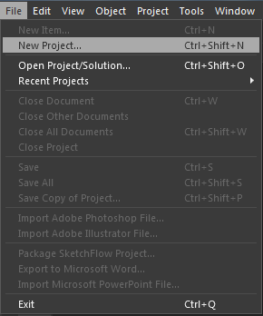
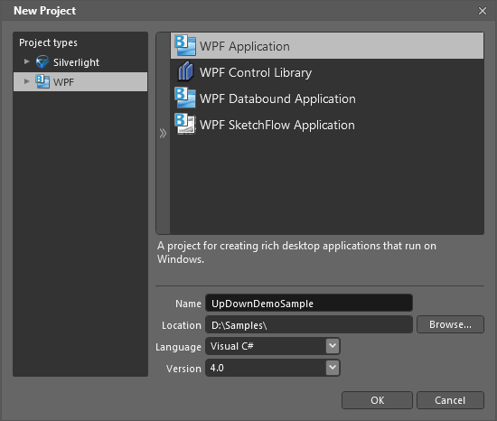
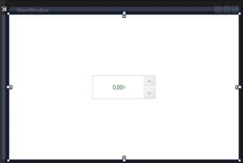

::: {style="DISPLAY: none"}
{#d2h_url_template}{#d2h_package_url style="WIDTH: 0px; DISPLAY: none; HEIGHT: 0px"}
:::

::: {.d2h_secondary_topic style="PADDING-BOTTOM: 10pt; MARGIN: 0pt; PADDING-LEFT: 0pt; PADDING-RIGHT: 0pt; PADDING-TOP: 0pt"}
#### Creating the UpDown Control in Expression Blend {#creating-the-updown-control-in-expression-blend style="tab-stops: 0pt"}

To create UpDown in Expression Blend:

1.   Open Expression Blend.

On the **File** menu, select **New Project**. The **New Project** dialog box opens.

{border="0"}

Figure 1154: File Menu

In the **Project types** pane, select **WPF**, and then from the options displayed, select **WPF Application**.

In the **Name** field, type a name for the project, and then click **OK**.

{border="0"}New Figure 1155:Project Dialog Box

[]{style="FONT-FAMILY: 'Trebuchet MS','sans-serif'; COLOR: #15428b; FONT-SIZE: 9pt"} 

On the **Window** menu, select **Assets**. The **Assets Library** dialog box opens.

In the **Search** box, type **UpDown**. The search results are displayed.

Drag the **UpDown** control to **Design View**. An instance of the **UpDown** control is created.

[]{style="FONT-FAMILY: 'Trebuchet MS','sans-serif'; COLOR: #15428b; FONT-SIZE: 9pt"} 

{border="0"}

Figure 1156: UpDown Control in Design View

[]{style="COLOR: #c00000"} 

[]{#related-topics}
:::
