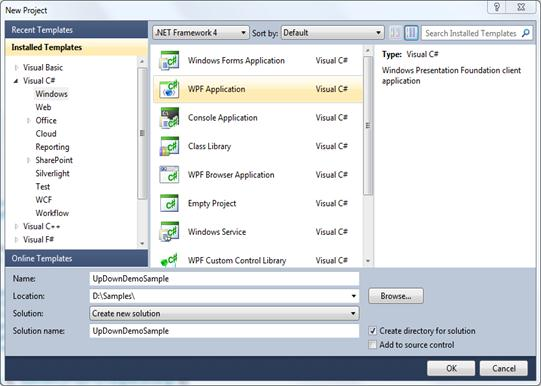
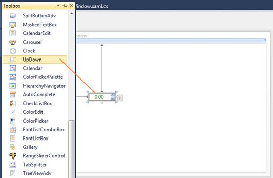

::: {style="DISPLAY: none"}
{#d2h_url_template}{#d2h_package_url style="WIDTH: 0px; DISPLAY: none; HEIGHT: 0px"}
:::

::: {.d2h_secondary_topic style="PADDING-BOTTOM: 10pt; MARGIN: 0pt; PADDING-LEFT: 0pt; PADDING-RIGHT: 0pt; PADDING-TOP: 0pt"}
#### Creating the UpDown Control in Visual Studio {#creating-the-updown-control-in-visual-studio style="tab-stops: 0pt"}

To create an UpDown instance in Visual Studio:

1.   Open Visual Studio.

2.   On the File menu, select New, and then select Project. The New Project dialog box opens.

 

{border="0"}

Figure 1151:File Menu

3.   In the **New Project** dialog box, select **WPF Application**, in the **Name** field, type the name of the project, and then click **OK**.

[]{style="FONT-FAMILY: 'Trebuchet MS','sans-serif'; COLOR: #15428b; FONT-SIZE: 9pt"} 

{border="0"}

Figure 1152:New Project Dialog Box

 

4.   Drag the **UpDown** control from the **Toolbox** window to **Design View**. An instance of the **UpDown** control is created in **Design View**.

 

{border="0"}

Figure 1153: UpDown Control in Design View

[]{#related-topics}
:::
