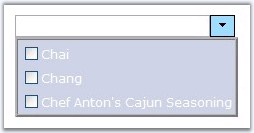
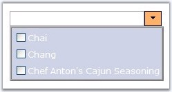
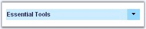
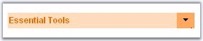
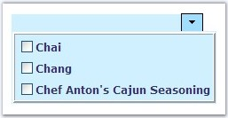

::: {style="DISPLAY: none"}
{#d2h_url_template}{#d2h_package_url style="WIDTH: 0px; DISPLAY: none; HEIGHT: 0px"}
:::

::::::: {.d2h_secondary_topic style="PADDING-BOTTOM: 10pt; MARGIN: 0pt; PADDING-LEFT: 0pt; PADDING-RIGHT: 0pt; PADDING-TOP: 0pt"}
##### CSS Styles {#css-styles style="tab-stops: 0pt"}

[]{style="FONT-FAMILY: 'Trebuchet MS','sans-serif'; COLOR: #15428b; FONT-SIZE: 9pt"} 

The look and feel of the control can be customized using the css properties which has been discussed below.

[]{style="FONT-FAMILY: 'Trebuchet MS','sans-serif'; COLOR: #15428b; FONT-SIZE: 9pt"} 

Customizing the Button

[  ]{style="FONT-FAMILY: 'Trebuchet MS','sans-serif'; COLOR: #15428b; FONT-SIZE: 9pt"}

The button image on the right of the control can be customized, and styles can be set using the **ButtonCssClass** and **ButtonHoverCssClass** properties.

[]{style="FONT-FAMILY: 'Trebuchet MS','sans-serif'; COLOR: #15428b; FONT-SIZE: 9pt"} 

::: {align="center"}
  --------------------- -----------------------------------------------------------------------
  Property              Description
  ButtonCssClass        Specifies the css definitions to apply to the button\'s html element.
  ButtonHoverCssClass   Specifies the css definitions to apply for the button on mouse hover.
  --------------------- -----------------------------------------------------------------------
:::

[]{style="FONT-FAMILY: 'Trebuchet MS','sans-serif'; COLOR: #15428b; FONT-SIZE: 9pt"} 

{border="0"}

[]{style="FONT-FAMILY: 'Trebuchet MS','sans-serif'; COLOR: #15428b; FONT-SIZE: 9pt"} 

Figure 133: Styles applied to the Button

[]{style="FONT-FAMILY: 'Trebuchet MS','sans-serif'; COLOR: #15428b; FONT-SIZE: 9pt"} 

{border="0"}

[]{style="FONT-FAMILY: 'Trebuchet MS','sans-serif'; COLOR: #15428b; FONT-SIZE: 9pt"} 

**[]{style="FONT-FAMILY: 'Trebuchet MS','sans-serif'; COLOR: #15428b; FONT-SIZE: 9pt"}** 

Figure 134: Styles applied for Button Hover

[           ]{style="FONT-FAMILY: 'Trebuchet MS','sans-serif'; COLOR: #15428b; FONT-SIZE: 9pt"}

The below given css definitions must be set to the above discussed properties to apply the styles to the button.

[]{style="FONT-FAMILY: 'Trebuchet MS','sans-serif'; COLOR: #15428b; FONT-SIZE: 9pt"} 

+-----------------------------------------------------------------------------------+
| [.BtnCSS]{style="FONT-FAMILY: 'Courier New'; FONT-SIZE: 9pt"}                     |
|                                                                                   |
| [{]{style="FONT-FAMILY: 'Courier New'; FONT-SIZE: 9pt"}                           |
|                                                                                   |
| [  border:1px solid #A0DEFF;]{style="FONT-FAMILY: 'Courier New'; FONT-SIZE: 9pt"} |
|                                                                                   |
| [  width:25px;]{style="FONT-FAMILY: 'Courier New'; FONT-SIZE: 9pt"}               |
|                                                                                   |
| [  cursor:pointer;]{style="FONT-FAMILY: 'Courier New'; FONT-SIZE: 9pt"}           |
|                                                                                   |
| [  background-Color:#A0DEFF;]{style="FONT-FAMILY: 'Courier New'; FONT-SIZE: 9pt"} |
|                                                                                   |
| [}]{style="FONT-FAMILY: 'Courier New'; FONT-SIZE: 9pt"}                           |
|                                                                                   |
| []{style="FONT-FAMILY: 'Courier New'; FONT-SIZE: 9pt"}                            |
|                                                                                   |
| [.BtnHoverCSS]{style="FONT-FAMILY: 'Courier New'; FONT-SIZE: 9pt"}                |
|                                                                                   |
| [{]{style="FONT-FAMILY: 'Courier New'; FONT-SIZE: 9pt"}                           |
|                                                                                   |
| [  border:1px solid #FFB26A;]{style="FONT-FAMILY: 'Courier New'; FONT-SIZE: 9pt"} |
|                                                                                   |
| [  width:25px;]{style="FONT-FAMILY: 'Courier New'; FONT-SIZE: 9pt"}               |
|                                                                                   |
| [  cursor:pointer;]{style="FONT-FAMILY: 'Courier New'; FONT-SIZE: 9pt"}           |
|                                                                                   |
| [  background-Color:#FFB26A;]{style="FONT-FAMILY: 'Courier New'; FONT-SIZE: 9pt"} |
|                                                                                   |
| [}]{style="FONT-FAMILY: 'Courier New'; FONT-SIZE: 9pt"}                           |
+-----------------------------------------------------------------------------------+

[]{style="FONT-FAMILY: 'Trebuchet MS','sans-serif'; COLOR: #15428b; FONT-SIZE: 9pt"} 

Customizing the TextBox

[]{style="FONT-FAMILY: 'Trebuchet MS','sans-serif'; COLOR: #15428b; FONT-SIZE: 9pt"} 

The TextBox can be customized by using the style properties such as **TextBoxCssClass** and **TextBoxHoverCssClass** which help to set different styles for the text and textbox.

[]{style="FONT-FAMILY: 'Trebuchet MS','sans-serif'; COLOR: #15428b; FONT-SIZE: 9pt"} 

::: {align="center"}
  ---------------------- -----------------------------------------------------------------------------
  Property               Description
  TextBoxCssClass        Specifies the css definitions to apply to the text container.
  TextBoxHoverCssClass   Specifies the css definitions to apply to the text container on mouse over.
  ---------------------- -----------------------------------------------------------------------------
:::

[]{style="FONT-FAMILY: 'Trebuchet MS','sans-serif'; COLOR: #15428b; FONT-SIZE: 9pt"} 

{border="0"}

[]{style="FONT-FAMILY: 'Trebuchet MS','sans-serif'; COLOR: #15428b; FONT-SIZE: 9pt"} 

Figure 135: Styles applied to the TextBox

[]{style="FONT-FAMILY: 'Trebuchet MS','sans-serif'; COLOR: #15428b; FONT-SIZE: 9pt"} 

{border="0"}

Figure 136

[]{style="FONT-FAMILY: 'Trebuchet MS','sans-serif'; COLOR: #15428b; FONT-SIZE: 9pt"} 

The below given css definitions must be set to the above discussed properties to apply the styles to both the text and textbox.

[]{style="FONT-FAMILY: 'Trebuchet MS','sans-serif'; COLOR: #15428b; FONT-SIZE: 9pt"} 

+-------------------------------------------------------------------------------------+
| [.TextBoxCSS]{style="FONT-FAMILY: 'Courier New'; FONT-SIZE: 9pt"}                   |
|                                                                                     |
| [{]{style="FONT-FAMILY: 'Courier New'; FONT-SIZE: 9pt"}                             |
|                                                                                     |
| [  color:#333365;]{style="FONT-FAMILY: 'Courier New'; FONT-SIZE: 9pt"}              |
|                                                                                     |
| [  font-name:tahoma;]{style="FONT-FAMILY: 'Courier New'; FONT-SIZE: 9pt"}           |
|                                                                                     |
| [  font-size:12px;]{style="FONT-FAMILY: 'Courier New'; FONT-SIZE: 9pt"}             |
|                                                                                     |
| [  font-weight:bold;]{style="FONT-FAMILY: 'Courier New'; FONT-SIZE: 9pt"}           |
|                                                                                     |
| [  background-Color:#d0f0ff;]{style="FONT-FAMILY: 'Courier New'; FONT-SIZE: 9pt"}   |
|                                                                                     |
| [  border:1px solid #d0f0ff;  ]{style="FONT-FAMILY: 'Courier New'; FONT-SIZE: 9pt"} |
|                                                                                     |
| [}]{style="FONT-FAMILY: 'Courier New'; FONT-SIZE: 9pt"}                             |
|                                                                                     |
| [.TextBoxHoverCSS]{style="FONT-FAMILY: 'Courier New'; FONT-SIZE: 9pt"}              |
|                                                                                     |
| [{]{style="FONT-FAMILY: 'Courier New'; FONT-SIZE: 9pt"}                             |
|                                                                                     |
| [  color:#ee7a03;]{style="FONT-FAMILY: 'Courier New'; FONT-SIZE: 9pt"}              |
|                                                                                     |
| [  font-name:tahoma;]{style="FONT-FAMILY: 'Courier New'; FONT-SIZE: 9pt"}           |
|                                                                                     |
| [  font-size:12px;]{style="FONT-FAMILY: 'Courier New'; FONT-SIZE: 9pt"}             |
|                                                                                     |
| [  font-weight:bold;]{style="FONT-FAMILY: 'Courier New'; FONT-SIZE: 9pt"}           |
|                                                                                     |
| [  background-Color:#ffe1c4;]{style="FONT-FAMILY: 'Courier New'; FONT-SIZE: 9pt"}   |
|                                                                                     |
| [  border:1px solid #ffe1c4;  ]{style="FONT-FAMILY: 'Courier New'; FONT-SIZE: 9pt"} |
|                                                                                     |
| [}]{style="FONT-FAMILY: 'Courier New'; FONT-SIZE: 9pt"}                             |
+-------------------------------------------------------------------------------------+

[]{style="FONT-FAMILY: 'Trebuchet MS','sans-serif'; COLOR: #15428b; FONT-SIZE: 9pt"} 

Customizing the TextBox Elements

[]{style="FONT-FAMILY: 'Trebuchet MS','sans-serif'; COLOR: #15428b; FONT-SIZE: 9pt"} 

Styles can be applied to the outer html elements of the textbox using the properties **ControlRootCssClass**, **ContainerHoverCSSClass** and **ContainerTableCssClass**. These properties can be used to apply styles to the various structured layers of the textbox.

[]{style="FONT-FAMILY: 'Trebuchet MS','sans-serif'; COLOR: #15428b; FONT-SIZE: 9pt"} 

::: {align="center"}
  ------------------------ -------------------------------------------------------------------------------
  Property                 Description
  ContainerHoverCSSClass   Specifies the css definitions to apply to the container table on mouse hover.
  ContainerTableCssClass   Specifies the css definitions to apply to the container table.
  ControlRootCSSClass      Specifies the css definitions to use for the root elements of the control.
  ------------------------ -------------------------------------------------------------------------------
:::

[]{style="FONT-FAMILY: 'Trebuchet MS','sans-serif'; COLOR: #15428b; FONT-SIZE: 9pt"} 

Customizing the Popup Container

[]{style="FONT-FAMILY: 'Trebuchet MS','sans-serif'; COLOR: #15428b; FONT-SIZE: 9pt"} 

The **PopupCSSClass** can be used to apply different styles to the container that pops-up on button click.

[]{style="FONT-FAMILY: 'Trebuchet MS','sans-serif'; COLOR: #15428b; FONT-SIZE: 9pt"} 

::: {align="center"}
  ----------------------- ----------------------------------------------------------------------------------
  Property                Description
  PopupCssClass           Specifies the css definitions to apply to the control container\'s html element.
  ----------------------- ----------------------------------------------------------------------------------
:::

[]{style="FONT-FAMILY: 'Trebuchet MS','sans-serif'; COLOR: #15428b; FONT-SIZE: 9pt"} 

{border="0"}

[]{style="FONT-FAMILY: 'Trebuchet MS','sans-serif'; COLOR: #15428b; FONT-SIZE: 9pt"} 

Figure 137: Styles applied to the Popup Container

 

[]{#related-topics}
:::::::
