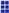
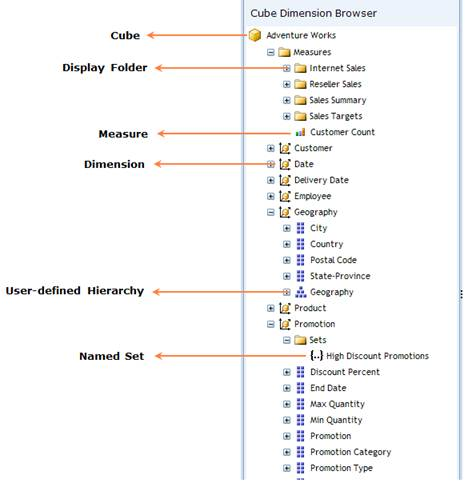
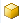
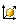

::: {style="DISPLAY: none"}
{#d2h_url_template}{#d2h_package_url style="WIDTH: 0px; DISPLAY: none; HEIGHT: 0px"}
:::

::::: {#nsbanner .d2h_main_nsbanner style="BORDER-BOTTOM: #999999 1px solid; POSITION: relative; PADDING-BOTTOM: 0px; BACKGROUND-COLOR: transparent; PADDING-LEFT: 0px; PADDING-RIGHT: 0px; DISPLAY: none; BORDER-TOP: #999999 1px solid; PADDING-TOP: 0px; LEFT: 0px"}
:::: {#TitleRow .d2h_main_titlerow style="PADDING-BOTTOM: 4px; BACKGROUND-COLOR: transparent; PADDING-LEFT: 22px; WIDTH: 100%; PADDING-RIGHT: 10px; DISPLAY: none; PADDING-TOP: 4px"}
::: {#ienav .d2h_main_ienav style="DISPLAY: none"}
{#D2HPrevious .D2HPreviousEnabled}  {#D2HNext .D2HNextEnabled}
:::
::::
:::::

:::::: {#nstext .d2h_main_nstext style="PADDING-BOTTOM: 10px; BACKGROUND-COLOR: transparent; PADDING-LEFT: 22px; PADDING-RIGHT: 10px; HEIGHT: 100%; OVERFLOW: auto; PADDING-TOP: 5px" hasuserbackground="true" valign="bottom"}
::: {#d2h_breadcrumbs .d2h_breadcrumbs}
[Essential Studio User Guide Documentation](ms-xhelp:///?Id=12457748-09e3-4d74-a240-8e049cedf030){.d2h_breadcrumbsNormal}[ \> ]{.d2h_breadcrumbsLinkSeparator}[Business Intelligence Edition](ms-xhelp:///?Id=fdf33dd8-62b2-47b9-ad7b-fc50e590bca5){.d2h_breadcrumbsNormal}[ \> ]{.d2h_breadcrumbsLinkSeparator}[Essential BI ASP.NET](ms-xhelp:///?Id=99c6694e-59c3-4c59-abb5-ce9ce9a948bc){.d2h_breadcrumbsNormal}[ \> ]{.d2h_breadcrumbsLinkSeparator}[Essential BI Client]{.d2h_breadcrumbsContentsOnly}[ \> ]{.d2h_breadcrumbsLinkSeparator}[Getting Started](ms-xhelp:///?Id=d67227c0-bba2-4943-acc1-d5c64f70f90b){.d2h_breadcrumbsNormal}[ \> ]{.d2h_breadcrumbsLinkSeparator}[Appearance and Structure of the control](ms-xhelp:///?Id=5eefc693-d23d-481b-92b8-6a7d9ff5439b){.d2h_breadcrumbsNormal}
:::

### Cube dimension browser {#cube-dimension-browser style="tab-stops: 0pt"}

 

Definition

The *Cube Dimension Browser* is a tree-view like structure that organizes the dimensions and measures from the selected cube into independent logical groups.

Type of nodes in cube dimension browser

 

Table 9: Type of Nodes

 

::: {align="center"}
  ------------------------ ------------------------------------------------------------------------------------------------------------------------------------------------
  Type Of Nodes            Description
  Cube                     Multidimensional set of data used for dynamic analysis.
  Measure Group            Composition of set of measures.
  Display Folder           Ordinary folder that contains the dimension and measure.
  Measure                  Actual set of measures that compose the measure group.
  Dimension                A name given to the parts of the cube that categorize the data such as Date, Customer etc... It in turn contains hierarchy and level elements.
  Attribute Hierarchy      Level of attributes down the hierarchy.
  User-defined hierarchy   Members of a dimension in hierarchical structure.
  ------------------------ ------------------------------------------------------------------------------------------------------------------------------------------------
:::

 

Attribute hierarchy and user-defined hierarchy

**Attribute Hierarchy:** An attribute hierarchy is a hierarchy of attribute members that contains the following levels:

[·      ]{style="FONT-FAMILY: Symbol"}A leaf level contains each distinct attribute member called leaf member with each member of the leaf level.

[·      ]{style="FONT-FAMILY: Symbol"}Intermediate levels if the attribute hierarchy is a parent-child hierarchy.

[·      ]{style="FONT-FAMILY: Symbol"}An optional (All) level (IsAggregatable=True) containing the aggregated value of the attribute hierarchy\'s leaf members, with the member of the (All) level also known as the (All) member.

**[]{style="COLOR: black"}** 

**User-Defined Hierarchy:** User-defined hierarchy organizes the members of a dimension into hierarchical structures and provides navigation paths in a cube. For example, take a dimension table that supports three attributes such as Year, Quarter, and Month. The Year, Quarter, and Month attributes are used to construct a user-defined hierarchy, named Calendar, in the time dimension.

[]{style="COLOR: black"} 

Differentiating attribute hierarchy and user-defined hierarchy

The attribute hierarchy and user-defined hierarchy are normally differentiated by their tree node image.

  --------------------------------------------------------------------------------------------------------------------------- -------------------------------------------------------------------------
  {border="0"}                   Attribute Hierarchy
  {border="0"}   User Defined Hierarchy and its levels are mentioned with similar image.
  --------------------------------------------------------------------------------------------------------------------------- -------------------------------------------------------------------------

[Draggable and non-draggable]{#OLE_LINK5} nodes in Cube Dimension Browser

The nodes which are allowed to drag are:

[·      ]{style="FONT-FAMILY: Symbol"}Measure

[·      ]{style="FONT-FAMILY: Symbol"}Dimension

[·      ]{style="FONT-FAMILY: Symbol"}Hierarchy

[·      ]{style="FONT-FAMILY: Symbol"}Level Elements and

[·      ]{style="FONT-FAMILY: Symbol"}Named Set

The []{#OLE_LINK2}[nodes which are not allowed to drag are]{#OLE_LINK1}:

[·      ]{style="FONT-FAMILY: Symbol"}Cube and

[·      ]{style="FONT-FAMILY: Symbol"}Display Folder

 

{border="0"}

 

Figure 16: Cube Dimension Browser

 

Table 10: Draggable and non-draggable

 

::: {align="center"}
  Icon                                                                                                                                                                                       Name                     Can Drag and Drop
  ------------------------------------------------------------------------------------------------------------------------------------------------------------------------------------------ ------------------------ -------------------
  {border="0"}                                                                                      Cube                     No
  {border="0"}                                                                                    Display Folder           No
  {border="0"}                                                                                  Measure                  Yes
  {border="0"}                                                                                 Dimension                Yes
  {border="0"}                                                           Named Set                Yes
  {border="0"}                                                                  User Defined Hierarchy   Yes
  [{border="0"}]{style="FONT-FAMILY: 'Segoe UI','sans-serif'; COLOR: black; FONT-SIZE: 12pt"}   Attribute Hierarchy      Yes
  {border="0"}                                                                              Level Element            Yes
:::

 

[]{#related-topics}
::::::
