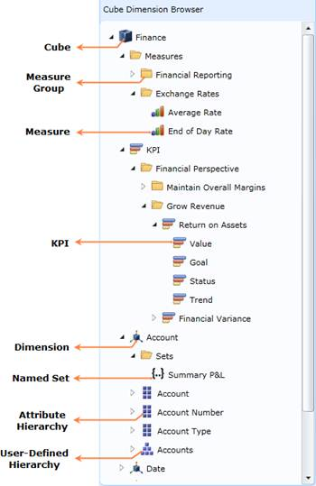
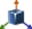
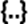
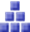
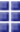

::: {style="DISPLAY: none"}
{#d2h_url_template}{#d2h_package_url style="WIDTH: 0px; DISPLAY: none; HEIGHT: 0px"}
:::

::::: {#nsbanner .d2h_main_nsbanner style="BORDER-BOTTOM: #999999 1px solid; POSITION: relative; PADDING-BOTTOM: 0px; BACKGROUND-COLOR: transparent; PADDING-LEFT: 0px; PADDING-RIGHT: 0px; DISPLAY: none; BORDER-TOP: #999999 1px solid; PADDING-TOP: 0px; LEFT: 0px"}
:::: {#TitleRow .d2h_main_titlerow style="PADDING-BOTTOM: 4px; BACKGROUND-COLOR: transparent; PADDING-LEFT: 22px; WIDTH: 100%; PADDING-RIGHT: 10px; DISPLAY: none; PADDING-TOP: 4px"}
::: {#ienav .d2h_main_ienav style="DISPLAY: none"}
{#D2HPrevious .D2HPreviousEnabled}  {#D2HNext .D2HNextEnabled}
:::
::::
:::::

::::: {#nstext .d2h_main_nstext style="PADDING-BOTTOM: 10px; BACKGROUND-COLOR: transparent; PADDING-LEFT: 22px; PADDING-RIGHT: 10px; HEIGHT: 100%; OVERFLOW: auto; PADDING-TOP: 5px" hasuserbackground="true" valign="bottom"}
::: {#d2h_breadcrumbs .d2h_breadcrumbs}
[Essential Studio User Guide Documentation](ms-xhelp:///?Id=12457748-09e3-4d74-a240-8e049cedf030){.d2h_breadcrumbsNormal}[ \> ]{.d2h_breadcrumbsLinkSeparator}[Business Intelligence Edition](ms-xhelp:///?Id=fdf33dd8-62b2-47b9-ad7b-fc50e590bca5){.d2h_breadcrumbsNormal}[ \> ]{.d2h_breadcrumbsLinkSeparator}[Essential BI Silverlight](ms-xhelp:///?Id=c006b39c-6aa2-4637-b7de-3e7b6cb3f9f9){.d2h_breadcrumbsNormal}[ \> ]{.d2h_breadcrumbsLinkSeparator}[Essential BI Client]{.d2h_breadcrumbsContentsOnly}[ \> ]{.d2h_breadcrumbsLinkSeparator}[Getting Started](ms-xhelp:///?Id=2e1ad51f-2428-46e4-ab7c-d12cb2ab2848){.d2h_breadcrumbsNormal}[ \> ]{.d2h_breadcrumbsLinkSeparator}[Structure of the Control](ms-xhelp:///?Id=c2c30790-e9f5-4e60-b28f-089b2bf378d1){.d2h_breadcrumbsNormal}
:::

### Cube Dimension Browser {#cube-dimension-browser style="tab-stops: 0pt"}

Cube Dimension Browser is a control that organizes the cube elements such as Measures, KPIs, Dimensions, Hierarchy and so on, in a Tree-view structure.

You can add the element to the selected report by dragging and dropping the element from the Cube Dimension browser to the Axis Element Builder. A cube has different types of elements and you cannot drag all the elements in the Cube Dimension browser.

 

Structure of the Cube Dimension Browser

 

{border="0"}

 

Figure 11: Cube Dimension Browser

 

Different Types of Notes in the Cube Dimension Browser

Table 3: Types of Notes

 

::: {align="center"}
  Icon                                        Name                     Can Drag and Drop
  ------------------------------------------- ------------------------ -------------------
  {border="0"}   Cube                     No
  {border="0"}   Measure Group            No
  {border="0"}   Measure                  Yes
  {border="0"}   KPI Group                No
  {border="0"}   KPI                      Yes
  {border="0"}   Dimension                Yes
  {border="0"}   Named Set                Yes
  {border="0"}   User Defined Hierarchy   Yes
  {border="0"}   Attribute Hierarchy      Yes
  {border="0"}   Level Element            Yes
:::

 

Cube -- Multidimensional set of data used for dynamic analysis.

Measure Group -- Composition of a set of measures.

Measure -- Actual set of measures that compose the measure group.

KPI Group -- Composition of a set of KPI.

KPI -- Business metric used to evaluate factors that are crucial to the success of an organization.

Dimension -- A name given to the parts of the cubes that categorize data such as date, customer and so on. It in turn contains hierarchy and level elements.

User-Defined Hierarchy -- Members of a dimension in hierarchical structure.

Attribute Hierarchy -- Level of attribute down the hierarchy.

 

Difference between Attribute Hierarchy and User-Defined Hierarchy:

 

Attribute Hierarchy:

An attribute hierarchy is a hierarchy  of attribute members that contains the following levels:

A leaf level that contains each distinct attribute member, with each member of the leaf level also known as a leaf member.

Intermediate levels if the attribute hierarchy is a parent-child hierarchy.

An optional (All) level (IsAggreagatable = True) containing the aggregated value of the attribute hierarchy's members, with the member of the (All) level also known as the (All) member.

User-Defined Hierarchy:

User-defined hierarchy organizes the members of a dimension into hierarchical structures and provides navigation paths in a cube. For example, take a dimension table that supports three attributes, named Year, Quarter and Months. The Year, Quarter and Month attributes are used to construct a User-defined hierarchy, named Calendar in the time dimension.

 

[]{#related-topics}
:::::
