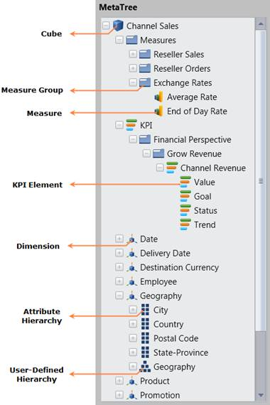
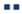

::: {style="DISPLAY: none"}
{#d2h_url_template} {#d2h_package_url style="WIDTH: 0px; DISPLAY: none; HEIGHT: 0px"}
:::

::::: {#nsbanner .d2h_main_nsbanner style="BORDER-BOTTOM: #999999 1px solid; POSITION: relative; PADDING-BOTTOM: 0px; BACKGROUND-COLOR: transparent; PADDING-LEFT: 0px; PADDING-RIGHT: 0px; DISPLAY: none; BORDER-TOP: #999999 1px solid; PADDING-TOP: 0px; LEFT: 0px"}
:::: {#TitleRow .d2h_main_titlerow style="PADDING-BOTTOM: 4px; BACKGROUND-COLOR: transparent; PADDING-LEFT: 22px; WIDTH: 100%; PADDING-RIGHT: 10px; DISPLAY: none; PADDING-TOP: 4px"}
::: {#ienav .d2h_main_ienav style="DISPLAY: none"}
{#D2HPrevious .D2HPreviousEnabled}  {#D2HNext .D2HNextEnabled}
:::
::::
:::::

::::: {#nstext .d2h_main_nstext style="PADDING-BOTTOM: 10px; BACKGROUND-COLOR: transparent; PADDING-LEFT: 22px; PADDING-RIGHT: 10px; HEIGHT: 100%; OVERFLOW: auto; PADDING-TOP: 5px" hasuserbackground="true" valign="bottom"}
::: {#d2h_breadcrumbs .d2h_breadcrumbs}
[Essential Studio User Guide Documentation](ms-xhelp:///?Id=12457748-09e3-4d74-a240-8e049cedf030){.d2h_breadcrumbsNormal} [ \> ]{.d2h_breadcrumbsLinkSeparator} [Business Intelligence Edition](ms-xhelp:///?Id=fdf33dd8-62b2-47b9-ad7b-fc50e590bca5){.d2h_breadcrumbsNormal} [ \> ]{.d2h_breadcrumbsLinkSeparator} [Essential BI WPF](ms-xhelp:///?Id=41e3d586-d922-4a01-8272-679fe4ae7343){.d2h_breadcrumbsNormal} [ \> ]{.d2h_breadcrumbsLinkSeparator} [Essential BI Client]{.d2h_breadcrumbsContentsOnly} [ \> ]{.d2h_breadcrumbsLinkSeparator} [Getting Started](ms-xhelp:///?Id=e2ccfc7e-65d6-4d37-b63a-4d82606af0e4){.d2h_breadcrumbsNormal} [ \> ]{.d2h_breadcrumbsLinkSeparator} [OLAP Client WPF Elements](ms-xhelp:///?Id=3a1e8d38-9b4a-4c83-89c0-4214cc149c24){.d2h_breadcrumbsNormal}
:::

### Cube Dimension Browser {#cube-dimension-browser style="tab-stops: 0pt"}

 

Cube Dimension Browser is a control that organises the cube elements such as Measures, KPIS, Dimensions, Hierarchy and so on. in a tree-view like structure.

User can add the element to the selected report by dragging and dropping the element from the cube dimension browser to the Axis Element Builder. A cube has different types of elements and the user cannot drag all the elements in the cube dimension browser.

[]{style="FONT-FAMILY: 'Trebuchet MS','sans-serif'; COLOR: #15428b; FONT-SIZE: 9pt"} 

[]{style="FONT-FAMILY: 'Calibri','sans-serif'"} 

{border="0"}

Figure 13: Cube Dimension Browser

 

Different types of notes in the Cube Dimension Browser

 

::: {align="center"}
+-------------------------------------------------------------------------------------------------------------------------------------------------------------------------------------------------------------------------------------------------------------+------------------------+-----------------------+
| Icon                                                                                                                                                                                                                                                        | Name                   | Can Drag and Drop     |
+=============================================================================================================================================================================================================================================================+========================+=======================+
| ::: {style="BORDER-BOTTOM: windowtext 1pt solid; BORDER-LEFT: medium none; PADDING-BOTTOM: 1pt; MARGIN-TOP: 9pt; PADDING-LEFT: 0pt; PADDING-RIGHT: 0pt; MARGIN-BOTTOM: 9pt; BORDER-TOP: windowtext 1pt solid; BORDER-RIGHT: medium none; PADDING-TOP: 1pt"} | Cube                   | No                    |
| {border="0"}                                                                                                                                                                                                                   |                        |                       |
| :::                                                                                                                                                                                                                                                         |                        |                       |
+-------------------------------------------------------------------------------------------------------------------------------------------------------------------------------------------------------------------------------------------------------------+------------------------+-----------------------+
| ::: {style="BORDER-BOTTOM: windowtext 1pt solid; BORDER-LEFT: medium none; PADDING-BOTTOM: 1pt; MARGIN-TOP: 9pt; PADDING-LEFT: 0pt; PADDING-RIGHT: 0pt; MARGIN-BOTTOM: 9pt; BORDER-TOP: windowtext 1pt solid; BORDER-RIGHT: medium none; PADDING-TOP: 1pt"} | Measure Group          | No                    |
| {border="0"}                                                                                                                                                                                                                   |                        |                       |
| :::                                                                                                                                                                                                                                                         |                        |                       |
+-------------------------------------------------------------------------------------------------------------------------------------------------------------------------------------------------------------------------------------------------------------+------------------------+-----------------------+
| ::: {style="BORDER-BOTTOM: windowtext 1pt solid; BORDER-LEFT: medium none; PADDING-BOTTOM: 1pt; MARGIN-TOP: 9pt; PADDING-LEFT: 0pt; PADDING-RIGHT: 0pt; MARGIN-BOTTOM: 9pt; BORDER-TOP: windowtext 1pt solid; BORDER-RIGHT: medium none; PADDING-TOP: 1pt"} | Measure                | Yes                   |
| {border="0"}                                                                                                                                                                                                                   |                        |                       |
| :::                                                                                                                                                                                                                                                         |                        |                       |
+-------------------------------------------------------------------------------------------------------------------------------------------------------------------------------------------------------------------------------------------------------------+------------------------+-----------------------+
| ::: {style="BORDER-BOTTOM: windowtext 1pt solid; BORDER-LEFT: medium none; PADDING-BOTTOM: 1pt; MARGIN-TOP: 9pt; PADDING-LEFT: 0pt; PADDING-RIGHT: 0pt; MARGIN-BOTTOM: 9pt; BORDER-TOP: windowtext 1pt solid; BORDER-RIGHT: medium none; PADDING-TOP: 1pt"} | KPI Group              | No                    |
| {border="0"}                                                                                                                                                                                                                   |                        |                       |
| :::                                                                                                                                                                                                                                                         |                        |                       |
+-------------------------------------------------------------------------------------------------------------------------------------------------------------------------------------------------------------------------------------------------------------+------------------------+-----------------------+
| ::: {style="BORDER-BOTTOM: windowtext 1pt solid; BORDER-LEFT: medium none; PADDING-BOTTOM: 1pt; MARGIN-TOP: 9pt; PADDING-LEFT: 0pt; PADDING-RIGHT: 0pt; MARGIN-BOTTOM: 9pt; BORDER-TOP: windowtext 1pt solid; BORDER-RIGHT: medium none; PADDING-TOP: 1pt"} | KPI                    | Yes                   |
| {border="0"}                                                                                                                                                                                                                   |                        |                       |
| :::                                                                                                                                                                                                                                                         |                        |                       |
+-------------------------------------------------------------------------------------------------------------------------------------------------------------------------------------------------------------------------------------------------------------+------------------------+-----------------------+
| ::: {style="BORDER-BOTTOM: windowtext 1pt solid; BORDER-LEFT: medium none; PADDING-BOTTOM: 1pt; MARGIN-TOP: 9pt; PADDING-LEFT: 0pt; PADDING-RIGHT: 0pt; MARGIN-BOTTOM: 9pt; BORDER-TOP: windowtext 1pt solid; BORDER-RIGHT: medium none; PADDING-TOP: 1pt"} | Dimension              | Yes                   |
| {border="0"}                                                                                                                                                                                                                   |                        |                       |
| :::                                                                                                                                                                                                                                                         |                        |                       |
+-------------------------------------------------------------------------------------------------------------------------------------------------------------------------------------------------------------------------------------------------------------+------------------------+-----------------------+
| ::: {style="BORDER-BOTTOM: windowtext 1pt solid; BORDER-LEFT: medium none; PADDING-BOTTOM: 1pt; MARGIN-TOP: 9pt; PADDING-LEFT: 0pt; PADDING-RIGHT: 0pt; MARGIN-BOTTOM: 9pt; BORDER-TOP: windowtext 1pt solid; BORDER-RIGHT: medium none; PADDING-TOP: 1pt"} | Named Set              | Yes                   |
| {border="0"}                                                                                                                                                                                                                   |                        |                       |
| :::                                                                                                                                                                                                                                                         |                        |                       |
+-------------------------------------------------------------------------------------------------------------------------------------------------------------------------------------------------------------------------------------------------------------+------------------------+-----------------------+
| ::: {style="BORDER-BOTTOM: windowtext 1pt solid; BORDER-LEFT: medium none; PADDING-BOTTOM: 1pt; MARGIN-TOP: 9pt; PADDING-LEFT: 0pt; PADDING-RIGHT: 0pt; MARGIN-BOTTOM: 9pt; BORDER-TOP: windowtext 1pt solid; BORDER-RIGHT: medium none; PADDING-TOP: 1pt"} | User Defined Hierarchy | Yes                   |
| {border="0"}                                                                                                                                                                                                                   |                        |                       |
| :::                                                                                                                                                                                                                                                         |                        |                       |
+-------------------------------------------------------------------------------------------------------------------------------------------------------------------------------------------------------------------------------------------------------------+------------------------+-----------------------+
| ::: {style="BORDER-BOTTOM: windowtext 1pt solid; BORDER-LEFT: medium none; PADDING-BOTTOM: 1pt; MARGIN-TOP: 9pt; PADDING-LEFT: 0pt; PADDING-RIGHT: 0pt; MARGIN-BOTTOM: 9pt; BORDER-TOP: windowtext 1pt solid; BORDER-RIGHT: medium none; PADDING-TOP: 1pt"} | Attribute Hierarchy    | Yes                   |
| {border="0"}                                                                                                                                                                                                                   |                        |                       |
| :::                                                                                                                                                                                                                                                         |                        |                       |
+-------------------------------------------------------------------------------------------------------------------------------------------------------------------------------------------------------------------------------------------------------------+------------------------+-----------------------+
| ::: {style="BORDER-BOTTOM: windowtext 1pt solid; BORDER-LEFT: medium none; PADDING-BOTTOM: 1pt; MARGIN-TOP: 9pt; PADDING-LEFT: 0pt; PADDING-RIGHT: 0pt; MARGIN-BOTTOM: 9pt; BORDER-TOP: windowtext 1pt solid; BORDER-RIGHT: medium none; PADDING-TOP: 1pt"} | Level Element          | Yes                   |
| {border="0"}                                                                                                                                                                                                                   |                        |                       |
| :::                                                                                                                                                                                                                                                         |                        |                       |
+-------------------------------------------------------------------------------------------------------------------------------------------------------------------------------------------------------------------------------------------------------------+------------------------+-----------------------+
:::

[]{style="FONT-FAMILY: 'Calibri','sans-serif'"} 

[·      ]{style="FONT-FAMILY: Symbol"} ***Cube*** -- Multidimensional set of data used for dynamic analysis.

[·      ]{style="FONT-FAMILY: Symbol"} ***Measure Group*** *--* Composition of a set of measures.

[·      ]{style="FONT-FAMILY: Symbol"} ***Measure*** -- Actual set of measures that compose the measure group.

[·      ]{style="FONT-FAMILY: Symbol"} ***KPI Group*** -- Composition of a set of KPI.

[·      ]{style="FONT-FAMILY: Symbol"} ***KPI*** -- Business metric used to evaluate factors that are crucial to the success of an organization.

[·      ]{style="FONT-FAMILY: Symbol"} ***Dimension*** -- A name given to the parts of the cubes that categorize the data such as date, customer and so on. It in turn contains hierarchy and level elements.

[·      ]{style="FONT-FAMILY: Symbol"} ***User-Defined Hierarchy*** -- Members of a dimension in hierarchical structure.

[·      ]{style="FONT-FAMILY: Symbol"} ***Attribute Hierarchy*** -- Level of attribute down the hierarchy*.*

[]{style="FONT-FAMILY: 'Calibri','sans-serif'"} 

More:

[ ]{#related-topics}

[{border="0" align="absMiddle"}Difference between Attribute Hierarchy and User-Defined Hierarchy](ms-xhelp:///?Id=93e2191d-9570-4c71-9cb7-0d71846cfba7){style="TEXT-DECORATION: none"}
:::::
