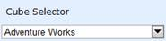

::: {style="DISPLAY: none"}
{#d2h_url_template}{#d2h_package_url style="WIDTH: 0px; DISPLAY: none; HEIGHT: 0px"}
:::

::::: {#nsbanner .d2h_main_nsbanner style="BORDER-BOTTOM: #999999 1px solid; POSITION: relative; PADDING-BOTTOM: 0px; BACKGROUND-COLOR: transparent; PADDING-LEFT: 0px; PADDING-RIGHT: 0px; DISPLAY: none; BORDER-TOP: #999999 1px solid; PADDING-TOP: 0px; LEFT: 0px"}
:::: {#TitleRow .d2h_main_titlerow style="PADDING-BOTTOM: 4px; BACKGROUND-COLOR: transparent; PADDING-LEFT: 22px; WIDTH: 100%; PADDING-RIGHT: 10px; DISPLAY: none; PADDING-TOP: 4px"}
::: {#ienav .d2h_main_ienav style="DISPLAY: none"}
{#D2HPrevious .D2HPreviousEnabled}  {#D2HNext .D2HNextEnabled}
:::
::::
:::::

::::: {#nstext .d2h_main_nstext style="PADDING-BOTTOM: 10px; BACKGROUND-COLOR: transparent; PADDING-LEFT: 22px; PADDING-RIGHT: 10px; HEIGHT: 100%; OVERFLOW: auto; PADDING-TOP: 5px" hasuserbackground="true" valign="bottom"}
::: {#d2h_breadcrumbs .d2h_breadcrumbs}
[Essential Studio User Guide Documentation](ms-xhelp:///?Id=12457748-09e3-4d74-a240-8e049cedf030){.d2h_breadcrumbsNormal}[ \> ]{.d2h_breadcrumbsLinkSeparator}[Business Intelligence Edition](ms-xhelp:///?Id=fdf33dd8-62b2-47b9-ad7b-fc50e590bca5){.d2h_breadcrumbsNormal}[ \> ]{.d2h_breadcrumbsLinkSeparator}[Essential BI ASP.NET](ms-xhelp:///?Id=99c6694e-59c3-4c59-abb5-ce9ce9a948bc){.d2h_breadcrumbsNormal}[ \> ]{.d2h_breadcrumbsLinkSeparator}[Essential BI Client]{.d2h_breadcrumbsContentsOnly}[ \> ]{.d2h_breadcrumbsLinkSeparator}[Getting Started](ms-xhelp:///?Id=d67227c0-bba2-4943-acc1-d5c64f70f90b){.d2h_breadcrumbsNormal}[ \> ]{.d2h_breadcrumbsLinkSeparator}[Appearance and Structure of the control](ms-xhelp:///?Id=5eefc693-d23d-481b-92b8-6a7d9ff5439b){.d2h_breadcrumbsNormal}
:::

### Cube selector {#cube-selector style="tab-stops: 0pt"}

 

Definition

Cube selector lets the user to browse and select a cube from the entire collection, which has been populated by the data source.

 

Changing the cube

On cube change the following elements refresh according to the new cube.

 

Table 8: Components

 

::: {align="center"}
  ------------------------ ---------------------------------------------------------------------------------------------------------------------------------------------------------------------------------------------------------------------------------------------------------------------------------
  Component                Description
  Report List              Maintains a collection of reports.
  Axis Element Builder     Collection of axes namely categorical, series and slicer.
  Elements Editor          The Tree-view control that displays the member element of the current dimension as well as holds a collection of measures.
  Cube Dimension Browser   The Tree-View structure that comprises the dimension and measure belonging to current cube into independent logical groups.
  Chart                    A chart is a graphical representation of [[data]{style="FONT-FAMILY: 'Arial','sans-serif'; COLOR: windowtext"}](http://en.wikipedia.org/wiki/Data "Data"), in which the data is represented by symbols, such as bars in bar chart, lines in line chart, or slices in pie chart.
  Grid                     A grid is a tabular representation of data, arranged in the form of rows and columns, categorized accordingly.
  ------------------------ ---------------------------------------------------------------------------------------------------------------------------------------------------------------------------------------------------------------------------------------------------------------------------------
:::

[]{style="FONT-SIZE: 12pt"} 

{border="0"}

 

Figure 15: Cube Selector

 

[]{#related-topics}
:::::
