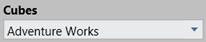

::: {style="DISPLAY: none"}
{#d2h_url_template} {#d2h_package_url style="WIDTH: 0px; DISPLAY: none; HEIGHT: 0px"}
:::

::::: {#nsbanner .d2h_main_nsbanner style="BORDER-BOTTOM: #999999 1px solid; POSITION: relative; PADDING-BOTTOM: 0px; BACKGROUND-COLOR: transparent; PADDING-LEFT: 0px; PADDING-RIGHT: 0px; DISPLAY: none; BORDER-TOP: #999999 1px solid; PADDING-TOP: 0px; LEFT: 0px"}
:::: {#TitleRow .d2h_main_titlerow style="PADDING-BOTTOM: 4px; BACKGROUND-COLOR: transparent; PADDING-LEFT: 22px; WIDTH: 100%; PADDING-RIGHT: 10px; DISPLAY: none; PADDING-TOP: 4px"}
::: {#ienav .d2h_main_ienav style="DISPLAY: none"}
{#D2HPrevious .D2HPreviousEnabled}  {#D2HNext .D2HNextEnabled}
:::
::::
:::::

:::: {#nstext .d2h_main_nstext style="PADDING-BOTTOM: 10px; BACKGROUND-COLOR: transparent; PADDING-LEFT: 22px; PADDING-RIGHT: 10px; HEIGHT: 100%; OVERFLOW: auto; PADDING-TOP: 5px" hasuserbackground="true" valign="bottom"}
::: {#d2h_breadcrumbs .d2h_breadcrumbs}
[Essential Studio User Guide Documentation](ms-xhelp:///?Id=12457748-09e3-4d74-a240-8e049cedf030){.d2h_breadcrumbsNormal} [ \> ]{.d2h_breadcrumbsLinkSeparator} [Business Intelligence Edition](ms-xhelp:///?Id=fdf33dd8-62b2-47b9-ad7b-fc50e590bca5){.d2h_breadcrumbsNormal} [ \> ]{.d2h_breadcrumbsLinkSeparator} [Essential BI WPF](ms-xhelp:///?Id=41e3d586-d922-4a01-8272-679fe4ae7343){.d2h_breadcrumbsNormal} [ \> ]{.d2h_breadcrumbsLinkSeparator} [Essential BI Client]{.d2h_breadcrumbsContentsOnly} [ \> ]{.d2h_breadcrumbsLinkSeparator} [Getting Started](ms-xhelp:///?Id=e2ccfc7e-65d6-4d37-b63a-4d82606af0e4){.d2h_breadcrumbsNormal} [ \> ]{.d2h_breadcrumbsLinkSeparator} [OLAP Client WPF Elements](ms-xhelp:///?Id=3a1e8d38-9b4a-4c83-89c0-4214cc149c24){.d2h_breadcrumbsNormal}
:::

### Cube Selector {#cube-selector style="tab-stops: 0pt"}

 

Definition

OLAP data sources contain multiple cubes and in this case, the cube selector lets you to browse all the available cubes and user can select accordingly.

{border="0"} []{style="FONT-SIZE: 12pt"}

Figure 12: Cube Selector

On Cube Selection Change

Once we change the cube all controls will get refreshed.

[·      ]{style="FONT-FAMILY: Symbol"}The Cube Dimension browser will get populated with cube.

[·      ]{style="FONT-FAMILY: Symbol"}The Axis element builder will come empty.

[·      ]{style="FONT-FAMILY: Symbol"}The OLAP Chart and OLAP Grid will become plain without any data.

[·      ]{style="FONT-FAMILY: Symbol"}The report list will have an empty report without any elements in it.

[]{#_Showing_CubeSelector} **[]{style="FONT-FAMILY: 'Trebuchet MS','sans-serif'; COLOR: #15428b; FONT-SIZE: 9pt"}**  

Showing CubeSelector

Users can toggle the visibility of CubeSelector using this property. This property will accept a Boolean value (true/false) and based on this value sets the visibility of CubeSelector.

**[]{style="FONT-FAMILY: 'Calibri','sans-serif'"}**  

+-------------------------------------------------------------------------------------------------------------------------------------------------------------+
| [\[C#\]]{style="FONT-FAMILY: 'Courier New'"}                                                                                                                |
|                                                                                                                                                             |
| []{style="FONT-FAMILY: 'Courier New'"}                                                                                                                      |
|                                                                                                                                                             |
| [this]{style="FONT-FAMILY: 'Courier New'; COLOR: blue"} [.olapClient1.ShowCubeSelector = [false]{style="COLOR: blue"};]{style="FONT-FAMILY: 'Courier New'"} |
|                                                                                                                                                             |
| []{style="FONT-FAMILY: 'Courier New'"}                                                                                                                      |
+-------------------------------------------------------------------------------------------------------------------------------------------------------------+

**[]{style="FONT-FAMILY: 'Calibri','sans-serif'; COLOR: black"}**  

+----------------------------------------------------------------------------------------------------------------------------------------------------------------------------------------------------------------------------------------+
| [\[VB\]]{style="FONT-FAMILY: 'Courier New'"}                                                                                                                                                                                           |
|                                                                                                                                                                                                                                        |
| [   ]{style="FONT-FAMILY: 'Courier New'"}                                                                                                                                                                                              |
|                                                                                                                                                                                                                                        |
| [Me]{style="FONT-FAMILY: 'Courier New'; COLOR: blue"} [.olapClient1.]{style="FONT-FAMILY: 'Courier New'"} [ShowCubeSelector]{style="FONT-FAMILY: 'Courier New'"} [ = [False]{style="COLOR: blue"}]{style="FONT-FAMILY: 'Courier New'"} |
|                                                                                                                                                                                                                                        |
| []{style="FONT-FAMILY: 'Courier New'"}                                                                                                                                                                                                 |
+----------------------------------------------------------------------------------------------------------------------------------------------------------------------------------------------------------------------------------------+

[]{style="FONT-FAMILY: 'Calibri','sans-serif'"} 

[]{#related-topics}
::::
