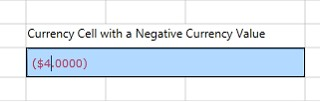
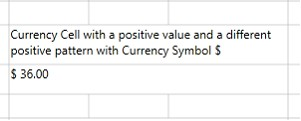
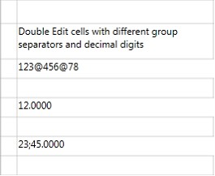
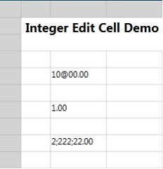
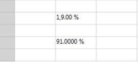
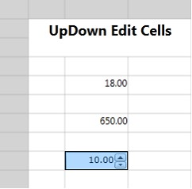

::: {style="DISPLAY: none"}
{#d2h_url_template}{#d2h_package_url style="WIDTH: 0px; DISPLAY: none; HEIGHT: 0px"}
:::

::::: {#nsbanner .d2h_main_nsbanner style="BORDER-BOTTOM: #999999 1px solid; POSITION: relative; PADDING-BOTTOM: 0px; BACKGROUND-COLOR: transparent; PADDING-LEFT: 0px; PADDING-RIGHT: 0px; DISPLAY: none; BORDER-TOP: #999999 1px solid; PADDING-TOP: 0px; LEFT: 0px"}
:::: {#TitleRow .d2h_main_titlerow style="PADDING-BOTTOM: 4px; BACKGROUND-COLOR: transparent; PADDING-LEFT: 22px; WIDTH: 100%; PADDING-RIGHT: 10px; DISPLAY: none; PADDING-TOP: 4px"}
::: {#ienav .d2h_main_ienav style="DISPLAY: none"}
{#D2HPrevious .D2HPreviousEnabled}  {#D2HNext .D2HNextEnabled}
:::
::::
:::::

::::::::: {#nstext .d2h_main_nstext style="PADDING-BOTTOM: 10px; BACKGROUND-COLOR: transparent; PADDING-LEFT: 22px; PADDING-RIGHT: 10px; HEIGHT: 100%; OVERFLOW: auto; PADDING-TOP: 5px" hasuserbackground="true" valign="bottom"}
::: {#d2h_breadcrumbs .d2h_breadcrumbs}
[Essential Studio User Guide Documentation](ms-xhelp:///?Id=12457748-09e3-4d74-a240-8e049cedf030){.d2h_breadcrumbsNormal}[ \> ]{.d2h_breadcrumbsLinkSeparator}[User Interface Edition](ms-xhelp:///?Id=c29296b7-531c-413b-a0ec-488ca1f7f669){.d2h_breadcrumbsNormal}[ \> ]{.d2h_breadcrumbsLinkSeparator}[Essential Silverlight](ms-xhelp:///?Id=66221bd1-ba2e-43c2-94a7-618f50e01d24){.d2h_breadcrumbsNormal}[ \> ]{.d2h_breadcrumbsLinkSeparator}[Essential Grid]{.d2h_breadcrumbsContentsOnly}[ \> ]{.d2h_breadcrumbsLinkSeparator}[Concepts and Features](ms-xhelp:///?Id=8126789d-b192-4c3c-9e36-f0119f12b8b9){.d2h_breadcrumbsNormal}
:::

## Currency Cells {#currency-cells style="tab-stops: 0pt"}

 

Currency cell is useful to represent monetary values to achieve accuracy in the calculations.

This stripes the currency sign in the cell and attempts to parse only the number from the input.

 

The following table consists of GridStyleInfo properties are used to customize these cells:

[]{style="FONT-FAMILY: 'Calibri','sans-serif'"} 

::: {align="center"}
+-------------------------+---------------------------------------------------------------------+------------------+------------------+-------------------------------------------------------------------------------------------------------+
| Name of Property        | Description                                                         | Type of Property | Value It Accepts | Property Syntax                                                                                       |
+-------------------------+---------------------------------------------------------------------+------------------+------------------+-------------------------------------------------------------------------------------------------------+
| CellType                | Set to "CurrencyEdit".                                              | Normal           |  string          | grid.Model\[6, 2\].CellType = \"CurrencyEdit\";                                                       |
+-------------------------+---------------------------------------------------------------------+------------------+------------------+-------------------------------------------------------------------------------------------------------+
| CurrencyDecimalDigits   | Sets the number of decimal places in currency value.                | Normal           | Int              |  grid.Model\[6, 2\].NumberFormat = new NumberFormatInfo{                                              |
|                         |                                                                     |                  |                  |                                                                                                       |
|                         |                                                                     |                  |                  |                 CurrencyDecimalDigits = 2               };                                            |
+-------------------------+---------------------------------------------------------------------+------------------+------------------+-------------------------------------------------------------------------------------------------------+
| CurrencyNegativePattern | Sets the format pattern for negative currency values.               |  Normal          | Int              | grid.Model\[6, 2\].NumberFormat = new NumberFormatInfo{                                               |
|                         |                                                                     |                  |                  |                                                                                                       |
|                         |                                                                     |                  |                  |   CurrencyNegativePattern = 11 };                                                                     |
+-------------------------+---------------------------------------------------------------------+------------------+------------------+-------------------------------------------------------------------------------------------------------+
| CurrencyPositivePattern | Sets the format pattern for positive currency values.               | Normal           | Int              | grid.Model\[6, 2\].NumberFormat = new NumberFormatInfo{                                               |
|                         |                                                                     |                  |                  |                                                                                                       |
|                         |                                                                     |                  |                  |    CurrencyPositivePattern = 1 };                                                                     |
+-------------------------+---------------------------------------------------------------------+------------------+------------------+-------------------------------------------------------------------------------------------------------+
| CurrencySymbol          | Sets the string to use as currency symbol.                          | Normal           | String           | grid.Model\[6, 2\].NumberFormat = new NumberFormatInfo{CurrencySymbol = \"\$\"};                      |
+-------------------------+---------------------------------------------------------------------+------------------+------------------+-------------------------------------------------------------------------------------------------------+
| CurrencyGroupSizes      | Sets the number of digits in each group to the left of the decimal. | Normal           | int\[\]          | grid.Model\[6, 2\].NumberFormat = new NumberFormatInfo{CurrencyGroupSizes = new int\[\] { 2, 3, 4 }}; |
+-------------------------+---------------------------------------------------------------------+------------------+------------------+-------------------------------------------------------------------------------------------------------+
:::

[]{style="FONT-FAMILY: 'Calibri','sans-serif'"} 

**[]{style="FONT-FAMILY: 'Trebuchet MS','sans-serif'; COLOR: #15428b; FONT-SIZE: 9pt"}** 

Creating a Currency Cell

 

1.   Create a Currency Cell with a Negative Currency Value and '\$' as the Currency Symbol. The following code illustrates this[.]{style="FONT-FAMILY: 'Calibri','sans-serif'"}

 

+-----------------------------------------------------------------------------------------------------------------------------------------------+
| []{style="FONT-FAMILY: 'Courier New'; COLOR: black"}                                                                                          |
|                                                                                                                                               |
| [\[C#\]]{style="FONT-FAMILY: 'Courier New'"}                                                                                                  |
|                                                                                                                                               |
| [grid.Model\[6, 2\].CellType = [\"CurrencyEdit\"]{style="COLOR: #a31515"};]{style="FONT-FAMILY: 'Courier New'"}                               |
|                                                                                                                                               |
| [grid.Model\[6, 2\].CurrencyEdit.MinValue = 5;]{style="FONT-FAMILY: 'Courier New'"}                                                           |
|                                                                                                                                               |
| [grid.Model\[6, 2\].CurrencyEdit.MaxValue = 1000;]{style="FONT-FAMILY: 'Courier New'"}                                                        |
|                                                                                                                                               |
| [grid.Model\[6, 2\].NumberFormat = [new]{style="COLOR: blue"} [NumberFormatInfo]{style="COLOR: #2b91af"}]{style="FONT-FAMILY: 'Courier New'"} |
|                                                                                                                                               |
| [            {]{style="FONT-FAMILY: 'Courier New'"}                                                                                           |
|                                                                                                                                               |
| [                CurrencyPositivePattern = 0,]{style="FONT-FAMILY: 'Courier New'"}                                                            |
|                                                                                                                                               |
| [                CurrencyDecimalDigits = 4,]{style="FONT-FAMILY: 'Courier New'"}                                                              |
|                                                                                                                                               |
| [                CurrencyNegativePattern = 0,]{style="FONT-FAMILY: 'Courier New'"}                                                            |
|                                                                                                                                               |
| [                CurrencySymbol = "\$",]{style="FONT-FAMILY: 'Courier New'"}                                                                  |
|                                                                                                                                               |
| [                CurrencyGroupSizes = new int\[\]{2, 3, 4}]{style="FONT-FAMILY: 'Courier New'"}                                               |
|                                                                                                                                               |
| [            };]{style="FONT-FAMILY: 'Courier New'"}                                                                                          |
|                                                                                                                                               |
| [grid.Model\[6, 2\].CellValue = -4.0;]{style="FONT-FAMILY: 'Courier New'"}                                                                    |
|                                                                                                                                               |
| []{style="FONT-FAMILY: 'Courier New'"}                                                                                                        |
+-----------------------------------------------------------------------------------------------------------------------------------------------+

[]{style="FONT-FAMILY: 'Courier New'"} 

When the code runs, the following output displays.

[]{style="FONT-FAMILY: 'Trebuchet MS','sans-serif'; COLOR: #15428b; FONT-SIZE: 9pt"} 

{border="0"}

Figure 202: Currency Cell With Negative Value

***[]{style="FONT-FAMILY: 'Trebuchet MS','sans-serif'; COLOR: #15428b; FONT-SIZE: 9pt"}*** 

 

2.   Create a Currency Cell with a Positive Value and '\$' as the Currency Symbol and with a different positive pattern. The following code illustrates this.

[]{style="FONT-FAMILY: 'Trebuchet MS','sans-serif'; COLOR: #15428b; FONT-SIZE: 9pt"} 

+------------------------------------------------------------------------------------------------------------------------------------------------+
| **[\[C#\]]{style="FONT-FAMILY: 'Courier New'"}**                                                                                               |
|                                                                                                                                                |
| [grid.Model\[10, 2\].CellType = [\"CurrencyEdit\"]{style="COLOR: #a31515"};]{style="FONT-FAMILY: 'Courier New'"}                               |
|                                                                                                                                                |
| [grid.Model\[10, 2\].CurrencyEdit.MinValue = 5;]{style="FONT-FAMILY: 'Courier New'"}                                                           |
|                                                                                                                                                |
| [grid.Model\[10, 2\].CurrencyEdit.MaxValue = 1000;]{style="FONT-FAMILY: 'Courier New'"}                                                        |
|                                                                                                                                                |
| [grid.Model\[10, 2\].NumberFormat = [new]{style="COLOR: blue"} [NumberFormatInfo]{style="COLOR: #2b91af"}]{style="FONT-FAMILY: 'Courier New'"} |
|                                                                                                                                                |
| [            {]{style="FONT-FAMILY: 'Courier New'"}                                                                                            |
|                                                                                                                                                |
| [                CurrencyPositivePattern = 1,]{style="FONT-FAMILY: 'Courier New'"}                                                             |
|                                                                                                                                                |
| [                CurrencyDecimalDigits = 2,]{style="FONT-FAMILY: 'Courier New'"}                                                               |
|                                                                                                                                                |
| [                CurrencyNegativePattern = 11,]{style="FONT-FAMILY: 'Courier New'"}                                                            |
|                                                                                                                                                |
| [                CurrencySymbol = [\"\$\"]{style="COLOR: #a31515"},]{style="FONT-FAMILY: 'Courier New'"}                                       |
|                                                                                                                                                |
| [                CurrencyGroupSizes = [new]{style="COLOR: blue"} [int]{style="COLOR: blue"}\[\]{2, 3, 4}]{style="FONT-FAMILY: 'Courier New'"}  |
|                                                                                                                                                |
| [            };]{style="FONT-FAMILY: 'Courier New'"}                                                                                           |
|                                                                                                                                                |
| [grid.Model\[10, 2\].CellValue = 36.0;]{style="FONT-FAMILY: 'Courier New'"}                                                                    |
|                                                                                                                                                |
| []{style="FONT-FAMILY: 'Courier New'"}                                                                                                         |
|                                                                                                                                                |
| []{style="FONT-FAMILY: 'Courier New'; COLOR: black"}                                                                                           |
+------------------------------------------------------------------------------------------------------------------------------------------------+

[]{style="FONT-FAMILY: 'Calibri','sans-serif'"} 

When the code runs, the following output displays.

[]{style="FONT-FAMILY: 'Trebuchet MS','sans-serif'; COLOR: #15428b; FONT-SIZE: 9pt"} 

[]{style="FONT-FAMILY: 'Calibri','sans-serif'"} 

{border="0"}

Figure 203: Currency Cell With Positive Value

**[]{style="FONT-FAMILY: 'Cambria','serif'; COLOR: #1f497d"}** 

DoubleEdit Cells

 

Using DoubleEdit cell restricts you to enter only double (value type) values into the cell. This is useful to display System.Double type values.

 

The following table consists of GridStyleInfo properties are used to customize these cells.

[]{style="FONT-FAMILY: 'Calibri','sans-serif'"} 

::: {align="center"}
  ------------------------ ----------------------------------------------------------------------------- ------------------ ------------------ ----------------------------------------------------------------------------------------------------------------------
  Name of Property         Description                                                                   Type of Property   Value It Accepts   Property Syntax
  Cell Type                Set to "DoubleEdit"                                                           Normal              String            grid.Model\[6, 2\].CellType = \"DoubleEdit\";
  NumberGroupSeparator     Sets the string that separates groups of digits to the left of the decimal.   Normal              String            grid.Model\[6, 2\].NumberFormat = new NumberFormatInfo{                NumberGroupSeparator = \"@\" };
  NumberDecimalSeparator   Sets the string to use as decimal separator.                                  Normal              String            grid.Model\[6, 2\].NumberFormat = new NumberFormatInfo{                NumberDecimalSeparator = \".\" };
  NumberDecimalDigits      Sets the number of decimal places.                                            Normal             int                grid.Model\[6, 2\].NumberFormat = new NumberFormatInfo{                NumberDecimalDigits = 0};
  NumberGroupSizes         Sets the number of digits in each group to the left of the decimal.           Normal             Int\[\]             grid.Model\[6, 2\].NumberFormat = new NumberFormatInfo{                NumberGroupSizes = new int\[\] { 2, 3, 4 }};
  ------------------------ ----------------------------------------------------------------------------- ------------------ ------------------ ----------------------------------------------------------------------------------------------------------------------
:::

**[]{style="FONT-FAMILY: 'Trebuchet MS','sans-serif'; COLOR: #15428b; FONT-SIZE: 9pt"}** 

Creating DoubleEdit Cells

 

The following code example illustrates creating three double edit cells using different group separator and different decimal digits.

[]{style="FONT-FAMILY: 'Trebuchet MS','sans-serif'; COLOR: #15428b; FONT-SIZE: 9pt"} 

+------------------------------------------------------------------------------------------------------------------------------------------------------------------------------------------------+
| **[\[C#\]]{style="FONT-FAMILY: 'Courier New'; COLOR: black"}**                                                                                                                                 |
|                                                                                                                                                                                                |
| []{style="FONT-FAMILY: 'Courier New'; COLOR: black"}                                                                                                                                           |
|                                                                                                                                                                                                |
| [grid.Model\[6, 2\].CellType = [\"DoubleEdit\"]{style="COLOR: #a31515"};]{style="FONT-FAMILY: 'Courier New'"}                                                                                  |
|                                                                                                                                                                                                |
| [            [this]{style="COLOR: blue"}.grid.Model.CoveredCells.Add([new]{style="COLOR: blue"} [CoveredCellInfo]{style="COLOR: #2b91af"}(6, 2, 6, 3));]{style="FONT-FAMILY: 'Courier New'"}   |
|                                                                                                                                                                                                |
| [            grid.Model\[6, 2\].NumberFormat = [new]{style="COLOR: blue"} [NumberFormatInfo]{style="COLOR: #2b91af"}]{style="FONT-FAMILY: 'Courier New'"}                                      |
|                                                                                                                                                                                                |
| [            {]{style="FONT-FAMILY: 'Courier New'"}                                                                                                                                            |
|                                                                                                                                                                                                |
| [                NumberGroupSeparator = [\"@\"]{style="COLOR: #a31515"},]{style="FONT-FAMILY: 'Courier New'"}                                                                                  |
|                                                                                                                                                                                                |
| [                NumberDecimalSeparator = [\".\"]{style="COLOR: #a31515"},]{style="FONT-FAMILY: 'Courier New'"}                                                                                |
|                                                                                                                                                                                                |
| [                NumberDecimalDigits = 0,]{style="FONT-FAMILY: 'Courier New'"}                                                                                                                 |
|                                                                                                                                                                                                |
| [                NumberGroupSizes = [new]{style="COLOR: blue"} [int]{style="COLOR: blue"}\[\] { 2, 3, 4 }]{style="FONT-FAMILY: 'Courier New'"}                                                 |
|                                                                                                                                                                                                |
| [            };]{style="FONT-FAMILY: 'Courier New'"}                                                                                                                                           |
|                                                                                                                                                                                                |
| [            grid.Model\[6, 2\].CellValue = 12345678.00;]{style="FONT-FAMILY: 'Courier New'"}                                                                                                  |
|                                                                                                                                                                                                |
| []{style="FONT-FAMILY: 'Courier New'"}                                                                                                                                                         |
|                                                                                                                                                                                                |
| [            grid.Model\[8, 2\].CellType = [\"DoubleEdit\"]{style="COLOR: #a31515"};]{style="FONT-FAMILY: 'Courier New'"}                                                                      |
|                                                                                                                                                                                                |
| [            [this]{style="COLOR: blue"}.grid.Model.CoveredCells.Add([new]{style="COLOR: blue"} [CoveredCellInfo]{style="COLOR: #2b91af"}(8, 2, 8, 8));]{style="FONT-FAMILY: 'Courier New'"}   |
|                                                                                                                                                                                                |
| [            grid.Model\[8, 2\].NumberFormat = [new]{style="COLOR: blue"} [NumberFormatInfo]{style="COLOR: #2b91af"}]{style="FONT-FAMILY: 'Courier New'"}                                      |
|                                                                                                                                                                                                |
| [            {]{style="FONT-FAMILY: 'Courier New'"}                                                                                                                                            |
|                                                                                                                                                                                                |
| [                NumberGroupSeparator = [\",\"]{style="COLOR: #a31515"},]{style="FONT-FAMILY: 'Courier New'"}                                                                                  |
|                                                                                                                                                                                                |
| [                NumberDecimalSeparator = [\".\"]{style="COLOR: #a31515"},]{style="FONT-FAMILY: 'Courier New'"}                                                                                |
|                                                                                                                                                                                                |
| [                NumberDecimalDigits = 4,]{style="FONT-FAMILY: 'Courier New'"}                                                                                                                 |
|                                                                                                                                                                                                |
| [                NumberGroupSizes = [new]{style="COLOR: blue"} [int]{style="COLOR: blue"}\[\] { 2, 3, 4 }]{style="FONT-FAMILY: 'Courier New'"}                                                 |
|                                                                                                                                                                                                |
| [            };]{style="FONT-FAMILY: 'Courier New'"}                                                                                                                                           |
|                                                                                                                                                                                                |
| [            grid.Model\[8, 2\].CellValue = 12;]{style="FONT-FAMILY: 'Courier New'"}                                                                                                           |
|                                                                                                                                                                                                |
| []{style="FONT-FAMILY: 'Courier New'"}                                                                                                                                                         |
|                                                                                                                                                                                                |
| [            grid.Model\[10, 2\].CellValue = 2345.00;]{style="FONT-FAMILY: 'Courier New'"}                                                                                                     |
|                                                                                                                                                                                                |
| [            grid.Model\[10, 2\].CellType = [\"DoubleEdit\"]{style="COLOR: #a31515"};]{style="FONT-FAMILY: 'Courier New'"}                                                                     |
|                                                                                                                                                                                                |
| [            [this]{style="COLOR: blue"}.grid.Model.CoveredCells.Add([new]{style="COLOR: blue"} [CoveredCellInfo]{style="COLOR: #2b91af"}(10, 2, 10, 3));]{style="FONT-FAMILY: 'Courier New'"} |
|                                                                                                                                                                                                |
| [            grid.Model\[10, 2\].NumberFormat = [new]{style="COLOR: blue"} [NumberFormatInfo]{style="COLOR: #2b91af"}]{style="FONT-FAMILY: 'Courier New'"}                                     |
|                                                                                                                                                                                                |
| [            {]{style="FONT-FAMILY: 'Courier New'"}                                                                                                                                            |
|                                                                                                                                                                                                |
| [                NumberGroupSeparator = [\";\"]{style="COLOR: #a31515"},]{style="FONT-FAMILY: 'Courier New'"}                                                                                  |
|                                                                                                                                                                                                |
| [                NumberDecimalSeparator = [\".\"]{style="COLOR: #a31515"},]{style="FONT-FAMILY: 'Courier New'"}                                                                                |
|                                                                                                                                                                                                |
| [                NumberDecimalDigits = 4,]{style="FONT-FAMILY: 'Courier New'"}                                                                                                                 |
|                                                                                                                                                                                                |
| [                NumberGroupSizes = [new]{style="COLOR: blue"} [int]{style="COLOR: blue"}\[\]{2, 3, 4}]{style="FONT-FAMILY: 'Courier New'"}                                                    |
|                                                                                                                                                                                                |
| [            };]{style="FONT-FAMILY: 'Courier New'"}                                                                                                                                           |
|                                                                                                                                                                                                |
| []{style="FONT-FAMILY: 'Courier New'; COLOR: black"}                                                                                                                                           |
+------------------------------------------------------------------------------------------------------------------------------------------------------------------------------------------------+

**[]{style="FONT-FAMILY: 'Calibri','sans-serif'; COLOR: black"}** 

When the code runs, the following output displays.

[]{style="FONT-FAMILY: 'Trebuchet MS','sans-serif'; COLOR: #15428b; FONT-SIZE: 9pt"} 

{border="0"}

Figure 204: DoubleEdit Cells

**[]{style="FONT-FAMILY: 'Trebuchet MS','sans-serif'; COLOR: #15428b; FONT-SIZE: 9pt"}** 

IntegerEdit Cells

 

IntegerEdit is a specialized cell type that restricts the data entry to integers. The following table consists of GridStyleInfo properties are used to customize these cells.

[]{style="FONT-FAMILY: 'Calibri','sans-serif'"} 

::: {align="center"}
  ---------------------- ------------------------------------------------- ------------------ ------------------ ----------------------------------------------------------------------------------------------------------------------
  Name of Property       Description                                       Type of Property   Value It Accepts   Property Syntax
  CellType               Set to "IntegerEdit"                              Normal             String              grid.Model\[6, 2\].CellType = \"IntegerEdit\";
  NumberGroupSeparator   Sets the string that separates groups of digits   Normal             String             grid.Model\[6, 2\].NumberFormat = new NumberFormatInfo{                NumberGroupSeparator = \";\" };
  NumberGroupSizes       Sets the number of digits in each group           Normal             int\[\]             grid.Model\[6, 2\].NumberFormat = new NumberFormatInfo{                NumberGroupSizes = new int\[\] { 2, 3, 4 }};
  ---------------------- ------------------------------------------------- ------------------ ------------------ ----------------------------------------------------------------------------------------------------------------------
:::

[]{style="FONT-FAMILY: 'Calibri','sans-serif'"} 

Creating Integer Edit Cells

 

The following code example illustrates creating three different Integer Edit Cells.

**[]{style="FONT-FAMILY: 'Calibri','sans-serif'"}** 

+-----------------------------------------------------------------------------------------------------------------------------------------------------------------------------------------------------------------------+
| []{style="FONT-FAMILY: 'Courier New'; COLOR: black"}                                                                                                                                                                  |
|                                                                                                                                                                                                                       |
| **[\[C#\]]{style="FONT-FAMILY: 'Courier New'"}**                                                                                                                                                                      |
|                                                                                                                                                                                                                       |
| [            int]{style="FONT-FAMILY: 'Courier New'; COLOR: blue"}[\[\] sizes = { 2, 3, 4 };]{style="FONT-FAMILY: 'Courier New'"}                                                                                     |
|                                                                                                                                                                                                                       |
| [            grid.Model\[4, 2\].CellType = [\"IntegerEdit\"]{style="COLOR: #a31515"};]{style="FONT-FAMILY: 'Courier New'"}                                                                                            |
|                                                                                                                                                                                                                       |
| [            grid.Model\[4, 2\].IsEditable = [true]{style="COLOR: blue"};]{style="FONT-FAMILY: 'Courier New'"}                                                                                                        |
|                                                                                                                                                                                                                       |
| [            grid.Model\[4, 2\].NumberFormat = [new]{style="COLOR: blue"} [NumberFormatInfo]{style="COLOR: #2b91af"} { NumberGroupSeparator = [\"@\"]{style="COLOR: #a31515"} };]{style="FONT-FAMILY: 'Courier New'"} |
|                                                                                                                                                                                                                       |
| [            grid.Model\[4, 2\].NumberFormat.NumberGroupSizes = sizes;]{style="FONT-FAMILY: 'Courier New'"}                                                                                                           |
|                                                                                                                                                                                                                       |
| [            grid.Model\[4, 2\].CellValue = 1000; ]{style="FONT-FAMILY: 'Courier New'"}                                                                                                                               |
|                                                                                                                                                                                                                       |
| [            ]{style="FONT-FAMILY: 'Courier New'"}                                                                                                                                                                    |
|                                                                                                                                                                                                                       |
| [            grid.Model\[6, 2\].CellType = [\"IntegerEdit\"]{style="COLOR: #a31515"};]{style="FONT-FAMILY: 'Courier New'"}                                                                                            |
|                                                                                                                                                                                                                       |
| [            grid.Model\[6, 2\].IsEditable = [true]{style="COLOR: blue"};]{style="FONT-FAMILY: 'Courier New'"}                                                                                                        |
|                                                                                                                                                                                                                       |
| [            grid.Model\[6, 2\].NumberFormat = [new]{style="COLOR: blue"} [NumberFormatInfo]{style="COLOR: #2b91af"} { NumberGroupSeparator = [\",\"]{style="COLOR: #a31515"} };]{style="FONT-FAMILY: 'Courier New'"} |
|                                                                                                                                                                                                                       |
| [            grid.Model\[6, 2\].NumberFormat.NumberGroupSizes = sizes;]{style="FONT-FAMILY: 'Courier New'"}                                                                                                           |
|                                                                                                                                                                                                                       |
| [            grid.Model\[6, 2\].CellValue = 1;]{style="FONT-FAMILY: 'Courier New'"}                                                                                                                                   |
|                                                                                                                                                                                                                       |
| []{style="FONT-FAMILY: 'Courier New'"}                                                                                                                                                                                |
|                                                                                                                                                                                                                       |
| [            grid.Model\[8, 2\].CellType = [\"IntegerEdit\"]{style="COLOR: #a31515"};]{style="FONT-FAMILY: 'Courier New'"}                                                                                            |
|                                                                                                                                                                                                                       |
| [            grid.Model\[8, 2\].IsEditable = [true]{style="COLOR: blue"};]{style="FONT-FAMILY: 'Courier New'"}                                                                                                        |
|                                                                                                                                                                                                                       |
| [            grid.Model\[8, 2\].NumberFormat = [new]{style="COLOR: blue"} [NumberFormatInfo]{style="COLOR: #2b91af"} { NumberGroupSeparator = [\";\"]{style="COLOR: #a31515"} };]{style="FONT-FAMILY: 'Courier New'"} |
|                                                                                                                                                                                                                       |
| [            grid.Model\[8, 2\].NumberFormat.NumberGroupSizes = sizes;]{style="FONT-FAMILY: 'Courier New'"}                                                                                                           |
|                                                                                                                                                                                                                       |
| [            grid.Model\[8, 2\].CellValue = 222222;]{style="FONT-FAMILY: 'Courier New'"}                                                                                                                              |
|                                                                                                                                                                                                                       |
| **[]{style="FONT-FAMILY: 'Courier New'"}**                                                                                                                                                                            |
+-----------------------------------------------------------------------------------------------------------------------------------------------------------------------------------------------------------------------+

**[]{style="FONT-FAMILY: 'Calibri','sans-serif'"}** 

When the code runs, the following output displays.

[]{style="FONT-FAMILY: 'Trebuchet MS','sans-serif'; COLOR: #15428b; FONT-SIZE: 9pt"} 

[]{style="FONT-FAMILY: 'Calibri','sans-serif'"} 

{border="0"}

Figure 205: Integer Edit Cells

***[]{style="FONT-FAMILY: 'Trebuchet MS','sans-serif'; COLOR: #15428b; FONT-SIZE: 9pt"}*** 

PercentEdit Cells

The PercentEdit cell type restricts you in data entry. This accepts only percentage values.

The following table consists of GridStyleInfo properties are used to customize these cells.

[]{style="FONT-FAMILY: 'Trebuchet MS','sans-serif'; COLOR: #15428b; FONT-SIZE: 9pt"} 

::: {align="center"}
+-----------------------+----------------------------------------------------------------------------+------------------+------------------+--------------------------------------------------------------------------------------------------------------+
| Name of Property      | Description                                                                | Type of Property | Value It Accepts | Property Syntax                                                                                              |
+-----------------------+----------------------------------------------------------------------------+------------------+------------------+--------------------------------------------------------------------------------------------------------------+
| CellType              | Set to "PercentEdit".                                                      | Normal           | String           |  grid.Model\[6, 2\].CellType = \"PercentEdit\";                                                              |
+-----------------------+----------------------------------------------------------------------------+------------------+------------------+--------------------------------------------------------------------------------------------------------------+
| PercentSymbol         | Sets the string to use as the percent symbol.                              | Normal           | String           | grid.Model\[6, 2\].NumberFormat = new NumberFormatInfo{                                                      |
|                       |                                                                            |                  |                  |                                                                                                              |
|                       |                                                                            |                  |                  | PercentSymbol = \"%\"};                                                                                      |
+-----------------------+----------------------------------------------------------------------------+------------------+------------------+--------------------------------------------------------------------------------------------------------------+
| PercentGroupSizes     | Sets the number of digits in each group to the left of the decimal.        | Normal           |  int\[\]         | grid.Model\[6, 2\].NumberFormat = new NumberFormatInfo{                PercentGroupSizes = new int\[\] {3}}; |
+-----------------------+----------------------------------------------------------------------------+------------------+------------------+--------------------------------------------------------------------------------------------------------------+
| PercentGroupSeparator | Sets the string that separates group of digits to the left of the decimal. | Normal           | String           | grid.Model\[6, 2\].NumberFormat = new NumberFormatInfo{                PercentGroupSeparator = \",\"};       |
+-----------------------+----------------------------------------------------------------------------+------------------+------------------+--------------------------------------------------------------------------------------------------------------+
| PercentDecimalDigits  | Sets the number of digits that appear after the decimal.                   | Normal           | int              | grid.Model\[6, 2\].NumberFormat = new NumberFormatInfo{                PercentDecimalDigits = 4};            |
+-----------------------+----------------------------------------------------------------------------+------------------+------------------+--------------------------------------------------------------------------------------------------------------+
:::

[]{style="FONT-FAMILY: 'Calibri','sans-serif'"} 

**[]{style="FONT-FAMILY: 'Trebuchet MS','sans-serif'; COLOR: #15428b; FONT-SIZE: 9pt"}** 

Creating PercentEdit cell

The following code example illustrates creating two Percent Edit cells with different group sizes and decimal digits.

[]{style="FONT-FAMILY: 'Trebuchet MS','sans-serif'; COLOR: #15428b; FONT-SIZE: 9pt"} 

+-----------------------------------------------------------------------------------------------------------------------------------------------------------------+
| **[\[C#\]]{style="FONT-FAMILY: 'Courier New'"}**                                                                                                                |
|                                                                                                                                                                 |
| [var]{style="FONT-FAMILY: 'Courier New'; COLOR: blue"}[ percentStyleInfo = [this]{style="COLOR: blue"}.grid.Model\[7, 2\];]{style="FONT-FAMILY: 'Courier New'"} |
|                                                                                                                                                                 |
| [            percentStyleInfo.CellType = [\"PercentEdit\"]{style="COLOR: #a31515"};]{style="FONT-FAMILY: 'Courier New'"}                                        |
|                                                                                                                                                                 |
| [            percentStyleInfo.NumberFormat = [new]{style="COLOR: blue"} [NumberFormatInfo]{style="COLOR: #2b91af"}()]{style="FONT-FAMILY: 'Courier New'"}       |
|                                                                                                                                                                 |
| [            {]{style="FONT-FAMILY: 'Courier New'"}                                                                                                             |
|                                                                                                                                                                 |
| [                PercentSymbol = [\"%\"]{style="COLOR: #a31515"},]{style="FONT-FAMILY: 'Courier New'"}                                                          |
|                                                                                                                                                                 |
| [                PercentGroupSizes = [new]{style="COLOR: blue"} [int]{style="COLOR: blue"}\[\] { 1, 2, 3 },]{style="FONT-FAMILY: 'Courier New'"}                |
|                                                                                                                                                                 |
| [                PercentDecimalDigits = 2,]{style="FONT-FAMILY: 'Courier New'"}                                                                                 |
|                                                                                                                                                                 |
| [                PercentGroupSeparator = [\",\"]{style="COLOR: #a31515"},]{style="FONT-FAMILY: 'Courier New'"}                                                  |
|                                                                                                                                                                 |
| [            };]{style="FONT-FAMILY: 'Courier New'"}                                                                                                            |
|                                                                                                                                                                 |
| [            percentStyleInfo.CellValue = 19;]{style="FONT-FAMILY: 'Courier New'"}                                                                              |
|                                                                                                                                                                 |
| []{style="FONT-FAMILY: 'Courier New'"}                                                                                                                          |
|                                                                                                                                                                 |
| [            [var]{style="COLOR: blue"} percentStyleInfo2 = [this]{style="COLOR: blue"}.grid.Model\[9, 2\];]{style="FONT-FAMILY: 'Courier New'"}                |
|                                                                                                                                                                 |
| [            percentStyleInfo2.CellType = [\"PercentEdit\"]{style="COLOR: #a31515"};]{style="FONT-FAMILY: 'Courier New'"}                                       |
|                                                                                                                                                                 |
| [            percentStyleInfo2.NumberFormat = [new]{style="COLOR: blue"} [NumberFormatInfo]{style="COLOR: #2b91af"}()]{style="FONT-FAMILY: 'Courier New'"}      |
|                                                                                                                                                                 |
| [            {]{style="FONT-FAMILY: 'Courier New'"}                                                                                                             |
|                                                                                                                                                                 |
| [                PercentSymbol = [\"%\"]{style="COLOR: #a31515"},]{style="FONT-FAMILY: 'Courier New'"}                                                          |
|                                                                                                                                                                 |
| [                PercentGroupSizes = [new]{style="COLOR: blue"} [int]{style="COLOR: blue"}\[\] { 3 },]{style="FONT-FAMILY: 'Courier New'"}                      |
|                                                                                                                                                                 |
| [                PercentDecimalDigits = 4,]{style="FONT-FAMILY: 'Courier New'"}                                                                                 |
|                                                                                                                                                                 |
| [                PercentGroupSeparator = [\",\"]{style="COLOR: #a31515"},]{style="FONT-FAMILY: 'Courier New'"}                                                  |
|                                                                                                                                                                 |
| [            };]{style="FONT-FAMILY: 'Courier New'"}                                                                                                            |
|                                                                                                                                                                 |
| [            percentStyleInfo2.CellValue = 91;]{style="FONT-FAMILY: 'Courier New'"}                                                                             |
|                                                                                                                                                                 |
| **[]{style="FONT-FAMILY: 'Courier New'"}**                                                                                                                      |
|                                                                                                                                                                 |
| []{style="FONT-FAMILY: 'Courier New'; COLOR: black"}                                                                                                            |
+-----------------------------------------------------------------------------------------------------------------------------------------------------------------+

[]{style="FONT-FAMILY: 'Calibri','sans-serif'"} 

When the code runs, the following output displays.

[]{style="FONT-FAMILY: 'Trebuchet MS','sans-serif'; COLOR: #15428b; FONT-SIZE: 9pt"} 

{border="0"}

Figure 206: Percent Edit Cells

**[]{style="FONT-FAMILY: 'Trebuchet MS','sans-serif'; COLOR: #15428b; FONT-SIZE: 9pt"}** 

UpDownEdit Cells

 

UpDownEdit cell enables you to increase or decrease the cell value with a pair of arrow buttons in the cell.

The following table consists of GridStyleInfo properties are used to customize these cells.

 

::: {align="center"}
  ------------------ ----------------------------------------------------------------------------------- ------------------ ------------------ -------------------------------------------------
  Name of Property   Description                                                                         Type of Property   Value It Accepts   Property Syntax
  CellType           Set to "UpDownEdit".                                                                Normal             String             grid.Model\[6, 2\].CellType = \"UpDownEdit\";
  MaxValue           Sets the upper limit in the range of applicable values.                             Normal             Double              grid.Model\[6, 2\].UpDownEdit.MaxValue = 1000;
  MinValue           Sets the lower limit in the range of applicable values.                             Normal             Double             grid.Model\[6, 2\].UpDownEdit.MinValue = 500;
  Step               Sets the unit value to be increased /decreased when the spin buttons are clicked.   Normal             Double             grid.Model\[6, 2\].UpDownEdit.Step = 50;
  ------------------ ----------------------------------------------------------------------------------- ------------------ ------------------ -------------------------------------------------
:::

[]{style="FONT-FAMILY: 'Calibri','sans-serif'"} 

[]{style="FONT-FAMILY: 'Calibri','sans-serif'"} 

[]{style="FONT-FAMILY: 'Calibri','sans-serif'"} 

[]{style="FONT-FAMILY: 'Calibri','sans-serif'"} 

Creating UpDownEdit cell

The following code example illustrates sets up three different Up and Down controls in grid cells[.]{style="FONT-FAMILY: 'Calibri','sans-serif'"}

[]{style="FONT-FAMILY: 'Calibri','sans-serif'"} 

+-------------------------------------------------------------------------------------------------------------------------------------------------+
| **[\[C#\]]{style="FONT-FAMILY: 'Courier New'"}**                                                                                                |
|                                                                                                                                                 |
| [            grid.Model\[6, 2\].CellType = [\"UpDownEdit\"]{style="COLOR: #a31515"};]{style="FONT-FAMILY: 'Courier New'"}                       |
|                                                                                                                                                 |
| [            grid.Model\[6, 2\].UpDownEdit.MinValue = 500;]{style="FONT-FAMILY: 'Courier New'"}                                                 |
|                                                                                                                                                 |
| [            grid.Model\[6, 2\].UpDownEdit.MaxValue = 1000;]{style="FONT-FAMILY: 'Courier New'"}                                                |
|                                                                                                                                                 |
| [            grid.Model\[6, 2\].UpDownEdit.Step = 50;]{style="FONT-FAMILY: 'Courier New'"}                                                      |
|                                                                                                                                                 |
| [            grid.Model\[6, 2\].HorizontalAlignment = [HorizontalAlignment]{style="COLOR: #2b91af"}.Right;]{style="FONT-FAMILY: 'Courier New'"} |
|                                                                                                                                                 |
| []{style="FONT-FAMILY: 'Courier New'"}                                                                                                          |
|                                                                                                                                                 |
| [            grid.Model\[8, 2\].CellType = [\"UpDownEdit\"]{style="COLOR: #a31515"};]{style="FONT-FAMILY: 'Courier New'"}                       |
|                                                                                                                                                 |
| [            grid.Model\[8, 2\].UpDownEdit.MinValue = 5;]{style="FONT-FAMILY: 'Courier New'"}                                                   |
|                                                                                                                                                 |
| [            grid.Model\[8, 2\].UpDownEdit.MaxValue = 100;]{style="FONT-FAMILY: 'Courier New'"}                                                 |
|                                                                                                                                                 |
| [            grid.Model\[8, 2\].UpDownEdit.Step = 5;]{style="FONT-FAMILY: 'Courier New'"}                                                       |
|                                                                                                                                                 |
| [            grid.Model\[8, 2\].HorizontalAlignment = [HorizontalAlignment]{style="COLOR: #2b91af"}.Right;]{style="FONT-FAMILY: 'Courier New'"} |
|                                                                                                                                                 |
| []{style="FONT-FAMILY: 'Courier New'"}                                                                                                          |
|                                                                                                                                                 |
| [            grid.Model\[4, 2\].CellType = [\"UpDownEdit\"]{style="COLOR: #a31515"};]{style="FONT-FAMILY: 'Courier New'"}                       |
|                                                                                                                                                 |
| [            grid.Model\[4, 2\].UpDownEdit.MinValue = 10;]{style="FONT-FAMILY: 'Courier New'"}                                                  |
|                                                                                                                                                 |
| [            grid.Model\[4, 2\].UpDownEdit.MaxValue = 18;]{style="FONT-FAMILY: 'Courier New'"}                                                  |
|                                                                                                                                                 |
| [            grid.Model\[4, 2\].UpDownEdit.Step = 2;]{style="FONT-FAMILY: 'Courier New'"}                                                       |
|                                                                                                                                                 |
| [            grid.Model\[4, 2\].HorizontalAlignment = [HorizontalAlignment]{style="COLOR: #2b91af"}.Right;]{style="FONT-FAMILY: 'Courier New'"} |
+-------------------------------------------------------------------------------------------------------------------------------------------------+

[]{style="FONT-FAMILY: 'Trebuchet MS','sans-serif'; COLOR: #15428b; FONT-SIZE: 9pt"} 

When the code runs, the following output displays.

[]{style="FONT-FAMILY: 'Trebuchet MS','sans-serif'; COLOR: #15428b; FONT-SIZE: 9pt"} 

[]{style="FONT-FAMILY: 'Calibri','sans-serif'"} 

{border="0"}

Figure 207: UpDown Edit cells

[]{#related-topics}
:::::::::
