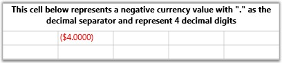
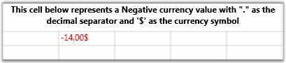

::: {style="DISPLAY: none"}
{#d2h_url_template}{#d2h_package_url style="WIDTH: 0px; DISPLAY: none; HEIGHT: 0px"}
:::

::::: {.d2h_secondary_topic style="PADDING-BOTTOM: 10pt; MARGIN: 0pt; PADDING-LEFT: 0pt; PADDING-RIGHT: 0pt; PADDING-TOP: 0pt"}
##### Currency Cells {#currency-cells style="tab-stops: 0pt"}

This cell type can be used to represent monetary values to achieve accuracy in the calculations. It will stripe the currency sign in the cell and attempt to parse only the number from the input. Use the GridStyleInfo properties below to customize these cells.

[]{style="COLOR: #15428b"} 

::: {align="center"}
  -------------------------- -------------------------------------------------------------
  GridStyleInfo Property     Description
  Cell Type                  Set to "CurrencyEdit".
  CurrencyDecimalDigits      Number of decimal places in currency value.
  CurrencyDecimalSeparator   String to use as decimal separator.
  CurrencyNeagtivePattern    Format pattern for negative currency values.
  CurrencyPostivePattern     Format pattern for positive currency values.
  CurrencySymbol             String to use as currency symbol.
  CurrencyGroupSizes         Number of digits in each group to the left of the decimal .
  -------------------------- -------------------------------------------------------------
:::

**[]{style="COLOR: #15428b"}** 

Creating a Currency Cell with a Negative Currency Value with '.' as the Decimal Separator.

**[]{style="COLOR: #15428b"}** 

+--------------------------------------------------------------------------------------------------------------------------+
| [\[C#\]]{style="FONT-FAMILY: 'Courier New'; COLOR: black"}                                                               |
|                                                                                                                          |
| []{style="FONT-FAMILY: 'Courier New'"}                                                                                   |
|                                                                                                                          |
| [int]{style="FONT-FAMILY: 'Courier New'; COLOR: blue"}[\[\] sizes = { 2, 3, 4 };   ]{style="FONT-FAMILY: 'Courier New'"} |
|                                                                                                                          |
| [grid.Model\[6, 2\].CellType = [\"CurrencyEdit\"]{style="COLOR: #a31515"};]{style="FONT-FAMILY: 'Courier New'"}          |
|                                                                                                                          |
| [grid.Model\[6, 2\].IsEditable = [true]{style="COLOR: blue"};]{style="FONT-FAMILY: 'Courier New'"}                       |
|                                                                                                                          |
| [grid.Model\[6, 2\].NumberFormat = [new]{style="COLOR: blue"} NumberFormatInfo ]{style="FONT-FAMILY: 'Courier New'"}     |
|                                                                                                                          |
| [{ ]{style="FONT-FAMILY: 'Courier New'"}                                                                                 |
|                                                                                                                          |
| [CurrencyDecimalDigits = 4, ]{style="FONT-FAMILY: 'Courier New'"}                                                        |
|                                                                                                                          |
| [CurrencyDecimalSeparator = [\".\"]{style="COLOR: #a31515"}, ]{style="FONT-FAMILY: 'Courier New'"}                       |
|                                                                                                                          |
| [CurrencyNegativePattern = 0, ]{style="FONT-FAMILY: 'Courier New'"}                                                      |
|                                                                                                                          |
| [CurrencyPositivePattern = 0, ]{style="FONT-FAMILY: 'Courier New'"}                                                      |
|                                                                                                                          |
| [CurrencySymbol = [\"\$\"]{style="COLOR: #a31515"} ]{style="FONT-FAMILY: 'Courier New'"}                                 |
|                                                                                                                          |
| [};]{style="FONT-FAMILY: 'Courier New'"}                                                                                 |
|                                                                                                                          |
| [grid.Model\[6, 2\].NumberFormat.CurrencyGroupSizes = sizes;]{style="FONT-FAMILY: 'Courier New'"}                        |
|                                                                                                                          |
| [grid.Model\[6, 2\].CellValue = -4.0;]{style="FONT-FAMILY: 'Courier New'"}                                               |
+--------------------------------------------------------------------------------------------------------------------------+

[]{style="COLOR: #15428b"} 

Output

The following output is generated using the code above.

[]{style="COLOR: #15428b"} 

[{border="0"}]{style="COLOR: #15428b"}[]{style="COLOR: #15428b"}

Figure 25: Currency Cell

 

Currency Cell with a Negative Currency Value and a Different Negative Pattern

+--------------------------------------------------------------------------------------------------------------------------+
| [\[C#\]]{style="FONT-FAMILY: 'Courier New'; COLOR: black"}                                                               |
|                                                                                                                          |
| []{style="FONT-FAMILY: 'Courier New'"}                                                                                   |
|                                                                                                                          |
| [int]{style="FONT-FAMILY: 'Courier New'; COLOR: blue"}[\[\] sizes = { 2, 3, 4 };   ]{style="FONT-FAMILY: 'Courier New'"} |
|                                                                                                                          |
| [grid.Model\[10, 2\].CellType = [\"CurrencyEdit\"]{style="COLOR: #a31515"};]{style="FONT-FAMILY: 'Courier New'"}         |
|                                                                                                                          |
| [grid.Model\[10, 2\].IsEditable = [true]{style="COLOR: blue"};]{style="FONT-FAMILY: 'Courier New'"}                      |
|                                                                                                                          |
| [grid.Model\[10, 2\].NumberFormat = [new]{style="COLOR: blue"} NumberFormatInfo ]{style="FONT-FAMILY: 'Courier New'"}    |
|                                                                                                                          |
| [{ ]{style="FONT-FAMILY: 'Courier New'"}                                                                                 |
|                                                                                                                          |
| [    CurrencyDecimalDigits = 2, ]{style="FONT-FAMILY: 'Courier New'"}                                                    |
|                                                                                                                          |
| [    CurrencyDecimalSeparator = [\".\"]{style="COLOR: #a31515"}, ]{style="FONT-FAMILY: 'Courier New'"}                   |
|                                                                                                                          |
| [    CurrencyNegativePattern = 5, ]{style="FONT-FAMILY: 'Courier New'"}                                                  |
|                                                                                                                          |
| [    CurrencyPositivePattern = 1, ]{style="FONT-FAMILY: 'Courier New'"}                                                  |
|                                                                                                                          |
| [    CurrencySymbol = [\"\$\"]{style="COLOR: #a31515"} ]{style="FONT-FAMILY: 'Courier New'"}                             |
|                                                                                                                          |
| [};]{style="FONT-FAMILY: 'Courier New'"}                                                                                 |
|                                                                                                                          |
| [grid.Model\[10, 2\].NumberFormat.CurrencyGroupSizes = sizes;]{style="FONT-FAMILY: 'Courier New'"}                       |
|                                                                                                                          |
| [grid.Model\[10, 2\].CellValue = -14.0;]{style="FONT-FAMILY: 'Courier New'"}                                             |
+--------------------------------------------------------------------------------------------------------------------------+

[]{style="COLOR: #15428b"} 

Output

The following output is generated using the code above.

[]{style="COLOR: #15428b"} 

[{border="0"}]{style="COLOR: #15428b"}[]{style="COLOR: #15428b"}

Figure 26: Currency Cell

 

Currency Cell with a Positive Currency Value with '.' as the Decimal Separator and '\$' as Currency Symbol

 

+--------------------------------------------------------------------------------------------------------------------------+
| [\[C#\]]{style="FONT-FAMILY: 'Courier New'; COLOR: black"}                                                               |
|                                                                                                                          |
| []{style="FONT-FAMILY: 'Courier New'"}                                                                                   |
|                                                                                                                          |
| [int]{style="FONT-FAMILY: 'Courier New'; COLOR: blue"}[\[\] sizes = { 2, 3, 4 };   ]{style="FONT-FAMILY: 'Courier New'"} |
|                                                                                                                          |
| [grid.Model\[14, 2\].CellType = [\"CurrencyEdit\"]{style="COLOR: #a31515"};]{style="FONT-FAMILY: 'Courier New'"}         |
|                                                                                                                          |
| [grid.Model\[14, 2\].IsEditable = [true]{style="COLOR: blue"};]{style="FONT-FAMILY: 'Courier New'"}                      |
|                                                                                                                          |
| [grid.Model\[14, 2\].NumberFormat = [new]{style="COLOR: blue"} NumberFormatInfo ]{style="FONT-FAMILY: 'Courier New'"}    |
|                                                                                                                          |
| [{]{style="FONT-FAMILY: 'Courier New'"}                                                                                  |
|                                                                                                                          |
| [    CurrencyDecimalDigits = 4, ]{style="FONT-FAMILY: 'Courier New'"}                                                    |
|                                                                                                                          |
| [    CurrencyDecimalSeparator = [\".\"]{style="COLOR: #a31515"}, ]{style="FONT-FAMILY: 'Courier New'"}                   |
|                                                                                                                          |
| [    CurrencyNegativePattern = 11, ]{style="FONT-FAMILY: 'Courier New'"}                                                 |
|                                                                                                                          |
| [    CurrencyPositivePattern = 2, ]{style="FONT-FAMILY: 'Courier New'"}                                                  |
|                                                                                                                          |
| [    CurrencySymbol = [\"\$\"]{style="COLOR: #a31515"}]{style="FONT-FAMILY: 'Courier New'"}                              |
|                                                                                                                          |
| [};]{style="FONT-FAMILY: 'Courier New'"}                                                                                 |
|                                                                                                                          |
| [grid.Model\[14, 2\].NumberFormat.CurrencyGroupSizes = sizes;]{style="FONT-FAMILY: 'Courier New'"}                       |
|                                                                                                                          |
| [grid.Model\[14, 2\].CellValue = 36.0]{style="FONT-FAMILY: 'Courier New'"}[;]{style="FONT-FAMILY: 'Courier New'"}        |
+--------------------------------------------------------------------------------------------------------------------------+

[]{style="COLOR: #15428b"} 

Output

The following output is generated using the code above.

[]{style="COLOR: #15428b"} 

{border="0"}

Figure 27: Currency Cell with a Positive Value

::: {style="BORDER-BOTTOM: windowtext 1pt solid; BORDER-LEFT: medium none; PADDING-BOTTOM: 1pt; MARGIN-TOP: 9pt; PADDING-LEFT: 0pt; PADDING-RIGHT: 0pt; MARGIN-BOTTOM: 9pt; BORDER-TOP: windowtext 1pt solid; BORDER-RIGHT: medium none; PADDING-TOP: 1pt"}
{border="0"}Note: For complete code, please refer to the following browser sample.
:::

[]{style="COLOR: #15428b"} 

***\...\\My Documents\\Syncfusion\\EssentialStudio\\\<Version Number\>\\WPF\\Grid.WPF\\Samples\\3.5\\WindowsSamples\\Cell Types\\Currency Cell Demo***

**** 

[]{#related-topics}
:::::
