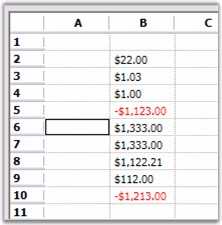

::: {style="DISPLAY: none"}
{#d2h_url_template}{#d2h_package_url style="WIDTH: 0px; DISPLAY: none; HEIGHT: 0px"}
:::

::: {.d2h_secondary_topic style="PADDING-BOTTOM: 10pt; MARGIN: 0pt; PADDING-LEFT: 0pt; PADDING-RIGHT: 0pt; PADDING-TOP: 0pt"}
##### Currency Edit {#currency-edit style="tab-stops: 0pt"}

[]{style="FONT-FAMILY: 'Trebuchet MS','sans-serif'; COLOR: #15428b; FONT-SIZE: 9pt"} 

The **Currency** **Edit** cell type lets you to edit monetary values and display them by using different currency type formats. To achieve this, you must set the **CellType** property to *Currency.* You can set additional properties such as the decimal and group separator for the cell value.

[]{style="FONT-FAMILY: 'Trebuchet MS','sans-serif'; COLOR: #15428b; FONT-SIZE: 9pt"} 

The following code example illustrates how to set the cell type to CurrencyEdit.

[]{style="FONT-FAMILY: 'Trebuchet MS','sans-serif'; COLOR: #15428b; FONT-SIZE: 9pt"} 

+----------------------------------------------------------------------------------------------------------------------------------------------+
| **[\[C#\]]{style="FONT-FAMILY: 'Courier New'; COLOR: black"}**                                                                               |
|                                                                                                                                              |
| []{style="FONT-FAMILY: 'Courier New'; COLOR: black"}                                                                                         |
|                                                                                                                                              |
| [GridStyleInfo]{style="FONT-FAMILY: 'Courier New'; COLOR: #2b91af"}[ style = gridControl1\[row, 2\];]{style="FONT-FAMILY: 'Courier New'"}    |
|                                                                                                                                              |
| [style.CellType = [\"Currency\"]{style="COLOR: #a31515"};]{style="FONT-FAMILY: 'Courier New'"}                                               |
|                                                                                                                                              |
| [style.Text = [\"\$1.00\"]{style="COLOR: #a31515"};]{style="FONT-FAMILY: 'Courier New'"}                                                     |
|                                                                                                                                              |
| []{style="FONT-FAMILY: 'Courier New'"}                                                                                                       |
|                                                                                                                                              |
| [// Set the clip mode.]{style="FONT-FAMILY: 'Courier New'; COLOR: green"}                                                                    |
|                                                                                                                                              |
| [style.CurrencyEdit.ClipMode = [CurrencyClipModes]{style="COLOR: #2b91af"}.IncludeFormatting;]{style="FONT-FAMILY: 'Courier New'"}           |
|                                                                                                                                              |
| []{style="FONT-FAMILY: 'Courier New'"}                                                                                                       |
|                                                                                                                                              |
| [// Set formatting properties.]{style="FONT-FAMILY: 'Courier New'; COLOR: green"}                                                            |
|                                                                                                                                              |
| [style.CurrencyEdit.CurrencyDecimalDigits = 2;]{style="FONT-FAMILY: 'Courier New'"}                                                          |
|                                                                                                                                              |
| [style.CurrencyEdit.CurrencyDecimalSeparator = [\".\"]{style="COLOR: #a31515"};]{style="FONT-FAMILY: 'Courier New'"}                         |
|                                                                                                                                              |
| [style.CurrencyEdit.CurrencyGroupSeparator = [\",\"]{style="COLOR: #a31515"};]{style="FONT-FAMILY: 'Courier New'"}                           |
|                                                                                                                                              |
| [style.CurrencyEdit.CurrencyGroupSizes = [new]{style="COLOR: blue"} [int]{style="COLOR: blue"}\[\] {3};]{style="FONT-FAMILY: 'Courier New'"} |
|                                                                                                                                              |
| [style.CurrencyEdit.CurrencyNegativePattern = 1;]{style="FONT-FAMILY: 'Courier New'"}                                                        |
|                                                                                                                                              |
| [style.CurrencyEdit.CurrencyNumberDigits = 27;]{style="FONT-FAMILY: 'Courier New'"}                                                          |
|                                                                                                                                              |
| [style.CurrencyEdit.CurrencyPositivePattern = 0;]{style="FONT-FAMILY: 'Courier New'"}                                                        |
|                                                                                                                                              |
| [style.CurrencyEdit.CurrencySymbol = [\"\$\"]{style="COLOR: #a31515"};]{style="FONT-FAMILY: 'Courier New'"}                                  |
|                                                                                                                                              |
| [style.CurrencyEdit.NegativeColor = System.Drawing.[Color]{style="COLOR: #2b91af"}.Red;]{style="FONT-FAMILY: 'Courier New'"}                 |
|                                                                                                                                              |
| [style.CurrencyEdit.NegativeSign = [\"-\"]{style="COLOR: #a31515"};]{style="FONT-FAMILY: 'Courier New'"}                                     |
|                                                                                                                                              |
| [style.CurrencyEdit.PositiveColor = System.Drawing.[Color]{style="COLOR: #2b91af"}.Black;]{style="FONT-FAMILY: 'Courier New'"}               |
|                                                                                                                                              |
| [style.FloatCell = [true]{style="COLOR: blue"};]{style="FONT-FAMILY: 'Courier New'"}                                                         |
+----------------------------------------------------------------------------------------------------------------------------------------------+

[]{style="FONT-FAMILY: 'Trebuchet MS','sans-serif'; COLOR: #15428b; FONT-SIZE: 9pt"} 

+-------------------------------------------------------------------------------------------------------------------------------------------------------------------+
| **[\[VB.NET\]]{style="FONT-FAMILY: 'Courier New'; COLOR: black"}**                                                                                                |
|                                                                                                                                                                   |
| []{style="FONT-FAMILY: 'Courier New'; COLOR: black"}                                                                                                              |
|                                                                                                                                                                   |
| [Dim]{style="FONT-FAMILY: 'Courier New'; COLOR: blue"}[ style [As]{style="COLOR: blue"} GridStyleInfo = gridControl1(row, 2)]{style="FONT-FAMILY: 'Courier New'"} |
|                                                                                                                                                                   |
| [style.CellType = [\"Currency\"]{style="COLOR: #a31515"}]{style="FONT-FAMILY: 'Courier New'"}                                                                     |
|                                                                                                                                                                   |
| [style.Text = [\"\$1.00\"]{style="COLOR: #a31515"}]{style="FONT-FAMILY: 'Courier New'"}                                                                           |
|                                                                                                                                                                   |
| []{style="FONT-FAMILY: 'Courier New'; COLOR: #a31515"}                                                                                                            |
|                                                                                                                                                                   |
| [\' Set the clip mode.]{style="FONT-FAMILY: 'Courier New'; COLOR: green"}                                                                                         |
|                                                                                                                                                                   |
| [style.CurrencyEdit.ClipMode = CurrencyClipModes.IncludeFormatting]{style="FONT-FAMILY: 'Courier New'"}                                                           |
|                                                                                                                                                                   |
| []{style="FONT-FAMILY: 'Courier New'"}                                                                                                                            |
|                                                                                                                                                                   |
| [\' Set formatting properties.]{style="FONT-FAMILY: 'Courier New'; COLOR: green"}                                                                                 |
|                                                                                                                                                                   |
| [style.CurrencyEdit.CurrencyDecimalDigits = 2]{style="FONT-FAMILY: 'Courier New'"}                                                                                |
|                                                                                                                                                                   |
| [style.CurrencyEdit.CurrencyDecimalSeparator = [\".\"]{style="COLOR: #a31515"}]{style="FONT-FAMILY: 'Courier New'"}                                               |
|                                                                                                                                                                   |
| [style.CurrencyEdit.CurrencyGroupSeparator = [\",\"]{style="COLOR: #a31515"}]{style="FONT-FAMILY: 'Courier New'"}                                                 |
|                                                                                                                                                                   |
| [style.CurrencyEdit.CurrencyGroupSizes = [New]{style="COLOR: blue"} [Integer]{style="COLOR: blue"}() {3}]{style="FONT-FAMILY: 'Courier New'"}                     |
|                                                                                                                                                                   |
| [style.CurrencyEdit.CurrencyNegativePattern = 1]{style="FONT-FAMILY: 'Courier New'"}                                                                              |
|                                                                                                                                                                   |
| [style.CurrencyEdit.CurrencyNumberDigits = 27]{style="FONT-FAMILY: 'Courier New'"}                                                                                |
|                                                                                                                                                                   |
| [style.CurrencyEdit.CurrencyPositivePattern = 0]{style="FONT-FAMILY: 'Courier New'"}                                                                              |
|                                                                                                                                                                   |
| [style.CurrencyEdit.CurrencySymbol = [\"\$\"]{style="COLOR: #a31515"}]{style="FONT-FAMILY: 'Courier New'"}                                                        |
|                                                                                                                                                                   |
| [style.CurrencyEdit.NegativeColor = System.Drawing.Color.Red]{style="FONT-FAMILY: 'Courier New'"}                                                                 |
|                                                                                                                                                                   |
| [style.CurrencyEdit.NegativeSign = [\"-\"]{style="COLOR: #a31515"}]{style="FONT-FAMILY: 'Courier New'"}                                                           |
|                                                                                                                                                                   |
| [style.CurrencyEdit.PositiveColor = System.Drawing.Color.Black]{style="FONT-FAMILY: 'Courier New'"}                                                               |
|                                                                                                                                                                   |
| [style.FloatCell = [True]{style="COLOR: blue"}]{style="FONT-FAMILY: 'Courier New'"}                                                                               |
+-------------------------------------------------------------------------------------------------------------------------------------------------------------------+

[]{style="FONT-FAMILY: 'Trebuchet MS','sans-serif'; COLOR: #15428b; FONT-SIZE: 9pt"} 

{border="0"}

[]{style="FONT-FAMILY: 'Trebuchet MS','sans-serif'; COLOR: #15428b; FONT-SIZE: 9pt"} 

Figure 78: Currency Cells

 

[]{#p55} 

 

[]{#related-topics}
:::
