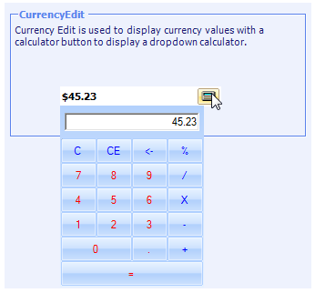

::: {style="DISPLAY: none"}
{#d2h_url_template}{#d2h_package_url style="WIDTH: 0px; DISPLAY: none; HEIGHT: 0px"}
:::

::: {.d2h_secondary_topic style="PADDING-BOTTOM: 10pt; MARGIN: 0pt; PADDING-LEFT: 0pt; PADDING-RIGHT: 0pt; PADDING-TOP: 0pt"}
#### CurrencyEdit {#currencyedit style="tab-stops: 0pt"}

**CurrencyEdit** embeds a** CurrencyTextBox **control and a button to provide a drop-down calculator to enable calculations with the contents of the CurrencyTextBox. The CurrencyEdit control provides an easy way to collect and display the currency data.[]{style="COLOR: black"}

[]{style="COLOR: black"} 

{border="0"}

Figure 435:  CurrencyEdit Control

 

 

More:

[ ]{#related-topics}

[{border="0" align="absMiddle"}Features](ms-xhelp:///?Id=06640f2b-2b07-4be3-bd7c-1193e8347c9b){style="TEXT-DECORATION: none"}

[{border="0" align="absMiddle"}Creating CurrencyEdit](ms-xhelp:///?Id=9a254e56-0956-4c12-b723-ce94f3e13781){style="TEXT-DECORATION: none"}

[{border="0" align="absMiddle"}Concepts and Features](ms-xhelp:///?Id=e2d56bcc-5699-41fd-812e-ad31e85981bd){style="TEXT-DECORATION: none"}

[{border="0" align="absMiddle"}Frequently Asked Questions](ms-xhelp:///?Id=1616505c-3418-46c9-b929-3e42b6df63f3){style="TEXT-DECORATION: none"}

[{border="0" align="absMiddle"}Events](ms-xhelp:///?Id=3057f005-0e15-4b46-9b63-68f274b5bf33){style="TEXT-DECORATION: none"}
:::
