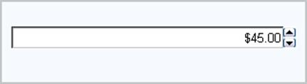

::: {style="DISPLAY: none"}
{#d2h_url_template}{#d2h_package_url style="WIDTH: 0px; DISPLAY: none; HEIGHT: 0px"}
:::

::: {.d2h_secondary_topic style="PADDING-BOTTOM: 10pt; MARGIN: 0pt; PADDING-LEFT: 0pt; PADDING-RIGHT: 0pt; PADDING-TOP: 0pt"}
#### CurrencyTextBox {#currencytextbox style="tab-stops: 0pt"}

 

 The CurrencyTextBox is a control that allows you to display only currency values within a textbox. 

 

{border="0"}

Figure 34

 

Features

[·      ]{style="FONT-FAMILY: Symbol"}Supports client side validation of key strokes.

[·      ]{style="FONT-FAMILY: Symbol"}Supports setting of minimum and maximum values.

[·      ]{style="FONT-FAMILY: Symbol"}Uses globalization features of .NET platform to provide locale-specific formatting.

[]{#p35} 

More:

[ ]{#related-topics}

[{border="0" align="absMiddle"}Creating CurrencyTextBox](ms-xhelp:///?Id=c3f38e11-2b46-4b38-a960-b527ac55decc){style="TEXT-DECORATION: none"}

[{border="0" align="absMiddle"}Concepts and Features](ms-xhelp:///?Id=a9757f70-6341-44ec-aefd-f9e75dca05f8){style="TEXT-DECORATION: none"}

[{border="0" align="absMiddle"}Events](ms-xhelp:///?Id=962c323b-184e-4374-9fe3-110107625194){style="TEXT-DECORATION: none"}

[{border="0" align="absMiddle"}Frequently Asked Questions](ms-xhelp:///?Id=4c7558af-f4f6-4c9e-829b-af76fd7a9ed8){style="TEXT-DECORATION: none"}
:::
