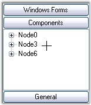
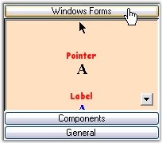

::: {style="DISPLAY: none"}
{#d2h_url_template}{#d2h_package_url style="WIDTH: 0px; DISPLAY: none; HEIGHT: 0px"}
:::

:::::: {.d2h_secondary_topic style="PADDING-BOTTOM: 10pt; MARGIN: 0pt; PADDING-LEFT: 0pt; PADDING-RIGHT: 0pt; PADDING-TOP: 0pt"}
##### Cursor Settings {#cursor-settings style="tab-stops: 0pt"}

[]{style="COLOR: #15428b"} 

Cursor Settings for GroupBar

[]{style="COLOR: #4a5c8c; FONT-SIZE: 8pt"} 

The cursor settings of the GroupBar control can be changed using the below given properties.

[]{style="COLOR: #15428b"} 

::: {align="center"}
  ------------------- --------------------------------------------------------------------------------------
  GroupBar Property   Description
  Cursor              Gets / sets the cursor that is displayed when the mouse pointer is over the control.
  ------------------- --------------------------------------------------------------------------------------
:::

[]{style="COLOR: #15428b"} 

+-----------------------------------------------------------------------------------------------------------------------------------------------------------------------------+
| **[\[C#\]]{style="FONT-FAMILY: 'Courier New'; COLOR: black"}**                                                                                                              |
|                                                                                                                                                                             |
| []{style="FONT-FAMILY: 'Courier New'; COLOR: black"}                                                                                                                        |
|                                                                                                                                                                             |
| [this]{style="FONT-FAMILY: 'Courier New'; COLOR: blue"}[.groupBar1.Cursor = System.Windows.Forms.[Cursors]{style="COLOR: teal"}.Cross;]{style="FONT-FAMILY: 'Courier New'"} |
+-----------------------------------------------------------------------------------------------------------------------------------------------------------------------------+

[]{style="COLOR: #4a5c8c; FONT-SIZE: 8pt"} 

+---------------------------------------------------------------------------------------------------------------------------------------------------+
| **[\[VB.NET\]]{style="FONT-FAMILY: 'Courier New'; COLOR: black"}**                                                                                |
|                                                                                                                                                   |
| []{style="FONT-FAMILY: 'Courier New'; COLOR: black"}                                                                                              |
|                                                                                                                                                   |
| [Me]{style="FONT-FAMILY: 'Courier New'; COLOR: blue"}[.groupBar1.Cursor = System.Windows.Forms.Cursors.Cross]{style="FONT-FAMILY: 'Courier New'"} |
+---------------------------------------------------------------------------------------------------------------------------------------------------+

[]{style="COLOR: #15428b"} 

[{border="0"}]{style="COLOR: #15428b"}[]{style="FONT-FAMILY: 'Calibri','sans-serif'; FONT-SIZE: 11pt"}

 

Figure 882: Cross Cursor displayed on the GroupBar

[]{style="COLOR: #15428b"} 

Cursor Settings for GroupBar Items

[]{style="COLOR: #4a5c8c; FONT-SIZE: 8pt"} 

Different types of cursors can be set when the mouse pointer is over the GroupBar Items. The cursors available are Mouse, Cross, Help, Hand and so on. The default cursor is \'Arrow\'.

[]{style="COLOR: #15428b"} 

::: {align="center"}
  -------------------- ---------------------------------------------------------------------------------------------------------------------------------------------------------------------
  GroupBar Property    Description
  GroupBarItemCursor   Specifies the type of cursor that is displayed when the mouse pointer is over the GroupBar Items. The rest of the control will display the standard control cursor.
  -------------------- ---------------------------------------------------------------------------------------------------------------------------------------------------------------------
:::

[]{style="COLOR: #15428b"} 

+-----------------------------------------------------------------------------------------------------------------------------------------------------------------+
| **[\[C#\]]{style="FONT-FAMILY: 'Courier New'; COLOR: black"}**                                                                                                  |
|                                                                                                                                                                 |
| []{style="FONT-FAMILY: 'Courier New'; COLOR: black"}                                                                                                            |
|                                                                                                                                                                 |
| [this]{style="FONT-FAMILY: 'Courier New'; COLOR: blue"}[.groupBar1.GroupBarItemCursor = System.Windows.Forms.Cursors.Hand;]{style="FONT-FAMILY: 'Courier New'"} |
+-----------------------------------------------------------------------------------------------------------------------------------------------------------------+

[]{style="COLOR: #4a5c8c; FONT-SIZE: 8pt"} 

+--------------------------------------------------------------------------------------------------------------------------------------------------------------+
| **[\[VB.NET\]]{style="FONT-FAMILY: 'Courier New'; COLOR: black"}**                                                                                           |
|                                                                                                                                                              |
| []{style="FONT-FAMILY: 'Courier New'; COLOR: black"}                                                                                                         |
|                                                                                                                                                              |
| [Me]{style="FONT-FAMILY: 'Courier New'; COLOR: blue"}[.groupBar1.GroupBarItemCursor = System.Windows.Forms.Cursors.Hand]{style="FONT-FAMILY: 'Courier New'"} |
+--------------------------------------------------------------------------------------------------------------------------------------------------------------+

[]{style="COLOR: #15428b"} 

{border="0"}[]{style="FONT-FAMILY: 'Calibri','sans-serif'; FONT-SIZE: 11pt"}

 

Figure 883: Hand cursor on \'Windows Forms\' Item

::: {style="BORDER-BOTTOM: windowtext 1pt solid; BORDER-LEFT: medium none; PADDING-BOTTOM: 1pt; MARGIN-TOP: 9pt; PADDING-LEFT: 0pt; PADDING-RIGHT: 0pt; MARGIN-BOTTOM: 9pt; BORDER-TOP: windowtext 1pt solid; BORDER-RIGHT: medium none; PADDING-TOP: 1pt"}
 

{border="0"} Note : The ResetGroupBarItemCursor() method can be used to reset the cursor when it is displayed over a GroupBar Item.
:::

 

 

 

[]{#p613} 

 

[]{#related-topics}
::::::
