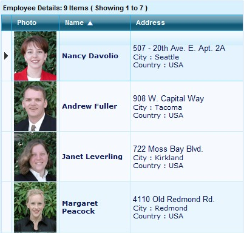

::: {style="DISPLAY: none"}
{#d2h_url_template}{#d2h_package_url style="WIDTH: 0px; DISPLAY: none; HEIGHT: 0px"}
:::

::::: {#nsbanner .d2h_main_nsbanner style="BORDER-BOTTOM: #999999 1px solid; POSITION: relative; PADDING-BOTTOM: 0px; BACKGROUND-COLOR: transparent; PADDING-LEFT: 0px; PADDING-RIGHT: 0px; DISPLAY: none; BORDER-TOP: #999999 1px solid; PADDING-TOP: 0px; LEFT: 0px"}
:::: {#TitleRow .d2h_main_titlerow style="PADDING-BOTTOM: 4px; BACKGROUND-COLOR: transparent; PADDING-LEFT: 22px; WIDTH: 100%; PADDING-RIGHT: 10px; DISPLAY: none; PADDING-TOP: 4px"}
::: {#ienav .d2h_main_ienav style="DISPLAY: none"}
{#D2HPrevious .D2HPreviousEnabled}  {#D2HNext .D2HNextEnabled}
:::
::::
:::::

:::: {#nstext .d2h_main_nstext style="PADDING-BOTTOM: 10px; BACKGROUND-COLOR: transparent; PADDING-LEFT: 22px; PADDING-RIGHT: 10px; HEIGHT: 100%; OVERFLOW: auto; PADDING-TOP: 5px" hasuserbackground="true" valign="bottom"}
::: {#d2h_breadcrumbs .d2h_breadcrumbs}
[Essential Studio User Guide Documentation](ms-xhelp:///?Id=12457748-09e3-4d74-a240-8e049cedf030){.d2h_breadcrumbsNormal}[ \> ]{.d2h_breadcrumbsLinkSeparator}[User Interface Edition](ms-xhelp:///?Id=c29296b7-531c-413b-a0ec-488ca1f7f669){.d2h_breadcrumbsNormal}[ \> ]{.d2h_breadcrumbsLinkSeparator}[Essential ASP.NET](ms-xhelp:///?Id=25c35330-c127-4dad-9a92-ed79dc7261a6){.d2h_breadcrumbsNormal}[ \> ]{.d2h_breadcrumbsLinkSeparator}[Essential Grid]{.d2h_breadcrumbsContentsOnly}[ \> ]{.d2h_breadcrumbsLinkSeparator}[Concepts and Features](ms-xhelp:///?Id=9e489974-524d-457c-9881-e458b1321685){.d2h_breadcrumbsNormal}[ \> ]{.d2h_breadcrumbsLinkSeparator}[Templates](ms-xhelp:///?Id=d885b471-bade-4d73-a9f1-b2f6a3c00206){.d2h_breadcrumbsNormal}
:::

### Custom {#custom style="tab-stops: 0pt"}

[]{style="FONT-FAMILY: 'Trebuchet MS','sans-serif'; COLOR: #15428b; FONT-SIZE: 9pt"} 

Illustrates how different columns data can be viewed in a single cell with the help of Templates. Uses an ItemTemplate in the Address column to display the data in the columns such as Address, City and Country, within the Address column.

[]{style="FONT-FAMILY: 'Trebuchet MS','sans-serif'; COLOR: #15428b; FONT-SIZE: 9pt"} 

{border="0"}

Figure 107[]{style="FONT-FAMILY: 'Trebuchet MS','sans-serif'; COLOR: red"}

+---------------------------------------------------------------------------------------------------------------------------------------------------------------------------------------------------------------------------------------------------------------------------------------------------------------------------------------------------------------------------------------------------------------------------------+
| **[\[ASPX\]]{style="FONT-FAMILY: 'Courier New'; COLOR: black"}**                                                                                                                                                                                                                                                                                                                                                                |
|                                                                                                                                                                                                                                                                                                                                                                                                                                 |
| []{style="FONT-FAMILY: 'Courier New'; COLOR: black"}                                                                                                                                                                                                                                                                                                                                                                            |
|                                                                                                                                                                                                                                                                                                                                                                                                                                 |
| [\<]{style="FONT-FAMILY: 'Courier New'; COLOR: blue"}[Columns]{style="FONT-FAMILY: 'Courier New'; COLOR: #a31515"}[\>]{style="FONT-FAMILY: 'Courier New'; COLOR: blue"}                                                                                                                                                                                                                                                         |
|                                                                                                                                                                                                                                                                                                                                                                                                                                 |
| [\<]{style="FONT-FAMILY: 'Courier New'; COLOR: blue"}[sfwg]{style="FONT-FAMILY: 'Courier New'; COLOR: #a31515"}[:]{style="FONT-FAMILY: 'Courier New'; COLOR: blue"}[GridColumnDescriptor]{style="FONT-FAMILY: 'Courier New'; COLOR: #a31515"}[ [MappingName]{style="COLOR: red"}[=\"SmallPhoto\"]{style="COLOR: blue"} [HeaderText]{style="COLOR: red"}[=\"Photo\"\>]{style="COLOR: blue"}]{style="FONT-FAMILY: 'Courier New'"} |
|                                                                                                                                                                                                                                                                                                                                                                                                                                 |
| [\<]{style="FONT-FAMILY: 'Courier New'; COLOR: blue"}[Appearance]{style="FONT-FAMILY: 'Courier New'; COLOR: #a31515"}[\>]{style="FONT-FAMILY: 'Courier New'; COLOR: blue"}                                                                                                                                                                                                                                                      |
|                                                                                                                                                                                                                                                                                                                                                                                                                                 |
| [\<]{style="FONT-FAMILY: 'Courier New'; COLOR: blue"}[AnyRecordFieldCell]{style="FONT-FAMILY: 'Courier New'; COLOR: #a31515"}[ [ImageSizeMode]{style="COLOR: red"}[=\"CenterImage\"]{style="COLOR: blue"} [ImageSize]{style="COLOR: red"}[=\"70, 82\"\>\</]{style="COLOR: blue"}[AnyRecordFieldCell]{style="COLOR: #a31515"}[\>]{style="COLOR: blue"}]{style="FONT-FAMILY: 'Courier New'"}                                      |
|                                                                                                                                                                                                                                                                                                                                                                                                                                 |
| [\</]{style="FONT-FAMILY: 'Courier New'; COLOR: blue"}[Appearance]{style="FONT-FAMILY: 'Courier New'; COLOR: #a31515"}[\>]{style="FONT-FAMILY: 'Courier New'; COLOR: blue"}                                                                                                                                                                                                                                                     |
|                                                                                                                                                                                                                                                                                                                                                                                                                                 |
| [\</]{style="FONT-FAMILY: 'Courier New'; COLOR: blue"}[sfwg]{style="FONT-FAMILY: 'Courier New'; COLOR: #a31515"}[:]{style="FONT-FAMILY: 'Courier New'; COLOR: blue"}[GridColumnDescriptor]{style="FONT-FAMILY: 'Courier New'; COLOR: #a31515"}[\>]{style="FONT-FAMILY: 'Courier New'; COLOR: blue"}                                                                                                                             |
|                                                                                                                                                                                                                                                                                                                                                                                                                                 |
| [\<]{style="FONT-FAMILY: 'Courier New'; COLOR: blue"}[sfwg]{style="FONT-FAMILY: 'Courier New'; COLOR: #a31515"}[:]{style="FONT-FAMILY: 'Courier New'; COLOR: blue"}[GridColumnDescriptor]{style="FONT-FAMILY: 'Courier New'; COLOR: #a31515"}[ [MappingName]{style="COLOR: red"}[=\"Name\"\>]{style="COLOR: blue"}]{style="FONT-FAMILY: 'Courier New'"}                                                                         |
|                                                                                                                                                                                                                                                                                                                                                                                                                                 |
| [\<]{style="FONT-FAMILY: 'Courier New'; COLOR: blue"}[ItemTemplate]{style="FONT-FAMILY: 'Courier New'; COLOR: #a31515"}[\>]{style="FONT-FAMILY: 'Courier New'; COLOR: blue"}                                                                                                                                                                                                                                                    |
|                                                                                                                                                                                                                                                                                                                                                                                                                                 |
| [\<]{style="FONT-FAMILY: 'Courier New'; COLOR: blue"}[p]{style="FONT-FAMILY: 'Courier New'; COLOR: #a31515"}[\>]{style="FONT-FAMILY: 'Courier New'; COLOR: blue"}                                                                                                                                                                                                                                                               |
|                                                                                                                                                                                                                                                                                                                                                                                                                                 |
| [    [\<]{style="COLOR: blue"}[asp]{style="COLOR: #a31515"}[:]{style="COLOR: blue"}[Label]{style="COLOR: #a31515"} [ID]{style="COLOR: red"}[=\"Label2\"]{style="COLOR: blue"} [runat]{style="COLOR: red"}[=\"server\"]{style="COLOR: blue"} [Font-Bold]{style="COLOR: red"}[=\"True\"]{style="COLOR: blue"} [Font-Size]{style="COLOR: red"}[=\"11px\"\>]{style="COLOR: blue"}]{style="FONT-FAMILY: 'Courier New'"}              |
|                                                                                                                                                                                                                                                                                                                                                                                                                                 |
| [    [\<]{style="COLOR: blue"}[font]{style="COLOR: #a31515"} [color]{style="COLOR: red"}[=\"#061558\"]{style="COLOR: blue"} [\>]{style="COLOR: blue"}]{style="FONT-FAMILY: 'Courier New'"}                                                                                                                                                                                                                                      |
|                                                                                                                                                                                                                                                                                                                                                                                                                                 |
| [        [\<%]{style="BACKGROUND: #ffee62"}[\#]{style="COLOR: blue"}GetName(Container)[%\>]{style="BACKGROUND: #ffee62"}]{style="FONT-FAMILY: 'Courier New'"}                                                                                                                                                                                                                                                                   |
|                                                                                                                                                                                                                                                                                                                                                                                                                                 |
| [    [\</]{style="COLOR: blue"}[font]{style="COLOR: #a31515"}[\>\</]{style="COLOR: blue"}[asp]{style="COLOR: #a31515"}[:]{style="COLOR: blue"}[Label]{style="COLOR: #a31515"}[\>]{style="COLOR: blue"}]{style="FONT-FAMILY: 'Courier New'"}                                                                                                                                                                                     |
|                                                                                                                                                                                                                                                                                                                                                                                                                                 |
| [\</]{style="FONT-FAMILY: 'Courier New'; COLOR: blue"}[p]{style="FONT-FAMILY: 'Courier New'; COLOR: #a31515"}[\>]{style="FONT-FAMILY: 'Courier New'; COLOR: blue"}                                                                                                                                                                                                                                                              |
|                                                                                                                                                                                                                                                                                                                                                                                                                                 |
| [\</]{style="FONT-FAMILY: 'Courier New'; COLOR: blue"}[ItemTemplate]{style="FONT-FAMILY: 'Courier New'; COLOR: #a31515"}[\>]{style="FONT-FAMILY: 'Courier New'; COLOR: blue"}                                                                                                                                                                                                                                                   |
|                                                                                                                                                                                                                                                                                                                                                                                                                                 |
| [\</]{style="FONT-FAMILY: 'Courier New'; COLOR: blue"}[sfwg]{style="FONT-FAMILY: 'Courier New'; COLOR: #a31515"}[:]{style="FONT-FAMILY: 'Courier New'; COLOR: blue"}[GridColumnDescriptor]{style="FONT-FAMILY: 'Courier New'; COLOR: #a31515"}[\>]{style="FONT-FAMILY: 'Courier New'; COLOR: blue"}                                                                                                                             |
|                                                                                                                                                                                                                                                                                                                                                                                                                                 |
| [\<]{style="FONT-FAMILY: 'Courier New'; COLOR: blue"}[sfwg]{style="FONT-FAMILY: 'Courier New'; COLOR: #a31515"}[:]{style="FONT-FAMILY: 'Courier New'; COLOR: blue"}[GridColumnDescriptor]{style="FONT-FAMILY: 'Courier New'; COLOR: #a31515"}[ [MappingName]{style="COLOR: red"}[=\"Address\"\>]{style="COLOR: blue"}]{style="FONT-FAMILY: 'Courier New'"}                                                                      |
|                                                                                                                                                                                                                                                                                                                                                                                                                                 |
| [\<]{style="FONT-FAMILY: 'Courier New'; COLOR: blue"}[ItemTemplate]{style="FONT-FAMILY: 'Courier New'; COLOR: #a31515"}[\>]{style="FONT-FAMILY: 'Courier New'; COLOR: blue"}                                                                                                                                                                                                                                                    |
|                                                                                                                                                                                                                                                                                                                                                                                                                                 |
| [\<]{style="FONT-FAMILY: 'Courier New'; COLOR: blue"}[p]{style="FONT-FAMILY: 'Courier New'; COLOR: #a31515"}[\>]{style="FONT-FAMILY: 'Courier New'; COLOR: blue"}                                                                                                                                                                                                                                                               |
|                                                                                                                                                                                                                                                                                                                                                                                                                                 |
| [    [\<]{style="COLOR: blue"}[asp]{style="COLOR: #a31515"}[:]{style="COLOR: blue"}[Label]{style="COLOR: #a31515"} [ID]{style="COLOR: red"}[=\"Label1\"]{style="COLOR: blue"} [runat]{style="COLOR: red"}[=\"server\"]{style="COLOR: blue"} [Font-Size]{style="COLOR: red"}[=\"Small\"]{style="COLOR: blue"} [Font-Names]{style="COLOR: red"}[=\"Arial\"\>]{style="COLOR: blue"}]{style="FONT-FAMILY: 'Courier New'"}           |
|                                                                                                                                                                                                                                                                                                                                                                                                                                 |
| [        [\<%]{style="BACKGROUND: #ffee62"}[\#]{style="COLOR: blue"}Container.StyleInfo.Text[%\>]{style="BACKGROUND: #ffee62"}]{style="FONT-FAMILY: 'Courier New'"}                                                                                                                                                                                                                                                             |
|                                                                                                                                                                                                                                                                                                                                                                                                                                 |
| [    [\</]{style="COLOR: blue"}[asp]{style="COLOR: #a31515"}[:]{style="COLOR: blue"}[Label]{style="COLOR: #a31515"}[\>\<]{style="COLOR: blue"}[br]{style="COLOR: #a31515"} [/\>]{style="COLOR: blue"}]{style="FONT-FAMILY: 'Courier New'"}                                                                                                                                                                                      |
|                                                                                                                                                                                                                                                                                                                                                                                                                                 |
| [    [\<]{style="COLOR: blue"}[asp]{style="COLOR: #a31515"}[:]{style="COLOR: blue"}[Label]{style="COLOR: #a31515"} [ID]{style="COLOR: red"}[=\"City\"]{style="COLOR: blue"} [runat]{style="COLOR: red"}[=\"server\"\>]{style="COLOR: blue"}]{style="FONT-FAMILY: 'Courier New'"}                                                                                                                                                |
|                                                                                                                                                                                                                                                                                                                                                                                                                                 |
| [        City : [\<%]{style="BACKGROUND: #ffee62"}[\#]{style="COLOR: blue"}GetCity(Container)[%\>]{style="BACKGROUND: #ffee62"}]{style="FONT-FAMILY: 'Courier New'"}                                                                                                                                                                                                                                                            |
|                                                                                                                                                                                                                                                                                                                                                                                                                                 |
| [    [\</]{style="COLOR: blue"}[asp]{style="COLOR: #a31515"}[:]{style="COLOR: blue"}[Label]{style="COLOR: #a31515"}[\>\<]{style="COLOR: blue"}[br]{style="COLOR: #a31515"} [/\>]{style="COLOR: blue"}]{style="FONT-FAMILY: 'Courier New'"}                                                                                                                                                                                      |
|                                                                                                                                                                                                                                                                                                                                                                                                                                 |
| [    [\<]{style="COLOR: blue"}[asp]{style="COLOR: #a31515"}[:]{style="COLOR: blue"}[Label]{style="COLOR: #a31515"} [ID]{style="COLOR: red"}[=\"Country\"]{style="COLOR: blue"} [runat]{style="COLOR: red"}[=\"server\"\>]{style="COLOR: blue"}]{style="FONT-FAMILY: 'Courier New'"}                                                                                                                                             |
|                                                                                                                                                                                                                                                                                                                                                                                                                                 |
| [        Country : [\<%]{style="BACKGROUND: #ffee62"}[\#]{style="COLOR: blue"}GetCountry(Container)[%\>]{style="BACKGROUND: #ffee62"}]{style="FONT-FAMILY: 'Courier New'"}                                                                                                                                                                                                                                                      |
|                                                                                                                                                                                                                                                                                                                                                                                                                                 |
| [    [\</]{style="COLOR: blue"}[asp]{style="COLOR: #a31515"}[:]{style="COLOR: blue"}[Label]{style="COLOR: #a31515"}[\>\</]{style="COLOR: blue"}[p]{style="COLOR: #a31515"}[\>]{style="COLOR: blue"}]{style="FONT-FAMILY: 'Courier New'"}                                                                                                                                                                                        |
|                                                                                                                                                                                                                                                                                                                                                                                                                                 |
| [\</]{style="FONT-FAMILY: 'Courier New'; COLOR: blue"}[ItemTemplate]{style="FONT-FAMILY: 'Courier New'; COLOR: #a31515"}[\>]{style="FONT-FAMILY: 'Courier New'; COLOR: blue"}                                                                                                                                                                                                                                                   |
|                                                                                                                                                                                                                                                                                                                                                                                                                                 |
| [\</]{style="FONT-FAMILY: 'Courier New'; COLOR: blue"}[sfwg]{style="FONT-FAMILY: 'Courier New'; COLOR: #a31515"}[:]{style="FONT-FAMILY: 'Courier New'; COLOR: blue"}[GridColumnDescriptor]{style="FONT-FAMILY: 'Courier New'; COLOR: #a31515"}[\>]{style="FONT-FAMILY: 'Courier New'; COLOR: blue"}                                                                                                                             |
|                                                                                                                                                                                                                                                                                                                                                                                                                                 |
| [\</]{style="FONT-FAMILY: 'Courier New'; COLOR: blue"}[Columns]{style="FONT-FAMILY: 'Courier New'; COLOR: #a31515"}[\>]{style="FONT-FAMILY: 'Courier New'; COLOR: blue"}                                                                                                                                                                                                                                                        |
+---------------------------------------------------------------------------------------------------------------------------------------------------------------------------------------------------------------------------------------------------------------------------------------------------------------------------------------------------------------------------------------------------------------------------------+

[]{style="FONT-FAMILY: 'Trebuchet MS','sans-serif'; COLOR: #15428b; FONT-SIZE: 9pt"} 

+-------------------------------------------------------------------------------------------------------------------------------------------------------------------------------------------------------------------------------------+
| **[\[C#\]]{style="FONT-FAMILY: 'Courier New'; COLOR: black"}**                                                                                                                                                                      |
|                                                                                                                                                                                                                                     |
| []{style="FONT-FAMILY: 'Courier New'; COLOR: black"}                                                                                                                                                                                |
|                                                                                                                                                                                                                                     |
| [//for retrieving Name to the TemplateColumn]{style="FONT-FAMILY: 'Courier New'; COLOR: green"}                                                                                                                                     |
|                                                                                                                                                                                                                                     |
| [    [protected]{style="COLOR: blue"} [string]{style="COLOR: blue"} GetName(GridCell container)]{style="FONT-FAMILY: 'Courier New'"}                                                                                                |
|                                                                                                                                                                                                                                     |
| [    {]{style="FONT-FAMILY: 'Courier New'"}                                                                                                                                                                                         |
|                                                                                                                                                                                                                                     |
| [        [string]{style="COLOR: blue"} name;]{style="FONT-FAMILY: 'Courier New'"}                                                                                                                                                   |
|                                                                                                                                                                                                                                     |
| [        Record rowRecord = container.Row.Record;]{style="FONT-FAMILY: 'Courier New'"}                                                                                                                                              |
|                                                                                                                                                                                                                                     |
| [  name = rowRecord.GetValue([\"FirstName\"]{style="COLOR: #a31515"}).ToString() + [\" \"]{style="COLOR: #a31515"} +    rowRecord.GetValue([\"LastName\"]{style="COLOR: #a31515"}).ToString();]{style="FONT-FAMILY: 'Courier New'"} |
|                                                                                                                                                                                                                                     |
| [        [return]{style="COLOR: blue"} name;]{style="FONT-FAMILY: 'Courier New'"}                                                                                                                                                   |
|                                                                                                                                                                                                                                     |
| [    }]{style="FONT-FAMILY: 'Courier New'"}                                                                                                                                                                                         |
|                                                                                                                                                                                                                                     |
| []{style="FONT-FAMILY: 'Courier New'"}                                                                                                                                                                                              |
|                                                                                                                                                                                                                                     |
| [    [//for retrieving City to the TemplateColumn]{style="COLOR: green"}]{style="FONT-FAMILY: 'Courier New'"}                                                                                                                       |
|                                                                                                                                                                                                                                     |
| [    [protected]{style="COLOR: blue"} [string]{style="COLOR: blue"} GetCity(GridCell container)]{style="FONT-FAMILY: 'Courier New'"}                                                                                                |
|                                                                                                                                                                                                                                     |
| [    {]{style="FONT-FAMILY: 'Courier New'"}                                                                                                                                                                                         |
|                                                                                                                                                                                                                                     |
| [        [string]{style="COLOR: blue"} city;]{style="FONT-FAMILY: 'Courier New'"}                                                                                                                                                   |
|                                                                                                                                                                                                                                     |
| [        Record rowRecord = container.Row.Record;]{style="FONT-FAMILY: 'Courier New'"}                                                                                                                                              |
|                                                                                                                                                                                                                                     |
| [        city = rowRecord.GetValue([\"City\"]{style="COLOR: #a31515"}).ToString();]{style="FONT-FAMILY: 'Courier New'"}                                                                                                             |
|                                                                                                                                                                                                                                     |
| [        [return]{style="COLOR: blue"} city;]{style="FONT-FAMILY: 'Courier New'"}                                                                                                                                                   |
|                                                                                                                                                                                                                                     |
| [    }]{style="FONT-FAMILY: 'Courier New'"}                                                                                                                                                                                         |
|                                                                                                                                                                                                                                     |
| []{style="FONT-FAMILY: 'Courier New'"}                                                                                                                                                                                              |
|                                                                                                                                                                                                                                     |
| [    [//for retrieving Country to the TemplateColumn]{style="COLOR: green"}]{style="FONT-FAMILY: 'Courier New'"}                                                                                                                    |
|                                                                                                                                                                                                                                     |
| [    [protected]{style="COLOR: blue"} [string]{style="COLOR: blue"} GetCountry(GridCell container)]{style="FONT-FAMILY: 'Courier New'"}                                                                                             |
|                                                                                                                                                                                                                                     |
| [    {]{style="FONT-FAMILY: 'Courier New'"}                                                                                                                                                                                         |
|                                                                                                                                                                                                                                     |
| [        [string]{style="COLOR: blue"} country;]{style="FONT-FAMILY: 'Courier New'"}                                                                                                                                                |
|                                                                                                                                                                                                                                     |
| [        Record rowRecord = container.Row.Record;]{style="FONT-FAMILY: 'Courier New'"}                                                                                                                                              |
|                                                                                                                                                                                                                                     |
| [        country = rowRecord.GetValue([\"Country\"]{style="COLOR: #a31515"}).ToString();]{style="FONT-FAMILY: 'Courier New'"}                                                                                                       |
|                                                                                                                                                                                                                                     |
| [        [return]{style="COLOR: blue"} country;]{style="FONT-FAMILY: 'Courier New'"}                                                                                                                                                |
|                                                                                                                                                                                                                                     |
| [    }]{style="FONT-FAMILY: 'Courier New'"}                                                                                                                                                                                         |
+-------------------------------------------------------------------------------------------------------------------------------------------------------------------------------------------------------------------------------------+

[]{style="FONT-FAMILY: 'Trebuchet MS','sans-serif'; COLOR: #15428b; FONT-SIZE: 9pt"} 

+----------------------------------------------------------------------------------------------------------------------------------------------------------------------------------------------------------------------------------------------------------------------------------+
| **[\[VB.NET\]]{style="FONT-FAMILY: 'Courier New'; COLOR: black"}**                                                                                                                                                                                                               |
|                                                                                                                                                                                                                                                                                  |
| []{style="FONT-FAMILY: 'Courier New'"}                                                                                                                                                                                                                                           |
|                                                                                                                                                                                                                                                                                  |
| [\'for retrieving Name to the TemplateColumn]{style="FONT-FAMILY: 'Courier New'; COLOR: green"}                                                                                                                                                                                  |
|                                                                                                                                                                                                                                                                                  |
| [Protected]{style="FONT-FAMILY: 'Courier New'; COLOR: blue"}[ [Function]{style="COLOR: blue"} GetName([ByVal]{style="COLOR: blue"} container [As]{style="COLOR: blue"} GridCell) [As]{style="COLOR: blue"} [String]{style="COLOR: blue"}]{style="FONT-FAMILY: 'Courier New'"}    |
|                                                                                                                                                                                                                                                                                  |
| [    [Dim]{style="COLOR: blue"} name [As]{style="COLOR: blue"} [String]{style="COLOR: blue"}]{style="FONT-FAMILY: 'Courier New'"}                                                                                                                                                |
|                                                                                                                                                                                                                                                                                  |
| [    [Dim]{style="COLOR: blue"} rowRecord [As]{style="COLOR: blue"} Record = container.Row.Record]{style="FONT-FAMILY: 'Courier New'"}                                                                                                                                           |
|                                                                                                                                                                                                                                                                                  |
| [    name = rowRecord.GetValue([\"FirstName\"]{style="COLOR: maroon"}).ToString() & [\" \"]{style="COLOR: maroon"} & rowRecord.GetValue([\"LastName\"]{style="COLOR: maroon"}).ToString()]{style="FONT-FAMILY: 'Courier New'"}                                                   |
|                                                                                                                                                                                                                                                                                  |
| [    [Return]{style="COLOR: blue"} name]{style="FONT-FAMILY: 'Courier New'"}                                                                                                                                                                                                     |
|                                                                                                                                                                                                                                                                                  |
| [End]{style="FONT-FAMILY: 'Courier New'; COLOR: blue"}[ [Function]{style="COLOR: blue"}]{style="FONT-FAMILY: 'Courier New'"}                                                                                                                                                     |
|                                                                                                                                                                                                                                                                                  |
| []{style="FONT-FAMILY: 'Courier New'; COLOR: blue"}                                                                                                                                                                                                                              |
|                                                                                                                                                                                                                                                                                  |
| [\'for retrieving City to the TemplateColumn]{style="FONT-FAMILY: 'Courier New'; COLOR: green"}                                                                                                                                                                                  |
|                                                                                                                                                                                                                                                                                  |
| [Protected]{style="FONT-FAMILY: 'Courier New'; COLOR: blue"}[ [Function]{style="COLOR: blue"} GetCity([ByVal]{style="COLOR: blue"} container [As]{style="COLOR: blue"} GridCell) [As]{style="COLOR: blue"} [String]{style="COLOR: blue"}]{style="FONT-FAMILY: 'Courier New'"}    |
|                                                                                                                                                                                                                                                                                  |
| [    [Dim]{style="COLOR: blue"} city [As]{style="COLOR: blue"} [String]{style="COLOR: blue"}]{style="FONT-FAMILY: 'Courier New'"}                                                                                                                                                |
|                                                                                                                                                                                                                                                                                  |
| [    [Dim]{style="COLOR: blue"} rowRecord [As]{style="COLOR: blue"} Record = container.Row.Record]{style="FONT-FAMILY: 'Courier New'"}                                                                                                                                           |
|                                                                                                                                                                                                                                                                                  |
| [    city = rowRecord.GetValue([\"City\"]{style="COLOR: maroon"}).ToString()]{style="FONT-FAMILY: 'Courier New'"}                                                                                                                                                                |
|                                                                                                                                                                                                                                                                                  |
| [    [Return]{style="COLOR: blue"} city]{style="FONT-FAMILY: 'Courier New'"}                                                                                                                                                                                                     |
|                                                                                                                                                                                                                                                                                  |
| [End]{style="FONT-FAMILY: 'Courier New'; COLOR: blue"}[ [Function]{style="COLOR: blue"}]{style="FONT-FAMILY: 'Courier New'"}                                                                                                                                                     |
|                                                                                                                                                                                                                                                                                  |
| []{style="FONT-FAMILY: 'Courier New'; COLOR: blue"}                                                                                                                                                                                                                              |
|                                                                                                                                                                                                                                                                                  |
| [\'for retrieving Country to the TemplateColumn]{style="FONT-FAMILY: 'Courier New'; COLOR: green"}                                                                                                                                                                               |
|                                                                                                                                                                                                                                                                                  |
| [Protected]{style="FONT-FAMILY: 'Courier New'; COLOR: blue"}[ [Function]{style="COLOR: blue"} GetCountry([ByVal]{style="COLOR: blue"} container [As]{style="COLOR: blue"} GridCell) [As]{style="COLOR: blue"} [String]{style="COLOR: blue"}]{style="FONT-FAMILY: 'Courier New'"} |
|                                                                                                                                                                                                                                                                                  |
| [    [Dim]{style="COLOR: blue"} country [As]{style="COLOR: blue"} [String]{style="COLOR: blue"}]{style="FONT-FAMILY: 'Courier New'"}                                                                                                                                             |
|                                                                                                                                                                                                                                                                                  |
| [    [Dim]{style="COLOR: blue"} rowRecord [As]{style="COLOR: blue"} Record = container.Row.Record]{style="FONT-FAMILY: 'Courier New'"}                                                                                                                                           |
|                                                                                                                                                                                                                                                                                  |
| [    country = rowRecord.GetValue([\"Country\"]{style="COLOR: maroon"}).ToString()]{style="FONT-FAMILY: 'Courier New'"}                                                                                                                                                          |
|                                                                                                                                                                                                                                                                                  |
| [    [Return]{style="COLOR: blue"} country]{style="FONT-FAMILY: 'Courier New'"}                                                                                                                                                                                                  |
|                                                                                                                                                                                                                                                                                  |
| [End]{style="FONT-FAMILY: 'Courier New'; COLOR: blue"}[ [Function]{style="COLOR: blue"}]{style="FONT-FAMILY: 'Courier New'"}                                                                                                                                                     |
+----------------------------------------------------------------------------------------------------------------------------------------------------------------------------------------------------------------------------------------------------------------------------------+

[]{#p91} 

[]{#related-topics}
::::
