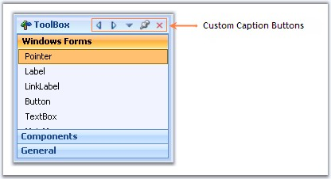
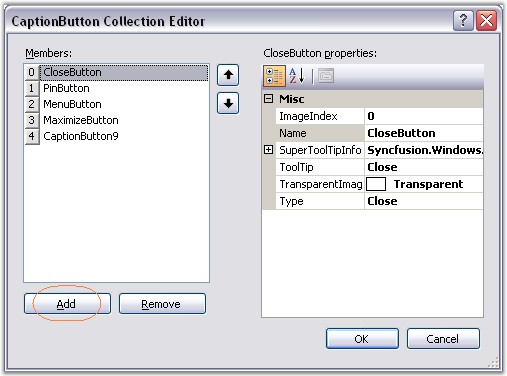
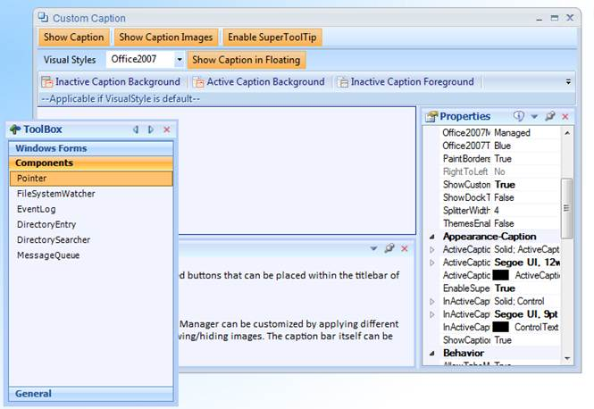

::: {style="DISPLAY: none"}
{#d2h_url_template}{#d2h_package_url style="WIDTH: 0px; DISPLAY: none; HEIGHT: 0px"}
:::

::::: {.d2h_secondary_topic style="PADDING-BOTTOM: 10pt; MARGIN: 0pt; PADDING-LEFT: 0pt; PADDING-RIGHT: 0pt; PADDING-TOP: 0pt"}
##### Custom Caption Buttons {#custom-caption-buttons style="tab-stops: 0pt"}

[]{style="COLOR: #15428b"} 

Custom Caption Collection Editor which can be accessed using **DockingManager.CaptionButtons** property, lets you customize the default buttons and also lets you add custom caption buttons.

[]{style="COLOR: #15428b"} 

{border="0"}

[]{style="COLOR: #15428b"} 

Figure 60: Docked Control with Custom Caption Buttons

**[]{style="COLOR: #15428b"}** 

Adding and customizing caption Buttons

**[]{style="COLOR: #15428b"}** 

In the CaptionButton Collection Editor, click \"Add\" to add a new caption button. To customize the caption button, modify the properties provided to the right of the members in the editor.

[]{style="COLOR: #15428b"} 

{border="0"}

***[]{style="COLOR: #15428b"}*** 

Figure 61: CaptionButton Collection Editor

[]{style="COLOR: #15428b"} 

This can be done programmatically using the below code snippets.

[]{style="COLOR: #15428b"} 

+-----------------------------------------------------------------------------------------------------------------------------------------------------------------------------------------------------------------------------+
| **[\[C#\]]{style="FONT-FAMILY: 'Courier New'; COLOR: black"}**                                                                                                                                                              |
|                                                                                                                                                                                                                             |
| **[]{style="FONT-FAMILY: 'Courier New'; COLOR: black"}**                                                                                                                                                                    |
|                                                                                                                                                                                                                             |
| [Syncfusion.Windows.Forms.Tools.[CaptionButton]{style="COLOR: teal"} captionButton = [new]{style="COLOR: blue"} Syncfusion.Windows.Forms.Tools.[CaptionButton]{style="COLOR: teal"}();]{style="FONT-FAMILY: 'Courier New'"} |
|                                                                                                                                                                                                                             |
| [toolTipInfo = ]{style="FONT-FAMILY: 'Courier New'; COLOR: black"}[new]{style="FONT-FAMILY: 'Courier New'; COLOR: blue"}[ Syncfusion.Windows.Forms.Tools.ToolTipInfo();]{style="FONT-FAMILY: 'Courier New'; COLOR: black"}  |
|                                                                                                                                                                                                                             |
| [captionButton.ImageIndex = 4;]{style="FONT-FAMILY: 'Courier New'"}                                                                                                                                                         |
|                                                                                                                                                                                                                             |
| [captionButton.Name = [\"Custom Button\"]{style="COLOR: maroon"};]{style="FONT-FAMILY: 'Courier New'"}                                                                                                                      |
|                                                                                                                                                                                                                             |
| [captionButton.Type = Syncfusion.Windows.Forms.Tools.[CaptionButtonType]{style="COLOR: teal"}.Custom;]{style="FONT-FAMILY: 'Courier New'"}                                                                                  |
|                                                                                                                                                                                                                             |
| [captionButton.SuperToolTipInfo = toolTipInfo]{style="FONT-FAMILY: 'Courier New'"}                                                                                                                                          |
|                                                                                                                                                                                                                             |
| [captionButton.TransparentImageColor = System.Drawing.[Color]{style="COLOR: teal"}.[Transparent]{style="COLOR: black"};]{style="FONT-FAMILY: 'Courier New'"}                                                                |
|                                                                                                                                                                                                                             |
| [this]{style="FONT-FAMILY: 'Courier New'; COLOR: blue"}[.dockingManager1.CaptionButtons.Add(captionButton);]{style="FONT-FAMILY: 'Courier New'"}                                                                            |
+-----------------------------------------------------------------------------------------------------------------------------------------------------------------------------------------------------------------------------+

[]{style="COLOR: #15428b"} 

+---------------------------------------------------------------------------------------------------------------------------------------------------------------------------------------------------------------------------------------------------------------------------------------+
| **[\[VB.NET\]]{style="FONT-FAMILY: 'Courier New'; COLOR: black"}**                                                                                                                                                                                                                    |
|                                                                                                                                                                                                                                                                                       |
| **[]{style="FONT-FAMILY: 'Courier New'; COLOR: black"}**                                                                                                                                                                                                                              |
|                                                                                                                                                                                                                                                                                       |
| [Dim]{style="FONT-FAMILY: 'Courier New'; COLOR: blue"}[ captionButton5 [As]{style="COLOR: blue"} Syncfusion.Windows.Forms.Tools.CaptionButton = [New]{style="COLOR: blue"} Syncfusion.Windows.Forms.Tools.[CaptionButton()]{style="COLOR: teal"}]{style="FONT-FAMILY: 'Courier New'"} |
|                                                                                                                                                                                                                                                                                       |
| [toolTipInfo = ]{style="FONT-FAMILY: 'Courier New'; COLOR: black"}[new]{style="FONT-FAMILY: 'Courier New'; COLOR: blue"}[ Syncfusion.Windows.Forms.Tools.ToolTipInfo()]{style="FONT-FAMILY: 'Courier New'; COLOR: black"}                                                             |
|                                                                                                                                                                                                                                                                                       |
| [captionButton.ImageIndex = 4 ]{style="FONT-FAMILY: 'Courier New'"}                                                                                                                                                                                                                   |
|                                                                                                                                                                                                                                                                                       |
| [captionButton.Name = [\"Custom Button\"]{style="COLOR: maroon"} ]{style="FONT-FAMILY: 'Courier New'"}                                                                                                                                                                                |
|                                                                                                                                                                                                                                                                                       |
| [captionButton.Type = Syncfusion.Windows.Forms.Tools.[CaptionButtonType]{style="COLOR: teal"}.Custom;]{style="FONT-FAMILY: 'Courier New'"}                                                                                                                                            |
|                                                                                                                                                                                                                                                                                       |
| [captionButton.SuperToolTipInfo = toolTipInfo]{style="FONT-FAMILY: 'Courier New'"}                                                                                                                                                                                                    |
|                                                                                                                                                                                                                                                                                       |
| [captionButton.TransparentImageColor = System.Drawing.Color.[Transparent]{style="COLOR: black"} ]{style="FONT-FAMILY: 'Courier New'"}                                                                                                                                                 |
|                                                                                                                                                                                                                                                                                       |
| [Me]{style="FONT-FAMILY: 'Courier New'; COLOR: blue"}[.dockingManager1.CaptionButtons.Add(captionButton)]{style="FONT-FAMILY: 'Courier New'"}                                                                                                                                         |
+---------------------------------------------------------------------------------------------------------------------------------------------------------------------------------------------------------------------------------------------------------------------------------------+

[]{style="COLOR: #15428b"} 

A sample which demonstrates the addition of Custom Caption Buttons is available in the below sample installation path.

 

..My Documents\\Syncfusion\\EssentialStudio\\***Version Number***\\Windows\\Tools.Windows\\Samples\\2.0\\Docking Package\\Custom Caption

 

Custom Button for Caption Bar in Floating Form

This feature enables you to add custom buttons to the caption bar when an item is in a floating state.

 

You can now add custom buttons to the caption bar when an item is in a floating state. It is not required to dock the item to use the custom buttons.

 

Table 11: Propertyes Table

::: {align="center"}
  ----------------------------- ------------------------------------------------------------------- ------ ----------- -----------------
  Property                      Description                                                         Type   Data Type   Reference links
  ShowCustomButtonsInFloating   Specifies whether caption button will be enabled while floating.    \-     Boolean     NA
  ----------------------------- ------------------------------------------------------------------- ------ ----------- -----------------
:::

[]{style="COLOR: #c00000"} 

[]{style="COLOR: #c00000"} 

Enabling Custom Button for Caption Bar while Floating

To enable custom button for caption bar while floating, set the *ShowCustomButtonsInFloating* property to *true*. By default this is set to *false*.

 

+--------------------------------------------------------------------------------------------------------------------------------------------------------------------------+
| **[\[C#\]]{style="FONT-FAMILY: 'Courier New'"}**                                                                                                                         |
|                                                                                                                                                                          |
| [this]{style="FONT-FAMILY: 'Courier New'; COLOR: blue"}[.dockingManager1.ShowCustomButtonsInFloating = [true]{style="COLOR: blue"};]{style="FONT-FAMILY: 'Courier New'"} |
+--------------------------------------------------------------------------------------------------------------------------------------------------------------------------+

 

+-----------------------------------------------------------------------------------------------------------------------------------------------------------------------+
| **[\[VB\]]{style="FONT-FAMILY: 'Courier New'"}**                                                                                                                      |
|                                                                                                                                                                       |
| [me]{style="FONT-FAMILY: 'Courier New'; COLOR: blue"}[.dockingManager1.ShowCustomButtonsInFloating = [True]{style="COLOR: blue"}]{style="FONT-FAMILY: 'Courier New'"} |
+-----------------------------------------------------------------------------------------------------------------------------------------------------------------------+

 

{border="0"}

Figure 62: Caption Bar with Custom Button while Floating

::: {style="BORDER-BOTTOM: windowtext 1pt solid; BORDER-LEFT: medium none; PADDING-BOTTOM: 1pt; MARGIN-TOP: 9pt; PADDING-LEFT: 0pt; PADDING-RIGHT: 0pt; MARGIN-BOTTOM: 9pt; BORDER-TOP: windowtext 1pt solid; BORDER-RIGHT: medium none; PADDING-TOP: 1pt"}
Note: This feature is not applicable for VS2005 (default) visual style.
:::

 

Sample Link

A sample for this feature is available in the following location:

***..\\..\\AppData\\Local\\Syncfusion\\EssentialStudio\\9.4.0.59\\Windows\\Tools.Windows\\Samples\\2.0\\Docking Package\\Custom Caption***

**** 

 

 

[]{#related-topics}
:::::
