::: {style="DISPLAY: none"}
{#d2h_url_template}{#d2h_package_url style="WIDTH: 0px; DISPLAY: none; HEIGHT: 0px"}
:::

::::: {#nsbanner .d2h_main_nsbanner style="BORDER-BOTTOM: #999999 1px solid; POSITION: relative; PADDING-BOTTOM: 0px; BACKGROUND-COLOR: transparent; PADDING-LEFT: 0px; PADDING-RIGHT: 0px; DISPLAY: none; BORDER-TOP: #999999 1px solid; PADDING-TOP: 0px; LEFT: 0px"}
:::: {#TitleRow .d2h_main_titlerow style="PADDING-BOTTOM: 4px; BACKGROUND-COLOR: transparent; PADDING-LEFT: 22px; WIDTH: 100%; PADDING-RIGHT: 10px; DISPLAY: none; PADDING-TOP: 4px"}
::: {#ienav .d2h_main_ienav style="DISPLAY: none"}
{#D2HPrevious .D2HPreviousEnabled}  {#D2HNext .D2HNextEnabled}
:::
::::
:::::

:::: {#nstext .d2h_main_nstext style="PADDING-BOTTOM: 10px; BACKGROUND-COLOR: transparent; PADDING-LEFT: 22px; PADDING-RIGHT: 10px; HEIGHT: 100%; OVERFLOW: auto; PADDING-TOP: 5px" hasuserbackground="true" valign="bottom"}
::: {#d2h_breadcrumbs .d2h_breadcrumbs}
[Essential Studio User Guide Documentation](ms-xhelp:///?Id=12457748-09e3-4d74-a240-8e049cedf030){.d2h_breadcrumbsNormal}[ \> ]{.d2h_breadcrumbsLinkSeparator}[User Interface Edition](ms-xhelp:///?Id=c29296b7-531c-413b-a0ec-488ca1f7f669){.d2h_breadcrumbsNormal}[ \> ]{.d2h_breadcrumbsLinkSeparator}[Essential Windows](ms-xhelp:///?Id=e60759d8-47a4-4570-9d7a-16a68d63f2ea){.d2h_breadcrumbsNormal}[ \> ]{.d2h_breadcrumbsLinkSeparator}[Essential Grid]{.d2h_breadcrumbsContentsOnly}[ \> ]{.d2h_breadcrumbsLinkSeparator}[Grid Controls](ms-xhelp:///?Id=bf2d70d7-33dc-4c67-a55d-4fcf8d51dc2b){.d2h_breadcrumbsNormal}[ \> ]{.d2h_breadcrumbsLinkSeparator}[Grid Helper Classes](ms-xhelp:///?Id=fc684465-b246-4aea-b668-e0c0084c9590){.d2h_breadcrumbsNormal}
:::

### Custom Cell Types {#custom-cell-types style="tab-stops: 0pt"}

[]{style="FONT-FAMILY: 'Trebuchet MS','sans-serif'; COLOR: #15428b; FONT-SIZE: 9pt"} 

Following are the custom cell types supported by the Grid Helper Library.

[]{style="FONT-FAMILY: 'Trebuchet MS','sans-serif'; COLOR: #15428b; FONT-SIZE: 9pt"} 

a.   ButtonEdit

b.   CalculatorTextBox

c.   Calendar

d.   DateTimePicker

e.   FNumericUpDown

f.    GridinCell

g.   LinkLabelCell

h.   PictureBox

[]{style="FONT-FAMILY: 'Trebuchet MS','sans-serif'; COLOR: #15428b; FONT-SIZE: 9pt"} 

ButtonEdit

 

You can implement a Button Edit control in grid cells by using the **ButtonEdit** cell type. ButtonEdit cell types can be used by initializing the **ButtonEditStyleProperties** class for the grid cells.

 

Following are the Button Edit cell types available in the Grid control.

[]{style="FONT-FAMILY: 'Trebuchet MS','sans-serif'; COLOR: #15428b; FONT-SIZE: 9pt"} 

[·      ]{style="FONT-FAMILY: Symbol"}Browse

[·      ]{style="FONT-FAMILY: Symbol"}Check

[·      ]{style="FONT-FAMILY: Symbol"}Down

[·      ]{style="FONT-FAMILY: Symbol"}Image

[·      ]{style="FONT-FAMILY: Symbol"}Left

[·      ]{style="FONT-FAMILY: Symbol"}Leftend

[·      ]{style="FONT-FAMILY: Symbol"}None

[·      ]{style="FONT-FAMILY: Symbol"}Redo

[·      ]{style="FONT-FAMILY: Symbol"}Right

[·      ]{style="FONT-FAMILY: Symbol"}Rightend

[·      ]{style="FONT-FAMILY: Symbol"}Undo

[·      ]{style="FONT-FAMILY: Symbol"}Up

 

The following code example illustrates how to set the grid cell type to ButtonEdit.

[]{style="FONT-FAMILY: 'Trebuchet MS','sans-serif'; COLOR: #15428b; FONT-SIZE: 9pt"} 

1.   Using C#

[]{style="FONT-FAMILY: 'Trebuchet MS','sans-serif'; COLOR: #15428b"} 

+-------------------------------------------------------------------------------------------------------------------------------------------------------------------------------------------------------------------------+
| **[\[C#\]]{style="FONT-FAMILY: 'Courier New'; COLOR: black"}**                                                                                                                                                          |
|                                                                                                                                                                                                                         |
| []{style="FONT-FAMILY: 'Courier New'; COLOR: black"}                                                                                                                                                                    |
|                                                                                                                                                                                                                         |
| [// Register the Cell Type with Grid control.]{style="FONT-FAMILY: 'Courier New'; COLOR: green"}                                                                                                                        |
|                                                                                                                                                                                                                         |
| [RegisterCellModel]{style="FONT-FAMILY: 'Courier New'; COLOR: #2b91af"}[.GridCellType(gridControl1, [CustomCellTypes]{style="COLOR: #2b91af"}.ButtonEdit);]{style="FONT-FAMILY: 'Courier New'"}                         |
|                                                                                                                                                                                                                         |
| [Syncfusion.GridHelperClasses.[ButtonEditStyleProperties]{style="COLOR: #2b91af"} sp;]{style="FONT-FAMILY: 'Courier New'"}                                                                                              |
|                                                                                                                                                                                                                         |
| [sp = [new]{style="COLOR: blue"} Syncfusion.GridHelperClasses.[ButtonEditStyleProperties]{style="COLOR: #2b91af"}([this]{style="COLOR: blue"}.gridControl1\[rowIndex, colIndex\]);]{style="FONT-FAMILY: 'Courier New'"} |
|                                                                                                                                                                                                                         |
| [sp.ButtonEditInfo.ButtonEditType = Syncfusion.GridHelperClasses.[ButtonType]{style="COLOR: #2b91af"}.Browse;]{style="FONT-FAMILY: 'Courier New'"}                                                                      |
|                                                                                                                                                                                                                         |
| []{style="FONT-FAMILY: 'Courier New'"}                                                                                                                                                                                  |
|                                                                                                                                                                                                                         |
| [this]{style="FONT-FAMILY: 'Courier New'; COLOR: blue"}[.gridControl1\[2, 2\].CellType = [\"ButtonEdit\"]{style="COLOR: #a31515"};]{style="FONT-FAMILY: 'Courier New'"}                                                 |
+-------------------------------------------------------------------------------------------------------------------------------------------------------------------------------------------------------------------------+

[]{style="FONT-FAMILY: 'Trebuchet MS','sans-serif'; COLOR: #15428b; FONT-SIZE: 9pt"} 

2.   Using VB.NET

[]{style="FONT-FAMILY: 'Trebuchet MS','sans-serif'; COLOR: #15428b; FONT-SIZE: 9pt"} 

+------------------------------------------------------------------------------------------------------------------------------------------------------------------------------------------+
| **[\[VB.NET\]]{style="FONT-FAMILY: 'Courier New'; COLOR: black"}**                                                                                                                       |
|                                                                                                                                                                                          |
| []{style="FONT-FAMILY: 'Courier New'; COLOR: black"}                                                                                                                                     |
|                                                                                                                                                                                          |
| [\' Register the Cell Type with Grid control.]{style="FONT-FAMILY: 'Courier New'; COLOR: green"}                                                                                         |
|                                                                                                                                                                                          |
| [RegisterCellModel.GridCellType(gridControl1, CustomCellTypes.ButtonEdit)]{style="FONT-FAMILY: 'Courier New'"}                                                                           |
|                                                                                                                                                                                          |
| [Dim]{style="FONT-FAMILY: 'Courier New'; COLOR: blue"}[ sp [As]{style="COLOR: blue"} Syncfusion.GridHelperClasses.ButtonEditStyleProperties]{style="FONT-FAMILY: 'Courier New'"}         |
|                                                                                                                                                                                          |
| [sp = [New]{style="COLOR: blue"} Syncfusion.GridHelperClasses.ButtonEditStyleProperties([Me]{style="COLOR: blue"}.gridControl1(rowIndex, colIndex))]{style="FONT-FAMILY: 'Courier New'"} |
|                                                                                                                                                                                          |
| [sp.ButtonEditInfo.ButtonEditType = Syncfusion.GridHelperClasses.ButtonType.Browse]{style="FONT-FAMILY: 'Courier New'"}                                                                  |
|                                                                                                                                                                                          |
| [gridControl1\[2, 2\].CellType = [\"ButtonEdit\"]{style="COLOR: #a31515"}]{style="FONT-FAMILY: 'Courier New'"}                                                                           |
+------------------------------------------------------------------------------------------------------------------------------------------------------------------------------------------+

 

Following screen shots illustrate different Button Edit cell types.

[]{style="FONT-FAMILY: 'Trebuchet MS','sans-serif'; COLOR: #15428b; FONT-SIZE: 9pt"} 

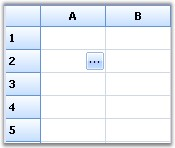{border="0"}

[                                                 ]{style="FONT-FAMILY: 'Trebuchet MS','sans-serif'; COLOR: #15428b; FONT-SIZE: 9pt"}

*[Figure ]{style="FONT-SIZE: 9pt"}[448]{style="FONT-SIZE: 9pt"}[: \"Browse\" Button Edit Cell Type]{style="FONT-SIZE: 9pt"}*

[]{style="FONT-FAMILY: 'Trebuchet MS','sans-serif'; COLOR: #15428b; FONT-SIZE: 9pt"} 

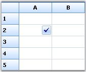{border="0"}

[]{style="FONT-FAMILY: 'Trebuchet MS','sans-serif'; COLOR: #15428b; FONT-SIZE: 9pt"} 

*[Figure ]{style="FONT-SIZE: 9pt"}[449]{style="FONT-SIZE: 9pt"}[: \"Check\" Button Edit Cell Type]{style="FONT-SIZE: 9pt"}****[]{style="FONT-FAMILY: 'Trebuchet MS','sans-serif'; COLOR: #15428b; FONT-SIZE: 9pt"}***

[]{style="FONT-FAMILY: 'Trebuchet MS','sans-serif'; COLOR: #15428b; FONT-SIZE: 9pt"} 

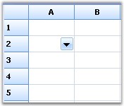{border="0"}

[]{style="FONT-FAMILY: 'Trebuchet MS','sans-serif'; COLOR: #15428b; FONT-SIZE: 9pt"} 

*[Figure ]{style="FONT-SIZE: 9pt"}[450]{style="FONT-SIZE: 9pt"}[: \"Down\" Button Edit Cell Type]{style="FONT-SIZE: 9pt"}*

*[]{style="FONT-SIZE: 9pt"}* 

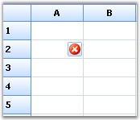{border="0"}

[]{style="FONT-FAMILY: 'Trebuchet MS','sans-serif'; COLOR: #15428b; FONT-SIZE: 9pt"} 

*[Figure ]{style="FONT-SIZE: 9pt"}[451]{style="FONT-SIZE: 9pt"}[: \"Image\" Button Edit Cell Type]{style="FONT-SIZE: 9pt"}*

[]{style="FONT-FAMILY: 'Trebuchet MS','sans-serif'; COLOR: #15428b; FONT-SIZE: 9pt"} 

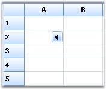{border="0"}

[]{style="FONT-FAMILY: 'Trebuchet MS','sans-serif'; COLOR: #15428b; FONT-SIZE: 9pt"} 

*[Figure ]{style="FONT-SIZE: 9pt"}[452]{style="FONT-SIZE: 9pt"}[: \"Left\" Button Edit Cell Type]{style="FONT-SIZE: 9pt"}*

[]{style="FONT-FAMILY: 'Trebuchet MS','sans-serif'; COLOR: #15428b; FONT-SIZE: 9pt"} 

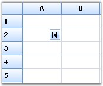{border="0"}

[]{style="FONT-FAMILY: 'Trebuchet MS','sans-serif'; COLOR: #15428b; FONT-SIZE: 9pt"} 

*[Figure ]{style="FONT-SIZE: 9pt"}[453]{style="FONT-SIZE: 9pt"}[: \"Leftend\" Button Edit Cell Type]{style="FONT-SIZE: 9pt"}*

*[]{style="FONT-SIZE: 9pt"}* 

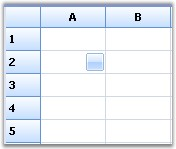{border="0"}

***[]{style="FONT-FAMILY: 'Trebuchet MS','sans-serif'; COLOR: #15428b; FONT-SIZE: 9pt"}*** 

*[Figure ]{style="FONT-SIZE: 9pt"}[454]{style="FONT-SIZE: 9pt"}[: \"None\" Button Edit Cell Type]{style="FONT-SIZE: 9pt"}*

[]{style="FONT-FAMILY: 'Trebuchet MS','sans-serif'; COLOR: #15428b; FONT-SIZE: 9pt"} 

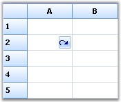{border="0"}

[]{style="FONT-FAMILY: 'Trebuchet MS','sans-serif'; COLOR: #15428b; FONT-SIZE: 9pt"} 

*[Figure ]{style="FONT-SIZE: 9pt"}[455]{style="FONT-SIZE: 9pt"}[: \"Redo\" Button Edit Cell Type]{style="FONT-SIZE: 9pt"}*

[]{style="FONT-FAMILY: 'Trebuchet MS','sans-serif'; COLOR: #15428b; FONT-SIZE: 9pt"} 

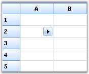{border="0"}

[]{style="FONT-FAMILY: 'Trebuchet MS','sans-serif'; COLOR: #15428b; FONT-SIZE: 9pt"} 

*[Figure ]{style="FONT-SIZE: 9pt"}[456]{style="FONT-SIZE: 9pt"}[: \"Right\" Button Edit Cell Type]{style="FONT-SIZE: 9pt"}*

[]{style="FONT-FAMILY: 'Trebuchet MS','sans-serif'; COLOR: #15428b; FONT-SIZE: 9pt"} 

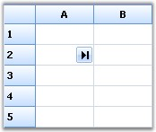{border="0"}

[]{style="FONT-FAMILY: 'Trebuchet MS','sans-serif'; COLOR: #15428b; FONT-SIZE: 9pt"} 

*[Figure ]{style="FONT-SIZE: 9pt"}[457]{style="FONT-SIZE: 9pt"}[: \"Rightend\" Button Edit Cell Type]{style="FONT-SIZE: 9pt"}****[]{style="FONT-FAMILY: 'Trebuchet MS','sans-serif'; COLOR: #15428b; FONT-SIZE: 9pt"}***

[]{style="FONT-FAMILY: 'Trebuchet MS','sans-serif'; COLOR: #15428b; FONT-SIZE: 9pt"} 

[{border="0"}]{style="FONT-FAMILY: 'Trebuchet MS','sans-serif'; COLOR: #15428b; FONT-SIZE: 9pt"}[]{style="FONT-FAMILY: 'Trebuchet MS','sans-serif'; COLOR: #15428b; FONT-SIZE: 9pt"}

[]{style="FONT-FAMILY: 'Trebuchet MS','sans-serif'; COLOR: #15428b; FONT-SIZE: 9pt"} 

*[Figure ]{style="FONT-SIZE: 9pt"}[458]{style="FONT-SIZE: 9pt"}[: \"Undo\" Button Edit Cell Type]{style="FONT-SIZE: 9pt"}*

[]{style="FONT-FAMILY: 'Trebuchet MS','sans-serif'; COLOR: #15428b; FONT-SIZE: 9pt"} 

[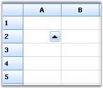{border="0"}]{style="FONT-FAMILY: 'Trebuchet MS','sans-serif'; COLOR: #15428b; FONT-SIZE: 9pt"}[]{style="FONT-FAMILY: 'Trebuchet MS','sans-serif'; COLOR: #15428b; FONT-SIZE: 9pt"}

[]{style="FONT-FAMILY: 'Trebuchet MS','sans-serif'; COLOR: #15428b; FONT-SIZE: 9pt"} 

*[Figure ]{style="FONT-SIZE: 9pt"}[459]{style="FONT-SIZE: 9pt"}[: \"Up\" Button Edit Cell Type]{style="FONT-SIZE: 9pt"}*

[]{style="FONT-FAMILY: 'Trebuchet MS','sans-serif'; COLOR: #15428b; FONT-SIZE: 9pt"} 

CalculatorTextBox

 

You can implement a Calculator control in grid cells by using the **CalculatorTextBox** cell type. This cell type is implemented as a drop-down container, embedded into the cell. The drop down contains the calculator which displays and stores the value in the cell.

 

The following code example illustrates how to set the grid cell type to CalculatorTextBox.

[]{style="FONT-FAMILY: 'Trebuchet MS','sans-serif'; COLOR: #15428b; FONT-SIZE: 9pt"} 

1.   Using C#

[]{style="FONT-FAMILY: 'Trebuchet MS','sans-serif'; COLOR: #15428b; FONT-SIZE: 9pt"} 

+----------------------------------------------------------------------------------------------------------------------------------------------------------------------------------------------------------------------------------------+
| **[\[C#\]]{style="FONT-FAMILY: 'Courier New'; COLOR: black; FONT-SIZE: 9pt"}**                                                                                                                                                         |
|                                                                                                                                                                                                                                        |
| []{style="FONT-FAMILY: 'Courier New'; COLOR: black; FONT-SIZE: 9pt"}                                                                                                                                                                   |
|                                                                                                                                                                                                                                        |
| [RegisterCellModel]{style="FONT-FAMILY: 'Courier New'; COLOR: #2b91af; FONT-SIZE: 9pt"}[.GridCellType(gridControl1, [CustomCellTypes]{style="COLOR: #2b91af"}.CalculatorTextBox);]{style="FONT-FAMILY: 'Courier New'; FONT-SIZE: 9pt"} |
|                                                                                                                                                                                                                                        |
| []{style="FONT-FAMILY: 'Courier New'; FONT-SIZE: 9pt"}                                                                                                                                                                                 |
|                                                                                                                                                                                                                                        |
| [CalculatorControl c1 = [new]{style="COLOR: blue"} CalculatorControl();]{style="FONT-FAMILY: 'Courier New'; FONT-SIZE: 9pt"}                                                                                                           |
|                                                                                                                                                                                                                                        |
| [c1.BorderStyle = [Border3DStyle]{style="COLOR: #2b91af"}.Flat;]{style="FONT-FAMILY: 'Courier New'; FONT-SIZE: 9pt"}                                                                                                                   |
|                                                                                                                                                                                                                                        |
| [c1.ButtonStyle = Syncfusion.Windows.Forms.[ButtonAppearance]{style="COLOR: #2b91af"}.Office2007;]{style="FONT-FAMILY: 'Courier New'; FONT-SIZE: 9pt"}                                                                                 |
|                                                                                                                                                                                                                                        |
| [c1.UseVisualStyle = [true]{style="COLOR: blue"};]{style="FONT-FAMILY: 'Courier New'; FONT-SIZE: 9pt"}                                                                                                                                 |
|                                                                                                                                                                                                                                        |
| []{style="FONT-FAMILY: 'Courier New'; FONT-SIZE: 9pt"}                                                                                                                                                                                 |
|                                                                                                                                                                                                                                        |
| [GridStyleInfo]{style="FONT-FAMILY: 'Courier New'; COLOR: #2b91af; FONT-SIZE: 9pt"}[ style = gridControl1\[4, 2\];]{style="FONT-FAMILY: 'Courier New'; FONT-SIZE: 9pt"}                                                                |
|                                                                                                                                                                                                                                        |
| [style.CellType = [\"CalculatorTextBox\"]{style="COLOR: #a31515"};]{style="FONT-FAMILY: 'Courier New'; FONT-SIZE: 9pt"}                                                                                                                |
|                                                                                                                                                                                                                                        |
| [style.Control = c1;]{style="FONT-FAMILY: 'Courier New'; FONT-SIZE: 9pt"}                                                                                                                                                              |
+----------------------------------------------------------------------------------------------------------------------------------------------------------------------------------------------------------------------------------------+

[]{style="FONT-FAMILY: 'Trebuchet MS','sans-serif'; COLOR: #15428b; FONT-SIZE: 9pt"} 

2.   Using VB.NET

[]{style="FONT-FAMILY: 'Trebuchet MS','sans-serif'; COLOR: #15428b; FONT-SIZE: 9pt"} 

+----------------------------------------------------------------------------------------------------------------------------------------------------------------------------------------------------------+
| **[\[VB.NET\]]{style="FONT-FAMILY: 'Courier New'; COLOR: black; FONT-SIZE: 9pt"}**                                                                                                                       |
|                                                                                                                                                                                                          |
| []{style="FONT-FAMILY: 'Courier New'; COLOR: black; FONT-SIZE: 9pt"}                                                                                                                                     |
|                                                                                                                                                                                                          |
| [RegisterCellModel.GridCellType(gridControl1, CustomCellTypes.CalculatorTextBox)]{style="FONT-FAMILY: 'Courier New'; FONT-SIZE: 9pt"}                                                                    |
|                                                                                                                                                                                                          |
| []{style="FONT-FAMILY: 'Courier New'; FONT-SIZE: 9pt"}                                                                                                                                                   |
|                                                                                                                                                                                                          |
| [Dim]{style="FONT-FAMILY: 'Courier New'; COLOR: blue; FONT-SIZE: 9pt"}[ c1 [As]{style="COLOR: blue"} [New]{style="COLOR: blue"} CalculatorControl()]{style="FONT-FAMILY: 'Courier New'; FONT-SIZE: 9pt"} |
|                                                                                                                                                                                                          |
| [c1.BorderStyle = Border3DStyle.Flat]{style="FONT-FAMILY: 'Courier New'; FONT-SIZE: 9pt"}                                                                                                                |
|                                                                                                                                                                                                          |
| [c1.ButtonStyle = Syncfusion.Windows.Forms.ButtonAppearance.Office2007]{style="FONT-FAMILY: 'Courier New'; FONT-SIZE: 9pt"}                                                                              |
|                                                                                                                                                                                                          |
| [c1.UseVisualStyle = [True]{style="COLOR: blue"}]{style="FONT-FAMILY: 'Courier New'; FONT-SIZE: 9pt"}                                                                                                    |
|                                                                                                                                                                                                          |
| []{style="FONT-FAMILY: 'Courier New'; COLOR: blue; FONT-SIZE: 9pt"}                                                                                                                                      |
|                                                                                                                                                                                                          |
| [Dim]{style="FONT-FAMILY: 'Courier New'; COLOR: blue; FONT-SIZE: 9pt"}[ style [As]{style="COLOR: blue"} GridStyleInfo = gridControl1(4, 2)]{style="FONT-FAMILY: 'Courier New'; FONT-SIZE: 9pt"}          |
|                                                                                                                                                                                                          |
| [style.CellType = [\"CalculatorTextBox\"]{style="COLOR: #a31515"}]{style="FONT-FAMILY: 'Courier New'; FONT-SIZE: 9pt"}                                                                                   |
|                                                                                                                                                                                                          |
| [style.Control = c1]{style="FONT-FAMILY: 'Courier New'; FONT-SIZE: 9pt"}                                                                                                                                 |
+----------------------------------------------------------------------------------------------------------------------------------------------------------------------------------------------------------+

[]{style="FONT-FAMILY: 'Trebuchet MS','sans-serif'; COLOR: #15428b; FONT-SIZE: 9pt"} 

Following screen shot illustrates CalculatorTextBox cell type in the Grid control.

[]{style="FONT-FAMILY: 'Trebuchet MS','sans-serif'; COLOR: #15428b; FONT-SIZE: 9pt"} 

[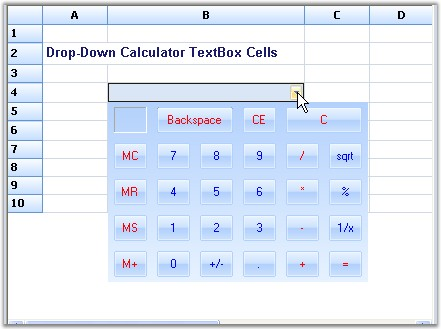{border="0"}]{style="FONT-FAMILY: 'Trebuchet MS','sans-serif'; COLOR: #15428b; FONT-SIZE: 9pt"}[]{style="FONT-FAMILY: 'Trebuchet MS','sans-serif'; COLOR: #15428b; FONT-SIZE: 9pt"}

[]{style="FONT-FAMILY: 'Trebuchet MS','sans-serif'; COLOR: #15428b; FONT-SIZE: 9pt"} 

*[Figure ]{style="FONT-SIZE: 9pt"}[460]{style="FONT-SIZE: 9pt"}[: CalculatorTextBox cell type in Grid Control]{style="FONT-SIZE: 9pt"}*

*[]{style="FONT-SIZE: 9pt"}* 

Calendar

[]{style="FONT-FAMILY: 'Trebuchet MS','sans-serif'; COLOR: #15428b; FONT-SIZE: 9pt"} 

You can implement a MonthCalendar control in a grid cell by enabling the **Calendar** cell type for that particular cell.

 

The following code example illustrates how to set the grid cell type to Calendar.

[]{style="FONT-FAMILY: 'Trebuchet MS','sans-serif'; COLOR: #15428b; FONT-SIZE: 9pt"} 

1.   Using C#

[]{style="FONT-FAMILY: 'Trebuchet MS','sans-serif'; COLOR: #15428b; FONT-SIZE: 9pt"} 

+-----------------------------------------------------------------------------------------------------------------------------------------------------------------------------------------------+
| **[\[C#\]]{style="FONT-FAMILY: 'Courier New'; COLOR: black"}**                                                                                                                                |
|                                                                                                                                                                                               |
| []{style="FONT-FAMILY: 'Courier New'; COLOR: black"}                                                                                                                                          |
|                                                                                                                                                                                               |
| [RegisterCellModel]{style="FONT-FAMILY: 'Courier New'; COLOR: #2b91af"}[.GridCellType(gridControl1, [CustomCellTypes]{style="COLOR: #2b91af"}.Calendar);]{style="FONT-FAMILY: 'Courier New'"} |
|                                                                                                                                                                                               |
| [GridStyleInfo]{style="FONT-FAMILY: 'Courier New'; COLOR: #2b91af"}[ style;]{style="FONT-FAMILY: 'Courier New'"}                                                                              |
|                                                                                                                                                                                               |
| [style = gridControl1\[row, 2\];]{style="FONT-FAMILY: 'Courier New'"}                                                                                                                         |
|                                                                                                                                                                                               |
| [style.CellType = [\"Calendar\"]{style="COLOR: #a31515"};]{style="FONT-FAMILY: 'Courier New'"}                                                                                                |
|                                                                                                                                                                                               |
| []{style="FONT-FAMILY: 'Courier New'"}                                                                                                                                                        |
|                                                                                                                                                                                               |
| [// Provide a Month Calendar control for drawing cell contents.]{style="FONT-FAMILY: 'Courier New'; COLOR: green"}                                                                            |
|                                                                                                                                                                                               |
| [style.Control = [new]{style="COLOR: blue"} [MonthCalendar]{style="COLOR: #2b91af"}();]{style="FONT-FAMILY: 'Courier New'"}                                                                   |
+-----------------------------------------------------------------------------------------------------------------------------------------------------------------------------------------------+

[]{style="FONT-FAMILY: 'Trebuchet MS','sans-serif'; COLOR: #15428b; FONT-SIZE: 9pt"} 

2.   Using VB.NET

[]{style="FONT-FAMILY: 'Trebuchet MS','sans-serif'; COLOR: #15428b; FONT-SIZE: 9pt"} 

+--------------------------------------------------------------------------------------------------------------------------------------------+
| **[\[VB.NET\]]{style="FONT-FAMILY: 'Courier New'; COLOR: black"}**                                                                         |
|                                                                                                                                            |
| []{style="FONT-FAMILY: 'Courier New'; COLOR: black"}                                                                                       |
|                                                                                                                                            |
| [RegisterCellModel.GridCellType(gridControl1, CustomCellTypes.Calendar)]{style="FONT-FAMILY: 'Courier New'"}                               |
|                                                                                                                                            |
| [Dim]{style="FONT-FAMILY: 'Courier New'; COLOR: blue"}[ style [As]{style="COLOR: blue"} GridStyleInfo]{style="FONT-FAMILY: 'Courier New'"} |
|                                                                                                                                            |
| [style = gridControl1(row, 2)]{style="FONT-FAMILY: 'Courier New'"}                                                                         |
|                                                                                                                                            |
| [style.CellType = [\"Calendar\"]{style="COLOR: #a31515"}]{style="FONT-FAMILY: 'Courier New'"}                                              |
|                                                                                                                                            |
| []{style="FONT-FAMILY: 'Courier New'; COLOR: #a31515"}                                                                                     |
|                                                                                                                                            |
| [\' Provide a Month Calendar control for drawing cell contents.]{style="FONT-FAMILY: 'Courier New'; COLOR: green"}                         |
|                                                                                                                                            |
| [style.Control = [New]{style="COLOR: blue"} MonthCalendar()]{style="FONT-FAMILY: 'Courier New'"}                                           |
+--------------------------------------------------------------------------------------------------------------------------------------------+

[]{style="FONT-FAMILY: 'Trebuchet MS','sans-serif'; COLOR: #15428b; FONT-SIZE: 9pt"} 

Following screen shot illustrates Calendar cell type in Grid control.

[]{style="FONT-FAMILY: 'Trebuchet MS','sans-serif'; COLOR: #15428b; FONT-SIZE: 9pt"} 

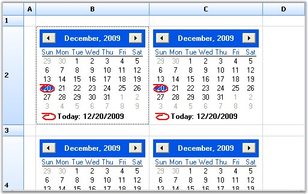{border="0"}

[]{style="FONT-FAMILY: 'Trebuchet MS','sans-serif'; COLOR: #15428b; FONT-SIZE: 9pt"} 

*[Figure ]{style="FONT-SIZE: 9pt"}[461]{style="FONT-SIZE: 9pt"}[: Calendar cell type in Grid Control]{style="FONT-SIZE: 9pt"}*

[]{style="FONT-FAMILY: 'Trebuchet MS','sans-serif'; COLOR: #15428b; FONT-SIZE: 9pt"} 

DateTimePicker

[]{style="FONT-FAMILY: 'Trebuchet MS','sans-serif'; COLOR: #15428b; FONT-SIZE: 9pt"} 

You can implement a Date Time Picker control in grid cells by using the **DateTimePicker** cell type. This cell type is implemented as a drop-down container, embedded into the cell, where the date and time picker is added. The drop down contains the calendar which displays and stores the date value in the cell. Various formats for the date and time can be specified by using the **Format** style property.

[]{style="FONT-FAMILY: 'Trebuchet MS','sans-serif'; COLOR: #15428b; FONT-SIZE: 9pt"} 

The following code example illustrates how to set the grid cell type to DateTimePicker.

[]{style="FONT-FAMILY: 'Trebuchet MS','sans-serif'; COLOR: #15428b; FONT-SIZE: 9pt"} 

1.   Using C#

[]{style="FONT-FAMILY: 'Trebuchet MS','sans-serif'; COLOR: #15428b; FONT-SIZE: 9pt"} 

+-------------------------------------------------------------------------------------------------------------------------------------------------------------------------------------------------------+
| **[\[C#\]]{style="FONT-FAMILY: 'Courier New'; COLOR: black"}**                                                                                                                                        |
|                                                                                                                                                                                                       |
| []{style="FONT-FAMILY: 'Courier New'; COLOR: black"}                                                                                                                                                  |
|                                                                                                                                                                                                       |
| [RegisterCellModel]{style="FONT-FAMILY: 'Courier New'; COLOR: #2b91af"}[.GridCellType(gridControl1, [CustomCellTypes]{style="COLOR: #2b91af"}.DateTimePicker);]{style="FONT-FAMILY: 'Courier New'"}   |
|                                                                                                                                                                                                       |
| []{style="FONT-FAMILY: 'Courier New'"}                                                                                                                                                                |
|                                                                                                                                                                                                       |
| [// Set up DateTimePicker Cells.]{style="FONT-FAMILY: 'Courier New'; COLOR: green"}                                                                                                                   |
|                                                                                                                                                                                                       |
| [this]{style="FONT-FAMILY: 'Courier New'; COLOR: blue"}[.gridControl1\[4, 2\].CellType = [\"DateTimePicker\"]{style="COLOR: #a31515"};]{style="FONT-FAMILY: 'Courier New'"}                           |
|                                                                                                                                                                                                       |
| [this]{style="FONT-FAMILY: 'Courier New'; COLOR: blue"}[.gridControl1\[4, 2\].CellValueType = [typeof]{style="COLOR: blue"}([DateTime]{style="COLOR: #2b91af"});]{style="FONT-FAMILY: 'Courier New'"} |
|                                                                                                                                                                                                       |
| [this]{style="FONT-FAMILY: 'Courier New'; COLOR: blue"}[.gridControl1\[4, 2\].CellValue = [DateTime]{style="COLOR: #2b91af"}.Now;]{style="FONT-FAMILY: 'Courier New'"}                                |
|                                                                                                                                                                                                       |
| [this]{style="FONT-FAMILY: 'Courier New'; COLOR: blue"}[.gridControl1\[4, 2\].Format = [\"MM/dd/yyyy hh:mm\"]{style="COLOR: #a31515"};]{style="FONT-FAMILY: 'Courier New'"}                           |
+-------------------------------------------------------------------------------------------------------------------------------------------------------------------------------------------------------+

[]{style="FONT-FAMILY: 'Trebuchet MS','sans-serif'; COLOR: #15428b; FONT-SIZE: 9pt"} 

2.   Using VB.NET

[]{style="FONT-FAMILY: 'Trebuchet MS','sans-serif'; COLOR: #15428b; FONT-SIZE: 9pt"} 

+-------------------------------------------------------------------------------------------------------------------------------------------------------------------------+
| **[\[VB.NET\]]{style="FONT-FAMILY: 'Courier New'; COLOR: black"}**                                                                                                      |
|                                                                                                                                                                         |
| []{style="FONT-FAMILY: 'Courier New'; COLOR: black"}                                                                                                                    |
|                                                                                                                                                                         |
| [RegisterCellModel.GridCellType(gridControl1, CustomCellTypes.DateTimePicker)]{style="FONT-FAMILY: 'Courier New'"}                                                      |
|                                                                                                                                                                         |
| []{style="FONT-FAMILY: 'Courier New'"}                                                                                                                                  |
|                                                                                                                                                                         |
| [\' Set up DateTimePicker Cells.]{style="FONT-FAMILY: 'Courier New'; COLOR: green"}                                                                                     |
|                                                                                                                                                                         |
| [Me]{style="FONT-FAMILY: 'Courier New'; COLOR: blue"}[.gridControl1(4, 2).CellType = [\"DateTimePicker\"]{style="COLOR: #a31515"}]{style="FONT-FAMILY: 'Courier New'"}  |
|                                                                                                                                                                         |
| [Me]{style="FONT-FAMILY: 'Courier New'; COLOR: blue"}[.gridControl1(4, 2).CellValueType = [GetType]{style="COLOR: blue"}(DateTime)]{style="FONT-FAMILY: 'Courier New'"} |
|                                                                                                                                                                         |
| [Me]{style="FONT-FAMILY: 'Courier New'; COLOR: blue"}[.gridControl1(4, 2).CellValue = DateTime.Now]{style="FONT-FAMILY: 'Courier New'"}                                 |
|                                                                                                                                                                         |
| [Me]{style="FONT-FAMILY: 'Courier New'; COLOR: blue"}[.gridControl1(4, 2).Format = [\"MM/dd/yyyy hh:mm\"]{style="COLOR: #a31515"}]{style="FONT-FAMILY: 'Courier New'"}  |
+-------------------------------------------------------------------------------------------------------------------------------------------------------------------------+

[]{style="FONT-FAMILY: 'Trebuchet MS','sans-serif'; COLOR: #15428b; FONT-SIZE: 9pt"} 

Following screen shot illustrates DateTimePicker cell type in the Grid control.

[]{style="FONT-FAMILY: 'Trebuchet MS','sans-serif'; COLOR: #15428b; FONT-SIZE: 9pt"} 

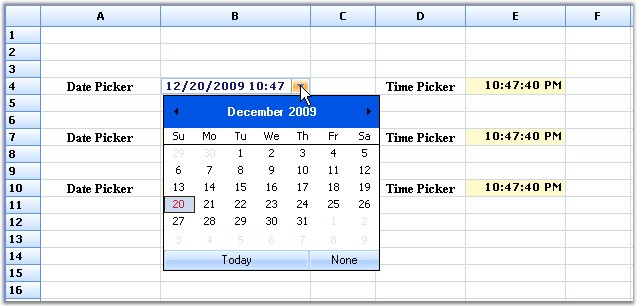{border="0"}

[]{style="FONT-FAMILY: 'Trebuchet MS','sans-serif'; COLOR: #15428b; FONT-SIZE: 9pt"} 

*[Figure ]{style="FONT-SIZE: 9pt"}[462]{style="FONT-SIZE: 9pt"}[: DateTimePicker cell type in Grid Control]{style="FONT-SIZE: 9pt"}*

[]{style="FONT-FAMILY: 'Trebuchet MS','sans-serif'; COLOR: #15428b; FONT-SIZE: 9pt"} 

FnumericUpDown

[]{style="FONT-FAMILY: 'Trebuchet MS','sans-serif'; COLOR: #15428b; FONT-SIZE: 9pt"} 

You can implement a Float Numeric Up Down control in grid cells by using the **FNumericUpDown** cell type. FNumericUpDown cell types can be used by initializing the **FloatNumericUpDownStyleProperties** class for the grid cells. This will allow you set the limitations of the numeric values and several other properties can also be added as follows.

 

The following code example illustrates how to set the grid cell type to FNumericUpDown.

[]{style="FONT-FAMILY: 'Trebuchet MS','sans-serif'; COLOR: #15428b; FONT-SIZE: 9pt"} 

1.   Using C#

[]{style="FONT-FAMILY: 'Trebuchet MS','sans-serif'; COLOR: #15428b; FONT-SIZE: 9pt"} 

+-----------------------------------------------------------------------------------------------------------------------------------------------------------------------------------------------------+
| **[\[C#\]]{style="FONT-FAMILY: 'Courier New'; COLOR: black"}**                                                                                                                                      |
|                                                                                                                                                                                                     |
| []{style="FONT-FAMILY: 'Courier New'; COLOR: black"}                                                                                                                                                |
|                                                                                                                                                                                                     |
| [RegisterCellModel]{style="FONT-FAMILY: 'Courier New'; COLOR: #2b91af"}[.GridCellType(gridControl1, [CustomCellTypes]{style="COLOR: #2b91af"}.FNumericUpDown);]{style="FONT-FAMILY: 'Courier New'"} |
|                                                                                                                                                                                                     |
| [GridStyleInfo]{style="FONT-FAMILY: 'Courier New'; COLOR: #2b91af"}[ style = [this]{style="COLOR: blue"}.gridControl1\[2, 2\];]{style="FONT-FAMILY: 'Courier New'"}                                 |
|                                                                                                                                                                                                     |
| []{style="FONT-FAMILY: 'Courier New'"}                                                                                                                                                              |
|                                                                                                                                                                                                     |
| [// Set up FNumericUpDown Cell. ]{style="FONT-FAMILY: 'Courier New'; COLOR: green"}                                                                                                                 |
|                                                                                                                                                                                                     |
| [style.CellType = [\"FNumericUpDown\"]{style="COLOR: #a31515"};]{style="FONT-FAMILY: 'Courier New'"}                                                                                                |
|                                                                                                                                                                                                     |
| [style.Text = [\"0.5\"]{style="COLOR: #a31515"};]{style="FONT-FAMILY: 'Courier New'"}                                                                                                               |
+-----------------------------------------------------------------------------------------------------------------------------------------------------------------------------------------------------+

[]{style="FONT-FAMILY: 'Trebuchet MS','sans-serif'; COLOR: #15428b; FONT-SIZE: 9pt"} 

2.   Using VB.NET

[]{style="FONT-FAMILY: 'Trebuchet MS','sans-serif'; COLOR: #15428b; FONT-SIZE: 9pt"} 

+-------------------------------------------------------------------------------------------------------------------------------------------------------------------------------------------+
| **[\[VB.NET\]]{style="FONT-FAMILY: 'Courier New'; COLOR: black"}**                                                                                                                        |
|                                                                                                                                                                                           |
| []{style="FONT-FAMILY: 'Courier New'; COLOR: black"}                                                                                                                                      |
|                                                                                                                                                                                           |
| [RegisterCellModel.GridCellType(gridControl1, CustomCellTypes.FNumericUpDown)]{style="FONT-FAMILY: 'Courier New'"}                                                                        |
|                                                                                                                                                                                           |
| [Dim]{style="FONT-FAMILY: 'Courier New'; COLOR: blue"}[ style [As]{style="COLOR: blue"} GridStyleInfo = [Me]{style="COLOR: blue"}.gridControl1(2, 2)]{style="FONT-FAMILY: 'Courier New'"} |
|                                                                                                                                                                                           |
| []{style="FONT-FAMILY: 'Courier New'"}                                                                                                                                                    |
|                                                                                                                                                                                           |
| [\' Set up FNumericUpDown Cell. ]{style="FONT-FAMILY: 'Courier New'; COLOR: green"}                                                                                                       |
|                                                                                                                                                                                           |
| [style.CellType = [\"FNumericUpDown\"]{style="COLOR: #a31515"}]{style="FONT-FAMILY: 'Courier New'"}                                                                                       |
|                                                                                                                                                                                           |
| [style.Text = [\"0.5\"]{style="COLOR: #a31515"}]{style="FONT-FAMILY: 'Courier New'"}                                                                                                      |
+-------------------------------------------------------------------------------------------------------------------------------------------------------------------------------------------+

[]{style="FONT-FAMILY: 'Trebuchet MS','sans-serif'; COLOR: #15428b; FONT-SIZE: 9pt"} 

Following screen shot illustrates FNumericUpDown cell type in the Grid control.

[]{style="FONT-FAMILY: 'Trebuchet MS','sans-serif'; COLOR: #15428b; FONT-SIZE: 9pt"} 

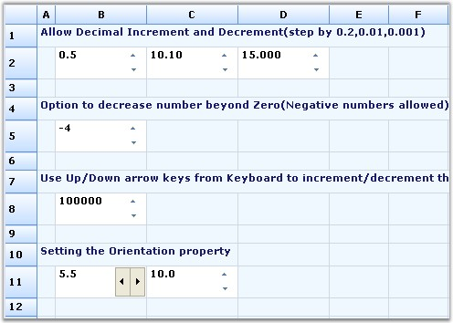{border="0"}

[]{style="FONT-FAMILY: 'Trebuchet MS','sans-serif'; COLOR: #15428b; FONT-SIZE: 9pt"} 

*[Figure ]{style="FONT-SIZE: 9pt"}[463]{style="FONT-SIZE: 9pt"}[: FNumericUpDown cell type in Grid Control]{style="FONT-SIZE: 9pt"}*

[]{style="FONT-FAMILY: 'Trebuchet MS','sans-serif'; COLOR: #15428b; FONT-SIZE: 9pt"} 

GridinCell

[]{style="FONT-FAMILY: 'Trebuchet MS','sans-serif'; COLOR: #15428b; FONT-SIZE: 9pt"} 

The **GridinCell** cell type provides a covered range of cells to embed the grid, which is added as a control to the cells. The registered cell model initializes the range by calculating the size of the grid control to be embedded, and adds styles such as borders and scroll bars to have the control within the range.

 

The following code example illustrates how to set the grid cell type to GridinCell.

[]{style="FONT-FAMILY: 'Trebuchet MS','sans-serif'; COLOR: #15428b; FONT-SIZE: 9pt"} 

1.   Using C#

[]{style="FONT-FAMILY: 'Trebuchet MS','sans-serif'; COLOR: #15428b; FONT-SIZE: 9pt"} 

+-------------------------------------------------------------------------------------------------------------------------------------------------------------------------------------------------+
| **[\[C#\]]{style="FONT-FAMILY: 'Courier New'; COLOR: black"}**                                                                                                                                  |
|                                                                                                                                                                                                 |
| []{style="FONT-FAMILY: 'Courier New'; COLOR: black"}                                                                                                                                            |
|                                                                                                                                                                                                 |
| [RegisterCellModel]{style="FONT-FAMILY: 'Courier New'; COLOR: #2b91af"}[.GridCellType(gridControl1, [CustomCellTypes]{style="COLOR: #2b91af"}.GridinCell);]{style="FONT-FAMILY: 'Courier New'"} |
|                                                                                                                                                                                                 |
| [GridControl]{style="FONT-FAMILY: 'Courier New'; COLOR: #2b91af"}[ grid;]{style="FONT-FAMILY: 'Courier New'"}                                                                                   |
|                                                                                                                                                                                                 |
| [this]{style="FONT-FAMILY: 'Courier New'; COLOR: blue"}[.gridControl1\[3, 2\].CellType = [\"GridinCell\"]{style="COLOR: #a31515"};]{style="FONT-FAMILY: 'Courier New'"}                         |
|                                                                                                                                                                                                 |
| [this]{style="FONT-FAMILY: 'Courier New'; COLOR: blue"}[.gridControl1.CoveredRanges.Add([GridRangeInfo]{style="COLOR: #2b91af"}.Cells(3, 2, 7, 4));]{style="FONT-FAMILY: 'Courier New'"}        |
|                                                                                                                                                                                                 |
| [grid = [new]{style="COLOR: blue"} Syncfusion.GridHelperClasses.[CellEmbeddedGrid]{style="COLOR: #2b91af"}([this]{style="COLOR: blue"}.gridControl1);]{style="FONT-FAMILY: 'Courier New'"}      |
|                                                                                                                                                                                                 |
| [grid.BackColor = [Color]{style="COLOR: #2b91af"}.FromArgb(0xb4, 0xe7, 0xf2);]{style="FONT-FAMILY: 'Courier New'"}                                                                              |
|                                                                                                                                                                                                 |
| [grid.RowCount = 10;]{style="FONT-FAMILY: 'Courier New'"}                                                                                                                                       |
|                                                                                                                                                                                                 |
| [grid.ColCount = 4;]{style="FONT-FAMILY: 'Courier New'"}                                                                                                                                        |
|                                                                                                                                                                                                 |
| [grid\[1, 1\].Text = [\"this is a 10x4 grid\"]{style="COLOR: #a31515"};]{style="FONT-FAMILY: 'Courier New'"}                                                                                    |
|                                                                                                                                                                                                 |
| [grid.ThemesEnabled = [true]{style="COLOR: blue"};]{style="FONT-FAMILY: 'Courier New'"}                                                                                                         |
|                                                                                                                                                                                                 |
| [this]{style="FONT-FAMILY: 'Courier New'; COLOR: blue"}[.gridControl1\[3, 2\].Control = grid;]{style="FONT-FAMILY: 'Courier New'"}                                                              |
|                                                                                                                                                                                                 |
| [this]{style="FONT-FAMILY: 'Courier New'; COLOR: blue"}[.gridControl1.Controls.Add(grid);]{style="FONT-FAMILY: 'Courier New'"}                                                                  |
+-------------------------------------------------------------------------------------------------------------------------------------------------------------------------------------------------+

[]{style="FONT-FAMILY: 'Trebuchet MS','sans-serif'; COLOR: #15428b; FONT-SIZE: 9pt"} 

2.   Using VB.NET

[]{style="FONT-FAMILY: 'Trebuchet MS','sans-serif'; COLOR: #15428b; FONT-SIZE: 9pt"} 

+--------------------------------------------------------------------------------------------------------------------------------------------------------------------+
| **[\[VB.NET\]]{style="FONT-FAMILY: 'Courier New'; COLOR: black"}**                                                                                                 |
|                                                                                                                                                                    |
| []{style="FONT-FAMILY: 'Courier New'; COLOR: black"}                                                                                                               |
|                                                                                                                                                                    |
| [RegisterCellModel.GridCellType(gridControl1, CustomCellTypes.GridinCell)]{style="FONT-FAMILY: 'Courier New'"}                                                     |
|                                                                                                                                                                    |
| [Dim]{style="FONT-FAMILY: 'Courier New'; COLOR: blue"}[ grid [As]{style="COLOR: blue"} GridControl]{style="FONT-FAMILY: 'Courier New'"}                            |
|                                                                                                                                                                    |
| [Me]{style="FONT-FAMILY: 'Courier New'; COLOR: blue"}[.gridControl1(3, 2).CellType = [\"GridinCell\"]{style="COLOR: #a31515"}]{style="FONT-FAMILY: 'Courier New'"} |
|                                                                                                                                                                    |
| [Me]{style="FONT-FAMILY: 'Courier New'; COLOR: blue"}[.gridControl1.CoveredRanges.Add(GridRangeInfo.Cells(3, 2, 7, 4))]{style="FONT-FAMILY: 'Courier New'"}        |
|                                                                                                                                                                    |
| [grid = [New]{style="COLOR: blue"} Syncfusion.GridHelperClasses.CellEmbeddedGrid([Me]{style="COLOR: blue"}.gridControl1)]{style="FONT-FAMILY: 'Courier New'"}      |
|                                                                                                                                                                    |
| [grid.BackColor = Color.FromArgb(&HB4, &HE7, &HF2)]{style="FONT-FAMILY: 'Courier New'"}                                                                            |
|                                                                                                                                                                    |
| [grid.RowCount = 10]{style="FONT-FAMILY: 'Courier New'"}                                                                                                           |
|                                                                                                                                                                    |
| [grid.ColCount = 4]{style="FONT-FAMILY: 'Courier New'"}                                                                                                            |
|                                                                                                                                                                    |
| [grid(1, 1).Text = [\"this is a 10x4 grid\"]{style="COLOR: #a31515"}]{style="FONT-FAMILY: 'Courier New'"}                                                          |
|                                                                                                                                                                    |
| [grid.ThemesEnabled = [True]{style="COLOR: blue"}]{style="FONT-FAMILY: 'Courier New'"}                                                                             |
|                                                                                                                                                                    |
| [Me]{style="FONT-FAMILY: 'Courier New'; COLOR: blue"}[.gridControl1(3, 2).Control = grid]{style="FONT-FAMILY: 'Courier New'"}                                      |
|                                                                                                                                                                    |
| [Me]{style="FONT-FAMILY: 'Courier New'; COLOR: blue"}[.gridControl1.Controls.Add(grid)]{style="FONT-FAMILY: 'Courier New'"}                                        |
+--------------------------------------------------------------------------------------------------------------------------------------------------------------------+

[]{style="FONT-FAMILY: 'Trebuchet MS','sans-serif'; COLOR: #15428b; FONT-SIZE: 9pt"} 

Following screen shot illustrates GridinCell cell type in the Grid control.

[]{style="FONT-FAMILY: 'Trebuchet MS','sans-serif'; COLOR: #15428b; FONT-SIZE: 9pt"} 

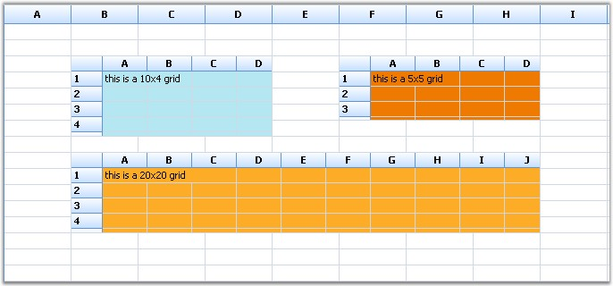{border="0"}

[]{style="FONT-FAMILY: 'Trebuchet MS','sans-serif'; COLOR: #15428b; FONT-SIZE: 9pt"} 

*[Figure ]{style="FONT-SIZE: 9pt"}[464]{style="FONT-SIZE: 9pt"}[: GridinCell cell type in Grid Control]{style="FONT-SIZE: 9pt"}*

[]{style="FONT-FAMILY: 'Trebuchet MS','sans-serif'; COLOR: #15428b; FONT-SIZE: 9pt"} 

LinkLabelCell

[]{style="FONT-FAMILY: 'Trebuchet MS','sans-serif'; COLOR: #15428b; FONT-SIZE: 9pt"} 

The **LinkLabelCell** cell type displays text which can be hyperlinked to a specific location. The path to be hyperlinked is specified by using the **Tag** property.

 

The following code example illustrates how to set the grid cell type to LinkLabelCell.

[]{style="FONT-FAMILY: 'Trebuchet MS','sans-serif'; COLOR: #15428b; FONT-SIZE: 9pt"} 

1.   Using C#

[]{style="FONT-FAMILY: 'Trebuchet MS','sans-serif'; COLOR: #15428b; FONT-SIZE: 9pt"} 

+----------------------------------------------------------------------------------------------------------------------------------------------------------------------------------------------------+
| **[\[C#\]]{style="FONT-FAMILY: 'Courier New'; COLOR: black"}**                                                                                                                                     |
|                                                                                                                                                                                                    |
| []{style="FONT-FAMILY: 'Courier New'; COLOR: black"}                                                                                                                                               |
|                                                                                                                                                                                                    |
| [RegisterCellModel]{style="FONT-FAMILY: 'Courier New'; COLOR: #2b91af"}[.GridCellType(gridControl1, [CustomCellTypes]{style="COLOR: #2b91af"}.LinkLabelCell);]{style="FONT-FAMILY: 'Courier New'"} |
|                                                                                                                                                                                                    |
| [int]{style="FONT-FAMILY: 'Courier New'; COLOR: blue"}[ rowIndex = 5;]{style="FONT-FAMILY: 'Courier New'"}                                                                                         |
|                                                                                                                                                                                                    |
| [gridControl1\[rowIndex, 2\].CellType = [\"LinkLabelCell\"]{style="COLOR: #a31515"};]{style="FONT-FAMILY: 'Courier New'"}                                                                          |
|                                                                                                                                                                                                    |
| [gridControl1\[rowIndex, 2\].Text = [\"Syncfusion, Inc.\"]{style="COLOR: #a31515"};]{style="FONT-FAMILY: 'Courier New'"}                                                                           |
|                                                                                                                                                                                                    |
| [gridControl1\[rowIndex, 2\].Font.Bold = [true]{style="COLOR: blue"};]{style="FONT-FAMILY: 'Courier New'"}                                                                                         |
|                                                                                                                                                                                                    |
| [gridControl1\[rowIndex, 2\].Tag = [\"http://www.syncfusion.com\"]{style="COLOR: #a31515"};]{style="FONT-FAMILY: 'Courier New'"}                                                                   |
|                                                                                                                                                                                                    |
| [gridControl1\[rowIndex, 2\].HorizontalAlignment = [GridHorizontalAlignment]{style="COLOR: #2b91af"}.Center;]{style="FONT-FAMILY: 'Courier New'"}                                                  |
+----------------------------------------------------------------------------------------------------------------------------------------------------------------------------------------------------+

[]{style="FONT-FAMILY: 'Trebuchet MS','sans-serif'; COLOR: #15428b; FONT-SIZE: 9pt"} 

2.   Using VB.NET

[]{style="FONT-FAMILY: 'Trebuchet MS','sans-serif'; COLOR: #15428b; FONT-SIZE: 9pt"} 

+--------------------------------------------------------------------------------------------------------------------------------------------------------------------+
| **[\[VB.NET\]]{style="FONT-FAMILY: 'Courier New'; COLOR: black"}**                                                                                                 |
|                                                                                                                                                                    |
| []{style="FONT-FAMILY: 'Courier New'; COLOR: black"}                                                                                                               |
|                                                                                                                                                                    |
| [RegisterCellModel.GridCellType(gridControl1, CustomCellTypes.LinkLabelCell)]{style="FONT-FAMILY: 'Courier New'"}                                                  |
|                                                                                                                                                                    |
| [Dim]{style="FONT-FAMILY: 'Courier New'; COLOR: blue"}[ rowIndex [As]{style="COLOR: blue"} [Integer]{style="COLOR: blue"} = 5]{style="FONT-FAMILY: 'Courier New'"} |
|                                                                                                                                                                    |
| [gridControl1(rowIndex, 2).CellType = [\"LinkLabelCell\"]{style="COLOR: #a31515"}]{style="FONT-FAMILY: 'Courier New'"}                                             |
|                                                                                                                                                                    |
| [gridControl1(rowIndex, 2).Text = [\"Syncfusion, Inc.\"]{style="COLOR: #a31515"}]{style="FONT-FAMILY: 'Courier New'"}                                              |
|                                                                                                                                                                    |
| [gridControl1(rowIndex, 2).Font.Bold = [True]{style="COLOR: blue"}]{style="FONT-FAMILY: 'Courier New'"}                                                            |
|                                                                                                                                                                    |
| [gridControl1(rowIndex, 2).Tag = [\"http://www.syncfusion.com\"]{style="COLOR: #a31515"}]{style="FONT-FAMILY: 'Courier New'"}                                      |
|                                                                                                                                                                    |
| [gridControl1(rowIndex, 2).HorizontalAlignment = GridHorizontalAlignment.Center]{style="FONT-FAMILY: 'Courier New'"}                                               |
+--------------------------------------------------------------------------------------------------------------------------------------------------------------------+

[]{style="FONT-FAMILY: 'Trebuchet MS','sans-serif'; COLOR: #15428b; FONT-SIZE: 9pt"} 

Following screen shot illustrates LinkLabelCell cell type in the Grid control.

[                                        ]{style="FONT-FAMILY: 'Trebuchet MS','sans-serif'; COLOR: #15428b; FONT-SIZE: 9pt"}

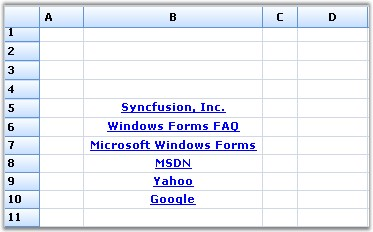{border="0"}

[]{style="FONT-FAMILY: 'Trebuchet MS','sans-serif'; COLOR: #15428b; FONT-SIZE: 9pt"} 

*[Figure ]{style="FONT-SIZE: 9pt"}[465]{style="FONT-SIZE: 9pt"}[: LinkLabelCell cell type in Grid Control]{style="FONT-SIZE: 9pt"}****[]{style="FONT-FAMILY: 'Trebuchet MS','sans-serif'; COLOR: #15428b; FONT-SIZE: 9pt"}***

[]{style="FONT-FAMILY: 'Trebuchet MS','sans-serif'; COLOR: #15428b; FONT-SIZE: 9pt"} 

PictureBox

 

The **PictureBox** cell type can be embedded into a cell by calculating the size of the picture and extending the width and height of the cell accordingly. The **PictureBoxStyleProperties** class is used to specify the style for the Picture Box control.

 

The following code example illustrates how to set the grid cell type to PictureBox.

[]{style="FONT-FAMILY: 'Trebuchet MS','sans-serif'; COLOR: #15428b; FONT-SIZE: 9pt"} 

1.   Using C#

[]{style="FONT-FAMILY: 'Trebuchet MS','sans-serif'; COLOR: #15428b; FONT-SIZE: 9pt"} 

+----------------------------------------------------------------------------------------------------------------------------------------------------------------------------------------------------------------------------------------------------------------------------------------------------------------------------------------+
| **[\[C#\]]{style="FONT-FAMILY: 'Courier New'; COLOR: black"}**                                                                                                                                                                                                                                                                         |
|                                                                                                                                                                                                                                                                                                                                        |
| []{style="FONT-FAMILY: 'Courier New'; COLOR: black"}                                                                                                                                                                                                                                                                                   |
|                                                                                                                                                                                                                                                                                                                                        |
| [RegisterCellModel]{style="FONT-FAMILY: 'Courier New'; COLOR: #2b91af"}[.GridCellType(gridControl1, [CustomCellTypes]{style="COLOR: #2b91af"}.PictureBox);]{style="FONT-FAMILY: 'Courier New'"}                                                                                                                                        |
|                                                                                                                                                                                                                                                                                                                                        |
| [Syncfusion.GridHelperClasses.[PictureBoxStyleProperties]{style="COLOR: #2b91af"} tsp = [new]{style="COLOR: blue"} Syncfusion.GridHelperClasses.[PictureBoxStyleProperties]{style="COLOR: #2b91af"}([new]{style="COLOR: blue"} [GridStyleInfo]{style="COLOR: #2b91af"}(gridControl1.TableStyle));]{style="FONT-FAMILY: 'Courier New'"} |
|                                                                                                                                                                                                                                                                                                                                        |
| [tsp.SizeMode = [PictureBoxSizeMode]{style="COLOR: #2b91af"}.AutoSize;]{style="FONT-FAMILY: 'Courier New'"}                                                                                                                                                                                                                            |
|                                                                                                                                                                                                                                                                                                                                        |
| []{style="FONT-FAMILY: 'Courier New'"}                                                                                                                                                                                                                                                                                                 |
|                                                                                                                                                                                                                                                                                                                                        |
| [Syncfusion.GridHelperClasses.[PictureBoxStyleProperties]{style="COLOR: #2b91af"} sp;]{style="FONT-FAMILY: 'Courier New'"}                                                                                                                                                                                                             |
|                                                                                                                                                                                                                                                                                                                                        |
| []{style="FONT-FAMILY: 'Courier New'"}                                                                                                                                                                                                                                                                                                 |
|                                                                                                                                                                                                                                                                                                                                        |
| [GridStyleInfo]{style="FONT-FAMILY: 'Courier New'; COLOR: #2b91af"}[ style;]{style="FONT-FAMILY: 'Courier New'"}                                                                                                                                                                                                                       |
|                                                                                                                                                                                                                                                                                                                                        |
| []{style="FONT-FAMILY: 'Courier New'"}                                                                                                                                                                                                                                                                                                 |
|                                                                                                                                                                                                                                                                                                                                        |
| [gridControl1.ColWidths\[1\] = 20;]{style="FONT-FAMILY: 'Courier New'"}                                                                                                                                                                                                                                                                |
|                                                                                                                                                                                                                                                                                                                                        |
| []{style="FONT-FAMILY: 'Courier New'"}                                                                                                                                                                                                                                                                                                 |
|                                                                                                                                                                                                                                                                                                                                        |
| [style = gridControl1\[2, 2\];]{style="FONT-FAMILY: 'Courier New'"}                                                                                                                                                                                                                                                                    |
|                                                                                                                                                                                                                                                                                                                                        |
| [style.CellType = [\"PictureBox\"]{style="COLOR: #a31515"};]{style="FONT-FAMILY: 'Courier New'"}                                                                                                                                                                                                                                       |
|                                                                                                                                                                                                                                                                                                                                        |
| []{style="FONT-FAMILY: 'Courier New'"}                                                                                                                                                                                                                                                                                                 |
|                                                                                                                                                                                                                                                                                                                                        |
| [sp = [new]{style="COLOR: blue"} Syncfusion.GridHelperClasses.[PictureBoxStyleProperties]{style="COLOR: #2b91af"}(style);]{style="FONT-FAMILY: 'Courier New'"}                                                                                                                                                                         |
|                                                                                                                                                                                                                                                                                                                                        |
| [sp.Image = GetImage([\"one.jpg\"]{style="COLOR: #a31515"});]{style="FONT-FAMILY: 'Courier New'"}                                                                                                                                                                                                                                      |
+----------------------------------------------------------------------------------------------------------------------------------------------------------------------------------------------------------------------------------------------------------------------------------------------------------------------------------------+

[]{style="FONT-FAMILY: 'Trebuchet MS','sans-serif'; COLOR: #15428b; FONT-SIZE: 9pt"} 

2.   Using VB.NET

[]{style="FONT-FAMILY: 'Trebuchet MS','sans-serif'; COLOR: #15428b; FONT-SIZE: 9pt"} 

+---------------------------------------------------------------------------------------------------------------------------------------------------------------------------------------------------------------------------------------------------------------------------------+
| **[\[VB.NET\]]{style="FONT-FAMILY: 'Courier New'; COLOR: black"}**                                                                                                                                                                                                              |
|                                                                                                                                                                                                                                                                                 |
| []{style="FONT-FAMILY: 'Courier New'; COLOR: black"}                                                                                                                                                                                                                            |
|                                                                                                                                                                                                                                                                                 |
| [RegisterCellModel.GridCellType(gridControl1, CustomCellTypes.PictureBox)]{style="FONT-FAMILY: 'Courier New'"}                                                                                                                                                                  |
|                                                                                                                                                                                                                                                                                 |
| [Dim]{style="FONT-FAMILY: 'Courier New'; COLOR: blue"}[ tsp [As]{style="COLOR: blue"} [New]{style="COLOR: blue"} Syncfusion.GridHelperClasses.PictureBoxStyleProperties([New]{style="COLOR: blue"} GridStyleInfo(gridControl1.TableStyle))]{style="FONT-FAMILY: 'Courier New'"} |
|                                                                                                                                                                                                                                                                                 |
| [tsp.SizeMode = PictureBoxSizeMode.AutoSize]{style="FONT-FAMILY: 'Courier New'"}                                                                                                                                                                                                |
|                                                                                                                                                                                                                                                                                 |
| [Dim]{style="FONT-FAMILY: 'Courier New'; COLOR: blue"}[ sp [As]{style="COLOR: blue"} Syncfusion.GridHelperClasses.PictureBoxStyleProperties]{style="FONT-FAMILY: 'Courier New'"}                                                                                                |
|                                                                                                                                                                                                                                                                                 |
| []{style="FONT-FAMILY: 'Courier New'"}                                                                                                                                                                                                                                          |
|                                                                                                                                                                                                                                                                                 |
| [Dim]{style="FONT-FAMILY: 'Courier New'; COLOR: blue"}[ style [As]{style="COLOR: blue"} GridStyleInfo]{style="FONT-FAMILY: 'Courier New'"}                                                                                                                                      |
|                                                                                                                                                                                                                                                                                 |
| []{style="FONT-FAMILY: 'Courier New'"}                                                                                                                                                                                                                                          |
|                                                                                                                                                                                                                                                                                 |
| [gridControl1.ColWidths(1) = 20]{style="FONT-FAMILY: 'Courier New'"}                                                                                                                                                                                                            |
|                                                                                                                                                                                                                                                                                 |
| []{style="FONT-FAMILY: 'Courier New'"}                                                                                                                                                                                                                                          |
|                                                                                                                                                                                                                                                                                 |
| [style = gridControl1(2, 2)]{style="FONT-FAMILY: 'Courier New'"}                                                                                                                                                                                                                |
|                                                                                                                                                                                                                                                                                 |
| [style.CellType = [\"PictureBox\"]{style="COLOR: #a31515"}]{style="FONT-FAMILY: 'Courier New'"}                                                                                                                                                                                 |
|                                                                                                                                                                                                                                                                                 |
| []{style="FONT-FAMILY: 'Courier New'; COLOR: #a31515"}                                                                                                                                                                                                                          |
|                                                                                                                                                                                                                                                                                 |
| [sp = [New]{style="COLOR: blue"} Syncfusion.GridHelperClasses.PictureBoxStyleProperties(style)]{style="FONT-FAMILY: 'Courier New'"}                                                                                                                                             |
|                                                                                                                                                                                                                                                                                 |
| [sp.Image = GetImage([\"one.jpg\"]{style="COLOR: #a31515"})]{style="FONT-FAMILY: 'Courier New'"}                                                                                                                                                                                |
+---------------------------------------------------------------------------------------------------------------------------------------------------------------------------------------------------------------------------------------------------------------------------------+

[]{style="FONT-FAMILY: 'Trebuchet MS','sans-serif'; COLOR: #15428b; FONT-SIZE: 9pt"} 

Following screen shot illustrates PictureBox cell type in the Grid control.

[]{style="FONT-FAMILY: 'Trebuchet MS','sans-serif'; COLOR: #15428b; FONT-SIZE: 9pt"} 

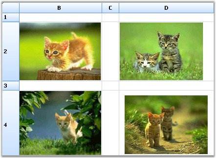{border="0"}

[]{style="FONT-FAMILY: 'Trebuchet MS','sans-serif'; COLOR: #15428b; FONT-SIZE: 9pt"} 

*[Figure ]{style="FONT-SIZE: 9pt"}[466]{style="FONT-SIZE: 9pt"}[: PictureBox cell type in Grid Control]{style="FONT-SIZE: 9pt"}*

 

[]{#p535} 

 

[]{#related-topics}
::::
