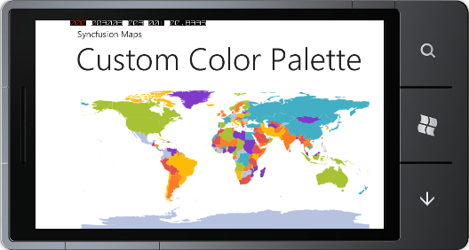

::: {style="DISPLAY: none"}
{#d2h_url_template}{#d2h_package_url style="WIDTH: 0px; DISPLAY: none; HEIGHT: 0px"}
:::

::::: {#nsbanner .d2h_main_nsbanner style="BORDER-BOTTOM: #999999 1px solid; POSITION: relative; PADDING-BOTTOM: 0px; BACKGROUND-COLOR: transparent; PADDING-LEFT: 0px; PADDING-RIGHT: 0px; DISPLAY: none; BORDER-TOP: #999999 1px solid; PADDING-TOP: 0px; LEFT: 0px"}
:::: {#TitleRow .d2h_main_titlerow style="PADDING-BOTTOM: 4px; BACKGROUND-COLOR: transparent; PADDING-LEFT: 22px; WIDTH: 100%; PADDING-RIGHT: 10px; DISPLAY: none; PADDING-TOP: 4px"}
::: {#ienav .d2h_main_ienav style="DISPLAY: none"}
{#D2HPrevious .D2HPreviousEnabled}  {#D2HNext .D2HNextEnabled}
:::
::::
:::::

:::: {#nstext .d2h_main_nstext style="PADDING-BOTTOM: 10px; BACKGROUND-COLOR: transparent; PADDING-LEFT: 22px; PADDING-RIGHT: 10px; HEIGHT: 100%; OVERFLOW: auto; PADDING-TOP: 5px" hasuserbackground="true" valign="bottom"}
::: {#d2h_breadcrumbs .d2h_breadcrumbs}
[Essential Studio User Guide Documentation](ms-xhelp:///?Id=12457748-09e3-4d74-a240-8e049cedf030){.d2h_breadcrumbsNormal}[ \> ]{.d2h_breadcrumbsLinkSeparator}[User Interface Edition](ms-xhelp:///?Id=c29296b7-531c-413b-a0ec-488ca1f7f669){.d2h_breadcrumbsNormal}[ \> ]{.d2h_breadcrumbsLinkSeparator}[Essential Windows Phone](ms-xhelp:///?Id=5ea1999c-4eff-4775-b84e-407dc825f555){.d2h_breadcrumbsNormal}[ \> ]{.d2h_breadcrumbsLinkSeparator}[Essential Maps]{.d2h_breadcrumbsContentsOnly}[ \> ]{.d2h_breadcrumbsLinkSeparator}[Concepts and Features](ms-xhelp:///?Id=fe4335c8-1cb6-47a4-a6f3-e9bc318bba8d){.d2h_breadcrumbsNormal}[ \> ]{.d2h_breadcrumbsLinkSeparator}[ColorPalette Support](ms-xhelp:///?Id=cb213dd2-1c95-4e61-b9bb-d0cd7f869a53){.d2h_breadcrumbsNormal}
:::

### CustomColorPalette {#customcolorpalette style="tab-stops: 0pt"}

 

With *CustomColorPalette*, color palette for the Map can be customized. CurrentMapColorPalette is used to set custom color palette. CurrentMapColorPalette is the collection of MapColorPalette.

The following code illustrates how to apply custom ColorPalette for the Map in code behind.

+-----------------------------------------------------------------------------------------------------------------------------------------------------------------------------------------------------------------------------------------------------------------------------------------------------------------------------------------------------------------------------------------------+
| [\[C#\]]{style="FONT-FAMILY: 'Courier New'"}[ ]{style="FONT-FAMILY: 'Courier New'; COLOR: #2b91af"}                                                                                                                                                                                                                                                                                           |
|                                                                                                                                                                                                                                                                                                                                                                                               |
| [      ]{style="FONT-FAMILY: 'Courier New'; COLOR: #a31515"}[        [MapControl]{style="COLOR: #2b91af"} Map = [new]{style="COLOR: blue"} [MapControl]{style="COLOR: #2b91af"}();]{style="FONT-FAMILY: 'Courier New'"}                                                                                                                                                                       |
|                                                                                                                                                                                                                                                                                                                                                                                               |
| [              Map.EnableColorPalette = [true]{style="COLOR: blue"};]{style="FONT-FAMILY: 'Courier New'"}                                                                                                                                                                                                                                                                                     |
|                                                                                                                                                                                                                                                                                                                                                                                               |
| [              [ShapeFileLayer]{style="COLOR: #2b91af"} shapeLayer = [new]{style="COLOR: blue"} [ShapeFileLayer]{style="COLOR: #2b91af"}();]{style="FONT-FAMILY: 'Courier New'"}                                                                                                                                                                                                              |
|                                                                                                                                                                                                                                                                                                                                                                                               |
| [              shapeLayer.Uri = [\"WindowsPhoneApplication1.ShapeFiles.wv.shp\"]{style="COLOR: #a31515"};]{style="FONT-FAMILY: 'Courier New'"}                                                                                                                                                                                                                                                |
|                                                                                                                                                                                                                                                                                                                                                                                               |
| [              Map.ColorPalette = [ColorPalettes]{style="COLOR: #2b91af"}.CustomColorPalette;]{style="FONT-FAMILY: 'Courier New'"}                                                                                                                                                                                                                                                            |
|                                                                                                                                                                                                                                                                                                                                                                                               |
| [              Map.Layers.Items.Add(shapeLayer);]{style="FONT-FAMILY: 'Courier New'"}                                                                                                                                                                                                                                                                                                         |
|                                                                                                                                                                                                                                                                                                                                                                                               |
| [              Map.LayeredContent = shapeLayer;]{style="FONT-FAMILY: 'Courier New'"}                                                                                                                                                                                                                                                                                                          |
|                                                                                                                                                                                                                                                                                                                                                                                               |
| [              LayoutRoot.Children.Add(map);]{style="FONT-FAMILY: 'Courier New'"}                                                                                                                                                                                                                                                                                                             |
|                                                                                                                                                                                                                                                                                                                                                                                               |
| [                ]{style="FONT-FAMILY: Consolas; COLOR: blue; FONT-SIZE: 9.5pt"}[Map.CurrentMapColorPalette.Add([new]{style="COLOR: blue"} [MapColorPallette]{style="COLOR: #2b91af"} { ShapeFill = conv.ConvertFromString([\"#FFE5514A\"]{style="COLOR: #a31515"}) [as]{style="COLOR: blue"} [SolidColorBrush]{style="COLOR: #2b91af"} });]{style="FONT-FAMILY: Consolas; FONT-SIZE: 9.5pt"} |
|                                                                                                                                                                                                                                                                                                                                                                                               |
| [                Map.CurrentMapColorPalette.Add([new]{style="COLOR: blue"} [MapColorPallette]{style="COLOR: #2b91af"} { ShapeFill = conv.ConvertFromString([\"#FFFF7E23\"]{style="COLOR: #a31515"}) [as]{style="COLOR: blue"} [SolidColorBrush]{style="COLOR: #2b91af"} });]{style="FONT-FAMILY: Consolas; FONT-SIZE: 9.5pt"}                                                                 |
|                                                                                                                                                                                                                                                                                                                                                                                               |
| [                Map.CurrentMapColorPalette.Add([new]{style="COLOR: blue"} [MapColorPallette]{style="COLOR: #2b91af"} { ShapeFill = conv.ConvertFromString([\"#FFFDBB07\"]{style="COLOR: #a31515"}) [as]{style="COLOR: blue"} [SolidColorBrush]{style="COLOR: #2b91af"} });]{style="FONT-FAMILY: Consolas; FONT-SIZE: 9.5pt"}                                                                 |
|                                                                                                                                                                                                                                                                                                                                                                                               |
| [                Map.CurrentMapColorPalette.Add([new]{style="COLOR: blue"} [MapColorPallette]{style="COLOR: #2b91af"} { ShapeFill = conv.ConvertFromString([\"#FFA7C232\"]{style="COLOR: #a31515"}) [as]{style="COLOR: blue"} [SolidColorBrush]{style="COLOR: #2b91af"} });]{style="FONT-FAMILY: Consolas; FONT-SIZE: 9.5pt"}                                                                 |
|                                                                                                                                                                                                                                                                                                                                                                                               |
| [                Map.CurrentMapColorPalette.Add([new]{style="COLOR: blue"} [MapColorPallette]{style="COLOR: #2b91af"} { ShapeFill = conv.ConvertFromString([\"#FFB6C2E0\"]{style="COLOR: #a31515"}) [as]{style="COLOR: blue"} [SolidColorBrush]{style="COLOR: #2b91af"} });]{style="FONT-FAMILY: Consolas; FONT-SIZE: 9.5pt"}                                                                 |
|                                                                                                                                                                                                                                                                                                                                                                                               |
| [                Map.CurrentMapColorPalette.Add([new]{style="COLOR: blue"} [MapColorPallette]{style="COLOR: #2b91af"} { ShapeFill = conv.ConvertFromString([\"#FF803ACA\"]{style="COLOR: #a31515"}) [as]{style="COLOR: blue"} [SolidColorBrush]{style="COLOR: #2b91af"} });]{style="FONT-FAMILY: Consolas; FONT-SIZE: 9.5pt"}                                                                 |
|                                                                                                                                                                                                                                                                                                                                                                                               |
| [                Map.CurrentMapColorPalette.Add([new]{style="COLOR: blue"} [MapColorPallette]{style="COLOR: #2b91af"} { ShapeFill = conv.ConvertFromString([\"#FF42AFC4\"]{style="COLOR: #a31515"}) [as]{style="COLOR: blue"} [SolidColorBrush]{style="COLOR: #2b91af"} });]{style="FONT-FAMILY: Consolas; FONT-SIZE: 9.5pt"}                                                                 |
|                                                                                                                                                                                                                                                                                                                                                                                               |
| [                ]{style="FONT-FAMILY: Consolas; FONT-SIZE: 9.5pt"}[]{style="FONT-FAMILY: 'Courier New'"}                                                                                                                                                                                                                                                                                     |
+-----------------------------------------------------------------------------------------------------------------------------------------------------------------------------------------------------------------------------------------------------------------------------------------------------------------------------------------------------------------------------------------------+

 

{border="0"}

Figure 18: CustomColorPalette

 

 

[]{#related-topics}
::::
