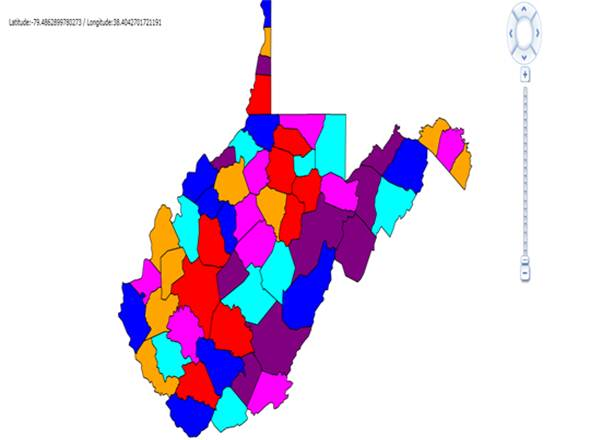

::: {style="DISPLAY: none"}
{#d2h_url_template}{#d2h_package_url style="WIDTH: 0px; DISPLAY: none; HEIGHT: 0px"}
:::

::::: {#nsbanner .d2h_main_nsbanner style="BORDER-BOTTOM: #999999 1px solid; POSITION: relative; PADDING-BOTTOM: 0px; BACKGROUND-COLOR: transparent; PADDING-LEFT: 0px; PADDING-RIGHT: 0px; DISPLAY: none; BORDER-TOP: #999999 1px solid; PADDING-TOP: 0px; LEFT: 0px"}
:::: {#TitleRow .d2h_main_titlerow style="PADDING-BOTTOM: 4px; BACKGROUND-COLOR: transparent; PADDING-LEFT: 22px; WIDTH: 100%; PADDING-RIGHT: 10px; DISPLAY: none; PADDING-TOP: 4px"}
::: {#ienav .d2h_main_ienav style="DISPLAY: none"}
{#D2HPrevious .D2HPreviousEnabled}  {#D2HNext .D2HNextEnabled}
:::
::::
:::::

:::: {#nstext .d2h_main_nstext style="PADDING-BOTTOM: 10px; BACKGROUND-COLOR: transparent; PADDING-LEFT: 22px; PADDING-RIGHT: 10px; HEIGHT: 100%; OVERFLOW: auto; PADDING-TOP: 5px" hasuserbackground="true" valign="bottom"}
::: {#d2h_breadcrumbs .d2h_breadcrumbs}
[Essential Studio User Guide Documentation](ms-xhelp:///?Id=12457748-09e3-4d74-a240-8e049cedf030){.d2h_breadcrumbsNormal}[ \> ]{.d2h_breadcrumbsLinkSeparator}[User Interface Edition](ms-xhelp:///?Id=c29296b7-531c-413b-a0ec-488ca1f7f669){.d2h_breadcrumbsNormal}[ \> ]{.d2h_breadcrumbsLinkSeparator}[Essential WPF](ms-xhelp:///?Id=7f4f82c5-151c-4262-94d0-75c4626c77bc){.d2h_breadcrumbsNormal}[ \> ]{.d2h_breadcrumbsLinkSeparator}[Essential Maps]{.d2h_breadcrumbsContentsOnly}[ \> ]{.d2h_breadcrumbsLinkSeparator}[Concepts and Features](ms-xhelp:///?Id=11705b50-1209-46fb-bfde-18237d32998e){.d2h_breadcrumbsNormal}[ \> ]{.d2h_breadcrumbsLinkSeparator}[ColorPalette Support](ms-xhelp:///?Id=443a50de-31e2-4805-9ffe-9fc440c701aa){.d2h_breadcrumbsNormal}
:::

### CustomColorPalette {#customcolorpalette style="tab-stops: 0pt"}

With CustomColorPalette, the color palette for the Map can be customized. CurrentMapColorPalette is used to set custom color palette. CurrentMapColorPalette is the Collection of MapColorPalette.

{border="0"}

Figure 25: CustomColorPalette

 

 

+-------------------------------------------------------------------------------------------------------------------------------------------------------------------------------------------------------------------------------------------------------------------------------------------------------------------------------------------------------------------------------------------------------------------------------------------------------------+
| **[\[C#\]]{style="FONT-FAMILY: 'Courier New'"}[ ]{style="FONT-FAMILY: Consolas; COLOR: #2b91af; FONT-SIZE: 9.5pt"}**                                                                                                                                                                                                                                                                                                                                        |
|                                                                                                                                                                                                                                                                                                                                                                                                                                                             |
| [      ]{style="FONT-FAMILY: Consolas; COLOR: #a31515; FONT-SIZE: 9.5pt"}[        [MapControl]{style="COLOR: #2b91af"} map = [new]{style="COLOR: blue"} [MapControl]{style="COLOR: #2b91af"}();]{style="FONT-FAMILY: Consolas; FONT-SIZE: 9.5pt"}                                                                                                                                                                                                           |
|                                                                                                                                                                                                                                                                                                                                                                                                                                                             |
| [              map.EnableColorPalette = [true]{style="COLOR: blue"};]{style="FONT-FAMILY: Consolas; FONT-SIZE: 9.5pt"}                                                                                                                                                                                                                                                                                                                                      |
|                                                                                                                                                                                                                                                                                                                                                                                                                                                             |
| [              [ShapeFileLayer]{style="COLOR: #2b91af"} shapeLayer = [new]{style="COLOR: blue"} [ShapeFileLayer]{style="COLOR: #2b91af"}();]{style="FONT-FAMILY: Consolas; FONT-SIZE: 9.5pt"}                                                                                                                                                                                                                                                               |
|                                                                                                                                                                                                                                                                                                                                                                                                                                                             |
| [              shapeLayer.Uri = [\"WpfApplication1.ShapeFiles.wv.shp\"]{style="COLOR: #a31515"};]{style="FONT-FAMILY: Consolas; FONT-SIZE: 9.5pt"}                                                                                                                                                                                                                                                                                                          |
|                                                                                                                                                                                                                                                                                                                                                                                                                                                             |
| [              map.ColorPalette = [ColorPalettes]{style="COLOR: #2b91af"}.CustomColorPalette;]{style="FONT-FAMILY: Consolas; FONT-SIZE: 9.5pt"}                                                                                                                                                                                                                                                                                                             |
|                                                                                                                                                                                                                                                                                                                                                                                                                                                             |
| [              map.Layers.Items.Add(shapeLayer);]{style="FONT-FAMILY: Consolas; FONT-SIZE: 9.5pt"}                                                                                                                                                                                                                                                                                                                                                          |
|                                                                                                                                                                                                                                                                                                                                                                                                                                                             |
| [              map.LayeredContent = shapeLayer;]{style="FONT-FAMILY: Consolas; FONT-SIZE: 9.5pt"}                                                                                                                                                                                                                                                                                                                                                           |
|                                                                                                                                                                                                                                                                                                                                                                                                                                                             |
| [              LayoutRoot.Children.Add(map);]{style="FONT-FAMILY: Consolas; FONT-SIZE: 9.5pt"}                                                                                                                                                                                                                                                                                                                                                              |
|                                                                                                                                                                                                                                                                                                                                                                                                                                                             |
| [              map.CurrentMapColorPalette.Add([new]{style="COLOR: blue"} [MapColorPallette]{style="COLOR: #2b91af"} { PathStroke = [new]{style="COLOR: blue"} [SolidColorBrush]{style="COLOR: #2b91af"}([Colors]{style="COLOR: #2b91af"}.Black), PathStrokeThickness = 1d, ShapeFill = [new]{style="COLOR: blue"} [SolidColorBrush]{style="COLOR: #2b91af"}([Colors]{style="COLOR: #2b91af"}.Cyan) });]{style="FONT-FAMILY: Consolas; FONT-SIZE: 9.5pt"}    |
|                                                                                                                                                                                                                                                                                                                                                                                                                                                             |
| [              map.CurrentMapColorPalette.Add([new]{style="COLOR: blue"} [MapColorPallette]{style="COLOR: #2b91af"} { PathStroke = [new]{style="COLOR: blue"} [SolidColorBrush]{style="COLOR: #2b91af"}([Colors]{style="COLOR: #2b91af"}.Black), PathStrokeThickness = 1d, ShapeFill = [new]{style="COLOR: blue"} [SolidColorBrush]{style="COLOR: #2b91af"}([Colors]{style="COLOR: #2b91af"}.Blue) });]{style="FONT-FAMILY: Consolas; FONT-SIZE: 9.5pt"}    |
|                                                                                                                                                                                                                                                                                                                                                                                                                                                             |
| [              map.CurrentMapColorPalette.Add([new]{style="COLOR: blue"} [MapColorPallette]{style="COLOR: #2b91af"} { PathStroke = [new]{style="COLOR: blue"} [SolidColorBrush]{style="COLOR: #2b91af"}([Colors]{style="COLOR: #2b91af"}.Black), PathStrokeThickness = 1d, ShapeFill = [new]{style="COLOR: blue"} [SolidColorBrush]{style="COLOR: #2b91af"}([Colors]{style="COLOR: #2b91af"}.Orange) });]{style="FONT-FAMILY: Consolas; FONT-SIZE: 9.5pt"}  |
|                                                                                                                                                                                                                                                                                                                                                                                                                                                             |
| [              map.CurrentMapColorPalette.Add([new]{style="COLOR: blue"} [MapColorPallette]{style="COLOR: #2b91af"} { PathStroke = [new]{style="COLOR: blue"} [SolidColorBrush]{style="COLOR: #2b91af"}([Colors]{style="COLOR: #2b91af"}.Black), PathStrokeThickness = 1d, ShapeFill = [new]{style="COLOR: blue"} [SolidColorBrush]{style="COLOR: #2b91af"}([Colors]{style="COLOR: #2b91af"}.Purple) });]{style="FONT-FAMILY: Consolas; FONT-SIZE: 9.5pt"}  |
|                                                                                                                                                                                                                                                                                                                                                                                                                                                             |
| [              map.CurrentMapColorPalette.Add([new]{style="COLOR: blue"} [MapColorPallette]{style="COLOR: #2b91af"} { PathStroke = [new]{style="COLOR: blue"} [SolidColorBrush]{style="COLOR: #2b91af"}([Colors]{style="COLOR: #2b91af"}.Black), PathStrokeThickness = 1d, ShapeFill = [new]{style="COLOR: blue"} [SolidColorBrush]{style="COLOR: #2b91af"}([Colors]{style="COLOR: #2b91af"}.Red) });]{style="FONT-FAMILY: Consolas; FONT-SIZE: 9.5pt"}     |
|                                                                                                                                                                                                                                                                                                                                                                                                                                                             |
| [              map.CurrentMapColorPalette.Add([new]{style="COLOR: blue"} [MapColorPallette]{style="COLOR: #2b91af"} { PathStroke = [new]{style="COLOR: blue"} [SolidColorBrush]{style="COLOR: #2b91af"}([Colors]{style="COLOR: #2b91af"}.Black), PathStrokeThickness = 1d, ShapeFill = [new]{style="COLOR: blue"} [SolidColorBrush]{style="COLOR: #2b91af"}([Colors]{style="COLOR: #2b91af"}.Magenta) });]{style="FONT-FAMILY: Consolas; FONT-SIZE: 9.5pt"} |
|                                                                                                                                                                                                                                                                                                                                                                                                                                                             |
| [       ]{style="FONT-FAMILY: Consolas; FONT-SIZE: 9.5pt"}                                                                                                                                                                                                                                                                                                                                                                                                  |
+-------------------------------------------------------------------------------------------------------------------------------------------------------------------------------------------------------------------------------------------------------------------------------------------------------------------------------------------------------------------------------------------------------------------------------------------------------------+

 

 

 

[]{#related-topics}
::::
