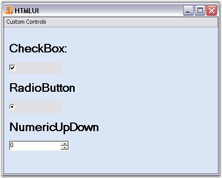

::: {style="DISPLAY: none"}
{#d2h_url_template}{#d2h_package_url style="WIDTH: 0px; DISPLAY: none; HEIGHT: 0px"}
:::

::::: {#nsbanner .d2h_main_nsbanner style="BORDER-BOTTOM: #999999 1px solid; POSITION: relative; PADDING-BOTTOM: 0px; BACKGROUND-COLOR: transparent; PADDING-LEFT: 0px; PADDING-RIGHT: 0px; DISPLAY: none; BORDER-TOP: #999999 1px solid; PADDING-TOP: 0px; LEFT: 0px"}
:::: {#TitleRow .d2h_main_titlerow style="PADDING-BOTTOM: 4px; BACKGROUND-COLOR: transparent; PADDING-LEFT: 22px; WIDTH: 100%; PADDING-RIGHT: 10px; DISPLAY: none; PADDING-TOP: 4px"}
::: {#ienav .d2h_main_ienav style="DISPLAY: none"}
{#D2HPrevious .D2HPreviousEnabled}  {#D2HNext .D2HNextEnabled}
:::
::::
:::::

:::: {#nstext .d2h_main_nstext style="PADDING-BOTTOM: 10px; BACKGROUND-COLOR: transparent; PADDING-LEFT: 22px; PADDING-RIGHT: 10px; HEIGHT: 100%; OVERFLOW: auto; PADDING-TOP: 5px" hasuserbackground="true" valign="bottom"}
::: {#d2h_breadcrumbs .d2h_breadcrumbs}
[Essential Studio User Guide Documentation](ms-xhelp:///?Id=12457748-09e3-4d74-a240-8e049cedf030){.d2h_breadcrumbsNormal}[ \> ]{.d2h_breadcrumbsLinkSeparator}[User Interface Edition](ms-xhelp:///?Id=c29296b7-531c-413b-a0ec-488ca1f7f669){.d2h_breadcrumbsNormal}[ \> ]{.d2h_breadcrumbsLinkSeparator}[Essential Windows](ms-xhelp:///?Id=e60759d8-47a4-4570-9d7a-16a68d63f2ea){.d2h_breadcrumbsNormal}[ \> ]{.d2h_breadcrumbsLinkSeparator}[Essential HTML UI]{.d2h_breadcrumbsContentsOnly}[ \> ]{.d2h_breadcrumbsLinkSeparator}[Concepts And Features](ms-xhelp:///?Id=fcb5d682-601f-4d1c-ae54-299d1cc60ad8){.d2h_breadcrumbsNormal}
:::

## []{style="FONT-SIZE: 10pt"}Custom Controls {#custom-controls style="tab-stops: 0pt"}

[[[]{style="TEXT-DECORATION: none"}]{style="FONT-FAMILY: 'Trebuchet MS','sans-serif'; COLOR: #15428b; FONT-SIZE: 14pt"}]{.underline} 

The Custom Controls are not standard HTML elements but user-defined controls that are created for improving the application\'s richness and productivity.

The **Custom** tag is used to include the custom controls in an HTML document. The custom tag comes with two attributes: **assembly** and **class**.

The **assembly** attribute refers to the namespace where the control is located. The **class** attribute represents the control.

An HTML document containing custom controls is shown below.

[]{style="FONT-FAMILY: 'Trebuchet MS','sans-serif'; COLOR: #15428b; FONT-SIZE: 9pt"} 

+-----------------------------------------------------------------------------------------------------------------------------------------------------------------------------------------------------------------------------------------------------------------------------------------------------------------------------------------------+
| **[\[HTML\]]{style="FONT-FAMILY: 'Courier New'; COLOR: black; FONT-SIZE: 9pt"}**                                                                                                                                                                                                                                                              |
|                                                                                                                                                                                                                                                                                                                                               |
| []{style="FONT-FAMILY: 'Courier New'; COLOR: black; FONT-SIZE: 9pt"}                                                                                                                                                                                                                                                                          |
|                                                                                                                                                                                                                                                                                                                                               |
| [\<]{style="FONT-FAMILY: 'Courier New'; COLOR: blue; FONT-SIZE: 9pt"}[html]{style="FONT-FAMILY: 'Courier New'; COLOR: maroon; FONT-SIZE: 9pt"}[\>]{style="FONT-FAMILY: 'Courier New'; COLOR: blue; FONT-SIZE: 9pt"}                                                                                                                           |
|                                                                                                                                                                                                                                                                                                                                               |
| [\<]{style="FONT-FAMILY: 'Courier New'; COLOR: blue; FONT-SIZE: 9pt"}[body]{style="FONT-FAMILY: 'Courier New'; COLOR: maroon; FONT-SIZE: 9pt"}[\>]{style="FONT-FAMILY: 'Courier New'; COLOR: blue; FONT-SIZE: 9pt"}                                                                                                                           |
|                                                                                                                                                                                                                                                                                                                                               |
| [\<]{style="FONT-FAMILY: 'Courier New'; COLOR: blue; FONT-SIZE: 9pt"}[div]{style="FONT-FAMILY: 'Courier New'; COLOR: maroon; FONT-SIZE: 9pt"}[\>]{style="FONT-FAMILY: 'Courier New'; COLOR: blue; FONT-SIZE: 9pt"}                                                                                                                            |
|                                                                                                                                                                                                                                                                                                                                               |
| [CheckBoxAdv:[\<]{style="COLOR: blue"}[CUSTOM]{style="COLOR: maroon"} [class]{style="COLOR: red"}[=\"Syncfusion.Windows.Forms.Tools.CheckBoxAdv\"]{style="COLOR: blue"} [assembly]{style="COLOR: red"}[=\"Syncfusion.tools.windows\"\>]{style="COLOR: blue"}]{style="FONT-FAMILY: 'Courier New'; FONT-SIZE: 9pt"}                             |
|                                                                                                                                                                                                                                                                                                                                               |
| [\</]{style="FONT-FAMILY: 'Courier New'; COLOR: blue; FONT-SIZE: 9pt"}[CUSTOM]{style="FONT-FAMILY: 'Courier New'; COLOR: maroon; FONT-SIZE: 9pt"}[\>]{style="FONT-FAMILY: 'Courier New'; COLOR: blue; FONT-SIZE: 9pt"}                                                                                                                        |
|                                                                                                                                                                                                                                                                                                                                               |
| [\</]{style="FONT-FAMILY: 'Courier New'; COLOR: blue; FONT-SIZE: 9pt"}[div]{style="FONT-FAMILY: 'Courier New'; COLOR: maroon; FONT-SIZE: 9pt"}[\>]{style="FONT-FAMILY: 'Courier New'; COLOR: blue; FONT-SIZE: 9pt"}[ ]{style="FONT-FAMILY: 'Courier New'; FONT-SIZE: 9pt"}                                                                    |
|                                                                                                                                                                                                                                                                                                                                               |
| [\<]{style="FONT-FAMILY: 'Courier New'; COLOR: blue; FONT-SIZE: 9pt"}[div]{style="FONT-FAMILY: 'Courier New'; COLOR: maroon; FONT-SIZE: 9pt"}[\>]{style="FONT-FAMILY: 'Courier New'; COLOR: blue; FONT-SIZE: 9pt"}                                                                                                                            |
|                                                                                                                                                                                                                                                                                                                                               |
| [NumericUpDown:[\<]{style="COLOR: blue"}[CUSTOM]{style="COLOR: maroon"} [class]{style="COLOR: red"}[=\"NumericUpDown\"]{style="COLOR: blue"} [assembly]{style="COLOR: red"}[=\"System.Windows.Forms\"\>\</]{style="COLOR: blue"}[CUSTOM]{style="COLOR: maroon"}[\>]{style="COLOR: blue"}]{style="FONT-FAMILY: 'Courier New'; FONT-SIZE: 9pt"} |
|                                                                                                                                                                                                                                                                                                                                               |
| [\</]{style="FONT-FAMILY: 'Courier New'; COLOR: blue; FONT-SIZE: 9pt"}[div]{style="FONT-FAMILY: 'Courier New'; COLOR: maroon; FONT-SIZE: 9pt"}[\>]{style="FONT-FAMILY: 'Courier New'; COLOR: blue; FONT-SIZE: 9pt"}[ ]{style="FONT-FAMILY: 'Courier New'; FONT-SIZE: 9pt"}                                                                    |
|                                                                                                                                                                                                                                                                                                                                               |
| [\</]{style="FONT-FAMILY: 'Courier New'; COLOR: blue; FONT-SIZE: 9pt"}[body]{style="FONT-FAMILY: 'Courier New'; COLOR: maroon; FONT-SIZE: 9pt"}[\>]{style="FONT-FAMILY: 'Courier New'; COLOR: blue; FONT-SIZE: 9pt"}[ ]{style="FONT-FAMILY: 'Courier New'; FONT-SIZE: 9pt"}                                                                   |
|                                                                                                                                                                                                                                                                                                                                               |
| [\</]{style="FONT-FAMILY: 'Courier New'; COLOR: blue; FONT-SIZE: 9pt"}[html]{style="FONT-FAMILY: 'Courier New'; COLOR: maroon; FONT-SIZE: 9pt"}[\>]{style="FONT-FAMILY: 'Courier New'; COLOR: blue; FONT-SIZE: 9pt"}                                                                                                                          |
+-----------------------------------------------------------------------------------------------------------------------------------------------------------------------------------------------------------------------------------------------------------------------------------------------------------------------------------------------+

[]{style="FONT-FAMILY: 'Trebuchet MS','sans-serif'; COLOR: #15428b; FONT-SIZE: 9pt"} 

The custom controls defined in the HTML document are interfaced with their equivalent windows forms control with the help of the **PreRenderDocument** event. The PreRenderDocument event occurs at a time when the HTML document is being loaded into the HTMLUI control, but the elements are not yet positioned.

The HTML elements are loaded into an hash table with an equivalent id as their key. An equivalent Base class object, here **BaseElement** class, is defined to link the HTML elements stored in the hash table with the help of the key associated with the element. The BaseElement is the Base class for all HTML elements. All HTML tag elements inherit this class.

The **CustomControlBase** implements the base functionality of the Windows forms control on the HTML tag element.

[]{style="FONT-FAMILY: 'Trebuchet MS','sans-serif'; COLOR: #15428b; FONT-SIZE: 9pt"} 

+-------------------------------------------------------------------------------------------------------------------------------------------------------------------------------------------------------------------------------------------------------------------------------------------------------------------------+
| **[\[C#\]]{style="FONT-FAMILY: 'Courier New'; COLOR: black; FONT-SIZE: 9pt"}**                                                                                                                                                                                                                                          |
|                                                                                                                                                                                                                                                                                                                         |
| **[]{style="FONT-FAMILY: 'Courier New'; COLOR: black; FONT-SIZE: 9pt"}**                                                                                                                                                                                                                                                |
|                                                                                                                                                                                                                                                                                                                         |
| [private]{style="FONT-FAMILY: 'Courier New'; COLOR: blue; FONT-SIZE: 9pt"}[ [void]{style="COLOR: blue"} htmluiControl1_PreRenderDocument([object]{style="COLOR: blue"} sender, Syncfusion.Windows.Forms.HTMLUI.[PreRenderDocumentArgs]{style="COLOR: #2b91af"} e) ]{style="FONT-FAMILY: 'Courier New'; FONT-SIZE: 9pt"} |
|                                                                                                                                                                                                                                                                                                                         |
| [{ ]{style="FONT-FAMILY: 'Courier New'; FONT-SIZE: 9pt"}                                                                                                                                                                                                                                                                |
|                                                                                                                                                                                                                                                                                                                         |
| [Hashtable]{style="FONT-FAMILY: 'Courier New'; COLOR: #2b91af; FONT-SIZE: 9pt"}[ htmlelements = [new]{style="COLOR: blue"} [Hashtable]{style="COLOR: #2b91af"}(); ]{style="FONT-FAMILY: 'Courier New'; FONT-SIZE: 9pt"}                                                                                                 |
|                                                                                                                                                                                                                                                                                                                         |
| [htmlelements = e.Document.ElementsByUserID; ]{style="FONT-FAMILY: 'Courier New'; FONT-SIZE: 9pt"}                                                                                                                                                                                                                      |
|                                                                                                                                                                                                                                                                                                                         |
| []{style="FONT-FAMILY: 'Courier New'; FONT-SIZE: 9pt"}                                                                                                                                                                                                                                                                  |
|                                                                                                                                                                                                                                                                                                                         |
| [// Here the base functionality of the \'this.checkBoxAdv1\' is implemented to the \'checkBoxAdvElement1\'. ]{style="FONT-FAMILY: 'Courier New'; COLOR: green; FONT-SIZE: 9pt"}                                                                                                                                         |
|                                                                                                                                                                                                                                                                                                                         |
| [BaseElement]{style="FONT-FAMILY: 'Courier New'; COLOR: #2b91af; FONT-SIZE: 9pt"}[ CheckBoxAdvElement1 = htmlelements\[[\"CheckBoxAdv\"]{style="COLOR: #a31515"}\] [as]{style="COLOR: blue"} [BaseElement]{style="COLOR: #2b91af"};]{style="FONT-FAMILY: 'Courier New'; FONT-SIZE: 9pt"}                                |
|                                                                                                                                                                                                                                                                                                                         |
| []{style="FONT-FAMILY: 'Courier New'; FONT-SIZE: 9pt"}                                                                                                                                                                                                                                                                  |
|                                                                                                                                                                                                                                                                                                                         |
| [// Create a new Wrapper object.]{style="FONT-FAMILY: 'Courier New'; COLOR: green; FONT-SIZE: 9pt"}                                                                                                                                                                                                                     |
|                                                                                                                                                                                                                                                                                                                         |
| [new]{style="FONT-FAMILY: 'Courier New'; COLOR: blue; FONT-SIZE: 9pt"}[ [CustomControlBase]{style="COLOR: #2b91af"}( CheckBoxAdvElement1, [this]{style="COLOR: blue"}.CheckBoxAdv1 ); ]{style="FONT-FAMILY: 'Courier New'; FONT-SIZE: 9pt"}                                                                             |
|                                                                                                                                                                                                                                                                                                                         |
| [BaseElement]{style="FONT-FAMILY: 'Courier New'; COLOR: #2b91af; FONT-SIZE: 9pt"}[ NumericUpDownElement = htmlelements\[[\"NumericUpDown\"]{style="COLOR: #a31515"}\] [as]{style="COLOR: blue"} [BaseElement]{style="COLOR: #2b91af"}; ]{style="FONT-FAMILY: 'Courier New'; FONT-SIZE: 9pt"}                            |
|                                                                                                                                                                                                                                                                                                                         |
| [new]{style="FONT-FAMILY: 'Courier New'; COLOR: blue; FONT-SIZE: 9pt"}[ [CustomControlBase]{style="COLOR: #2b91af"}( NumericUpDownElement, [this]{style="COLOR: blue"}.NumericUpDown1 ); ]{style="FONT-FAMILY: 'Courier New'; FONT-SIZE: 9pt"}                                                                          |
|                                                                                                                                                                                                                                                                                                                         |
| [}]{style="FONT-FAMILY: 'Courier New'; FONT-SIZE: 9pt"}                                                                                                                                                                                                                                                                 |
+-------------------------------------------------------------------------------------------------------------------------------------------------------------------------------------------------------------------------------------------------------------------------------------------------------------------------+

[]{style="FONT-FAMILY: 'Trebuchet MS','sans-serif'; COLOR: #15428b; FONT-SIZE: 9pt"} 

+--------------------------------------------------------------------------------------------------------------------------------------------------------------------------------------------------------------------------------------------------------------------------------------------------------------------------------------------------------------------------------------------------------------------------------------------------------------------+
| **[\[VB.NET\]]{style="FONT-FAMILY: 'Courier New'; COLOR: black; FONT-SIZE: 9pt"}**                                                                                                                                                                                                                                                                                                                                                                                 |
|                                                                                                                                                                                                                                                                                                                                                                                                                                                                    |
| **[]{style="FONT-FAMILY: 'Courier New'; COLOR: black; FONT-SIZE: 9pt"}**                                                                                                                                                                                                                                                                                                                                                                                           |
|                                                                                                                                                                                                                                                                                                                                                                                                                                                                    |
| [Private]{style="FONT-FAMILY: 'Courier New'; COLOR: blue; FONT-SIZE: 9pt"}[ [Sub]{style="COLOR: blue"} htmluiControl1_PreRenderDocument([ByVal]{style="COLOR: blue"} sender [As]{style="COLOR: blue"} [Object]{style="COLOR: blue"}, [ByVal]{style="COLOR: blue"} e [As]{style="COLOR: blue"} Syncfusion.Windows.Forms.HTMLUI.PreRenderDocumentArgs)]{style="FONT-FAMILY: 'Courier New'; FONT-SIZE: 9pt"}                                                          |
|                                                                                                                                                                                                                                                                                                                                                                                                                                                                    |
| [Dim]{style="FONT-FAMILY: 'Courier New'; COLOR: blue; FONT-SIZE: 9pt"}[ htmlelements [As]{style="COLOR: blue"} Hashtable = [New]{style="COLOR: blue"} Hashtable()]{style="FONT-FAMILY: 'Courier New'; FONT-SIZE: 9pt"}                                                                                                                                                                                                                                             |
|                                                                                                                                                                                                                                                                                                                                                                                                                                                                    |
| [htmlelements = e.Document.ElementsByUserID]{style="FONT-FAMILY: 'Courier New'; FONT-SIZE: 9pt"}                                                                                                                                                                                                                                                                                                                                                                   |
|                                                                                                                                                                                                                                                                                                                                                                                                                                                                    |
| []{style="FONT-FAMILY: 'Courier New'; FONT-SIZE: 9pt"}                                                                                                                                                                                                                                                                                                                                                                                                             |
|                                                                                                                                                                                                                                                                                                                                                                                                                                                                    |
| [\' Here the base functionality of the \'this.checkBoxAdv1\' is implemented to the \'checkBoxAdvElement1\'. ]{style="FONT-FAMILY: 'Courier New'; COLOR: green; FONT-SIZE: 9pt"}                                                                                                                                                                                                                                                                                    |
|                                                                                                                                                                                                                                                                                                                                                                                                                                                                    |
| [Dim]{style="FONT-FAMILY: 'Courier New'; COLOR: blue; FONT-SIZE: 9pt"}[ CheckBoxAdvElement1 [As]{style="COLOR: blue"} BaseElement = [CType]{style="COLOR: blue"}(IIf([TypeOf]{style="COLOR: blue"} htmlelements([\"CheckBoxAdv\"]{style="COLOR: #a31515"}) [Is]{style="COLOR: blue"} BaseElement, htmlelements([\"CheckBoxAdv\"]{style="COLOR: #a31515"}), [Nothing]{style="COLOR: blue"}), BaseElement)]{style="FONT-FAMILY: 'Courier New'; FONT-SIZE: 9pt"}      |
|                                                                                                                                                                                                                                                                                                                                                                                                                                                                    |
| []{style="FONT-FAMILY: 'Courier New'; FONT-SIZE: 9pt"}                                                                                                                                                                                                                                                                                                                                                                                                             |
|                                                                                                                                                                                                                                                                                                                                                                                                                                                                    |
| [\' Create a new Wrapper object.]{style="FONT-FAMILY: 'Courier New'; COLOR: green; FONT-SIZE: 9pt"}                                                                                                                                                                                                                                                                                                                                                                |
|                                                                                                                                                                                                                                                                                                                                                                                                                                                                    |
| [Dim]{style="FONT-FAMILY: 'Courier New'; COLOR: blue; FONT-SIZE: 9pt"}[ oTemp1 [As]{style="COLOR: blue"} CustomControlBase = [New]{style="COLOR: blue"} CustomControlBase(CheckBoxAdvElement1, [Me]{style="COLOR: blue"}.CheckBoxAdv1)]{style="FONT-FAMILY: 'Courier New'; FONT-SIZE: 9pt"}                                                                                                                                                                        |
|                                                                                                                                                                                                                                                                                                                                                                                                                                                                    |
| [Dim]{style="FONT-FAMILY: 'Courier New'; COLOR: blue; FONT-SIZE: 9pt"}[ NumericUpDownElement [As]{style="COLOR: blue"} BaseElement = [CType]{style="COLOR: blue"}(IIf([TypeOf]{style="COLOR: blue"} htmlelements([\"NumericUpDown\"]{style="COLOR: #a31515"}) [Is]{style="COLOR: blue"} BaseElement, htmlelements([\"NumericUpDown\"]{style="COLOR: #a31515"}), [Nothing]{style="COLOR: blue"}), BaseElement)]{style="FONT-FAMILY: 'Courier New'; FONT-SIZE: 9pt"} |
|                                                                                                                                                                                                                                                                                                                                                                                                                                                                    |
| [Dim]{style="FONT-FAMILY: 'Courier New'; COLOR: blue; FONT-SIZE: 9pt"}[ oTemp2 [As]{style="COLOR: blue"} CustomControlBase = [New]{style="COLOR: blue"} CustomControlBase(NumericUpDownElement, [Me]{style="COLOR: blue"}.NumericUpDown1)]{style="FONT-FAMILY: 'Courier New'; FONT-SIZE: 9pt"}                                                                                                                                                                     |
|                                                                                                                                                                                                                                                                                                                                                                                                                                                                    |
| [End]{style="FONT-FAMILY: 'Courier New'; COLOR: blue; FONT-SIZE: 9pt"}[ [Sub]{style="COLOR: blue"}]{style="FONT-FAMILY: 'Courier New'; FONT-SIZE: 9pt"}                                                                                                                                                                                                                                                                                                            |
+--------------------------------------------------------------------------------------------------------------------------------------------------------------------------------------------------------------------------------------------------------------------------------------------------------------------------------------------------------------------------------------------------------------------------------------------------------------------+

[]{style="FONT-FAMILY: 'Trebuchet MS','sans-serif'; COLOR: #15428b; FONT-SIZE: 9pt"} 

The following image illustrates three custom controls created using HTMLUI.

[]{style="FONT-FAMILY: 'Trebuchet MS','sans-serif'; COLOR: #15428b; FONT-SIZE: 9pt"} 

                            {border="0"}

***[]{style="FONT-FAMILY: 'Trebuchet MS','sans-serif'; COLOR: #15428b; FONT-SIZE: 9pt"}*** 

Figure 28: Custom Controls created by using the HTMLUI Control

 

More:

[ ]{#related-topics}

[{border="0" align="absMiddle"}Custom Controls Sample](ms-xhelp:///?Id=823e374a-a324-42ed-93c6-42d74cf38baf){style="TEXT-DECORATION: none"}
::::
