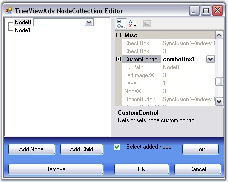
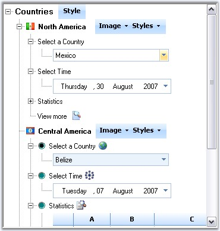

::: {style="DISPLAY: none"}
{#d2h_url_template}{#d2h_package_url style="WIDTH: 0px; DISPLAY: none; HEIGHT: 0px"}
:::

::: {.d2h_secondary_topic style="PADDING-BOTTOM: 10pt; MARGIN: 0pt; PADDING-LEFT: 0pt; PADDING-RIGHT: 0pt; PADDING-TOP: 0pt"}
##### Custom Controls {#custom-controls style="MARGIN-LEFT: 18pt; tab-stops: 18.0pt"}

[]{style="COLOR: #15428b"} 

Tree Nodes can hold controls using this Custom Controls feature. This widens the functionality and view of the Tree nodes. With this feature, the nodes can hold controls like combo box, Calendar, Chart etc.,

 

Any custom control can be dragged and dropped to the form and selected using TreeNodeAdv.CustomControls property

[]{style="COLOR: #15428b"} 

{border="0"}

[]{style="COLOR: #15428b"} 

Figure 1130: Selecting CustomControl (ComboBox) for Node0

[]{style="COLOR: #15428b"} 

We can also add functionality based on the changes made to the CustomControls.

[]{style="COLOR: #15428b"} 

[{border="0"}]{style="COLOR: #15428b"}[]{style="COLOR: #15428b"}

**[]{style="COLOR: #15428b"}** 

Figure 1131: Tree sample with different Custom Controls added to the Nodes

[]{style="COLOR: #15428b"} 

A sample which demonstrates Custom Controls feature is available in the below sample installation location. This sample illustrates adding functionality based on the changes to the custom controls.

 

***..\\My Documents\\Syncfusion\\EssentialStudio\\Version Number\\Windows\\Tools.Windows\\Samples\\2.0\\Tree Package\\CustomControls***

 

 

 

 

 

[]{#related-topics}
:::
