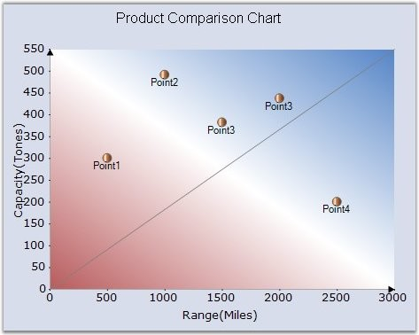

::: {style="DISPLAY: none"}
{#d2h_url_template}{#d2h_package_url style="WIDTH: 0px; DISPLAY: none; HEIGHT: 0px"}
:::

::::: {#nsbanner .d2h_main_nsbanner style="BORDER-BOTTOM: #999999 1px solid; POSITION: relative; PADDING-BOTTOM: 0px; BACKGROUND-COLOR: transparent; PADDING-LEFT: 0px; PADDING-RIGHT: 0px; DISPLAY: none; BORDER-TOP: #999999 1px solid; PADDING-TOP: 0px; LEFT: 0px"}
:::: {#TitleRow .d2h_main_titlerow style="PADDING-BOTTOM: 4px; BACKGROUND-COLOR: transparent; PADDING-LEFT: 22px; WIDTH: 100%; PADDING-RIGHT: 10px; DISPLAY: none; PADDING-TOP: 4px"}
::: {#ienav .d2h_main_ienav style="DISPLAY: none"}
{#D2HPrevious .D2HPreviousEnabled}  {#D2HNext .D2HNextEnabled}
:::
::::
:::::

:::: {#nstext .d2h_main_nstext style="PADDING-BOTTOM: 10px; BACKGROUND-COLOR: transparent; PADDING-LEFT: 22px; PADDING-RIGHT: 10px; HEIGHT: 100%; OVERFLOW: auto; PADDING-TOP: 5px" hasuserbackground="true" valign="bottom"}
::: {#d2h_breadcrumbs .d2h_breadcrumbs}
[Essential Studio User Guide Documentation](ms-xhelp:///?Id=12457748-09e3-4d74-a240-8e049cedf030){.d2h_breadcrumbsNormal}[ \> ]{.d2h_breadcrumbsLinkSeparator}[User Interface Edition](ms-xhelp:///?Id=c29296b7-531c-413b-a0ec-488ca1f7f669){.d2h_breadcrumbsNormal}[ \> ]{.d2h_breadcrumbsLinkSeparator}[Essential Windows](ms-xhelp:///?Id=e60759d8-47a4-4570-9d7a-16a68d63f2ea){.d2h_breadcrumbsNormal}[ \> ]{.d2h_breadcrumbsLinkSeparator}[Essential Chart]{.d2h_breadcrumbsContentsOnly}[ \> ]{.d2h_breadcrumbsLinkSeparator}[Concepts and Features](ms-xhelp:///?Id=71321e9c-336c-4c1c-a127-be9f135ad4bb){.d2h_breadcrumbsNormal}[ \> ]{.d2h_breadcrumbsLinkSeparator}[Chart Appearance](ms-xhelp:///?Id=eb9d5ffd-71db-4613-9396-75dd4913dca1){.d2h_breadcrumbsNormal}
:::

### Custom Drawing {#custom-drawing style="tab-stops: 0pt"}

 

Essential Chart lets you render any data on the chart area. If the built-in features and functionality are not sufficient you can simply draw whatever you want on the chart surface.

 

You can do so by listening to the **ChartAreaPaint** event. This event is raised both when a chart is painted as well as when the chart is exported to other image formats, SVG, etc. Remember to do your custom drawing in this event instead of in the **Paint** event (which will not be called during chart export).

 

+-------------------------------------------------------------------------------------------------------------------------------------------------------------------------------------------------------------------------------------------------------------------------------------------------------+
| **[\[C#\]]{style="FONT-FAMILY: 'Courier New'; COLOR: black"}**                                                                                                                                                                                                                                        |
|                                                                                                                                                                                                                                                                                                       |
| []{style="FONT-FAMILY: 'Courier New'; COLOR: black"}                                                                                                                                                                                                                                                  |
|                                                                                                                                                                                                                                                                                                       |
| [private]{style="FONT-FAMILY: 'Courier New'; COLOR: blue"}[ [void]{style="COLOR: blue"} chartControl1_ChartAreaPaint([object]{style="COLOR: blue"} sender, PaintEventArgs e)]{style="FONT-FAMILY: 'Courier New'"}                                                                                     |
|                                                                                                                                                                                                                                                                                                       |
| [{]{style="FONT-FAMILY: 'Courier New'"}                                                                                                                                                                                                                                                               |
|                                                                                                                                                                                                                                                                                                       |
| [    [// Get the right end of the X axis]{style="COLOR: green"}]{style="FONT-FAMILY: 'Courier New'"}                                                                                                                                                                                                  |
|                                                                                                                                                                                                                                                                                                       |
| [    Point ptX = [this]{style="COLOR: blue"}.chartControl1.ChartArea.GetPointByValue([new]{style="COLOR: blue"} ChartPoint([this]{style="COLOR: blue"}.chartControl1.PrimaryXAxis.Range.Max, [this]{style="COLOR: blue"}.chartControl1.PrimaryYAxis.Range.Min));]{style="FONT-FAMILY: 'Courier New'"} |
|                                                                                                                                                                                                                                                                                                       |
| []{style="FONT-FAMILY: 'Courier New'"}                                                                                                                                                                                                                                                                |
|                                                                                                                                                                                                                                                                                                       |
| [    PointF ptX1 = [new]{style="COLOR: blue"} PointF(ptX.X - 7, ptX.Y - 4);]{style="FONT-FAMILY: 'Courier New'"}                                                                                                                                                                                      |
|                                                                                                                                                                                                                                                                                                       |
| [    PointF ptX2 = [new]{style="COLOR: blue"} PointF(ptX.X, ptX.Y);]{style="FONT-FAMILY: 'Courier New'"}                                                                                                                                                                                              |
|                                                                                                                                                                                                                                                                                                       |
| [    PointF ptX3 = [new]{style="COLOR: blue"} PointF(ptX.X - 7, ptX.Y + 4);]{style="FONT-FAMILY: 'Courier New'"}                                                                                                                                                                                      |
|                                                                                                                                                                                                                                                                                                       |
| []{style="FONT-FAMILY: 'Courier New'"}                                                                                                                                                                                                                                                                |
|                                                                                                                                                                                                                                                                                                       |
| [    [// Draws an arrow at the end of the X axis]{style="COLOR: green"}]{style="FONT-FAMILY: 'Courier New'"}                                                                                                                                                                                          |
|                                                                                                                                                                                                                                                                                                       |
| [    e.Graphics.FillPolygon(Brushes.Black, [new]{style="COLOR: blue"} PointF\[\] { ptX1, ptX2, ptX3 });]{style="FONT-FAMILY: 'Courier New'"}                                                                                                                                                          |
|                                                                                                                                                                                                                                                                                                       |
| []{style="FONT-FAMILY: 'Courier New'"}                                                                                                                                                                                                                                                                |
|                                                                                                                                                                                                                                                                                                       |
| [    [// Get the top end of the Y axis]{style="COLOR: green"}]{style="FONT-FAMILY: 'Courier New'"}                                                                                                                                                                                                    |
|                                                                                                                                                                                                                                                                                                       |
| [    Point ptY = [this]{style="COLOR: blue"}.chartControl1.ChartArea.GetPointByValue([new]{style="COLOR: blue"} ChartPoint([this]{style="COLOR: blue"}.chartControl1.PrimaryXAxis.Range.Min, [this]{style="COLOR: blue"}.chartControl1.PrimaryYAxis.Range.Max));]{style="FONT-FAMILY: 'Courier New'"} |
|                                                                                                                                                                                                                                                                                                       |
| []{style="FONT-FAMILY: 'Courier New'"}                                                                                                                                                                                                                                                                |
|                                                                                                                                                                                                                                                                                                       |
| [    PointF ptY1 = [new]{style="COLOR: blue"} PointF(ptY.X - 4, ptY.Y + 7);]{style="FONT-FAMILY: 'Courier New'"}                                                                                                                                                                                      |
|                                                                                                                                                                                                                                                                                                       |
| [    PointF ptY2 = [new]{style="COLOR: blue"} PointF(ptY.X, ptY.Y);]{style="FONT-FAMILY: 'Courier New'"}                                                                                                                                                                                              |
|                                                                                                                                                                                                                                                                                                       |
| [    PointF ptY3 = [new]{style="COLOR: blue"} PointF(ptY.X + 4, ptY.Y + 7);]{style="FONT-FAMILY: 'Courier New'"}                                                                                                                                                                                      |
|                                                                                                                                                                                                                                                                                                       |
| []{style="FONT-FAMILY: 'Courier New'"}                                                                                                                                                                                                                                                                |
|                                                                                                                                                                                                                                                                                                       |
| [    [// Draws an arrow at the top of the Y Axis.]{style="COLOR: green"}]{style="FONT-FAMILY: 'Courier New'"}                                                                                                                                                                                         |
|                                                                                                                                                                                                                                                                                                       |
| [    e.Graphics.FillPolygon(Brushes.Black, [new]{style="COLOR: blue"} PointF\[\] { ptY1, ptY2, ptY3 });]{style="FONT-FAMILY: 'Courier New'"}                                                                                                                                                          |
|                                                                                                                                                                                                                                                                                                       |
| []{style="FONT-FAMILY: 'Courier New'"}                                                                                                                                                                                                                                                                |
|                                                                                                                                                                                                                                                                                                       |
| [    [// Draws a line through the center of the chart.]{style="COLOR: green"}]{style="FONT-FAMILY: 'Courier New'"}                                                                                                                                                                                    |
|                                                                                                                                                                                                                                                                                                       |
| [    e.Graphics.DrawLine(Pens.Gray, ptY.X, ptX.Y, ptX.X, ptY.Y);]{style="FONT-FAMILY: 'Courier New'"}                                                                                                                                                                                                 |
|                                                                                                                                                                                                                                                                                                       |
| [}]{style="FONT-FAMILY: 'Courier New'"}                                                                                                                                                                                                                                                               |
+-------------------------------------------------------------------------------------------------------------------------------------------------------------------------------------------------------------------------------------------------------------------------------------------------------+

 

+-----------------------------------------------------------------------------------------------------------------------------------------------------------------------------------------------------------------------------------------------------------------------------------------------------------------------------------------------------+
| **[\[VB.NET\]]{style="FONT-FAMILY: 'Courier New'; COLOR: black"}**                                                                                                                                                                                                                                                                                  |
|                                                                                                                                                                                                                                                                                                                                                     |
| []{style="FONT-FAMILY: 'Courier New'"}                                                                                                                                                                                                                                                                                                              |
|                                                                                                                                                                                                                                                                                                                                                     |
| [Private]{style="FONT-FAMILY: 'Courier New'; COLOR: blue"}[ [Sub]{style="COLOR: blue"} chartControl1_ChartAreaPaint([ByVal]{style="COLOR: blue"} sender [As]{style="COLOR: blue"} [Object]{style="COLOR: blue"}, [ByVal]{style="COLOR: blue"} e [As]{style="COLOR: blue"} PaintEventArgs)]{style="FONT-FAMILY: 'Courier New'"}                      |
|                                                                                                                                                                                                                                                                                                                                                     |
| [    [\' Get the right end of the X axis ]{style="COLOR: green"}]{style="FONT-FAMILY: 'Courier New'"}                                                                                                                                                                                                                                               |
|                                                                                                                                                                                                                                                                                                                                                     |
| [    [Dim]{style="COLOR: blue"} ptX [As]{style="COLOR: blue"} Point = [Me]{style="COLOR: blue"}.chartControl1.ChartArea.GetPointByValue([New]{style="COLOR: blue"} ChartPoint([Me]{style="COLOR: blue"}.chartControl1.PrimaryXAxis.Range.Max, [Me]{style="COLOR: blue"}.chartControl1.PrimaryYAxis.Range.Min))]{style="FONT-FAMILY: 'Courier New'"} |
|                                                                                                                                                                                                                                                                                                                                                     |
| []{style="FONT-FAMILY: 'Courier New'"}                                                                                                                                                                                                                                                                                                              |
|                                                                                                                                                                                                                                                                                                                                                     |
| [    [Dim]{style="COLOR: blue"} ptX1 [As]{style="COLOR: blue"} [New]{style="COLOR: blue"} PointF(ptX.X - 7, ptX.Y - 4)]{style="FONT-FAMILY: 'Courier New'"}                                                                                                                                                                                         |
|                                                                                                                                                                                                                                                                                                                                                     |
| [    [Dim]{style="COLOR: blue"} ptX2 [As]{style="COLOR: blue"} [New]{style="COLOR: blue"} PointF(ptX.X, ptX.Y)]{style="FONT-FAMILY: 'Courier New'"}                                                                                                                                                                                                 |
|                                                                                                                                                                                                                                                                                                                                                     |
| [    [Dim]{style="COLOR: blue"} ptX3 [As]{style="COLOR: blue"} [New]{style="COLOR: blue"} PointF(ptX.X - 7, ptX.Y + 4)]{style="FONT-FAMILY: 'Courier New'"}                                                                                                                                                                                         |
|                                                                                                                                                                                                                                                                                                                                                     |
| []{style="FONT-FAMILY: 'Courier New'"}                                                                                                                                                                                                                                                                                                              |
|                                                                                                                                                                                                                                                                                                                                                     |
| [    [\' Draws an arrow at the end of the X axis ]{style="COLOR: green"}]{style="FONT-FAMILY: 'Courier New'"}                                                                                                                                                                                                                                       |
|                                                                                                                                                                                                                                                                                                                                                     |
| [    e.Graphics.FillPolygon(Brushes.Black, [New]{style="COLOR: blue"} PointF() {ptX1, ptX2, ptX3})]{style="FONT-FAMILY: 'Courier New'"}                                                                                                                                                                                                             |
|                                                                                                                                                                                                                                                                                                                                                     |
| []{style="FONT-FAMILY: 'Courier New'"}                                                                                                                                                                                                                                                                                                              |
|                                                                                                                                                                                                                                                                                                                                                     |
| [    [\' Get the top end of the Y axis ]{style="COLOR: green"}]{style="FONT-FAMILY: 'Courier New'"}                                                                                                                                                                                                                                                 |
|                                                                                                                                                                                                                                                                                                                                                     |
| [    [Dim]{style="COLOR: blue"} ptY [As]{style="COLOR: blue"} Point = [Me]{style="COLOR: blue"}.chartControl1.ChartArea.GetPointByValue([New]{style="COLOR: blue"} ChartPoint([Me]{style="COLOR: blue"}.chartControl1.PrimaryXAxis.Range.Min, [Me]{style="COLOR: blue"}.chartControl1.PrimaryYAxis.Range.Max))]{style="FONT-FAMILY: 'Courier New'"} |
|                                                                                                                                                                                                                                                                                                                                                     |
| []{style="FONT-FAMILY: 'Courier New'"}                                                                                                                                                                                                                                                                                                              |
|                                                                                                                                                                                                                                                                                                                                                     |
| [    [Dim]{style="COLOR: blue"} ptY1 [As]{style="COLOR: blue"} [New]{style="COLOR: blue"} PointF(ptY.X - 4, ptY.Y + 7)]{style="FONT-FAMILY: 'Courier New'"}                                                                                                                                                                                         |
|                                                                                                                                                                                                                                                                                                                                                     |
| [    [Dim]{style="COLOR: blue"} ptY2 [As]{style="COLOR: blue"} [New]{style="COLOR: blue"} PointF(ptY.X, ptY.Y)]{style="FONT-FAMILY: 'Courier New'"}                                                                                                                                                                                                 |
|                                                                                                                                                                                                                                                                                                                                                     |
| [    [Dim]{style="COLOR: blue"} ptY3 [As]{style="COLOR: blue"} [New]{style="COLOR: blue"} PointF(ptY.X + 4, ptY.Y + 7)]{style="FONT-FAMILY: 'Courier New'"}                                                                                                                                                                                         |
|                                                                                                                                                                                                                                                                                                                                                     |
| []{style="FONT-FAMILY: 'Courier New'"}                                                                                                                                                                                                                                                                                                              |
|                                                                                                                                                                                                                                                                                                                                                     |
| [    [\' Draws an arrow at the top of the Y Axis. ]{style="COLOR: green"}]{style="FONT-FAMILY: 'Courier New'"}                                                                                                                                                                                                                                      |
|                                                                                                                                                                                                                                                                                                                                                     |
| [    e.Graphics.FillPolygon(Brushes.Black, [New]{style="COLOR: blue"} PointF() {ptY1, ptY2, ptY3})]{style="FONT-FAMILY: 'Courier New'"}                                                                                                                                                                                                             |
|                                                                                                                                                                                                                                                                                                                                                     |
| []{style="FONT-FAMILY: 'Courier New'"}                                                                                                                                                                                                                                                                                                              |
|                                                                                                                                                                                                                                                                                                                                                     |
| [    [\' Draws a line through the center of the chart. ]{style="COLOR: green"}]{style="FONT-FAMILY: 'Courier New'"}                                                                                                                                                                                                                                 |
|                                                                                                                                                                                                                                                                                                                                                     |
| [    e.Graphics.DrawLine(Pens.Gray, ptY.X, ptX.Y, ptX.X, ptY.Y)]{style="FONT-FAMILY: 'Courier New'"}                                                                                                                                                                                                                                                |
|                                                                                                                                                                                                                                                                                                                                                     |
| [End]{style="FONT-FAMILY: 'Courier New'; COLOR: blue"}[ [Sub]{style="COLOR: blue"}]{style="FONT-FAMILY: 'Courier New'"}                                                                                                                                                                                                                             |
+-----------------------------------------------------------------------------------------------------------------------------------------------------------------------------------------------------------------------------------------------------------------------------------------------------------------------------------------------------+

 

{border="0"}

 

Figure 325: Chart with Custom Drawing - Arrows at the end of the Axes and a Diagonal Line

**[]{style="FONT-SIZE: 8pt"}** 

See Also

 

[Chart Area Bounds]{.UGHyperlink}[]{.UGHyperlink}

[]{#p211} 

 

[]{#related-topics}
::::
