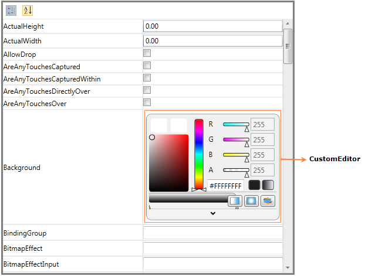

::: {style="DISPLAY: none"}
{#d2h_url_template}{#d2h_package_url style="WIDTH: 0px; DISPLAY: none; HEIGHT: 0px"}
:::

:::: {.d2h_secondary_topic style="PADDING-BOTTOM: 10pt; MARGIN: 0pt; PADDING-LEFT: 0pt; PADDING-RIGHT: 0pt; PADDING-TOP: 0pt"}
#### CustomEditor support {#customeditor-support style="tab-stops: 0pt"}

The PropertyGrid control supports several built-in editors, to give a good look and feel for the application (like in Expression Blend). Using CustomEditors or CategoryEditors. CustomEditor support enables you to set custom value editors for particular properties, instead of default editors.

 

Adding CustomEditor support to an Application

Using **CustomEditorCollection** property user can add custom editors to PropertyGrid control. To create CustomEditor user needs to implement **ITypeEditor** interface. In the below example for Background(Type -- Brush), by default ColorPicker will be displayed as ValueEditor. By setting CustomEditor for Background, ColorEdit will be displayed as ValueEditor instead of ColorPicker.

 

+-----------------------------------------------------------------------------------------------------------------------------------------------------------------------------------------------------------------------------------------------------------------------------------------------------------------------------------------------------------------------------------------------------------------------------------------------------------------------------------------------------------------------------------------------------------------------------------------------------------------------------------------------------------------------------------------------------------------------------------------------------------------------------------------------------------------------------------------------------------------------+
| **[\[XAML\]]{style="FONT-FAMILY: 'Courier New'"}**                                                                                                                                                                                                                                                                                                                                                                                                                                                                                                                                                                                                                                                                                                                                                                                                                    |
|                                                                                                                                                                                                                                                                                                                                                                                                                                                                                                                                                                                                                                                                                                                                                                                                                                                                       |
| [           ]{style="FONT-FAMILY: 'Courier New'"}                                                                                                                                                                                                                                                                                                                                                                                                                                                                                                                                                                                                                                                                                                                                                                                                                     |
|                                                                                                                                                                                                                                                                                                                                                                                                                                                                                                                                                                                                                                                                                                                                                                                                                                                                       |
| [    ]{style="FONT-FAMILY: 'Courier New'; COLOR: #a31515"}[\<]{style="FONT-FAMILY: 'Courier New'; COLOR: blue"}[Grid]{style="FONT-FAMILY: 'Courier New'; COLOR: #a31515"}[ x]{style="FONT-FAMILY: 'Courier New'; COLOR: red"}[:]{style="FONT-FAMILY: 'Courier New'; COLOR: blue"}[Name]{style="FONT-FAMILY: 'Courier New'; COLOR: red"}[=\"LayoutRoot\"]{style="FONT-FAMILY: 'Courier New'; COLOR: blue"}[ Background]{style="FONT-FAMILY: 'Courier New'; COLOR: red"}[=\"White\"]{style="FONT-FAMILY: 'Courier New'; COLOR: blue"}[ HorizontalAlignment]{style="FONT-FAMILY: 'Courier New'; COLOR: red"}[=\"Stretch\"]{style="FONT-FAMILY: 'Courier New'; COLOR: blue"}[ VerticalAlignment]{style="FONT-FAMILY: 'Courier New'; COLOR: red"}[=\"Stretch\"\>]{style="FONT-FAMILY: 'Courier New'; COLOR: blue"}[\                                                       |
| [        ]{style="COLOR: #a31515"}[\<]{style="COLOR: blue"}[Button]{style="COLOR: #a31515"}[ Height]{style="COLOR: red"}[=\"25\"]{style="COLOR: blue"} [Width]{style="COLOR: red"}[=\"100\"]{style="COLOR: blue"}[ VerticalAlignment]{style="COLOR: red"}[=\"Top\"]{style="COLOR: blue"}[ x]{style="COLOR: red"}[:]{style="COLOR: blue"}[Name]{style="COLOR: red"}[=\"Btn\"/\>]{style="COLOR: blue"}\                                                                                                                                                                                                                                                                                                                                                                                                                                                                 |
| [        ]{style="COLOR: #a31515"}[\<]{style="COLOR: blue"}[syncfusion]{style="COLOR: #a31515"}[:]{style="COLOR: blue"}[PropertyGrid]{style="COLOR: #a31515"}[ x]{style="COLOR: red"}[:]{style="COLOR: blue"}[Name]{style="COLOR: red"}[=\"propertyGrid\"]{style="COLOR: blue"}[ SelectedObject]{style="COLOR: red"}[=\"{]{style="COLOR: blue"}[Binding]{style="COLOR: #a31515"}[ ElementName]{style="COLOR: red"}[=Btn}\"]{style="COLOR: blue"}[ Margin]{style="COLOR: red"}[=\"50\"]{style="COLOR: blue"} [Width]{style="COLOR: red"}[=\"500\"]{style="COLOR: blue"}[ BorderBrush]{style="COLOR: red"}[=\"Gray\"]{style="COLOR: blue"}[ BorderThickness]{style="COLOR: red"}[=\"3\"]{style="COLOR: blue"}[ HorizontalAlignment]{style="COLOR: red"}[=\"Center\"]{style="COLOR: blue"}[ VerticalAlignment]{style="COLOR: red"}[=\"Center\"/\>]{style="COLOR: blue"}\ |
| [    ]{style="COLOR: #a31515"}[\</]{style="COLOR: blue"}[Grid]{style="COLOR: #a31515"}[\>]{style="COLOR: blue"}]{style="FONT-FAMILY: 'Courier New'"}                                                                                                                                                                                                                                                                                                                                                                                                                                                                                                                                                                                                                                                                                                                  |
|                                                                                                                                                                                                                                                                                                                                                                                                                                                                                                                                                                                                                                                                                                                                                                                                                                                                       |
| []{style="FONT-FAMILY: 'Courier New'"}                                                                                                                                                                                                                                                                                                                                                                                                                                                                                                                                                                                                                                                                                                                                                                                                                                |
+-----------------------------------------------------------------------------------------------------------------------------------------------------------------------------------------------------------------------------------------------------------------------------------------------------------------------------------------------------------------------------------------------------------------------------------------------------------------------------------------------------------------------------------------------------------------------------------------------------------------------------------------------------------------------------------------------------------------------------------------------------------------------------------------------------------------------------------------------------------------------+

[]{style="FONT-FAMILY: 'Courier New'"} 

+----------------------------------------------------------------------------------------------------------------------------------------------------------------------------------+
| **[\[C#\]]{style="FONT-FAMILY: 'Courier New'"}**                                                                                                                                 |
|                                                                                                                                                                                  |
| [           ]{style="FONT-FAMILY: 'Courier New'"}                                                                                                                                |
|                                                                                                                                                                                  |
| [    [///]{style="COLOR: gray"}[ ]{style="COLOR: green"}[\<summary\>]{style="COLOR: gray"}\                                                                                      |
|     [///]{style="COLOR: gray"}[ Interaction logic for MainWindow.xaml.]{style="COLOR: green"}\                                                                                   |
|     [///]{style="COLOR: gray"}[ ]{style="COLOR: green"}[\</summary\>]{style="COLOR: gray"}\                                                                                      |
|     [public]{style="COLOR: blue"} [partial]{style="COLOR: blue"} [class]{style="COLOR: blue"} [MainWindow]{style="COLOR: #2b91af"} : [Window]{style="COLOR: #2b91af"}\           |
|     {\                                                                                                                                                                           |
|         [///]{style="COLOR: gray"}[ ]{style="COLOR: green"}[\<summary\>]{style="COLOR: gray"}\                                                                                   |
|         [///]{style="COLOR: gray"}[ Initializes a new instance of the ]{style="COLOR: green"}[\<see cref=\"MainWindow\"/\>]{style="COLOR: gray"}[ class.]{style="COLOR: green"}\ |
|         [///]{style="COLOR: gray"}[ ]{style="COLOR: green"}[\</summary\>]{style="COLOR: gray"}\                                                                                  |
|         [public]{style="COLOR: blue"} MainWindow()\                                                                                                                              |
|         {\                                                                                                                                                                       |
|             InitializeComponent();\                                                                                                                                              |
|             [// Creating CustomEditor for Background.]{style="COLOR: green"}\                                                                                                    |
|             [CustomEditor]{style="COLOR: #2b91af"} editor = [new]{style="COLOR: blue"} [CustomEditor]{style="COLOR: #2b91af"}();\                                                |
|             editor.Properties.Add([\"Background\"]{style="COLOR: #a31515"});\                                                                                                    |
|             editor.Editor = [new]{style="COLOR: blue"} [ColorEditEditor]{style="COLOR: #2b91af"}();\                                                                             |
|             [this]{style="COLOR: blue"}.propertyGrid.CustomEditorCollection.Add(editor);\                                                                                        |
|         }\                                                                                                                                                                       |
|     }\                                                                                                                                                                           |
|  \                                                                                                                                                                               |
|     [public]{style="COLOR: blue"} [class]{style="COLOR: blue"} [ColorEditEditor]{style="COLOR: #2b91af"} : [ITypeEditor]{style="COLOR: #2b91af"}\                                |
|     {\                                                                                                                                                                           |
|         [public]{style="COLOR: blue"} [void]{style="COLOR: blue"} Attach([PropertyViewItem]{style="COLOR: #2b91af"} property, [PropertyItem]{style="COLOR: #2b91af"} info)\      |
|         {\                                                                                                                                                                       |
|             [if]{style="COLOR: blue"} (info.CanWrite)\                                                                                                                           |
|             {\                                                                                                                                                                   |
|                 [var]{style="COLOR: blue"} binding = [new]{style="COLOR: blue"} [Binding]{style="COLOR: #2b91af"}([\"Value\"]{style="COLOR: #a31515"})\                          |
|                 {\                                                                                                                                                               |
|                     Mode = [BindingMode]{style="COLOR: #2b91af"}.TwoWay,\                                                                                                        |
|                     Source = info,\                                                                                                                                              |
|                     ValidatesOnExceptions = [true]{style="COLOR: blue"},\                                                                                                        |
|                     ValidatesOnDataErrors = [true]{style="COLOR: blue"}\                                                                                                         |
|                 };\                                                                                                                                                              |
|                 [BindingOperations]{style="COLOR: #2b91af"}.SetBinding(colorEdit, [ColorEdit]{style="COLOR: #2b91af"}.BrushProperty, binding);\                                  |
|             }\                                                                                                                                                                   |
|             [else]{style="COLOR: blue"}\                                                                                                                                         |
|             {\                                                                                                                                                                   |
|                 [var]{style="COLOR: blue"} binding = [new]{style="COLOR: blue"} [Binding]{style="COLOR: #2b91af"}([\"Value\"]{style="COLOR: #a31515"})\                          |
|                 {\                                                                                                                                                               |
|                     Mode = [BindingMode]{style="COLOR: #2b91af"}.OneWayToSource,\                                                                                                |
|                     Source = info,\                                                                                                                                              |
|                     ValidatesOnExceptions = [true]{style="COLOR: blue"},\                                                                                                        |
|                     ValidatesOnDataErrors = [true]{style="COLOR: blue"}\                                                                                                         |
|                 };\                                                                                                                                                              |
|                 [BindingOperations]{style="COLOR: #2b91af"}.SetBinding(colorEdit, [ColorEdit]{style="COLOR: #2b91af"}.BrushProperty, binding);\                                  |
|             }\                                                                                                                                                                   |
|         }\                                                                                                                                                                       |
|  \                                                                                                                                                                               |
|         [public]{style="COLOR: blue"} [ColorEdit]{style="COLOR: #2b91af"} colorEdit;\                                                                                            |
|         [public]{style="COLOR: blue"} [object]{style="COLOR: blue"} Create(System.Reflection.[PropertyInfo]{style="COLOR: #2b91af"} PropertyInfo)\                               |
|         {\                                                                                                                                                                       |
|             colorEdit = [new]{style="COLOR: blue"} [ColorEdit]{style="COLOR: #2b91af"}();\                                                                                       |
|             [return]{style="COLOR: blue"} colorEdit;\                                                                                                                            |
|         }\                                                                                                                                                                       |
|  \                                                                                                                                                                               |
|         [public]{style="COLOR: blue"} [void]{style="COLOR: blue"} Detach([PropertyViewItem]{style="COLOR: #2b91af"} property)\                                                   |
|         {\                                                                                                                                                                       |
|             [throw]{style="COLOR: blue"} [new]{style="COLOR: blue"} [NotImplementedException]{style="COLOR: #2b91af"}();\                                                        |
|         }\                                                                                                                                                                       |
|     }]{style="FONT-FAMILY: 'Courier New'"}                                                                                                                                       |
|                                                                                                                                                                                  |
| []{style="FONT-FAMILY: 'Courier New'"}                                                                                                                                           |
+----------------------------------------------------------------------------------------------------------------------------------------------------------------------------------+

 

{border="0"}

Figure 822: PropertyGrid

 

 

Properties

Table 72: CustomEditor Table

::: {align="center"}
  ------------------------ --------------------------------------------------------------------------------------------------------------------- -------------------- ------------------------ -----------------
  Property                 Description                                                                                                           Type                 Data Type                Reference links
  CustomEditorCollection   CustomEditor support enables you to set custom value editors for particular properties, instead of default editors.   DependencyProperty   CustomEditorCollection   
  ------------------------ --------------------------------------------------------------------------------------------------------------------- -------------------- ------------------------ -----------------
:::

[]{style="FONT-FAMILY: 'Trebuchet MS','sans-serif'; COLOR: #15428b; FONT-SIZE: 9pt"} 

Sample Link

[]{style="FONT-FAMILY: 'Trebuchet MS','sans-serif'; COLOR: #15428b; FONT-SIZE: 9pt"} 

1.   Select Start -\> Programs -\> Syncfusion -\> Essential Studio x.x.xx -\> Dashboard.

2.   Select   Run Locally Installed Samples in WPF Button.

3.   Now expand the PropertyGrid treeview item in the Sample Browser.

4.   Choose any one of the samples listed under it to launch.

[]{style="COLOR: #c00000"} 

[]{#related-topics}
::::
