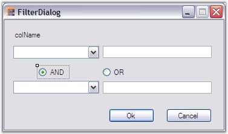
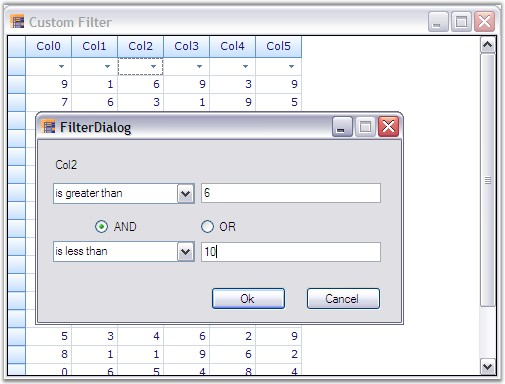
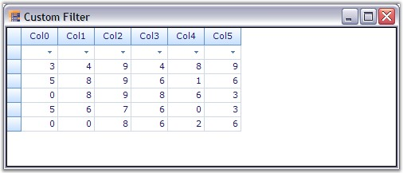

::: {style="DISPLAY: none"}
{#d2h_url_template}{#d2h_package_url style="WIDTH: 0px; DISPLAY: none; HEIGHT: 0px"}
:::

::: {.d2h_secondary_topic style="PADDING-BOTTOM: 10pt; MARGIN: 0pt; PADDING-LEFT: 0pt; PADDING-RIGHT: 0pt; PADDING-TOP: 0pt"}
##### Custom Filter Dialog {#custom-filter-dialog style="tab-stops: 0pt"}

[]{style="FONT-FAMILY: 'Trebuchet MS','sans-serif'; COLOR: #15428b; FONT-SIZE: 9pt"} 

When you have a grouping grid with filter bar enabled, the drop down in a filter bar cell shows a \'Custom\' option too along with other filtering options. This option allows you to customize the filtering mechanism. By default, the custom option pops up the RecordFieldDescriptor collection editor for the table. This default behavior must be overridden when a custom defined filter dialog has to be displayed as a result of clicking the custom option. It can be achieved by replacing the default FilterBarCell with custom defined filter bar cell.

 

This section best demonstrates merging of user defined filter dialog with the grid filter bar and also explores the code to implement it.

 

**Implementation**

**[]{style="FONT-FAMILY: 'Verdana','sans-serif'; COLOR: navy"}** 

To adopt our own filter dialog with respect to the \'Custom\' filtering option, we must define a **Custom Filter CellType** which should then replace the filter bar cell that is shown by default.

 

In general, a celltype requires a model class and a renderer class. The model class handles the serialization requirements for the control and creates the renderer class. The renderer class handles the UI requirements of the cell, such as drawing it, handling mouse actions, and so on.

 

For our FilterBarCell, we have to create the model and renderer classes by inheriting the **GridTableFilterBarCellModel** and **GridTableFilterBarCellRenderer** classes. In the renderer, you should override ListBoxClick or ListBoxMouseUp event handlers (the event that gets fired upon clicking a filter option) in order to show up our own filter dialog. Once the dialog is closed, retrieve the filter string that has been setup using the dialog and add this filter string into the RecordFilters collection of the TableDescriptor. This would set up a filter using the custom option.

 

Following steps illustrate how to add a custom filter dialog.

[]{style="FONT-FAMILY: 'Trebuchet MS','sans-serif'; COLOR: #15428b; FONT-SIZE: 9pt"} 

1.   Set up a grouping grid and bind a data source into it. Enable the grid filter bar to show the filter options for all the columns.

[]{style="FONT-FAMILY: 'Trebuchet MS','sans-serif'; COLOR: #15428b; FONT-SIZE: 9pt"} 

+----------------------------------------------------------------------------------------------------------------------------------------------------------------------------------------------------------------------------------------------------------------------+
| **[\[C#\]]{style="FONT-FAMILY: 'Courier New'; COLOR: black"}**                                                                                                                                                                                                       |
|                                                                                                                                                                                                                                                                      |
| []{style="FONT-FAMILY: 'Courier New'; COLOR: black"}                                                                                                                                                                                                                 |
|                                                                                                                                                                                                                                                                      |
| [// Set up a data source.]{style="FONT-FAMILY: 'Courier New'; COLOR: green"}                                                                                                                                                                                         |
|                                                                                                                                                                                                                                                                      |
| [DataTable]{style="FONT-FAMILY: 'Courier New'; COLOR: #2b91af"}[ dt = [new]{style="COLOR: blue"} [DataTable]{style="COLOR: #2b91af"}([\"MyTable\"]{style="COLOR: #a31515"});]{style="FONT-FAMILY: 'Courier New'"}                                                    |
|                                                                                                                                                                                                                                                                      |
| []{style="FONT-FAMILY: 'Courier New'"}                                                                                                                                                                                                                               |
|                                                                                                                                                                                                                                                                      |
| [int]{style="FONT-FAMILY: 'Courier New'; COLOR: blue"}[ nCols = 6;]{style="FONT-FAMILY: 'Courier New'"}                                                                                                                                                              |
|                                                                                                                                                                                                                                                                      |
| [int]{style="FONT-FAMILY: 'Courier New'; COLOR: blue"}[ nRows = 20;]{style="FONT-FAMILY: 'Courier New'"}                                                                                                                                                             |
|                                                                                                                                                                                                                                                                      |
| [Random]{style="FONT-FAMILY: 'Courier New'; COLOR: #2b91af"}[ r = [new]{style="COLOR: blue"} [Random]{style="COLOR: #2b91af"}(100);]{style="FONT-FAMILY: 'Courier New'"}                                                                                             |
|                                                                                                                                                                                                                                                                      |
| [for]{style="FONT-FAMILY: 'Courier New'; COLOR: blue"}[ ([int]{style="COLOR: blue"} i = 0; i \< nCols; i++)]{style="FONT-FAMILY: 'Courier New'"}                                                                                                                     |
|                                                                                                                                                                                                                                                                      |
| [    dt.Columns.Add([new]{style="COLOR: blue"} [DataColumn]{style="COLOR: #2b91af"}([string]{style="COLOR: blue"}.Format([\"Col{0}\"]{style="COLOR: #a31515"}, i), [typeof]{style="COLOR: blue"}([int]{style="COLOR: blue"})));]{style="FONT-FAMILY: 'Courier New'"} |
|                                                                                                                                                                                                                                                                      |
| []{style="FONT-FAMILY: 'Courier New'"}                                                                                                                                                                                                                               |
|                                                                                                                                                                                                                                                                      |
| [for]{style="FONT-FAMILY: 'Courier New'; COLOR: blue"}[ ([int]{style="COLOR: blue"} i = 0; i \< nRows; ++i)]{style="FONT-FAMILY: 'Courier New'"}                                                                                                                     |
|                                                                                                                                                                                                                                                                      |
| [{]{style="FONT-FAMILY: 'Courier New'"}                                                                                                                                                                                                                              |
|                                                                                                                                                                                                                                                                      |
| [    [DataRow]{style="COLOR: #2b91af"} dr = dt.NewRow();]{style="FONT-FAMILY: 'Courier New'"}                                                                                                                                                                        |
|                                                                                                                                                                                                                                                                      |
| [    [for]{style="COLOR: blue"} ([int]{style="COLOR: blue"} j = 0; j \< nCols; j++)]{style="FONT-FAMILY: 'Courier New'"}                                                                                                                                             |
|                                                                                                                                                                                                                                                                      |
| [        dr\[j\] = r.Next(10);]{style="FONT-FAMILY: 'Courier New'"}                                                                                                                                                                                                  |
|                                                                                                                                                                                                                                                                      |
| [    dt.Rows.Add(dr);]{style="FONT-FAMILY: 'Courier New'"}                                                                                                                                                                                                           |
|                                                                                                                                                                                                                                                                      |
| [}]{style="FONT-FAMILY: 'Courier New'"}                                                                                                                                                                                                                              |
|                                                                                                                                                                                                                                                                      |
| []{style="FONT-FAMILY: 'Courier New'"}                                                                                                                                                                                                                               |
|                                                                                                                                                                                                                                                                      |
| [// Bind it to the grouping grid.]{style="FONT-FAMILY: 'Courier New'; COLOR: green"}                                                                                                                                                                                 |
|                                                                                                                                                                                                                                                                      |
| [this]{style="FONT-FAMILY: 'Courier New'; COLOR: blue"}[.gridGroupingControl1.DataSource = dt;]{style="FONT-FAMILY: 'Courier New'"}                                                                                                                                  |
|                                                                                                                                                                                                                                                                      |
| []{style="FONT-FAMILY: 'Courier New'"}                                                                                                                                                                                                                               |
|                                                                                                                                                                                                                                                                      |
| [// Enable the filter bar.]{style="FONT-FAMILY: 'Courier New'; COLOR: green"}                                                                                                                                                                                        |
|                                                                                                                                                                                                                                                                      |
| [this]{style="FONT-FAMILY: 'Courier New'; COLOR: blue"}[.gridGroupingControl1.TopLevelGroupOptions.ShowFilterBar = [true]{style="COLOR: blue"};]{style="FONT-FAMILY: 'Courier New'"}                                                                                 |
|                                                                                                                                                                                                                                                                      |
| []{style="FONT-FAMILY: 'Courier New'"}                                                                                                                                                                                                                               |
|                                                                                                                                                                                                                                                                      |
| [for]{style="FONT-FAMILY: 'Courier New'; COLOR: blue"}[ ([int]{style="COLOR: blue"} i = 0; i \< gridGroupingControl1.TableDescriptor.Columns.Count; i++)]{style="FONT-FAMILY: 'Courier New'"}                                                                        |
|                                                                                                                                                                                                                                                                      |
| [gridGroupingControl1.TableDescriptor.Columns\[i\].AllowFilter = [true]{style="COLOR: blue"};]{style="FONT-FAMILY: 'Courier New'"}                                                                                                                                   |
+----------------------------------------------------------------------------------------------------------------------------------------------------------------------------------------------------------------------------------------------------------------------+

[]{style="FONT-FAMILY: 'Trebuchet MS','sans-serif'; COLOR: #15428b; FONT-SIZE: 9pt"} 

+--------------------------------------------------------------------------------------------------------------------------------------------------------------------------------------------------------------------------------------------+
| **[\[VB.NET\]]{style="FONT-FAMILY: 'Courier New'; COLOR: black"}**                                                                                                                                                                         |
|                                                                                                                                                                                                                                            |
| []{style="FONT-FAMILY: 'Courier New'; COLOR: black"}                                                                                                                                                                                       |
|                                                                                                                                                                                                                                            |
| [\' Setup a data source.]{style="FONT-FAMILY: 'Courier New'; COLOR: green"}                                                                                                                                                                |
|                                                                                                                                                                                                                                            |
| [Dim]{style="FONT-FAMILY: 'Courier New'; COLOR: blue"}[ dt [As]{style="COLOR: blue"} DataTable = [New]{style="COLOR: blue"} DataTable([\"MyTable\"]{style="COLOR: #a31515"})]{style="FONT-FAMILY: 'Courier New'"}                          |
|                                                                                                                                                                                                                                            |
| []{style="FONT-FAMILY: 'Courier New'"}                                                                                                                                                                                                     |
|                                                                                                                                                                                                                                            |
| [Dim]{style="FONT-FAMILY: 'Courier New'; COLOR: blue"}[ nCols [As]{style="COLOR: blue"} [Integer]{style="COLOR: blue"} = 6]{style="FONT-FAMILY: 'Courier New'"}                                                                            |
|                                                                                                                                                                                                                                            |
| [Dim]{style="FONT-FAMILY: 'Courier New'; COLOR: blue"}[ nRows [As]{style="COLOR: blue"} [Integer]{style="COLOR: blue"} = 20]{style="FONT-FAMILY: 'Courier New'"}                                                                           |
|                                                                                                                                                                                                                                            |
| [Dim]{style="FONT-FAMILY: 'Courier New'; COLOR: blue"}[ r [As]{style="COLOR: blue"} Random = [New]{style="COLOR: blue"} Random(100)]{style="FONT-FAMILY: 'Courier New'"}                                                                   |
|                                                                                                                                                                                                                                            |
| []{style="FONT-FAMILY: 'Courier New'; COLOR: blue"}                                                                                                                                                                                        |
|                                                                                                                                                                                                                                            |
| [Dim]{style="FONT-FAMILY: 'Courier New'; COLOR: blue"}[ i [As]{style="COLOR: blue"} [Integer]{style="COLOR: blue"} = 0]{style="FONT-FAMILY: 'Courier New'"}                                                                                |
|                                                                                                                                                                                                                                            |
| [Do]{style="FONT-FAMILY: 'Courier New'; COLOR: blue"}[ [While]{style="COLOR: blue"} i \< nCols]{style="FONT-FAMILY: 'Courier New'"}                                                                                                        |
|                                                                                                                                                                                                                                            |
| [dt.Columns.Add([New]{style="COLOR: blue"} DataColumn([String]{style="COLOR: blue"}.Format([\"Col{0}\"]{style="COLOR: #a31515"}, i), [GetType]{style="COLOR: blue"}([Integer]{style="COLOR: blue"})))]{style="FONT-FAMILY: 'Courier New'"} |
|                                                                                                                                                                                                                                            |
| [i += 1]{style="FONT-FAMILY: 'Courier New'"}                                                                                                                                                                                               |
|                                                                                                                                                                                                                                            |
| [Loop]{style="FONT-FAMILY: 'Courier New'; COLOR: blue"}                                                                                                                                                                                    |
|                                                                                                                                                                                                                                            |
| [i = 0]{style="FONT-FAMILY: 'Courier New'"}                                                                                                                                                                                                |
|                                                                                                                                                                                                                                            |
| []{style="FONT-FAMILY: 'Courier New'; COLOR: green"}                                                                                                                                                                                       |
|                                                                                                                                                                                                                                            |
| [Do]{style="FONT-FAMILY: 'Courier New'; COLOR: blue"}[ [While]{style="COLOR: blue"} i \< nRows]{style="FONT-FAMILY: 'Courier New'"}                                                                                                        |
|                                                                                                                                                                                                                                            |
| [Dim]{style="FONT-FAMILY: 'Courier New'; COLOR: blue"}[ dr [As]{style="COLOR: blue"} DataRow = dt.NewRow()]{style="FONT-FAMILY: 'Courier New'"}                                                                                            |
|                                                                                                                                                                                                                                            |
| [Dim]{style="FONT-FAMILY: 'Courier New'; COLOR: blue"}[ j [As]{style="COLOR: blue"} [Integer]{style="COLOR: blue"} = 0]{style="FONT-FAMILY: 'Courier New'"}                                                                                |
|                                                                                                                                                                                                                                            |
| [Do]{style="FONT-FAMILY: 'Courier New'; COLOR: blue"}[ [While]{style="COLOR: blue"} j \< nCols]{style="FONT-FAMILY: 'Courier New'"}                                                                                                        |
|                                                                                                                                                                                                                                            |
| [dr(j) = r.Next(10)]{style="FONT-FAMILY: 'Courier New'"}                                                                                                                                                                                   |
|                                                                                                                                                                                                                                            |
| [j += 1]{style="FONT-FAMILY: 'Courier New'"}                                                                                                                                                                                               |
|                                                                                                                                                                                                                                            |
| [Loop]{style="FONT-FAMILY: 'Courier New'; COLOR: blue"}                                                                                                                                                                                    |
|                                                                                                                                                                                                                                            |
| [dt.Rows.Add(dr)]{style="FONT-FAMILY: 'Courier New'"}                                                                                                                                                                                      |
|                                                                                                                                                                                                                                            |
| [i += 1]{style="FONT-FAMILY: 'Courier New'"}                                                                                                                                                                                               |
|                                                                                                                                                                                                                                            |
| [Loop]{style="FONT-FAMILY: 'Courier New'; COLOR: blue"}                                                                                                                                                                                    |
|                                                                                                                                                                                                                                            |
| []{style="FONT-FAMILY: 'Courier New'; COLOR: green"}                                                                                                                                                                                       |
|                                                                                                                                                                                                                                            |
| [\' Bind it to the grouping grid.]{style="FONT-FAMILY: 'Courier New'; COLOR: green"}                                                                                                                                                       |
|                                                                                                                                                                                                                                            |
| [Me]{style="FONT-FAMILY: 'Courier New'; COLOR: blue"}[.gridGroupingControl1.DataSource = dt]{style="FONT-FAMILY: 'Courier New'"}                                                                                                           |
|                                                                                                                                                                                                                                            |
| []{style="FONT-FAMILY: 'Courier New'; COLOR: green"}                                                                                                                                                                                       |
|                                                                                                                                                                                                                                            |
| [\' Enable the filter bar.]{style="FONT-FAMILY: 'Courier New'; COLOR: green"}                                                                                                                                                              |
|                                                                                                                                                                                                                                            |
| [Me]{style="FONT-FAMILY: 'Courier New'; COLOR: blue"}[.gridGroupingControl1.TopLevelGroupOptions.ShowFilterBar = [True]{style="COLOR: blue"}]{style="FONT-FAMILY: 'Courier New'"}                                                          |
|                                                                                                                                                                                                                                            |
| [i = 0]{style="FONT-FAMILY: 'Courier New'"}                                                                                                                                                                                                |
|                                                                                                                                                                                                                                            |
| [Do]{style="FONT-FAMILY: 'Courier New'; COLOR: blue"}[ [While]{style="COLOR: blue"} i \< gridGroupingControl1.TableDescriptor.Columns.Count]{style="FONT-FAMILY: 'Courier New'"}                                                           |
|                                                                                                                                                                                                                                            |
| [gridGroupingControl1.TableDescriptor.Columns(i).AllowFilter = [True]{style="COLOR: blue"}]{style="FONT-FAMILY: 'Courier New'"}                                                                                                            |
|                                                                                                                                                                                                                                            |
| [i += 1]{style="FONT-FAMILY: 'Courier New'"}                                                                                                                                                                                               |
|                                                                                                                                                                                                                                            |
| [Loop]{style="FONT-FAMILY: 'Courier New'; COLOR: blue"}                                                                                                                                                                                    |
+--------------------------------------------------------------------------------------------------------------------------------------------------------------------------------------------------------------------------------------------+

[]{style="FONT-FAMILY: 'Trebuchet MS','sans-serif'; COLOR: #15428b; FONT-SIZE: 9pt"} 

2.   Add another form say **FilterDialog** to the project. This form will accept two filter conditions combined by a logical operator. Add a label to display the name of the filter column, two comboboxes to display the compare operator choices and two text boxes to accept the compare values, two radio buttons to determine logical combination of the filter conditions, and two buttons \'Ok\' to pass the filter string to the parent grid and \'Cancel\' to cancel the filter action. Here is a sample image of the form\'s designer.

[]{style="FONT-SIZE: 8pt"} 

{border="0"}

[]{style="FONT-FAMILY: 'Trebuchet MS','sans-serif'; COLOR: #15428b; FONT-SIZE: 9pt"} 

*[Figure ]{style="FONT-SIZE: 9pt"}[412]{style="FONT-SIZE: 9pt"}[: Creating FilterDialog Dialog Box ]{style="FONT-SIZE: 9pt"}*

[]{style="FONT-SIZE: 8pt"} 

3.   Add a method **SetupOptions** to fill the comboboxes with the operator choices. Inside the Ok_Button_Click event handler, form the filter string by writing the extracted values from the form in a valid syntax. Then close the form. The CancelButton would simply close the form.

[]{style="FONT-FAMILY: 'Trebuchet MS','sans-serif'; COLOR: #15428b; FONT-SIZE: 9pt"} 

+----------------------------------------------------------------------------------------------------------------------------------------------------------------------------------------------------------------------------------------------------------------+
| **[\[C#\]]{style="FONT-FAMILY: 'Courier New'; COLOR: black"}**                                                                                                                                                                                                 |
|                                                                                                                                                                                                                                                                |
| []{style="FONT-FAMILY: 'Courier New'; COLOR: black"}                                                                                                                                                                                                           |
|                                                                                                                                                                                                                                                                |
| [internal]{style="FONT-FAMILY: 'Courier New'; COLOR: blue"}[ FilterString = [\"\"]{style="COLOR: #a31515"};]{style="FONT-FAMILY: 'Courier New'"}                                                                                                               |
|                                                                                                                                                                                                                                                                |
| []{style="FONT-FAMILY: 'Courier New'"}                                                                                                                                                                                                                         |
|                                                                                                                                                                                                                                                                |
| [// Filling up the combo boxes with the operator options.]{style="FONT-FAMILY: 'Courier New'; COLOR: green"}                                                                                                                                                   |
|                                                                                                                                                                                                                                                                |
| [public]{style="FONT-FAMILY: 'Courier New'; COLOR: blue"}[ [void]{style="COLOR: blue"} SetupOptions([string]{style="COLOR: blue"}\[\] filteroptions)]{style="FONT-FAMILY: 'Courier New'"}                                                                      |
|                                                                                                                                                                                                                                                                |
| [{]{style="FONT-FAMILY: 'Courier New'"}                                                                                                                                                                                                                        |
|                                                                                                                                                                                                                                                                |
| [    [this]{style="COLOR: blue"}.comboBox1.Items.AddRange(filteroptions);]{style="FONT-FAMILY: 'Courier New'"}                                                                                                                                                 |
|                                                                                                                                                                                                                                                                |
| [    [this]{style="COLOR: blue"}.comboBox2.Items.AddRange(filteroptions);]{style="FONT-FAMILY: 'Courier New'"}                                                                                                                                                 |
|                                                                                                                                                                                                                                                                |
| [}]{style="FONT-FAMILY: 'Courier New'"}                                                                                                                                                                                                                        |
|                                                                                                                                                                                                                                                                |
| []{style="FONT-FAMILY: 'Courier New'"}                                                                                                                                                                                                                         |
|                                                                                                                                                                                                                                                                |
| [// Code that is implemented on clicking the OK button.]{style="FONT-FAMILY: 'Courier New'; COLOR: green"}                                                                                                                                                     |
|                                                                                                                                                                                                                                                                |
| [private]{style="FONT-FAMILY: 'Courier New'; COLOR: blue"}[ [void]{style="COLOR: blue"} button1_Click([object]{style="COLOR: blue"} sender, [EventArgs]{style="COLOR: #2b91af"} e)]{style="FONT-FAMILY: 'Courier New'"}                                        |
|                                                                                                                                                                                                                                                                |
| [{]{style="FONT-FAMILY: 'Courier New'"}                                                                                                                                                                                                                        |
|                                                                                                                                                                                                                                                                |
| [    [if]{style="COLOR: blue"} ([this]{style="COLOR: blue"}.comboBox1.Text.Length \> 0 && [this]{style="COLOR: blue"}.textBox1.Text.Length \> 0)]{style="FONT-FAMILY: 'Courier New'"}                                                                          |
|                                                                                                                                                                                                                                                                |
| [    {]{style="FONT-FAMILY: 'Courier New'"}                                                                                                                                                                                                                    |
|                                                                                                                                                                                                                                                                |
| [        FilterString = [\'\[\']{style="COLOR: #a31515"} + colLabel.Text + [\'\]\']{style="COLOR: #a31515"} + GetFilter([this]{style="COLOR: blue"}.comboBox1.SelectedIndex, [this]{style="COLOR: blue"}.textBox1.Text);]{style="FONT-FAMILY: 'Courier New'"}  |
|                                                                                                                                                                                                                                                                |
| [    }]{style="FONT-FAMILY: 'Courier New'"}                                                                                                                                                                                                                    |
|                                                                                                                                                                                                                                                                |
| [    [if]{style="COLOR: blue"} ([this]{style="COLOR: blue"}.comboBox2.Text.Length \> 0 && [this]{style="COLOR: blue"}.textBox2.Text.Length \> 0)]{style="FONT-FAMILY: 'Courier New'"}                                                                          |
|                                                                                                                                                                                                                                                                |
| [    {]{style="FONT-FAMILY: 'Courier New'"}                                                                                                                                                                                                                    |
|                                                                                                                                                                                                                                                                |
| [        FilterString += ([this]{style="COLOR: blue"}.radioButton1.Checked) ? [\" AND \"]{style="COLOR: #a31515"} : [\" OR \"]{style="COLOR: #a31515"};]{style="FONT-FAMILY: 'Courier New'"}                                                                   |
|                                                                                                                                                                                                                                                                |
| [        FilterString += [\'\[\']{style="COLOR: #a31515"} + colLabel.Text + [\'\]\']{style="COLOR: #a31515"} + GetFilter([this]{style="COLOR: blue"}.comboBox2.SelectedIndex, [this]{style="COLOR: blue"}.textBox2.Text);]{style="FONT-FAMILY: 'Courier New'"} |
|                                                                                                                                                                                                                                                                |
| [    }]{style="FONT-FAMILY: 'Courier New'"}                                                                                                                                                                                                                    |
|                                                                                                                                                                                                                                                                |
| [    [this]{style="COLOR: blue"}.DialogResult = [DialogResult]{style="COLOR: #2b91af"}.OK;]{style="FONT-FAMILY: 'Courier New'"}                                                                                                                                |
|                                                                                                                                                                                                                                                                |
| [    [this]{style="COLOR: blue"}.Close();]{style="FONT-FAMILY: 'Courier New'"}                                                                                                                                                                                 |
|                                                                                                                                                                                                                                                                |
| [}]{style="FONT-FAMILY: 'Courier New'"}                                                                                                                                                                                                                        |
|                                                                                                                                                                                                                                                                |
| []{style="FONT-FAMILY: 'Courier New'"}                                                                                                                                                                                                                         |
|                                                                                                                                                                                                                                                                |
| [private]{style="FONT-FAMILY: 'Courier New'; COLOR: blue"}[ [string]{style="COLOR: blue"} GetFilter([int]{style="COLOR: blue"} index, [string]{style="COLOR: blue"} text)]{style="FONT-FAMILY: 'Courier New'"}                                                 |
|                                                                                                                                                                                                                                                                |
| [{]{style="FONT-FAMILY: 'Courier New'"}                                                                                                                                                                                                                        |
|                                                                                                                                                                                                                                                                |
| [    [string]{style="COLOR: blue"} s = [\"\"]{style="COLOR: #a31515"};]{style="FONT-FAMILY: 'Courier New'"}                                                                                                                                                    |
|                                                                                                                                                                                                                                                                |
| []{style="FONT-FAMILY: 'Courier New'"}                                                                                                                                                                                                                         |
|                                                                                                                                                                                                                                                                |
| [    [switch]{style="COLOR: blue"} (index)]{style="FONT-FAMILY: 'Courier New'"}                                                                                                                                                                                |
|                                                                                                                                                                                                                                                                |
| [    {]{style="FONT-FAMILY: 'Courier New'"}                                                                                                                                                                                                                    |
|                                                                                                                                                                                                                                                                |
| [        [case]{style="COLOR: blue"} 0:]{style="FONT-FAMILY: 'Courier New'"}                                                                                                                                                                                   |
|                                                                                                                                                                                                                                                                |
| [        s = [\" = \'\"]{style="COLOR: #a31515"} + text + [\"\'\"]{style="COLOR: #a31515"};]{style="FONT-FAMILY: 'Courier New'"}                                                                                                                               |
|                                                                                                                                                                                                                                                                |
| [        [break]{style="COLOR: blue"};]{style="FONT-FAMILY: 'Courier New'"}                                                                                                                                                                                    |
|                                                                                                                                                                                                                                                                |
| [        [case]{style="COLOR: blue"} 1:]{style="FONT-FAMILY: 'Courier New'"}                                                                                                                                                                                   |
|                                                                                                                                                                                                                                                                |
| [        s = [\" \<\> \'\"]{style="COLOR: #a31515"} + text + [\"\'\"]{style="COLOR: #a31515"};]{style="FONT-FAMILY: 'Courier New'"}                                                                                                                            |
|                                                                                                                                                                                                                                                                |
| [        [break]{style="COLOR: blue"};]{style="FONT-FAMILY: 'Courier New'"}                                                                                                                                                                                    |
|                                                                                                                                                                                                                                                                |
| [        [case]{style="COLOR: blue"} 2:]{style="FONT-FAMILY: 'Courier New'"}                                                                                                                                                                                   |
|                                                                                                                                                                                                                                                                |
| [        s = [\" \> \'\"]{style="COLOR: #a31515"} + text + [\"\'\"]{style="COLOR: #a31515"};]{style="FONT-FAMILY: 'Courier New'"}                                                                                                                              |
|                                                                                                                                                                                                                                                                |
| [        [break]{style="COLOR: blue"};]{style="FONT-FAMILY: 'Courier New'"}                                                                                                                                                                                    |
|                                                                                                                                                                                                                                                                |
| [        [case]{style="COLOR: blue"} 3:]{style="FONT-FAMILY: 'Courier New'"}                                                                                                                                                                                   |
|                                                                                                                                                                                                                                                                |
| [        s = [\" \>= \'\"]{style="COLOR: #a31515"} + text + [\"\'\"]{style="COLOR: #a31515"};]{style="FONT-FAMILY: 'Courier New'"}                                                                                                                             |
|                                                                                                                                                                                                                                                                |
| [        [break]{style="COLOR: blue"};]{style="FONT-FAMILY: 'Courier New'"}                                                                                                                                                                                    |
|                                                                                                                                                                                                                                                                |
| [        [case]{style="COLOR: blue"} 4: ]{style="FONT-FAMILY: 'Courier New'"}                                                                                                                                                                                  |
|                                                                                                                                                                                                                                                                |
| [        s = [\" \< \'\"]{style="COLOR: #a31515"} + text + [\"\'\"]{style="COLOR: #a31515"};]{style="FONT-FAMILY: 'Courier New'"}                                                                                                                              |
|                                                                                                                                                                                                                                                                |
| [        [break]{style="COLOR: blue"};]{style="FONT-FAMILY: 'Courier New'"}                                                                                                                                                                                    |
|                                                                                                                                                                                                                                                                |
| [        [case]{style="COLOR: blue"} 5: ]{style="FONT-FAMILY: 'Courier New'"}                                                                                                                                                                                  |
|                                                                                                                                                                                                                                                                |
| [        s = [\" \<= \'\"]{style="COLOR: #a31515"} + text + [\"\'\"]{style="COLOR: #a31515"};]{style="FONT-FAMILY: 'Courier New'"}                                                                                                                             |
|                                                                                                                                                                                                                                                                |
| [        [break]{style="COLOR: blue"}; ]{style="FONT-FAMILY: 'Courier New'"}                                                                                                                                                                                   |
|                                                                                                                                                                                                                                                                |
| [    }]{style="FONT-FAMILY: 'Courier New'"}                                                                                                                                                                                                                    |
|                                                                                                                                                                                                                                                                |
| [    [return]{style="COLOR: blue"} s;]{style="FONT-FAMILY: 'Courier New'"}                                                                                                                                                                                     |
|                                                                                                                                                                                                                                                                |
| [}]{style="FONT-FAMILY: 'Courier New'"}                                                                                                                                                                                                                        |
|                                                                                                                                                                                                                                                                |
| [        ]{style="FONT-FAMILY: 'Courier New'"}                                                                                                                                                                                                                 |
|                                                                                                                                                                                                                                                                |
| [// Code that is implemented on clicking the Cancel button.]{style="FONT-FAMILY: 'Courier New'; COLOR: green"}                                                                                                                                                 |
|                                                                                                                                                                                                                                                                |
| [private]{style="FONT-FAMILY: 'Courier New'; COLOR: blue"}[ [void]{style="COLOR: blue"} button2_Click([object]{style="COLOR: blue"} sender, [EventArgs]{style="COLOR: #2b91af"} e)]{style="FONT-FAMILY: 'Courier New'"}                                        |
|                                                                                                                                                                                                                                                                |
| [{]{style="FONT-FAMILY: 'Courier New'"}                                                                                                                                                                                                                        |
|                                                                                                                                                                                                                                                                |
| [    [this]{style="COLOR: blue"}.Close();]{style="FONT-FAMILY: 'Courier New'"}                                                                                                                                                                                 |
|                                                                                                                                                                                                                                                                |
| [}]{style="FONT-FAMILY: 'Courier New'"}                                                                                                                                                                                                                        |
+----------------------------------------------------------------------------------------------------------------------------------------------------------------------------------------------------------------------------------------------------------------+

[]{style="FONT-FAMILY: 'Trebuchet MS','sans-serif'; COLOR: #15428b; FONT-SIZE: 9pt"} 

+--------------------------------------------------------------------------------------------------------------------------------------------------------------------------------------------------------------------------------------------------------------------------------------------------------------------------------------------------------------------------------------------+
| **[\[VB.NET\]]{style="FONT-FAMILY: 'Courier New'; COLOR: black"}**                                                                                                                                                                                                                                                                                                                         |
|                                                                                                                                                                                                                                                                                                                                                                                            |
| []{style="FONT-FAMILY: 'Courier New'; COLOR: black"}                                                                                                                                                                                                                                                                                                                                       |
|                                                                                                                                                                                                                                                                                                                                                                                            |
| [Friend]{style="FONT-FAMILY: 'Courier New'; COLOR: blue"}[ FilterString [As]{style="COLOR: blue"} [String]{style="COLOR: blue"} = [\"\"]{style="COLOR: #a31515"}]{style="FONT-FAMILY: 'Courier New'"}                                                                                                                                                                                      |
|                                                                                                                                                                                                                                                                                                                                                                                            |
| []{style="FONT-FAMILY: 'Courier New'; COLOR: maroon"}                                                                                                                                                                                                                                                                                                                                      |
|                                                                                                                                                                                                                                                                                                                                                                                            |
| [\' Filling up the combo boxes with the operator options.]{style="FONT-FAMILY: 'Courier New'; COLOR: green"}                                                                                                                                                                                                                                                                               |
|                                                                                                                                                                                                                                                                                                                                                                                            |
| [Public]{style="FONT-FAMILY: 'Courier New'; COLOR: blue"}[ [Sub]{style="COLOR: blue"} SetupOptions([ByVal]{style="COLOR: blue"} filteroptions [As]{style="COLOR: blue"} [String]{style="COLOR: blue"}())]{style="FONT-FAMILY: 'Courier New'"}                                                                                                                                              |
|                                                                                                                                                                                                                                                                                                                                                                                            |
| [Me]{style="FONT-FAMILY: 'Courier New'; COLOR: blue"}[.comboBox1.Items.AddRange(filteroptions)]{style="FONT-FAMILY: 'Courier New'"}                                                                                                                                                                                                                                                        |
|                                                                                                                                                                                                                                                                                                                                                                                            |
| [Me]{style="FONT-FAMILY: 'Courier New'; COLOR: blue"}[.comboBox2.Items.AddRange(filteroptions)]{style="FONT-FAMILY: 'Courier New'"}                                                                                                                                                                                                                                                        |
|                                                                                                                                                                                                                                                                                                                                                                                            |
| [End]{style="FONT-FAMILY: 'Courier New'; COLOR: blue"}[ [Sub]{style="COLOR: blue"}]{style="FONT-FAMILY: 'Courier New'"}                                                                                                                                                                                                                                                                    |
|                                                                                                                                                                                                                                                                                                                                                                                            |
| []{style="FONT-FAMILY: 'Courier New'; COLOR: blue"}                                                                                                                                                                                                                                                                                                                                        |
|                                                                                                                                                                                                                                                                                                                                                                                            |
| [\' Code that is implemented on clicking the OK button.]{style="FONT-FAMILY: 'Courier New'; COLOR: green"}                                                                                                                                                                                                                                                                                 |
|                                                                                                                                                                                                                                                                                                                                                                                            |
| [Private]{style="FONT-FAMILY: 'Courier New'; COLOR: blue"}[ [Sub]{style="COLOR: blue"} button1_Click([ByVal]{style="COLOR: blue"} sender [As]{style="COLOR: blue"} [Object]{style="COLOR: blue"}, [ByVal]{style="COLOR: blue"} e [As]{style="COLOR: blue"} EventArgs)]{style="FONT-FAMILY: 'Courier New'"}                                                                                 |
|                                                                                                                                                                                                                                                                                                                                                                                            |
| [If]{style="FONT-FAMILY: 'Courier New'; COLOR: blue"}[ [Me]{style="COLOR: blue"}.comboBox1.Text.Length \> 0 [AndAlso]{style="COLOR: blue"} [Me]{style="COLOR: blue"}.textBox1.Text.Length \> 0 [Then]{style="COLOR: blue"}]{style="FONT-FAMILY: 'Courier New'"}                                                                                                                            |
|                                                                                                                                                                                                                                                                                                                                                                                            |
| [FilterString = [\"\[\"c]{style="COLOR: #a31515"} + colLabel.Text & [\"\]\"c]{style="COLOR: #a31515"} + GetFilter([Me]{style="COLOR: blue"}.comboBox1.SelectedIndex, [Me]{style="COLOR: blue"}.textBox1.Text)]{style="FONT-FAMILY: 'Courier New'"}                                                                                                                                         |
|                                                                                                                                                                                                                                                                                                                                                                                            |
| [End]{style="FONT-FAMILY: 'Courier New'; COLOR: blue"}[ [If]{style="COLOR: blue"}]{style="FONT-FAMILY: 'Courier New'"}                                                                                                                                                                                                                                                                     |
|                                                                                                                                                                                                                                                                                                                                                                                            |
| [If]{style="FONT-FAMILY: 'Courier New'; COLOR: blue"}[ [Me]{style="COLOR: blue"}.comboBox2.Text.Length \> 0 [AndAlso]{style="COLOR: blue"} [Me]{style="COLOR: blue"}.textBox2.Text.Length \> 0 [Then]{style="COLOR: blue"}]{style="FONT-FAMILY: 'Courier New'"}                                                                                                                            |
|                                                                                                                                                                                                                                                                                                                                                                                            |
| [If]{style="FONT-FAMILY: 'Courier New'; COLOR: blue"}[ ([Me]{style="COLOR: blue"}.radioButton1.Checked) [Then]{style="COLOR: blue"}]{style="FONT-FAMILY: 'Courier New'"}                                                                                                                                                                                                                   |
|                                                                                                                                                                                                                                                                                                                                                                                            |
| [FilterString &= [\" AND \"]{style="COLOR: #a31515"}]{style="FONT-FAMILY: 'Courier New'"}                                                                                                                                                                                                                                                                                                  |
|                                                                                                                                                                                                                                                                                                                                                                                            |
| [Else]{style="FONT-FAMILY: 'Courier New'; COLOR: blue"}                                                                                                                                                                                                                                                                                                                                    |
|                                                                                                                                                                                                                                                                                                                                                                                            |
| [FilterString &= [\" OR \"]{style="COLOR: #a31515"}]{style="FONT-FAMILY: 'Courier New'"}                                                                                                                                                                                                                                                                                                   |
|                                                                                                                                                                                                                                                                                                                                                                                            |
| [End]{style="FONT-FAMILY: 'Courier New'; COLOR: blue"}[ [If]{style="COLOR: blue"}]{style="FONT-FAMILY: 'Courier New'"}                                                                                                                                                                                                                                                                     |
|                                                                                                                                                                                                                                                                                                                                                                                            |
| [FilterString &= [\"\[\"c]{style="COLOR: #a31515"} + colLabel.Text & [\"\]\"c]{style="COLOR: #a31515"} + GetFilter([Me]{style="COLOR: blue"}.comboBox2.SelectedIndex, [Me]{style="COLOR: blue"}.textBox2.Text)]{style="FONT-FAMILY: 'Courier New'"}                                                                                                                                        |
|                                                                                                                                                                                                                                                                                                                                                                                            |
| [End]{style="FONT-FAMILY: 'Courier New'; COLOR: blue"}[ [If]{style="COLOR: blue"}]{style="FONT-FAMILY: 'Courier New'"}                                                                                                                                                                                                                                                                     |
|                                                                                                                                                                                                                                                                                                                                                                                            |
| [Me]{style="FONT-FAMILY: 'Courier New'; COLOR: blue"}[.DialogResult = DialogResult.OK]{style="FONT-FAMILY: 'Courier New'"}                                                                                                                                                                                                                                                                 |
|                                                                                                                                                                                                                                                                                                                                                                                            |
| [Me]{style="FONT-FAMILY: 'Courier New'; COLOR: blue"}[.Close()]{style="FONT-FAMILY: 'Courier New'"}                                                                                                                                                                                                                                                                                        |
|                                                                                                                                                                                                                                                                                                                                                                                            |
| [End]{style="FONT-FAMILY: 'Courier New'; COLOR: blue"}[ [Sub]{style="COLOR: blue"}]{style="FONT-FAMILY: 'Courier New'"}                                                                                                                                                                                                                                                                    |
|                                                                                                                                                                                                                                                                                                                                                                                            |
| []{style="FONT-FAMILY: 'Courier New'; COLOR: blue"}                                                                                                                                                                                                                                                                                                                                        |
|                                                                                                                                                                                                                                                                                                                                                                                            |
| [Private]{style="FONT-FAMILY: 'Courier New'; COLOR: blue"}[ [Function]{style="COLOR: blue"} GetFilter([ByVal]{style="COLOR: blue"} index [As]{style="COLOR: blue"} [Integer]{style="COLOR: blue"}, [ByVal]{style="COLOR: blue"} text [As]{style="COLOR: blue"} [String]{style="COLOR: blue"}) [As]{style="COLOR: blue"} [String]{style="COLOR: blue"}]{style="FONT-FAMILY: 'Courier New'"} |
|                                                                                                                                                                                                                                                                                                                                                                                            |
| [Dim]{style="FONT-FAMILY: 'Courier New'; COLOR: blue"}[ s [As]{style="COLOR: blue"} [String]{style="COLOR: blue"} = [\"\"]{style="COLOR: #a31515"}]{style="FONT-FAMILY: 'Courier New'"}                                                                                                                                                                                                    |
|                                                                                                                                                                                                                                                                                                                                                                                            |
| []{style="FONT-FAMILY: 'Courier New'; COLOR: maroon"}                                                                                                                                                                                                                                                                                                                                      |
|                                                                                                                                                                                                                                                                                                                                                                                            |
| [Select]{style="FONT-FAMILY: 'Courier New'; COLOR: blue"}[ [Case]{style="COLOR: blue"} index]{style="FONT-FAMILY: 'Courier New'"}                                                                                                                                                                                                                                                          |
|                                                                                                                                                                                                                                                                                                                                                                                            |
| [Case]{style="FONT-FAMILY: 'Courier New'; COLOR: blue"}[ 0 ]{style="FONT-FAMILY: 'Courier New'"}                                                                                                                                                                                                                                                                                           |
|                                                                                                                                                                                                                                                                                                                                                                                            |
| [s = [\" = \'\"]{style="COLOR: #a31515"} + text + [\"\'\"]{style="COLOR: #a31515"}]{style="FONT-FAMILY: 'Courier New'"}                                                                                                                                                                                                                                                                    |
|                                                                                                                                                                                                                                                                                                                                                                                            |
| [Case]{style="FONT-FAMILY: 'Courier New'; COLOR: blue"}[ 1 ]{style="FONT-FAMILY: 'Courier New'"}                                                                                                                                                                                                                                                                                           |
|                                                                                                                                                                                                                                                                                                                                                                                            |
| [s = [\" \<\> \'\"]{style="COLOR: #a31515"} + text + [\"\'\"]{style="COLOR: #a31515"}]{style="FONT-FAMILY: 'Courier New'"}                                                                                                                                                                                                                                                                 |
|                                                                                                                                                                                                                                                                                                                                                                                            |
| [Case]{style="FONT-FAMILY: 'Courier New'; COLOR: blue"}[ 2 ]{style="FONT-FAMILY: 'Courier New'"}                                                                                                                                                                                                                                                                                           |
|                                                                                                                                                                                                                                                                                                                                                                                            |
| [s = [\" \> \'\"]{style="COLOR: #a31515"} + text + [\"\'\"]{style="COLOR: #a31515"}]{style="FONT-FAMILY: 'Courier New'"}                                                                                                                                                                                                                                                                   |
|                                                                                                                                                                                                                                                                                                                                                                                            |
| [Case]{style="FONT-FAMILY: 'Courier New'; COLOR: blue"}[ 3 ]{style="FONT-FAMILY: 'Courier New'"}                                                                                                                                                                                                                                                                                           |
|                                                                                                                                                                                                                                                                                                                                                                                            |
| [s = [\" \>= \'\"]{style="COLOR: #a31515"} + text + [\"\'\"]{style="COLOR: #a31515"}]{style="FONT-FAMILY: 'Courier New'"}                                                                                                                                                                                                                                                                  |
|                                                                                                                                                                                                                                                                                                                                                                                            |
| [Case]{style="FONT-FAMILY: 'Courier New'; COLOR: blue"}[ 4 ]{style="FONT-FAMILY: 'Courier New'"}                                                                                                                                                                                                                                                                                           |
|                                                                                                                                                                                                                                                                                                                                                                                            |
| [s = [\" \< \'\"]{style="COLOR: #a31515"} + text + [\"\'\"]{style="COLOR: #a31515"}]{style="FONT-FAMILY: 'Courier New'"}                                                                                                                                                                                                                                                                   |
|                                                                                                                                                                                                                                                                                                                                                                                            |
| [Case]{style="FONT-FAMILY: 'Courier New'; COLOR: blue"}[ 5 ]{style="FONT-FAMILY: 'Courier New'"}                                                                                                                                                                                                                                                                                           |
|                                                                                                                                                                                                                                                                                                                                                                                            |
| [s = [\" \<= \'\"]{style="COLOR: #a31515"} + text + [\"\'\"]{style="COLOR: #a31515"}]{style="FONT-FAMILY: 'Courier New'"}                                                                                                                                                                                                                                                                  |
|                                                                                                                                                                                                                                                                                                                                                                                            |
| [End]{style="FONT-FAMILY: 'Courier New'; COLOR: blue"}[ [Select]{style="COLOR: blue"}]{style="FONT-FAMILY: 'Courier New'"}                                                                                                                                                                                                                                                                 |
|                                                                                                                                                                                                                                                                                                                                                                                            |
| [Return]{style="FONT-FAMILY: 'Courier New'; COLOR: blue"}[ s]{style="FONT-FAMILY: 'Courier New'"}                                                                                                                                                                                                                                                                                          |
|                                                                                                                                                                                                                                                                                                                                                                                            |
| [End]{style="FONT-FAMILY: 'Courier New'; COLOR: blue"}[ [Function]{style="COLOR: blue"}]{style="FONT-FAMILY: 'Courier New'"}                                                                                                                                                                                                                                                               |
|                                                                                                                                                                                                                                                                                                                                                                                            |
| []{style="FONT-FAMILY: 'Courier New'; COLOR: blue"}                                                                                                                                                                                                                                                                                                                                        |
|                                                                                                                                                                                                                                                                                                                                                                                            |
| [\' Code that is implemented on clicking the Cancel button.]{style="FONT-FAMILY: 'Courier New'; COLOR: green"}                                                                                                                                                                                                                                                                             |
|                                                                                                                                                                                                                                                                                                                                                                                            |
| [Private]{style="FONT-FAMILY: 'Courier New'; COLOR: blue"}[ [Sub]{style="COLOR: blue"} button2_Click([ByVal]{style="COLOR: blue"} sender [As]{style="COLOR: blue"} [Object]{style="COLOR: blue"}, [ByVal]{style="COLOR: blue"} e [As]{style="COLOR: blue"} EventArgs)]{style="FONT-FAMILY: 'Courier New'"}                                                                                 |
|                                                                                                                                                                                                                                                                                                                                                                                            |
| [Me]{style="FONT-FAMILY: 'Courier New'; COLOR: blue"}[.Close()]{style="FONT-FAMILY: 'Courier New'"}                                                                                                                                                                                                                                                                                        |
|                                                                                                                                                                                                                                                                                                                                                                                            |
| [End]{style="FONT-FAMILY: 'Courier New'; COLOR: blue"}[ [Sub]{style="COLOR: blue"}]{style="FONT-FAMILY: 'Courier New'"}                                                                                                                                                                                                                                                                    |
+--------------------------------------------------------------------------------------------------------------------------------------------------------------------------------------------------------------------------------------------------------------------------------------------------------------------------------------------------------------------------------------------+

[]{style="FONT-FAMILY: 'Trebuchet MS','sans-serif'; COLOR: #15428b; FONT-SIZE: 9pt"} 

4.   Once a filter dialog has been designed, our next step is to create the required model and renderer classes in order to adopt the custom filter dialog. Inside the renderer, override the ListBoxMouseUp event to make the custom filter dialog to pop up. When the dialog is closed, add the filter string into the RecordFilters collection to set up the filter.

[]{style="FONT-FAMILY: 'Trebuchet MS','sans-serif'; COLOR: #15428b; FONT-SIZE: 9pt"} 

+-----------------------------------------------------------------------------------------------------------------------------------------------------------------------------------------------------------------------------------------+
| **[\[C#\]]{style="FONT-FAMILY: 'Courier New'; COLOR: black"}**                                                                                                                                                                          |
|                                                                                                                                                                                                                                         |
| []{style="FONT-FAMILY: 'Courier New'; COLOR: black"}                                                                                                                                                                                    |
|                                                                                                                                                                                                                                         |
| [// Cell Model class.]{style="FONT-FAMILY: 'Courier New'; COLOR: green"}                                                                                                                                                                |
|                                                                                                                                                                                                                                         |
| [class]{style="FONT-FAMILY: 'Courier New'; COLOR: blue"}[ [CustomFilterCellModel]{style="COLOR: #2b91af"} : [GridTableFilterBarCellModel]{style="COLOR: #2b91af"}]{style="FONT-FAMILY: 'Courier New'"}                                  |
|                                                                                                                                                                                                                                         |
| [{]{style="FONT-FAMILY: 'Courier New'"}                                                                                                                                                                                                 |
|                                                                                                                                                                                                                                         |
| [    [internal]{style="COLOR: blue"} [GridFilterBar]{style="COLOR: #2b91af"} filterBar;]{style="FONT-FAMILY: 'Courier New'"}                                                                                                            |
|                                                                                                                                                                                                                                         |
| []{style="FONT-FAMILY: 'Courier New'"}                                                                                                                                                                                                  |
|                                                                                                                                                                                                                                         |
| [    [public]{style="COLOR: blue"} CustomFilterCellModel([GridModel]{style="COLOR: #2b91af"} grid) : [base]{style="COLOR: blue"}(grid)]{style="FONT-FAMILY: 'Courier New'"}                                                             |
|                                                                                                                                                                                                                                         |
| [    {]{style="FONT-FAMILY: 'Courier New'"}                                                                                                                                                                                             |
|                                                                                                                                                                                                                                         |
| [        filterBar = [new]{style="COLOR: blue"} [GridFilterBar]{style="COLOR: #2b91af"}();]{style="FONT-FAMILY: 'Courier New'"}                                                                                                         |
|                                                                                                                                                                                                                                         |
| [    }]{style="FONT-FAMILY: 'Courier New'"}                                                                                                                                                                                             |
|                                                                                                                                                                                                                                         |
| []{style="FONT-FAMILY: 'Courier New'"}                                                                                                                                                                                                  |
|                                                                                                                                                                                                                                         |
| [    [public]{style="COLOR: blue"} [override]{style="COLOR: blue"} [GridCellRendererBase]{style="COLOR: #2b91af"} CreateRenderer([GridControlBase]{style="COLOR: #2b91af"} control)]{style="FONT-FAMILY: 'Courier New'"}                |
|                                                                                                                                                                                                                                         |
| [    {]{style="FONT-FAMILY: 'Courier New'"}                                                                                                                                                                                             |
|                                                                                                                                                                                                                                         |
| [        [return]{style="COLOR: blue"} [new]{style="COLOR: blue"} [CustomFilterCellRenderer]{style="COLOR: #2b91af"}(control, [this]{style="COLOR: blue"});]{style="FONT-FAMILY: 'Courier New'"}                                        |
|                                                                                                                                                                                                                                         |
| [    }]{style="FONT-FAMILY: 'Courier New'"}                                                                                                                                                                                             |
|                                                                                                                                                                                                                                         |
| []{style="FONT-FAMILY: 'Courier New'"}                                                                                                                                                                                                  |
|                                                                                                                                                                                                                                         |
| [    [public]{style="COLOR: blue"} [string]{style="COLOR: blue"}\[\] FilterBarOptions = [new]{style="COLOR: blue"} [string]{style="COLOR: blue"}\[\]]{style="FONT-FAMILY: 'Courier New'"}                                               |
|                                                                                                                                                                                                                                         |
| [    {]{style="FONT-FAMILY: 'Courier New'"}                                                                                                                                                                                             |
|                                                                                                                                                                                                                                         |
| [        [\"equals\"]{style="COLOR: #a31515"},                               ]{style="FONT-FAMILY: 'Courier New'"}                                                                                                                      |
|                                                                                                                                                                                                                                         |
| [        [\"does not equal\"]{style="COLOR: #a31515"},                       ]{style="FONT-FAMILY: 'Courier New'"}                                                                                                                      |
|                                                                                                                                                                                                                                         |
| [        [\"is greater than\"]{style="COLOR: #a31515"},                      ]{style="FONT-FAMILY: 'Courier New'"}                                                                                                                      |
|                                                                                                                                                                                                                                         |
| [        [\"is greater than or equal to\"]{style="COLOR: #a31515"},    ]{style="FONT-FAMILY: 'Courier New'"}                                                                                                                            |
|                                                                                                                                                                                                                                         |
| [        [\"is less than\"]{style="COLOR: #a31515"},                         ]{style="FONT-FAMILY: 'Courier New'"}                                                                                                                      |
|                                                                                                                                                                                                                                         |
| [        [\"is less than or equal to\"]{style="COLOR: #a31515"}        ]{style="FONT-FAMILY: 'Courier New'"}                                                                                                                            |
|                                                                                                                                                                                                                                         |
| [    }; ]{style="FONT-FAMILY: 'Courier New'"}                                                                                                                                                                                           |
|                                                                                                                                                                                                                                         |
| [}]{style="FONT-FAMILY: 'Courier New'"}                                                                                                                                                                                                 |
|                                                                                                                                                                                                                                         |
| []{style="FONT-FAMILY: 'Courier New'"}                                                                                                                                                                                                  |
|                                                                                                                                                                                                                                         |
| [// Cell Renderer class.]{style="FONT-FAMILY: 'Courier New'; COLOR: green"}                                                                                                                                                             |
|                                                                                                                                                                                                                                         |
| [class]{style="FONT-FAMILY: 'Courier New'; COLOR: blue"}[ [CustomFilterCellRenderer]{style="COLOR: #2b91af"} : [GridTableFilterBarCellRenderer]{style="COLOR: #2b91af"}]{style="FONT-FAMILY: 'Courier New'"}                            |
|                                                                                                                                                                                                                                         |
| [{]{style="FONT-FAMILY: 'Courier New'"}                                                                                                                                                                                                 |
|                                                                                                                                                                                                                                         |
| [    [CustomFilterCellModel]{style="COLOR: #2b91af"} filterModel;]{style="FONT-FAMILY: 'Courier New'"}                                                                                                                                  |
|                                                                                                                                                                                                                                         |
| []{style="FONT-FAMILY: 'Courier New'"}                                                                                                                                                                                                  |
|                                                                                                                                                                                                                                         |
| [    [public]{style="COLOR: blue"} CustomFilterCellRenderer([GridControlBase]{style="COLOR: #2b91af"} grid, [GridCellModelBase]{style="COLOR: #2b91af"} cellModel)]{style="FONT-FAMILY: 'Courier New'"}                                 |
|                                                                                                                                                                                                                                         |
| [    : [base]{style="COLOR: blue"}(grid, cellModel)]{style="FONT-FAMILY: 'Courier New'"}                                                                                                                                                |
|                                                                                                                                                                                                                                         |
| [    {]{style="FONT-FAMILY: 'Courier New'"}                                                                                                                                                                                             |
|                                                                                                                                                                                                                                         |
| [        filterModel = cellModel [as]{style="COLOR: blue"} [CustomFilterCellModel]{style="COLOR: #2b91af"};]{style="FONT-FAMILY: 'Courier New'"}                                                                                        |
|                                                                                                                                                                                                                                         |
| [    }]{style="FONT-FAMILY: 'Courier New'"}                                                                                                                                                                                             |
|                                                                                                                                                                                                                                         |
| [            ]{style="FONT-FAMILY: 'Courier New'"}                                                                                                                                                                                      |
|                                                                                                                                                                                                                                         |
| [    [protected]{style="COLOR: blue"} [override]{style="COLOR: blue"} [void]{style="COLOR: blue"} ListBoxMouseUp([object]{style="COLOR: blue"} sender, [MouseEventArgs]{style="COLOR: #2b91af"} e)]{style="FONT-FAMILY: 'Courier New'"} |
|                                                                                                                                                                                                                                         |
| [    {]{style="FONT-FAMILY: 'Courier New'"}                                                                                                                                                                                             |
|                                                                                                                                                                                                                                         |
| [        [GridTableCellStyleInfo]{style="COLOR: #2b91af"} tableStyleInfo = ([GridTableCellStyleInfo]{style="COLOR: #2b91af"}) StyleInfo;]{style="FONT-FAMILY: 'Courier New'"}                                                           |
|                                                                                                                                                                                                                                         |
| [        [GridTableCellStyleInfoIdentity]{style="COLOR: #2b91af"} tableCellIdentity = tableStyleInfo.TableCellIdentity;]{style="FONT-FAMILY: 'Courier New'"}                                                                            |
|                                                                                                                                                                                                                                         |
| [        [if]{style="COLOR: blue"}( [this]{style="COLOR: blue"}.ListBoxPart.SelectedIndex == 1)]{style="FONT-FAMILY: 'Courier New'"}                                                                                                    |
|                                                                                                                                                                                                                                         |
| [        {]{style="FONT-FAMILY: 'Courier New'"}                                                                                                                                                                                         |
|                                                                                                                                                                                                                                         |
| [            [FilterDialog]{style="COLOR: #2b91af"} dlg = [new]{style="COLOR: blue"} [FilterDialog]{style="COLOR: #2b91af"}();]{style="FONT-FAMILY: 'Courier New'"}                                                                     |
|                                                                                                                                                                                                                                         |
| [            dlg.colLabel.Text = tableCellIdentity.Column.MappingName;]{style="FONT-FAMILY: 'Courier New'"}                                                                                                                             |
|                                                                                                                                                                                                                                         |
| [            dlg.SetupOptions(filterModel.FilterBarOptions);]{style="FONT-FAMILY: 'Courier New'"}                                                                                                                                       |
|                                                                                                                                                                                                                                         |
| [            [if]{style="COLOR: blue"}(dlg.ShowDialog() == [DialogResult]{style="COLOR: #2b91af"}.OK)]{style="FONT-FAMILY: 'Courier New'"}                                                                                              |
|                                                                                                                                                                                                                                         |
| [            {]{style="FONT-FAMILY: 'Courier New'"}                                                                                                                                                                                     |
|                                                                                                                                                                                                                                         |
| [                [// Apply the filter.]{style="COLOR: green"}]{style="FONT-FAMILY: 'Courier New'"}                                                                                                                                      |
|                                                                                                                                                                                                                                         |
| [                tableCellIdentity.Table.TableDescriptor.RecordFilters.Add(dlg.FilterString);]{style="FONT-FAMILY: 'Courier New'"}                                                                                                      |
|                                                                                                                                                                                                                                         |
| [            }]{style="FONT-FAMILY: 'Courier New'"}                                                                                                                                                                                     |
|                                                                                                                                                                                                                                         |
| [        }]{style="FONT-FAMILY: 'Courier New'"}                                                                                                                                                                                         |
|                                                                                                                                                                                                                                         |
| [        [else]{style="COLOR: blue"}]{style="FONT-FAMILY: 'Courier New'"}                                                                                                                                                               |
|                                                                                                                                                                                                                                         |
| [        {]{style="FONT-FAMILY: 'Courier New'"}                                                                                                                                                                                         |
|                                                                                                                                                                                                                                         |
| [            [if]{style="COLOR: blue"}( [this]{style="COLOR: blue"}.ListBoxPart.SelectedIndex == 0)]{style="FONT-FAMILY: 'Courier New'"}                                                                                                |
|                                                                                                                                                                                                                                         |
| [            tableCellIdentity.Table.TableDescriptor.RecordFilters.Clear();]{style="FONT-FAMILY: 'Courier New'"}                                                                                                                        |
|                                                                                                                                                                                                                                         |
| [            [base]{style="COLOR: blue"}.ListBoxMouseUp(sender, e);]{style="FONT-FAMILY: 'Courier New'"}                                                                                                                                |
|                                                                                                                                                                                                                                         |
| [        }]{style="FONT-FAMILY: 'Courier New'"}                                                                                                                                                                                         |
|                                                                                                                                                                                                                                         |
| [    }]{style="FONT-FAMILY: 'Courier New'"}                                                                                                                                                                                             |
|                                                                                                                                                                                                                                         |
| [}]{style="FONT-FAMILY: 'Courier New'"}                                                                                                                                                                                                 |
+-----------------------------------------------------------------------------------------------------------------------------------------------------------------------------------------------------------------------------------------+

[]{style="FONT-FAMILY: 'Trebuchet MS','sans-serif'; COLOR: #15428b; FONT-SIZE: 9pt"} 

+------------------------------------------------------------------------------------------------------------------------------------------------------------------------------------------------------------------------------------------------------------------------------------------------------------------------------------------------------------------------------------------------------------------------------------------------+
| **[\[VB.NET\]]{style="FONT-FAMILY: 'Courier New'; COLOR: black"}**                                                                                                                                                                                                                                                                                                                                                                             |
|                                                                                                                                                                                                                                                                                                                                                                                                                                                |
| []{style="FONT-FAMILY: 'Courier New'; COLOR: black"}                                                                                                                                                                                                                                                                                                                                                                                           |
|                                                                                                                                                                                                                                                                                                                                                                                                                                                |
| [\' Cell Model class.]{style="FONT-FAMILY: 'Courier New'; COLOR: green"}                                                                                                                                                                                                                                                                                                                                                                       |
|                                                                                                                                                                                                                                                                                                                                                                                                                                                |
| [Friend]{style="FONT-FAMILY: 'Courier New'; COLOR: blue"}[ [Class]{style="COLOR: blue"} CustomFilterCellModel : [Inherits]{style="COLOR: blue"} GridTableFilterBarCellModel]{style="FONT-FAMILY: 'Courier New'"}                                                                                                                                                                                                                               |
|                                                                                                                                                                                                                                                                                                                                                                                                                                                |
| [Friend]{style="FONT-FAMILY: 'Courier New'; COLOR: blue"}[ filterBar [As]{style="COLOR: blue"} GridFilterBar]{style="FONT-FAMILY: 'Courier New'"}                                                                                                                                                                                                                                                                                              |
|                                                                                                                                                                                                                                                                                                                                                                                                                                                |
| []{style="FONT-FAMILY: 'Courier New'"}                                                                                                                                                                                                                                                                                                                                                                                                         |
|                                                                                                                                                                                                                                                                                                                                                                                                                                                |
| [Public]{style="FONT-FAMILY: 'Courier New'; COLOR: blue"}[ [Sub]{style="COLOR: blue"} [New]{style="COLOR: blue"}([ByVal]{style="COLOR: blue"} grid [As]{style="COLOR: blue"} GridModel)]{style="FONT-FAMILY: 'Courier New'"}                                                                                                                                                                                                                   |
|                                                                                                                                                                                                                                                                                                                                                                                                                                                |
| [MyBase]{style="FONT-FAMILY: 'Courier New'; COLOR: blue"}[.New(grid)]{style="FONT-FAMILY: 'Courier New'"}                                                                                                                                                                                                                                                                                                                                      |
|                                                                                                                                                                                                                                                                                                                                                                                                                                                |
| [filterBar = [New]{style="COLOR: blue"} GridFilterBar()]{style="FONT-FAMILY: 'Courier New'"}                                                                                                                                                                                                                                                                                                                                                   |
|                                                                                                                                                                                                                                                                                                                                                                                                                                                |
| [End]{style="FONT-FAMILY: 'Courier New'; COLOR: blue"}[ [Sub]{style="COLOR: blue"}]{style="FONT-FAMILY: 'Courier New'"}                                                                                                                                                                                                                                                                                                                        |
|                                                                                                                                                                                                                                                                                                                                                                                                                                                |
| []{style="FONT-FAMILY: 'Courier New'; COLOR: blue"}                                                                                                                                                                                                                                                                                                                                                                                            |
|                                                                                                                                                                                                                                                                                                                                                                                                                                                |
| [Public]{style="FONT-FAMILY: 'Courier New'; COLOR: blue"}[ [Overrides]{style="COLOR: blue"} [Function]{style="COLOR: blue"} CreateRenderer([ByVal]{style="COLOR: blue"} control [As]{style="COLOR: blue"} GridControlBase) [As]{style="COLOR: blue"} GridCellRendererBase]{style="FONT-FAMILY: 'Courier New'"}                                                                                                                                 |
|                                                                                                                                                                                                                                                                                                                                                                                                                                                |
| [Return]{style="FONT-FAMILY: 'Courier New'; COLOR: blue"}[ [New]{style="COLOR: blue"} CustomFilterCellRenderer(control, [Me]{style="COLOR: blue"})]{style="FONT-FAMILY: 'Courier New'"}                                                                                                                                                                                                                                                        |
|                                                                                                                                                                                                                                                                                                                                                                                                                                                |
| [End]{style="FONT-FAMILY: 'Courier New'; COLOR: blue"}[ [Function]{style="COLOR: blue"}]{style="FONT-FAMILY: 'Courier New'"}                                                                                                                                                                                                                                                                                                                   |
|                                                                                                                                                                                                                                                                                                                                                                                                                                                |
| []{style="FONT-FAMILY: 'Courier New'; COLOR: blue"}                                                                                                                                                                                                                                                                                                                                                                                            |
|                                                                                                                                                                                                                                                                                                                                                                                                                                                |
| [Public]{style="FONT-FAMILY: 'Courier New'; COLOR: blue"}[ FilterBarOptions [As]{style="COLOR: blue"} [String]{style="COLOR: blue"}() = [New]{style="COLOR: blue"} [String]{style="COLOR: blue"}() {[\"equals\"]{style="COLOR: #a31515"}, [\"does not equal\"]{style="COLOR: #a31515"}, [\"is greater than\"]{style="COLOR: #a31515"},   [\"is greater than or equal to\"]{style="COLOR: #a31515"},      ]{style="FONT-FAMILY: 'Courier New'"} |
|                                                                                                                                                                                                                                                                                                                                                                                                                                                |
| [\"is less than\"]{style="FONT-FAMILY: 'Courier New'; COLOR: #a31515"}[, [\"is less than or equal to\"]{style="COLOR: #a31515"}}]{style="FONT-FAMILY: 'Courier New'"}                                                                                                                                                                                                                                                                          |
|                                                                                                                                                                                                                                                                                                                                                                                                                                                |
| [End]{style="FONT-FAMILY: 'Courier New'; COLOR: blue"}[ [Class]{style="COLOR: blue"}]{style="FONT-FAMILY: 'Courier New'"}                                                                                                                                                                                                                                                                                                                      |
|                                                                                                                                                                                                                                                                                                                                                                                                                                                |
| []{style="FONT-FAMILY: 'Courier New'; COLOR: blue"}                                                                                                                                                                                                                                                                                                                                                                                            |
|                                                                                                                                                                                                                                                                                                                                                                                                                                                |
| [\' Cell Renderer class.]{style="FONT-FAMILY: 'Courier New'; COLOR: green"}                                                                                                                                                                                                                                                                                                                                                                    |
|                                                                                                                                                                                                                                                                                                                                                                                                                                                |
| [Friend]{style="FONT-FAMILY: 'Courier New'; COLOR: blue"}[ [Class]{style="COLOR: blue"} CustomFilterCellRenderer : [Inherits]{style="COLOR: blue"} GridTableFilterBarCellRenderer]{style="FONT-FAMILY: 'Courier New'"}                                                                                                                                                                                                                         |
|                                                                                                                                                                                                                                                                                                                                                                                                                                                |
| [Private]{style="FONT-FAMILY: 'Courier New'; COLOR: blue"}[ filterModel [As]{style="COLOR: blue"} CustomFilterCellModel]{style="FONT-FAMILY: 'Courier New'"}                                                                                                                                                                                                                                                                                   |
|                                                                                                                                                                                                                                                                                                                                                                                                                                                |
| []{style="FONT-FAMILY: 'Courier New'"}                                                                                                                                                                                                                                                                                                                                                                                                         |
|                                                                                                                                                                                                                                                                                                                                                                                                                                                |
| [Public]{style="FONT-FAMILY: 'Courier New'; COLOR: blue"}[ [Sub]{style="COLOR: blue"} [New]{style="COLOR: blue"}([ByVal]{style="COLOR: blue"} grid [As]{style="COLOR: blue"} GridControlBase, [ByVal]{style="COLOR: blue"} cellModel [As]{style="COLOR: blue"} GridCellModelBase)]{style="FONT-FAMILY: 'Courier New'"}                                                                                                                         |
|                                                                                                                                                                                                                                                                                                                                                                                                                                                |
| [MyBase]{style="FONT-FAMILY: 'Courier New'; COLOR: blue"}[.New(grid, cellModel)]{style="FONT-FAMILY: 'Courier New'"}                                                                                                                                                                                                                                                                                                                           |
|                                                                                                                                                                                                                                                                                                                                                                                                                                                |
| [filterModel = [CType]{style="COLOR: blue"}(IIf([TypeOf]{style="COLOR: blue"} cellModel [Is]{style="COLOR: blue"} CustomFilterCellModel, cellModel, [Nothing]{style="COLOR: blue"}), CustomFilterCellModel)]{style="FONT-FAMILY: 'Courier New'"}                                                                                                                                                                                               |
|                                                                                                                                                                                                                                                                                                                                                                                                                                                |
| [End]{style="FONT-FAMILY: 'Courier New'; COLOR: blue"}[ [Sub]{style="COLOR: blue"}]{style="FONT-FAMILY: 'Courier New'"}                                                                                                                                                                                                                                                                                                                        |
|                                                                                                                                                                                                                                                                                                                                                                                                                                                |
| []{style="FONT-FAMILY: 'Courier New'; COLOR: blue"}                                                                                                                                                                                                                                                                                                                                                                                            |
|                                                                                                                                                                                                                                                                                                                                                                                                                                                |
| [Protected]{style="FONT-FAMILY: 'Courier New'; COLOR: blue"}[ [Overrides]{style="COLOR: blue"} [Sub]{style="COLOR: blue"} ListBoxMouseUp([ByVal]{style="COLOR: blue"} sender [As]{style="COLOR: blue"} [Object]{style="COLOR: blue"}, [ByVal]{style="COLOR: blue"} e [As]{style="COLOR: blue"} MouseEventArgs)]{style="FONT-FAMILY: 'Courier New'"}                                                                                            |
|                                                                                                                                                                                                                                                                                                                                                                                                                                                |
| [Dim]{style="FONT-FAMILY: 'Courier New'; COLOR: blue"}[ tableStyleInfo [As]{style="COLOR: blue"} GridTableCellStyleInfo = [CType]{style="COLOR: blue"}(StyleInfo, GridTableCellStyleInfo)]{style="FONT-FAMILY: 'Courier New'"}                                                                                                                                                                                                                 |
|                                                                                                                                                                                                                                                                                                                                                                                                                                                |
| [Dim]{style="FONT-FAMILY: 'Courier New'; COLOR: blue"}[ tableCellIdentity [As]{style="COLOR: blue"} GridTableCellStyleInfoIdentity = tableStyleInfo.TableCellIdentity]{style="FONT-FAMILY: 'Courier New'"}                                                                                                                                                                                                                                     |
|                                                                                                                                                                                                                                                                                                                                                                                                                                                |
| [If]{style="FONT-FAMILY: 'Courier New'; COLOR: blue"}[ [Me]{style="COLOR: blue"}.ListBoxPart.SelectedIndex = 1 [Then]{style="COLOR: blue"}]{style="FONT-FAMILY: 'Courier New'"}                                                                                                                                                                                                                                                                |
|                                                                                                                                                                                                                                                                                                                                                                                                                                                |
| []{style="FONT-FAMILY: 'Courier New'; COLOR: blue"}                                                                                                                                                                                                                                                                                                                                                                                            |
|                                                                                                                                                                                                                                                                                                                                                                                                                                                |
| [Dim]{style="FONT-FAMILY: 'Courier New'; COLOR: blue"}[ dlg [As]{style="COLOR: blue"} FilterDialog = [New]{style="COLOR: blue"} FilterDialog()]{style="FONT-FAMILY: 'Courier New'"}                                                                                                                                                                                                                                                            |
|                                                                                                                                                                                                                                                                                                                                                                                                                                                |
| [dlg.colLabel.Text = tableCellIdentity.Column.MappingName]{style="FONT-FAMILY: 'Courier New'"}                                                                                                                                                                                                                                                                                                                                                 |
|                                                                                                                                                                                                                                                                                                                                                                                                                                                |
| [dlg.SetupOptions(filterModel.FilterBarOptions)]{style="FONT-FAMILY: 'Courier New'"}                                                                                                                                                                                                                                                                                                                                                           |
|                                                                                                                                                                                                                                                                                                                                                                                                                                                |
| [If]{style="FONT-FAMILY: 'Courier New'; COLOR: blue"}[ dlg.ShowDialog() = DialogResult.OK [Then]{style="COLOR: blue"}]{style="FONT-FAMILY: 'Courier New'"}                                                                                                                                                                                                                                                                                     |
|                                                                                                                                                                                                                                                                                                                                                                                                                                                |
| []{style="FONT-FAMILY: 'Courier New'; COLOR: green"}                                                                                                                                                                                                                                                                                                                                                                                           |
|                                                                                                                                                                                                                                                                                                                                                                                                                                                |
| [\' Apply the filter.]{style="FONT-FAMILY: 'Courier New'; COLOR: green"}                                                                                                                                                                                                                                                                                                                                                                       |
|                                                                                                                                                                                                                                                                                                                                                                                                                                                |
| [tableCellIdentity.Table.TableDescriptor.RecordFilters.Add(dlg.FilterString)]{style="FONT-FAMILY: 'Courier New'"}                                                                                                                                                                                                                                                                                                                              |
|                                                                                                                                                                                                                                                                                                                                                                                                                                                |
| []{style="FONT-FAMILY: 'Courier New'"}                                                                                                                                                                                                                                                                                                                                                                                                         |
|                                                                                                                                                                                                                                                                                                                                                                                                                                                |
| [End]{style="FONT-FAMILY: 'Courier New'; COLOR: blue"}[ [If]{style="COLOR: blue"}]{style="FONT-FAMILY: 'Courier New'"}                                                                                                                                                                                                                                                                                                                         |
|                                                                                                                                                                                                                                                                                                                                                                                                                                                |
| [Else]{style="FONT-FAMILY: 'Courier New'; COLOR: blue"}                                                                                                                                                                                                                                                                                                                                                                                        |
|                                                                                                                                                                                                                                                                                                                                                                                                                                                |
| [If]{style="FONT-FAMILY: 'Courier New'; COLOR: blue"}[ [Me]{style="COLOR: blue"}.ListBoxPart.SelectedIndex = 0 [Then]{style="COLOR: blue"}]{style="FONT-FAMILY: 'Courier New'"}                                                                                                                                                                                                                                                                |
|                                                                                                                                                                                                                                                                                                                                                                                                                                                |
| [tableCellIdentity.Table.TableDescriptor.RecordFilters.Clear()]{style="FONT-FAMILY: 'Courier New'"}                                                                                                                                                                                                                                                                                                                                            |
|                                                                                                                                                                                                                                                                                                                                                                                                                                                |
| [End]{style="FONT-FAMILY: 'Courier New'; COLOR: blue"}[ [If]{style="COLOR: blue"}]{style="FONT-FAMILY: 'Courier New'"}                                                                                                                                                                                                                                                                                                                         |
|                                                                                                                                                                                                                                                                                                                                                                                                                                                |
| [MyBase]{style="FONT-FAMILY: 'Courier New'; COLOR: blue"}[.ListBoxMouseUp(sender, e)]{style="FONT-FAMILY: 'Courier New'"}                                                                                                                                                                                                                                                                                                                      |
|                                                                                                                                                                                                                                                                                                                                                                                                                                                |
| [End]{style="FONT-FAMILY: 'Courier New'; COLOR: blue"}[ [If]{style="COLOR: blue"}]{style="FONT-FAMILY: 'Courier New'"}                                                                                                                                                                                                                                                                                                                         |
|                                                                                                                                                                                                                                                                                                                                                                                                                                                |
| [End]{style="FONT-FAMILY: 'Courier New'; COLOR: blue"}[ [Sub]{style="COLOR: blue"}]{style="FONT-FAMILY: 'Courier New'"}                                                                                                                                                                                                                                                                                                                        |
|                                                                                                                                                                                                                                                                                                                                                                                                                                                |
| [End]{style="FONT-FAMILY: 'Courier New'; COLOR: blue"}[ [Class]{style="COLOR: blue"}]{style="FONT-FAMILY: 'Courier New'"}                                                                                                                                                                                                                                                                                                                      |
+------------------------------------------------------------------------------------------------------------------------------------------------------------------------------------------------------------------------------------------------------------------------------------------------------------------------------------------------------------------------------------------------------------------------------------------------+

[]{style="FONT-FAMILY: 'Trebuchet MS','sans-serif'; COLOR: #15428b; FONT-SIZE: 9pt"} 

5.   Our final step is to replace the **default filter bar cell** with our **custom filter bar cell**. This can be done by registering our new cell model class into the existing cell model\'s collection by specifying a name for the new cell type. Then set the cell type of the FilterBarCell to this new cell type.

[]{style="FONT-FAMILY: 'Trebuchet MS','sans-serif'; COLOR: #15428b; FONT-SIZE: 9pt"} 

+----------------------------------------------------------------------------------------------------------------------------------------------------------------------------------------------------------------------------------------------------------------------------------------------------------+
| **[\[C#\]]{style="FONT-FAMILY: 'Courier New'; COLOR: black"}**                                                                                                                                                                                                                                           |
|                                                                                                                                                                                                                                                                                                          |
| []{style="FONT-FAMILY: 'Courier New'; COLOR: black"}                                                                                                                                                                                                                                                     |
|                                                                                                                                                                                                                                                                                                          |
| [this]{style="FONT-FAMILY: 'Courier New'; COLOR: blue"}[.gridGroupingControl1.TableModel.CellModels.Add([\"MyFilterCell\"]{style="COLOR: #a31515"}, [new]{style="COLOR: blue"} CustomFilterCellModel([this]{style="COLOR: blue"}.gridGroupingControl1.TableModel));]{style="FONT-FAMILY: 'Courier New'"} |
|                                                                                                                                                                                                                                                                                                          |
| [this]{style="FONT-FAMILY: 'Courier New'; COLOR: blue"}[.gridGroupingControl1.Appearance.FilterBarCell.CellType = [\"MyFilterCell\"]{style="COLOR: #a31515"};]{style="FONT-FAMILY: 'Courier New'"}                                                                                                       |
+----------------------------------------------------------------------------------------------------------------------------------------------------------------------------------------------------------------------------------------------------------------------------------------------------------+

[]{style="FONT-FAMILY: 'Trebuchet MS','sans-serif'; COLOR: #15428b; FONT-SIZE: 9pt"} 

+-----------------------------------------------------------------------------------------------------------------------------------------------------------------------------------------------------------------------------------------------------------------------------------------------------+
| **[\[VB.NET\]]{style="FONT-FAMILY: 'Courier New'; COLOR: black"}**                                                                                                                                                                                                                                  |
|                                                                                                                                                                                                                                                                                                     |
| []{style="FONT-FAMILY: 'Courier New'; COLOR: black"}                                                                                                                                                                                                                                                |
|                                                                                                                                                                                                                                                                                                     |
| [Me]{style="FONT-FAMILY: 'Courier New'; COLOR: blue"}[.gridGroupingControl1.TableModel.CellModels.Add([\"MyFilterCell\"]{style="COLOR: #a31515"}, [New]{style="COLOR: blue"} CustomFilterCellModel([Me]{style="COLOR: blue"}.gridGroupingControl1.TableModel))]{style="FONT-FAMILY: 'Courier New'"} |
|                                                                                                                                                                                                                                                                                                     |
| [Me]{style="FONT-FAMILY: 'Courier New'; COLOR: blue"}[.gridGroupingControl1.Appearance.FilterBarCell.CellType = [\"MyFilterCell\"]{style="COLOR: #a31515"}]{style="FONT-FAMILY: 'Courier New'"}                                                                                                     |
+-----------------------------------------------------------------------------------------------------------------------------------------------------------------------------------------------------------------------------------------------------------------------------------------------------+

[]{style="FONT-FAMILY: 'Trebuchet MS','sans-serif'; COLOR: #15428b; FONT-SIZE: 9pt"} 

6.   When you run the sample, click the filter drop down and then select custom option to show up our filter dialog. This is shown in the below screenshots.

[]{style="FONT-SIZE: 8pt"} 

{border="0"}

[]{style="FONT-SIZE: 8pt"} 

*[Figure ]{style="FONT-SIZE: 9pt"}[413]{style="FONT-SIZE: 9pt"}[: Image showing the Custom FilterDialog dialog box with Filter Options Entered]{style="FONT-SIZE: 9pt"}*

**[]{style="FONT-SIZE: 8pt"}** 

{border="0"}

**[]{style="FONT-SIZE: 8pt"}** 

***[]{style="FONT-FAMILY: 'Trebuchet MS','sans-serif'; COLOR: #15428b; FONT-SIZE: 9pt"}*** 

*[Figure ]{style="FONT-SIZE: 9pt"}[414]{style="FONT-SIZE: 9pt"}[: Filtered Grid]{style="FONT-SIZE: 9pt"}*

 

[]{#p483} 

 

[]{#related-topics}
:::
