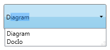
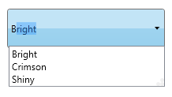
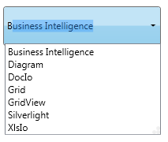

::: {style="DISPLAY: none"}
{#d2h_url_template}{#d2h_package_url style="WIDTH: 0px; DISPLAY: none; HEIGHT: 0px"}
:::

:::: {.d2h_secondary_topic style="PADDING-BOTTOM: 10pt; MARGIN: 0pt; PADDING-LEFT: 0pt; PADDING-RIGHT: 0pt; PADDING-TOP: 0pt"}
#### Custom Filtration Support {#custom-filtration-support style="tab-stops: 0pt"}

AutoComplete supports Custom Filtration of items, which allows you to specify three different search modes for displaying the drop-down list. The **StringMode** property is used to specify the search mode.

When the value of the **StringMode** property is set as StartChar, AutoComplete begins its search from starting index of the strings in the source list collection and the matching results will be displayed in the drop-down list. In the figure shown below, AutoComplete searches using the entered key "D" and displays the matched list.

 

{border="0"}

Figure 31: StringMode---StartChar

**[]{style="FONT-FAMILY: 'Myriad Pro','sans-serif'"}** 

When the value of the **StringMode** property is set as IndexBased, starting index value can be set using the **StringModeIndex** property. In this mode AutoComplete begins its search from the user specified index of the strings in the source list collection and the matching results will be displayed in the drop-down list. In the figure shown below StringModeIndex value is set as "2" and the entered text is "i". The AutoComplete displays the list of items which has "i" in the specified index.

**{border="0"}**

Figure 32: StringMode---IndexBased

**[]{style="FONT-FAMILY: 'Myriad Pro','sans-serif'"}** 

When the value of the **StringMode** property is set as AnyChar, the AutoComplete searches for the strings which has substrings entered in the AutoComplete control. In the figure shown below, based on the entered text "I", the AutoComplete displays the list of items which has as a substring in it.

[]{style="FONT-FAMILY: 'Trebuchet MS','sans-serif'; COLOR: #15428b; FONT-SIZE: 9pt"} 

{border="0"}

Figure 33: StringMode---AnyChar

 

 

Using Custom Filtration Support in an Application

The **StringMode** property will be used to attain this functionality by setting its value as StartChar or IndexBased or AnyChar.

 

+-----------------------------------------------------------------------------------------------------------------------------------------------------------------------------------------------------------------------------------------------------------------------------------------------------------------------------------------------------------------------------------------------------------------------------------------------------------------------------------------------------------------------------------------------------------------------------------------------------------------------------------------------------+
| **[\[XAML\]]{style="FONT-FAMILY: 'Courier New'"}**                                                                                                                                                                                                                                                                                                                                                                                                                                                                                                                                                                                                  |
|                                                                                                                                                                                                                                                                                                                                                                                                                                                                                                                                                                                                                                                     |
| [\<]{style="FONT-FAMILY: 'Courier New'; COLOR: blue"}[syncfusion]{style="FONT-FAMILY: 'Courier New'; COLOR: #a31515"}[:]{style="FONT-FAMILY: 'Courier New'; COLOR: blue"}[AutoComplete]{style="FONT-FAMILY: 'Courier New'; COLOR: #a31515"}[ x]{style="FONT-FAMILY: 'Courier New'; COLOR: red"}[:]{style="FONT-FAMILY: 'Courier New'; COLOR: blue"}[Name]{style="FONT-FAMILY: 'Courier New'; COLOR: red"}[=\"AutoComplete1\"]{style="FONT-FAMILY: 'Courier New'; COLOR: blue"}[ StringMode]{style="FONT-FAMILY: 'Courier New'; COLOR: red"}[=\"StartChar\"/\>]{style="FONT-FAMILY: 'Courier New'; COLOR: blue"}                                     |
|                                                                                                                                                                                                                                                                                                                                                                                                                                                                                                                                                                                                                                                     |
| [\<]{style="FONT-FAMILY: 'Courier New'; COLOR: blue"}[syncfusion]{style="FONT-FAMILY: 'Courier New'; COLOR: #a31515"}[:]{style="FONT-FAMILY: 'Courier New'; COLOR: blue"}[AutoComplete]{style="FONT-FAMILY: 'Courier New'; COLOR: #a31515"}[ x]{style="FONT-FAMILY: 'Courier New'; COLOR: red"}[:]{style="FONT-FAMILY: 'Courier New'; COLOR: blue"}[Name]{style="FONT-FAMILY: 'Courier New'; COLOR: red"}[=\"AutoComplete2\"]{style="FONT-FAMILY: 'Courier New'; COLOR: blue"}[ StringMode]{style="FONT-FAMILY: 'Courier New'; COLOR: red"}[=\"IndexBased\"/\>]{style="FONT-FAMILY: 'Courier New'; COLOR: blue"}                                    |
|                                                                                                                                                                                                                                                                                                                                                                                                                                                                                                                                                                                                                                                     |
| [\<]{style="FONT-FAMILY: 'Courier New'; COLOR: blue"}[syncfusion]{style="FONT-FAMILY: 'Courier New'; COLOR: #a31515"}[:]{style="FONT-FAMILY: 'Courier New'; COLOR: blue"}[AutoComplete]{style="FONT-FAMILY: 'Courier New'; COLOR: #a31515"}[ x]{style="FONT-FAMILY: 'Courier New'; COLOR: red"}[:]{style="FONT-FAMILY: 'Courier New'; COLOR: blue"}[Name]{style="FONT-FAMILY: 'Courier New'; COLOR: red"}[=\"AutoComplete3\"]{style="FONT-FAMILY: 'Courier New'; COLOR: blue"}[ StringMode]{style="FONT-FAMILY: 'Courier New'; COLOR: red"}[=\"AnyChar\"/\>]{style="FONT-FAMILY: 'Courier New'; COLOR: blue"}[]{style="FONT-FAMILY: 'Courier New'"} |
+-----------------------------------------------------------------------------------------------------------------------------------------------------------------------------------------------------------------------------------------------------------------------------------------------------------------------------------------------------------------------------------------------------------------------------------------------------------------------------------------------------------------------------------------------------------------------------------------------------------------------------------------------------+

 

+-------------------------------------------------------------------------------------------------------------------------------------------------------------------------------------------------------------------------------------------------------------------------------------------------------+
| **[\[C#\]]{style="FONT-FAMILY: 'Courier New'"}**                                                                                                                                                                                                                                                      |
|                                                                                                                                                                                                                                                                                                       |
| [AutoComplete]{style="FONT-FAMILY: 'Courier New'; COLOR: teal"}[ autoComplete1 = [new]{style="COLOR: blue"} [AutoComplete]{style="COLOR: teal"}();]{style="FONT-FAMILY: 'Courier New'"}                                                                                                               |
|                                                                                                                                                                                                                                                                                                       |
| [this]{style="FONT-FAMILY: 'Courier New'; COLOR: blue"}[.]{style="FONT-FAMILY: 'Courier New'"}[autoComplete1]{style="FONT-FAMILY: 'Courier New'"}[.StringMode = [StringMode]{style="COLOR: #2b91af"}.StartChar;]{style="FONT-FAMILY: 'Courier New'"}                                                  |
|                                                                                                                                                                                                                                                                                                       |
| [AutoComplete]{style="FONT-FAMILY: 'Courier New'; COLOR: teal"}[ autoComplete2 = [new]{style="COLOR: blue"} [AutoComplete]{style="COLOR: teal"}();]{style="FONT-FAMILY: 'Courier New'"}                                                                                                               |
|                                                                                                                                                                                                                                                                                                       |
| [this]{style="FONT-FAMILY: 'Courier New'; COLOR: blue"}[.]{style="FONT-FAMILY: 'Courier New'"}[autoComplete2]{style="FONT-FAMILY: 'Courier New'"}[.StringMode = [StringMode]{style="COLOR: #2b91af"}.IndexBased;]{style="FONT-FAMILY: 'Courier New'"}                                                 |
|                                                                                                                                                                                                                                                                                                       |
| [this]{style="FONT-FAMILY: 'Courier New'; COLOR: blue"}[.]{style="FONT-FAMILY: 'Courier New'"}[autoComplete2]{style="FONT-FAMILY: 'Courier New'"}[.StringModeIndex = 2;]{style="FONT-FAMILY: 'Courier New'"}                                                                                          |
|                                                                                                                                                                                                                                                                                                       |
| []{style="FONT-FAMILY: 'Courier New'"}                                                                                                                                                                                                                                                                |
|                                                                                                                                                                                                                                                                                                       |
| [AutoComplete]{style="FONT-FAMILY: 'Courier New'; COLOR: teal"}[ autoComplete3 = [new]{style="COLOR: blue"} [AutoComplete]{style="COLOR: teal"}();]{style="FONT-FAMILY: 'Courier New'"}[]{style="FONT-FAMILY: 'Courier New'"}                                                                         |
|                                                                                                                                                                                                                                                                                                       |
| [this]{style="FONT-FAMILY: 'Courier New'; COLOR: blue"}[.]{style="FONT-FAMILY: 'Courier New'"}[autoComplete3]{style="FONT-FAMILY: 'Courier New'"}[.StringMode = [StringMode]{style="COLOR: #2b91af"}.AnyChar;]{style="FONT-FAMILY: 'Courier New'"}[]{style="FONT-FAMILY: Consolas; FONT-SIZE: 9.5pt"} |
+-------------------------------------------------------------------------------------------------------------------------------------------------------------------------------------------------------------------------------------------------------------------------------------------------------+

 

Properties

Table 13: Property Table for Filter

::: {align="center"}
  ------------ ----------------------------------------------------------- -------------------- ------------------ -----------------
  Property     Description                                                 Type                 Data Type          Reference links
  StringMode   Gets or sets the value of StringMode in the AutoComplete.   DependencyProperty   StringMode(enum)   
  ------------ ----------------------------------------------------------- -------------------- ------------------ -----------------
:::

**[]{style="FONT-FAMILY: 'Trebuchet MS','sans-serif'; COLOR: #15428b; FONT-SIZE: 9pt"}** 

Sample Link

WPF Sample Browser-\> Tools -\> Editors -\> AutoComplete Demo

 

[]{#related-topics}
::::
