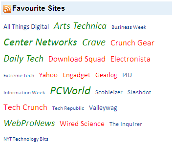

::: {style="DISPLAY: none"}
{#d2h_url_template}{#d2h_package_url style="WIDTH: 0px; DISPLAY: none; HEIGHT: 0px"}
:::

::: {.d2h_secondary_topic style="PADDING-BOTTOM: 10pt; MARGIN: 0pt; PADDING-LEFT: 0pt; PADDING-RIGHT: 0pt; PADDING-TOP: 0pt"}
#### Custom Formatting {#custom-formatting style="tab-stops: 0pt"}

 

The tag cloud control supports custom formatting so that each tag item can be formatted with custom styles to distinguish one tag from another tag.

 

Properties

 

  --------------- --------------------------------------------------------------- ------------------ ------------------ ------------
  Name            Description                                                     Type of property   Value it accepts   Dependency
  QueryItemInfo   Defines the action to be called when rendering each tag item.   Action             Action method      NA
  --------------- --------------------------------------------------------------- ------------------ ------------------ ------------

 

The following steps explain how to perform custom formatting.

1.   In the controller, pass the model to the view.

 

+------------------------------------------------------------------------------------------------------------------------------------------------+
| **[\[Controller\]]{style="FONT-FAMILY: 'Courier New'"}**                                                                                       |
|                                                                                                                                                |
| [public]{style="FONT-FAMILY: 'Courier New'; COLOR: blue"}[ [ActionResult]{style="COLOR: #2b91af"} Index()]{style="FONT-FAMILY: 'Courier New'"} |
|                                                                                                                                                |
| [        {]{style="FONT-FAMILY: 'Courier New'"}                                                                                                |
|                                                                                                                                                |
| [            [Northwind]{style="COLOR: #2b91af"} data = SqlCE;]{style="FONT-FAMILY: 'Courier New'"}                                            |
|                                                                                                                                                |
| [            [//passing the Model to the view]{style="COLOR: green"}]{style="FONT-FAMILY: 'Courier New'"}                                      |
|                                                                                                                                                |
| [            [return]{style="COLOR: blue"} View(data.Blogs);]{style="FONT-FAMILY: 'Courier New'"}                                              |
|                                                                                                                                                |
| [  }  ]{style="FONT-FAMILY: 'Courier New'"}                                                                                                    |
|                                                                                                                                                |
| []{style="FONT-FAMILY: 'Courier New'"}                                                                                                         |
+------------------------------------------------------------------------------------------------------------------------------------------------+

[]{style="FONT-FAMILY: 'Courier New'"} 

2.   [Create a strongly typed view]{.UGHyperlink}[. ]{style="FONT-FAMILY: 'Calibri','sans-serif'"}

3.   In **View**, create a list of tag items and invoke the tag cloud helper with the control ID as the first argument followed by the **DataSource** and **BindTo** methods with the data source and column names for the respective tag item properties as arguments.

[]{style="FONT-FAMILY: 'Calibri','sans-serif'"} 

+------------------------------------------------------------------------------------------------------------------------------------------------------------------------------------------------------------------------------------+
| **View\[ASPX\]**                                                                                                                                                                                                                   |
|                                                                                                                                                                                                                                    |
| [\<%]{style="FONT-FAMILY: 'Courier New'; BACKGROUND: yellow"}[=]{style="FONT-FAMILY: 'Courier New'; COLOR: blue"}[Html.Syncfusion().TagCloud([\"myTagCloud\"]{style="COLOR: #a31515"})]{style="FONT-FAMILY: 'Courier New'"}        |
|                                                                                                                                                                                                                                    |
| [.Title([\"Favourite Sites\"]{style="COLOR: #a31515"})]{style="FONT-FAMILY: 'Courier New'"}                                                                                                                                        |
|                                                                                                                                                                                                                                    |
| [.TitleImageUrl(Url.Content([\"\~/Content/Blog.png\"]{style="COLOR: #a31515"}))        .DataSource(Model)]{style="FONT-FAMILY: 'Courier New'"}                                                                                     |
|                                                                                                                                                                                                                                    |
| [.BindTo(bind=\>]{style="FONT-FAMILY: 'Courier New'"}                                                                                                                                                                              |
|                                                                                                                                                                                                                                    |
| [bind.TagName([\"Title\"]{style="COLOR: #a31515"})]{style="FONT-FAMILY: 'Courier New'"}                                                                                                                                            |
|                                                                                                                                                                                                                                    |
| [    .Frequency([\"Rank\"]{style="COLOR: #a31515"})]{style="FONT-FAMILY: 'Courier New'"}                                                                                                                                           |
|                                                                                                                                                                                                                                    |
| [                      .NavigateUrl([\"Website\"]{style="COLOR: #a31515"}))]{style="FONT-FAMILY: 'Courier New'"}                                                                                                                   |
|                                                                                                                                                                                                                                    |
| [.QueryItemInfo(args =\>{]{style="FONT-FAMILY: 'Courier New'"}                                                                                                                                                                     |
|                                                                                                                                                                                                                                    |
| [     [if]{style="COLOR: blue"} (args.Item.Frequency \>= 805 && args.Item.Frequency \<= 828)]{style="FONT-FAMILY: 'Courier New'"}                                                                                                  |
|                                                                                                                                                                                                                                    |
| [         args.HtmlAttributes.Add([\"style\"]{style="COLOR: #a31515"}, [\"color: #14428D;\"]{style="COLOR: #a31515"});]{style="FONT-FAMILY: 'Courier New'"}                                                                        |
|                                                                                                                                                                                                                                    |
| [     [else]{style="COLOR: blue"} [if]{style="COLOR: blue"} (args.Item.Frequency \> 829 && args.Item.Frequency \<= 855)]{style="FONT-FAMILY: 'Courier New'"}                                                                       |
|                                                                                                                                                                                                                                    |
| [         args.HtmlAttributes.Add([\"style\"]{style="COLOR: #a31515"}, [\"color: Red;\"]{style="COLOR: #a31515"});]{style="FONT-FAMILY: 'Courier New'"}                                                                            |
|                                                                                                                                                                                                                                    |
| [     [else]{style="COLOR: blue"} [if]{style="COLOR: blue"} (args.Item.Frequency \> 856 && args.Item.Frequency \<= 887)                                        ]{style="FONT-FAMILY: 'Courier New'"}                               |
|                                                                                                                                                                                                                                    |
| [args.HtmlAttributes.Add([\"style\"]{style="COLOR: #a31515"}, [\"color: Green;font-style: italic;\"]{style="COLOR: #a31515"});})]{style="FONT-FAMILY: 'Courier New'"}[%\>]{style="FONT-FAMILY: 'Courier New'; BACKGROUND: yellow"} |
|                                                                                                                                                                                                                                    |
| []{style="FONT-FAMILY: 'Courier New'; BACKGROUND: yellow"}                                                                                                                                                                         |
+------------------------------------------------------------------------------------------------------------------------------------------------------------------------------------------------------------------------------------+

[]{style="FONT-FAMILY: Consolas; BACKGROUND: yellow; FONT-SIZE: 9.5pt"} 

[]{style="FONT-FAMILY: 'Calibri','sans-serif'"} 

+--------------------------------------------------------------------------------------------------------------------------------------------------------------------------------------------------------------------------------------------+
| **View\[cshtml\]**                                                                                                                                                                                                                         |
|                                                                                                                                                                                                                                            |
| [\@{]{style="FONT-FAMILY: 'Courier New'; BACKGROUND: yellow"}[ Html.Syncfusion().TagCloud([\"myTagCloud\"]{style="COLOR: #a31515"})]{style="FONT-FAMILY: 'Courier New'"}                                                                   |
|                                                                                                                                                                                                                                            |
| [.Title([\"Favourite Sites\"]{style="COLOR: #a31515"})]{style="FONT-FAMILY: 'Courier New'"}                                                                                                                                                |
|                                                                                                                                                                                                                                            |
| [.TitleImageUrl(Url.Content([\"\~/Content/Blog.png\"]{style="COLOR: #a31515"}))        .DataSource(Model)]{style="FONT-FAMILY: 'Courier New'"}                                                                                             |
|                                                                                                                                                                                                                                            |
| [.BindTo(bind=\>]{style="FONT-FAMILY: 'Courier New'"}                                                                                                                                                                                      |
|                                                                                                                                                                                                                                            |
| [bind.TagName([\"Title\"]{style="COLOR: #a31515"})]{style="FONT-FAMILY: 'Courier New'"}                                                                                                                                                    |
|                                                                                                                                                                                                                                            |
| [    .Frequency([\"Rank\"]{style="COLOR: #a31515"})]{style="FONT-FAMILY: 'Courier New'"}                                                                                                                                                   |
|                                                                                                                                                                                                                                            |
| [                      .NavigateUrl([\"Website\"]{style="COLOR: #a31515"}))]{style="FONT-FAMILY: 'Courier New'"}                                                                                                                           |
|                                                                                                                                                                                                                                            |
| [.QueryItemInfo(args =\>{]{style="FONT-FAMILY: 'Courier New'"}                                                                                                                                                                             |
|                                                                                                                                                                                                                                            |
| [     [if]{style="COLOR: blue"} (args.Item.Frequency \>= 805 && args.Item.Frequency \<= 828)]{style="FONT-FAMILY: 'Courier New'"}                                                                                                          |
|                                                                                                                                                                                                                                            |
| [         args.HtmlAttributes.Add([\"style\"]{style="COLOR: #a31515"}, [\"color: #14428D;\"]{style="COLOR: #a31515"});]{style="FONT-FAMILY: 'Courier New'"}                                                                                |
|                                                                                                                                                                                                                                            |
| [     [else]{style="COLOR: blue"} [if]{style="COLOR: blue"} (args.Item.Frequency \> 829 && args.Item.Frequency \<= 855)]{style="FONT-FAMILY: 'Courier New'"}                                                                               |
|                                                                                                                                                                                                                                            |
| [         args.HtmlAttributes.Add([\"style\"]{style="COLOR: #a31515"}, [\"color: Red;\"]{style="COLOR: #a31515"});]{style="FONT-FAMILY: 'Courier New'"}                                                                                    |
|                                                                                                                                                                                                                                            |
| [     [else]{style="COLOR: blue"} [if]{style="COLOR: blue"} (args.Item.Frequency \> 856 && args.Item.Frequency \<= 887)                                        ]{style="FONT-FAMILY: 'Courier New'"}                                       |
|                                                                                                                                                                                                                                            |
| [args.HtmlAttributes.Add([\"style\"]{style="COLOR: #a31515"}, [\"color: Green;font-style: italic;\"]{style="COLOR: #a31515"});}).Render();]{style="FONT-FAMILY: 'Courier New'"}[}]{style="FONT-FAMILY: 'Courier New'; BACKGROUND: yellow"} |
|                                                                                                                                                                                                                                            |
| []{style="FONT-FAMILY: 'Courier New'; BACKGROUND: yellow"}                                                                                                                                                                                 |
+--------------------------------------------------------------------------------------------------------------------------------------------------------------------------------------------------------------------------------------------+

[]{style="FONT-FAMILY: Consolas; BACKGROUND: yellow; FONT-SIZE: 9.5pt"} 

4.   Build and run the application.

The following figure shows the output of the tag cloud control with custom formatting.

 

{border="0"}

Figure 276: Tag Cloud with Custom Formatting

 

[]{#related-topics}
:::
