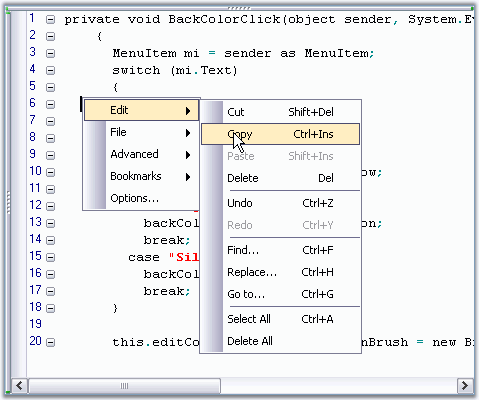
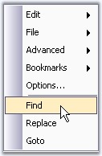

::: {style="DISPLAY: none"}
{#d2h_url_template}{#d2h_package_url style="WIDTH: 0px; DISPLAY: none; HEIGHT: 0px"}
:::

:::: {.d2h_secondary_topic style="PADDING-BOTTOM: 10pt; MARGIN: 0pt; PADDING-LEFT: 0pt; PADDING-RIGHT: 0pt; PADDING-TOP: 0pt"}
##### Customizable Context Menu {#customizable-context-menu style="tab-stops: 0pt"}

[]{style="FONT-FAMILY: 'Trebuchet MS','sans-serif'; COLOR: red; FONT-SIZE: 9pt"} 

Edit Control has a built-in context menu which is enabled, by default. This context menu allows you to edit the contents, and open or create a new file. It includes some advanced features like indent selection, comment selection, adding bookmarks, and much more. This is enabled by using the **EditControl1.ContextMenuManager.Enabled** property.

[]{style="FONT-FAMILY: 'Trebuchet MS','sans-serif'; COLOR: #15428b; FONT-SIZE: 9pt"} 

The context menu has the standard VS.NET-like appearance, and can optionally be provided with the Office 2003 appearance.

[]{style="FONT-FAMILY: 'Trebuchet MS','sans-serif'; COLOR: #15428b; FONT-SIZE: 9pt"} 

{border="0"}

Figure 53: Edit Control\'s Context Menu in Office2003 Style

 

Set the appearance of the context menu by specifying the desired **ContextMenuProvider**.

 

+---------------------------------------------------------------------------------------------------------------------------------------------------------------------------------------------------------------------------------------------------------+
| **[\[C#\]]{style="FONT-FAMILY: 'Courier New'; COLOR: black"}**                                                                                                                                                                                          |
|                                                                                                                                                                                                                                                         |
| []{style="FONT-FAMILY: 'Courier New'; COLOR: black"}                                                                                                                                                                                                    |
|                                                                                                                                                                                                                                                         |
| [// Show Office2003 style context menu.]{style="FONT-FAMILY: 'Courier New'; COLOR: green"}                                                                                                                                                              |
|                                                                                                                                                                                                                                                         |
| [this]{style="FONT-FAMILY: 'Courier New'; COLOR: blue"}[.editControl1.ContextMenuManager.ContextMenuProvider = [new]{style="COLOR: blue"} Syncfusion.Windows.Forms.Tools.XPMenus.XPMenusProvider();]{style="FONT-FAMILY: 'Courier New'"}                |
|                                                                                                                                                                                                                                                         |
| []{style="FONT-FAMILY: 'Courier New'"}                                                                                                                                                                                                                  |
|                                                                                                                                                                                                                                                         |
| [// Show Standard style context menu.]{style="FONT-FAMILY: 'Courier New'; COLOR: green"}                                                                                                                                                                |
|                                                                                                                                                                                                                                                         |
| [this]{style="FONT-FAMILY: 'Courier New'; COLOR: blue"}[.editControl1.ContextMenuManager.ContextMenuProvider = [new]{style="COLOR: blue"} Syncfusion.Windows.Forms.[StandardMenusProvider]{style="COLOR: teal"}();]{style="FONT-FAMILY: 'Courier New'"} |
+---------------------------------------------------------------------------------------------------------------------------------------------------------------------------------------------------------------------------------------------------------+

[]{style="FONT-FAMILY: 'Trebuchet MS','sans-serif'; COLOR: #15428b; FONT-SIZE: 9pt"} 

+---------------------------------------------------------------------------------------------------------------------------------------------------------------------------------------------------------------------------------------+
| **[\[VB.NET\]]{style="FONT-FAMILY: 'Courier New'; COLOR: black"}**                                                                                                                                                                    |
|                                                                                                                                                                                                                                       |
| []{style="FONT-FAMILY: 'Courier New'; COLOR: black"}                                                                                                                                                                                  |
|                                                                                                                                                                                                                                       |
| [\' Show Office2003 style context menu]{style="FONT-FAMILY: 'Courier New'; COLOR: green"}                                                                                                                                             |
|                                                                                                                                                                                                                                       |
| [Me]{style="FONT-FAMILY: 'Courier New'; COLOR: blue"}[.editControl1.ContextMenuManager.ContextMenuProvider = [New]{style="COLOR: blue"} Syncfusion.Windows.Forms.Tools.XPMenus.XPMenusProvider()]{style="FONT-FAMILY: 'Courier New'"} |
|                                                                                                                                                                                                                                       |
| [        ]{style="FONT-FAMILY: 'Courier New'"}                                                                                                                                                                                        |
|                                                                                                                                                                                                                                       |
| [\' Show Standard style context menu]{style="FONT-FAMILY: 'Courier New'; COLOR: green"}                                                                                                                                               |
|                                                                                                                                                                                                                                       |
| [Me]{style="FONT-FAMILY: 'Courier New'; COLOR: blue"}[.editControl1.ContextMenuManager.ContextMenuProvider = [New]{style="COLOR: blue"} Syncfusion.Windows.Forms.StandardMenusProvider()]{style="FONT-FAMILY: 'Courier New'"}         |
+---------------------------------------------------------------------------------------------------------------------------------------------------------------------------------------------------------------------------------------+

 

**Adding Customized Menu Items**

 

You can handle the **MenuFill** event to add Menu Items to the context menu. This is illustrated in the below code snippet.

 

+--------------------------------------------------------------------------------------------------------------------------------------------------------------------------------------------------------------------+
| **[\[C#\]]{style="FONT-FAMILY: 'Courier New'; COLOR: black"}**                                                                                                                                                     |
|                                                                                                                                                                                                                    |
| []{style="FONT-FAMILY: 'Courier New'; COLOR: black"}                                                                                                                                                               |
|                                                                                                                                                                                                                    |
| [// Handle the MenuFill event which is called each time the context menu is displayed.]{style="FONT-FAMILY: 'Courier New'; COLOR: green"}                                                                          |
|                                                                                                                                                                                                                    |
| [this]{style="FONT-FAMILY: 'Courier New'; COLOR: blue"}[.editControl1.MenuFill += [new]{style="COLOR: blue"} [EventHandler]{style="COLOR: teal"}(cm_FillMenu);]{style="FONT-FAMILY: 'Courier New'"}                |
|                                                                                                                                                                                                                    |
| []{style="FONT-FAMILY: 'Courier New'"}                                                                                                                                                                             |
|                                                                                                                                                                                                                    |
| [private]{style="FONT-FAMILY: 'Courier New'; COLOR: blue"}[ [void]{style="COLOR: blue"} cm_FillMenu([object]{style="COLOR: blue"} sender, [EventArgs]{style="COLOR: teal"} e)]{style="FONT-FAMILY: 'Courier New'"} |
|                                                                                                                                                                                                                    |
| [{]{style="FONT-FAMILY: 'Courier New'"}                                                                                                                                                                            |
|                                                                                                                                                                                                                    |
| [ContextMenuManager cm = (ContextMenuManager) sender;]{style="FONT-FAMILY: 'Courier New'"}                                                                                                                         |
|                                                                                                                                                                                                                    |
| [         ]{style="FONT-FAMILY: 'Courier New'"}                                                                                                                                                                    |
|                                                                                                                                                                                                                    |
| [// To clear default context menu items.]{style="FONT-FAMILY: 'Courier New'; COLOR: green"}                                                                                                                        |
|                                                                                                                                                                                                                    |
| [cm.ClearMenu();]{style="FONT-FAMILY: 'Courier New'"}                                                                                                                                                              |
|                                                                                                                                                                                                                    |
| []{style="FONT-FAMILY: 'Courier New'"}                                                                                                                                                                             |
|                                                                                                                                                                                                                    |
| [// Add a separator.]{style="FONT-FAMILY: 'Courier New'; COLOR: green"}                                                                                                                                            |
|                                                                                                                                                                                                                    |
| [cm.AddSeparator();]{style="FONT-FAMILY: 'Courier New'"}                                                                                                                                                           |
|                                                                                                                                                                                                                    |
| []{style="FONT-FAMILY: 'Courier New'"}                                                                                                                                                                             |
|                                                                                                                                                                                                                    |
| [// Add custom context menu items and their Click eventhandlers.]{style="FONT-FAMILY: 'Courier New'; COLOR: green"}                                                                                                |
|                                                                                                                                                                                                                    |
| [cm.AddMenuItem([\"&Find\"]{style="COLOR: maroon"}, [new]{style="COLOR: blue"} [EventHandler]{style="COLOR: teal"}(ShowFindDialog));]{style="FONT-FAMILY: 'Courier New'"}                                          |
|                                                                                                                                                                                                                    |
| [cm.AddMenuItem([\"&Replace\"]{style="COLOR: maroon"}, [new]{style="COLOR: blue"} [EventHandler]{style="COLOR: teal"}(ShowReplaceDialog));]{style="FONT-FAMILY: 'Courier New'"}                                    |
|                                                                                                                                                                                                                    |
| [cm.AddMenuItem([\"&Goto\"]{style="COLOR: maroon"}, [new]{style="COLOR: blue"} [EventHandler]{style="COLOR: teal"}(ShowGoToDialog));]{style="FONT-FAMILY: 'Courier New'"}                                          |
|                                                                                                                                                                                                                    |
| [               ]{style="FONT-FAMILY: 'Courier New'"}                                                                                                                                                              |
|                                                                                                                                                                                                                    |
| [// If you need to get access to the underlying menu provider you can access it using the below given code.]{style="FONT-FAMILY: 'Courier New'; COLOR: green"}                                                     |
|                                                                                                                                                                                                                    |
| [Syncfusion.Windows.Forms.[IContextMenuProvider]{style="COLOR: teal"} contextMenuProvider = [this]{style="COLOR: blue"}.editControl1.ContextMenuManager.ContextMenuProvider;]{style="FONT-FAMILY: 'Courier New'"}  |
|                                                                                                                                                                                                                    |
| [}]{style="FONT-FAMILY: 'Courier New'"}                                                                                                                                                                            |
|                                                                                                                                                                                                                    |
| []{style="FONT-FAMILY: 'Courier New'"}                                                                                                                                                                             |
|                                                                                                                                                                                                                    |
| [// Calling the in-built dialogs.]{style="FONT-FAMILY: 'Courier New'; COLOR: green"}                                                                                                                               |
|                                                                                                                                                                                                                    |
| []{style="FONT-FAMILY: 'Courier New'; COLOR: green"}                                                                                                                                                               |
|                                                                                                                                                                                                                    |
| [void]{style="FONT-FAMILY: 'Courier New'; COLOR: blue"}[ ShowFindDialog([object]{style="COLOR: blue"} sender, [EventArgs]{style="COLOR: teal"} e)]{style="FONT-FAMILY: 'Courier New'"}                             |
|                                                                                                                                                                                                                    |
| [{]{style="FONT-FAMILY: 'Courier New'"}                                                                                                                                                                            |
|                                                                                                                                                                                                                    |
| [    [this]{style="COLOR: blue"}.editControl1.ShowFindDialog();]{style="FONT-FAMILY: 'Courier New'"}                                                                                                               |
|                                                                                                                                                                                                                    |
| [}]{style="FONT-FAMILY: 'Courier New'"}                                                                                                                                                                            |
|                                                                                                                                                                                                                    |
| []{style="FONT-FAMILY: 'Courier New'"}                                                                                                                                                                             |
|                                                                                                                                                                                                                    |
| [void]{style="FONT-FAMILY: 'Courier New'; COLOR: blue"}[ ShowReplaceDialog([object]{style="COLOR: blue"} sender, [EventArgs]{style="COLOR: teal"} e)]{style="FONT-FAMILY: 'Courier New'"}                          |
|                                                                                                                                                                                                                    |
| [{]{style="FONT-FAMILY: 'Courier New'"}                                                                                                                                                                            |
|                                                                                                                                                                                                                    |
| [    [this]{style="COLOR: blue"}.editControl1.ShowReplaceDialog();]{style="FONT-FAMILY: 'Courier New'"}                                                                                                            |
|                                                                                                                                                                                                                    |
| [}]{style="FONT-FAMILY: 'Courier New'"}                                                                                                                                                                            |
|                                                                                                                                                                                                                    |
| []{style="FONT-FAMILY: 'Courier New'"}                                                                                                                                                                             |
|                                                                                                                                                                                                                    |
| [void]{style="FONT-FAMILY: 'Courier New'; COLOR: blue"}[ ShowGoToDialog([object]{style="COLOR: blue"} sender, [EventArgs]{style="COLOR: teal"} e)]{style="FONT-FAMILY: 'Courier New'"}                             |
|                                                                                                                                                                                                                    |
| [{]{style="FONT-FAMILY: 'Courier New'"}                                                                                                                                                                            |
|                                                                                                                                                                                                                    |
| [this]{style="FONT-FAMILY: 'Courier New'; COLOR: blue"}[.editControl1.ShowGoToDialog();]{style="FONT-FAMILY: 'Courier New'"}                                                                                       |
|                                                                                                                                                                                                                    |
| [}]{style="FONT-FAMILY: 'Courier New'"}                                                                                                                                                                            |
+--------------------------------------------------------------------------------------------------------------------------------------------------------------------------------------------------------------------+

[]{style="FONT-FAMILY: 'Trebuchet MS','sans-serif'; COLOR: #15428b; FONT-SIZE: 9pt"} 

+----------------------------------------------------------------------------------------------------------------------------------------------------------------------------------------------------------------------------------------------------------------------------------------------------------+
| **[\[VB.NET\]]{style="FONT-FAMILY: 'Courier New'; COLOR: black"}**                                                                                                                                                                                                                                       |
|                                                                                                                                                                                                                                                                                                          |
| []{style="FONT-FAMILY: 'Courier New'; COLOR: black"}                                                                                                                                                                                                                                                     |
|                                                                                                                                                                                                                                                                                                          |
| [\' Handle the MenuFill event which is called each time the context menu is displayed.]{style="FONT-FAMILY: 'Courier New'; COLOR: green"}                                                                                                                                                                |
|                                                                                                                                                                                                                                                                                                          |
| [AddHandler]{style="FONT-FAMILY: 'Courier New'; COLOR: blue"}[ [Me]{style="COLOR: blue"}.editControl1.MenuFill, [AddressOf]{style="COLOR: blue"} cm_FillMenu]{style="FONT-FAMILY: 'Courier New'"}                                                                                                        |
|                                                                                                                                                                                                                                                                                                          |
| []{style="FONT-FAMILY: 'Courier New'"}                                                                                                                                                                                                                                                                   |
|                                                                                                                                                                                                                                                                                                          |
| [Private]{style="FONT-FAMILY: 'Courier New'; COLOR: blue"}[ [Sub]{style="COLOR: blue"} cm_FillMenu([ByVal]{style="COLOR: blue"} sender [As]{style="COLOR: blue"} [Object]{style="COLOR: blue"}, [ByVal]{style="COLOR: blue"} e [As]{style="COLOR: blue"} EventArgs)]{style="FONT-FAMILY: 'Courier New'"} |
|                                                                                                                                                                                                                                                                                                          |
| [Dim]{style="FONT-FAMILY: 'Courier New'; COLOR: blue"}[ cm [As]{style="COLOR: blue"} ContextMenuManager = [CType]{style="COLOR: blue"}(sender, ContextMenuManager)]{style="FONT-FAMILY: 'Courier New'"}                                                                                                  |
|                                                                                                                                                                                                                                                                                                          |
| []{style="FONT-FAMILY: 'Courier New'"}                                                                                                                                                                                                                                                                   |
|                                                                                                                                                                                                                                                                                                          |
| [\' To clear default context menu items.]{style="FONT-FAMILY: 'Courier New'; COLOR: green"}                                                                                                                                                                                                              |
|                                                                                                                                                                                                                                                                                                          |
| [cm.ClearMenu();]{style="FONT-FAMILY: 'Courier New'"}                                                                                                                                                                                                                                                    |
|                                                                                                                                                                                                                                                                                                          |
| []{style="FONT-FAMILY: 'Courier New'"}                                                                                                                                                                                                                                                                   |
|                                                                                                                                                                                                                                                                                                          |
| [\' Add a separator.]{style="FONT-FAMILY: 'Courier New'; COLOR: green"}                                                                                                                                                                                                                                  |
|                                                                                                                                                                                                                                                                                                          |
| [cm.AddSeparator()]{style="FONT-FAMILY: 'Courier New'"}                                                                                                                                                                                                                                                  |
|                                                                                                                                                                                                                                                                                                          |
| []{style="FONT-FAMILY: 'Courier New'"}                                                                                                                                                                                                                                                                   |
|                                                                                                                                                                                                                                                                                                          |
| [\' Add custom context menu items and their Click eventhandlers.]{style="FONT-FAMILY: 'Courier New'; COLOR: green"}                                                                                                                                                                                      |
|                                                                                                                                                                                                                                                                                                          |
| [cm.AddMenuItem([\"&Find\"]{style="COLOR: maroon"}, [New]{style="COLOR: blue"} EventHandler([AddressOf]{style="COLOR: blue"} ShowFindDialog))]{style="FONT-FAMILY: 'Courier New'"}                                                                                                                       |
|                                                                                                                                                                                                                                                                                                          |
| [cm.AddMenuItem([\"&Replace\"]{style="COLOR: maroon"}, [New]{style="COLOR: blue"} EventHandler([AddressOf]{style="COLOR: blue"} ShowReplaceDialog))]{style="FONT-FAMILY: 'Courier New'"}                                                                                                                 |
|                                                                                                                                                                                                                                                                                                          |
| [cm.AddMenuItem([\"&Goto\"]{style="COLOR: maroon"}, [New]{style="COLOR: blue"} EventHandler([AddressOf]{style="COLOR: blue"} ShowGoToDialog))]{style="FONT-FAMILY: 'Courier New'"}                                                                                                                       |
|                                                                                                                                                                                                                                                                                                          |
| []{style="FONT-FAMILY: 'Courier New'"}                                                                                                                                                                                                                                                                   |
|                                                                                                                                                                                                                                                                                                          |
| [\' If you need to get access to the underlying menu provider you can access it using the below given code.]{style="FONT-FAMILY: 'Courier New'; COLOR: green"}                                                                                                                                           |
|                                                                                                                                                                                                                                                                                                          |
| [Dim]{style="FONT-FAMILY: 'Courier New'; COLOR: blue"}[ contextMenuProvider [As]{style="COLOR: blue"} Syncfusion.Windows.Forms.IContextMenuProvider = [Me]{style="COLOR: blue"}.editControl1.ContextMenuManager.ContextMenuProvider]{style="FONT-FAMILY: 'Courier New'"}                                 |
|                                                                                                                                                                                                                                                                                                          |
| [End]{style="FONT-FAMILY: 'Courier New'; COLOR: blue"}[ [Sub]{style="COLOR: blue"} [\'cm_FillMenu]{style="COLOR: green"}]{style="FONT-FAMILY: 'Courier New'"}                                                                                                                                            |
|                                                                                                                                                                                                                                                                                                          |
| []{style="FONT-FAMILY: 'Courier New'; COLOR: green"}                                                                                                                                                                                                                                                     |
|                                                                                                                                                                                                                                                                                                          |
| [\' Calling the in-built dialogs.]{style="FONT-FAMILY: 'Courier New'; COLOR: green"}                                                                                                                                                                                                                     |
|                                                                                                                                                                                                                                                                                                          |
| [Sub]{style="FONT-FAMILY: 'Courier New'; COLOR: blue"}[ ShowFindDialog([ByVal]{style="COLOR: blue"} sender [As]{style="COLOR: blue"} [Object]{style="COLOR: blue"}, [ByVal]{style="COLOR: blue"} e [As]{style="COLOR: blue"} EventArgs)]{style="FONT-FAMILY: 'Courier New'"}                             |
|                                                                                                                                                                                                                                                                                                          |
| [Me]{style="FONT-FAMILY: 'Courier New'; COLOR: blue"}[.editControl1.FindDialog()]{style="FONT-FAMILY: 'Courier New'"}                                                                                                                                                                                    |
|                                                                                                                                                                                                                                                                                                          |
| [End]{style="FONT-FAMILY: 'Courier New'; COLOR: blue"}[ [Sub]{style="COLOR: blue"} ]{style="FONT-FAMILY: 'Courier New'"}                                                                                                                                                                                 |
|                                                                                                                                                                                                                                                                                                          |
| []{style="FONT-FAMILY: 'Courier New'; COLOR: green"}                                                                                                                                                                                                                                                     |
|                                                                                                                                                                                                                                                                                                          |
| [Sub]{style="FONT-FAMILY: 'Courier New'; COLOR: blue"}[ ShowReplaceDialog([ByVal]{style="COLOR: blue"} sender [As]{style="COLOR: blue"} [Object]{style="COLOR: blue"}, [ByVal]{style="COLOR: blue"} e [As]{style="COLOR: blue"} EventArgs)]{style="FONT-FAMILY: 'Courier New'"}                          |
|                                                                                                                                                                                                                                                                                                          |
| [Me]{style="FONT-FAMILY: 'Courier New'; COLOR: blue"}[.editControl1.ReplaceDialog()]{style="FONT-FAMILY: 'Courier New'"}                                                                                                                                                                                 |
|                                                                                                                                                                                                                                                                                                          |
| [End]{style="FONT-FAMILY: 'Courier New'; COLOR: blue"}[ [Sub]{style="COLOR: blue"}]{style="FONT-FAMILY: 'Courier New'"}                                                                                                                                                                                  |
|                                                                                                                                                                                                                                                                                                          |
| []{style="FONT-FAMILY: 'Courier New'; COLOR: green"}                                                                                                                                                                                                                                                     |
|                                                                                                                                                                                                                                                                                                          |
| [Sub]{style="FONT-FAMILY: 'Courier New'; COLOR: blue"}[ ShowGoToDialog([ByVal]{style="COLOR: blue"} sender [As]{style="COLOR: blue"} [Object]{style="COLOR: blue"}, [ByVal]{style="COLOR: blue"} e [As]{style="COLOR: blue"} EventArgs)]{style="FONT-FAMILY: 'Courier New'"}                             |
|                                                                                                                                                                                                                                                                                                          |
| [Me]{style="FONT-FAMILY: 'Courier New'; COLOR: blue"}[.editControl1.GoToDialog()]{style="FONT-FAMILY: 'Courier New'"}                                                                                                                                                                                    |
|                                                                                                                                                                                                                                                                                                          |
| [End]{style="FONT-FAMILY: 'Courier New'; COLOR: blue"}[ [Sub]{style="COLOR: blue"}]{style="FONT-FAMILY: 'Courier New'"}                                                                                                                                                                                  |
+----------------------------------------------------------------------------------------------------------------------------------------------------------------------------------------------------------------------------------------------------------------------------------------------------------+

[]{style="FONT-FAMILY: 'Trebuchet MS','sans-serif'; COLOR: #15428b; FONT-SIZE: 9pt"} 

{border="0"}

Figure 54: Customized Find, Replace and Goto Menu Items in Context Menu

 

**Assembly Dependency**

 

If the Syncfusion.Tools.Windows assembly is loaded before the instantiation of the context menu, then an XPMenus.PopupMenu is displayed as the context menu. Otherwise, a standard .NET context menu is shown.

 

::: {style="BORDER-BOTTOM: windowtext 1pt solid; BORDER-LEFT: medium none; PADDING-BOTTOM: 1pt; MARGIN-TOP: 9pt; PADDING-LEFT: 0pt; PADDING-RIGHT: 0pt; MARGIN-BOTTOM: 9pt; BORDER-TOP: windowtext 1pt solid; BORDER-RIGHT: medium none; PADDING-TOP: 1pt"}
{border="0"}Note: You must have reference to the Syncfusion.Tools.Windows assembly in your project.
:::

 

A sample demonstrating the Context Menu feature is available in the following sample installation path.

 

***..\\My Documents\\Syncfusion\\EssentialStudio\\Version Number\\Windows\\Edit.Windows\\Samples\\2.0\\Advanced Editor Functions\\ContextMenuDemo***

[]{#p74} 

[]{#related-topics}
::::
