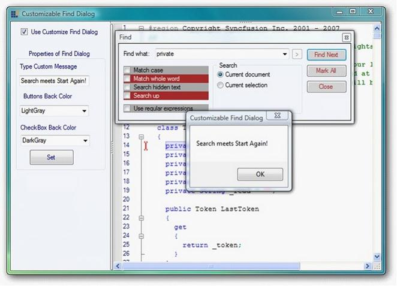

::: {style="DISPLAY: none"}
{#d2h_url_template}{#d2h_package_url style="WIDTH: 0px; DISPLAY: none; HEIGHT: 0px"}
:::

::::: {#nsbanner .d2h_main_nsbanner style="BORDER-BOTTOM: #999999 1px solid; POSITION: relative; PADDING-BOTTOM: 0px; BACKGROUND-COLOR: transparent; PADDING-LEFT: 0px; PADDING-RIGHT: 0px; DISPLAY: none; BORDER-TOP: #999999 1px solid; PADDING-TOP: 0px; LEFT: 0px"}
:::: {#TitleRow .d2h_main_titlerow style="PADDING-BOTTOM: 4px; BACKGROUND-COLOR: transparent; PADDING-LEFT: 22px; WIDTH: 100%; PADDING-RIGHT: 10px; DISPLAY: none; PADDING-TOP: 4px"}
::: {#ienav .d2h_main_ienav style="DISPLAY: none"}
{#D2HPrevious .D2HPreviousEnabled}  {#D2HNext .D2HNextEnabled}
:::
::::
:::::

:::: {#nstext .d2h_main_nstext style="PADDING-BOTTOM: 10px; BACKGROUND-COLOR: transparent; PADDING-LEFT: 22px; PADDING-RIGHT: 10px; HEIGHT: 100%; OVERFLOW: auto; PADDING-TOP: 5px" hasuserbackground="true" valign="bottom"}
::: {#d2h_breadcrumbs .d2h_breadcrumbs}
[Essential Studio User Guide Documentation](ms-xhelp:///?Id=12457748-09e3-4d74-a240-8e049cedf030){.d2h_breadcrumbsNormal}[ \> ]{.d2h_breadcrumbsLinkSeparator}[User Interface Edition](ms-xhelp:///?Id=c29296b7-531c-413b-a0ec-488ca1f7f669){.d2h_breadcrumbsNormal}[ \> ]{.d2h_breadcrumbsLinkSeparator}[Essential Windows](ms-xhelp:///?Id=e60759d8-47a4-4570-9d7a-16a68d63f2ea){.d2h_breadcrumbsNormal}[ \> ]{.d2h_breadcrumbsLinkSeparator}[Essential Edit]{.d2h_breadcrumbsContentsOnly}[ \> ]{.d2h_breadcrumbsLinkSeparator}[Concepts And Features](ms-xhelp:///?Id=7c39cee6-8434-4711-a18e-efaba8ac85c0){.d2h_breadcrumbsNormal}[ \> ]{.d2h_breadcrumbsLinkSeparator}[Appearance](ms-xhelp:///?Id=8629fda6-ad48-4d6d-a648-9baa247658cb){.d2h_breadcrumbsNormal}
:::

### Customizable Find Dialog {#customizable-find-dialog style="tab-stops: 0pt"}

 

Essential Edit now enables you to create a new find dialog by inheriting Essential Edit's find dialog. You can customize the **Find Dialog** by changing the properties and triggers the events of the buttons such as **Find**, **Mark All** and **Close**. You can also easily localize the captions of the controls in the **Find dialog**.

 

**Creating a Class for Own Find Dialog**

 

Create a class for own find dialog that inherits the **frmFindDialog** class.

The following code illustrates this.

 

+------------------------------------------------------------------------------------------------------------------------------------------------------------------------------------------------------------------------------------------------------+
| **[\[C#\]]{style="FONT-FAMILY: 'Courier New'"}**                                                                                                                                                                                                     |
|                                                                                                                                                                                                                                                      |
| **[]{style="FONT-FAMILY: 'Courier New'"}**                                                                                                                                                                                                           |
|                                                                                                                                                                                                                                                      |
| [//Inherits the frmFindDialog]{style="FONT-FAMILY: 'Courier New'"}                                                                                                                                                                                   |
|                                                                                                                                                                                                                                                      |
| [public]{style="FONT-FAMILY: 'Courier New'; COLOR: blue"}[ [class]{style="COLOR: blue"} [FindDialogExt]{style="COLOR: #2b91af"} : Syncfusion.Windows.Forms.Edit.Dialogs.[frmFindDialog]{style="COLOR: #2b91af"}]{style="FONT-FAMILY: 'Courier New'"} |
+------------------------------------------------------------------------------------------------------------------------------------------------------------------------------------------------------------------------------------------------------+

[]{style="FONT-FAMILY: 'Times New Roman','serif'"} 

+--------------------------------------------------------------------------------------------------------------------------------------------+
| **[\[VB.NET\]]{style="FONT-FAMILY: 'Courier New'"}**                                                                                       |
|                                                                                                                                            |
| **[]{style="FONT-FAMILY: 'Courier New'"}**                                                                                                 |
|                                                                                                                                            |
| ['Inherits the frmFindDialog.]{style="FONT-FAMILY: 'Courier New'"}                                                                         |
|                                                                                                                                            |
| [Public]{style="FONT-FAMILY: 'Courier New'; COLOR: blue"}[ [Class]{style="COLOR: blue"} FindDialogExt]{style="FONT-FAMILY: 'Courier New'"} |
|                                                                                                                                            |
| [     [Inherits]{style="COLOR: blue"} Syncfusion.Windows.Forms.Edit.Dialogs.frmFindDialog]{style="FONT-FAMILY: 'Courier New'"}             |
|                                                                                                                                            |
| [End]{style="FONT-FAMILY: 'Courier New'; COLOR: blue"}[ [Class]{style="COLOR: blue"}]{style="FONT-FAMILY: 'Courier New'"}                  |
+--------------------------------------------------------------------------------------------------------------------------------------------+

[]{style="FONT-FAMILY: 'Times New Roman','serif'"} 

FindComplete Event

**[]{style="FONT-FAMILY: 'Trebuchet MS','sans-serif'; COLOR: #15428b; FONT-SIZE: 9pt"}** 

This event occurs in **FindNext()** when search reaches the starting point of the search before the message box displays.

The event handler receives an argument of **FindCompleteEventArgs** . This argument class sets the text for message box. Users can localize this text.

[]{style="FONT-FAMILY: 'Trebuchet MS','sans-serif'; COLOR: #15428b; FONT-SIZE: 9pt"} 

+-------------------------------------------------------------------------------------------------------------------------------------------------------------------------------------------------------------------------------------------------+
| **[\[C#\]]{style="FONT-FAMILY: 'Courier New'"}**                                                                                                                                                                                                |
|                                                                                                                                                                                                                                                 |
| [            ]{style="FONT-FAMILY: 'Courier New'"}                                                                                                                                                                                              |
|                                                                                                                                                                                                                                                 |
| [// Handle the FindComplete event.]{style="FONT-FAMILY: 'Courier New'; COLOR: green"}                                                                                                                                                           |
|                                                                                                                                                                                                                                                 |
| [            [this]{style="COLOR: blue"}.FindComplete += [new]{style="COLOR: blue"} [EventHandler]{style="COLOR: #2b91af"}\<[FindCompleteEventArgs]{style="COLOR: #2b91af"}\>(FindDialogExt_FindComplete);]{style="FONT-FAMILY: 'Courier New'"} |
|                                                                                                                                                                                                                                                 |
| []{style="FONT-FAMILY: 'Courier New'"}                                                                                                                                                                                                          |
|                                                                                                                                                                                                                                                 |
| [        [//Set the value for message box for when search reaches the starting point of search]{style="COLOR: green"}]{style="FONT-FAMILY: 'Courier New'"}                                                                                      |
|                                                                                                                                                                                                                                                 |
| [        [void]{style="COLOR: blue"} FindDialogExt_FindComplete([object]{style="COLOR: blue"} sender, [frmFindDialog]{style="COLOR: #2b91af"}.[FindCompleteEventArgs]{style="COLOR: #2b91af"} e)]{style="FONT-FAMILY: 'Courier New'"}           |
|                                                                                                                                                                                                                                                 |
| [        {]{style="FONT-FAMILY: 'Courier New'"}                                                                                                                                                                                                 |
|                                                                                                                                                                                                                                                 |
| [            [//Arabic text as message(localize)]{style="COLOR: green"}]{style="FONT-FAMILY: 'Courier New'"}                                                                                                                                    |
|                                                                                                                                                                                                                                                 |
| [            [if]{style="COLOR: blue"} (messageString != [string]{style="COLOR: blue"}.Empty)]{style="FONT-FAMILY: 'Courier New'"}                                                                                                              |
|                                                                                                                                                                                                                                                 |
| [                e.Message = [\"[انتهى]{dir="rtl"}\"]{style="COLOR: #a31515"};]{style="FONT-FAMILY: 'Courier New'"}                                                                                                                             |
|                                                                                                                                                                                                                                                 |
| [            [else]{style="COLOR: blue"}]{style="FONT-FAMILY: 'Courier New'"}                                                                                                                                                                   |
|                                                                                                                                                                                                                                                 |
| [                e.Message = [\"Find reached the starting point of the search.\"]{style="COLOR: #a31515"};]{style="FONT-FAMILY: 'Courier New'"}                                                                                                 |
|                                                                                                                                                                                                                                                 |
| [        }]{style="FONT-FAMILY: 'Courier New'"}                                                                                                                                                                                                 |
+-------------------------------------------------------------------------------------------------------------------------------------------------------------------------------------------------------------------------------------------------+

[]{style="FONT-FAMILY: 'Times New Roman','serif'"} 

+---------------------------------------------------------------------------------------------------------------------------------------------------------------------------------------------------------------------------------------------------------------------------------------------------------------------------------------------------+
| **[\[VB.NET\]]{style="FONT-FAMILY: 'Courier New'"}**                                                                                                                                                                                                                                                                                              |
|                                                                                                                                                                                                                                                                                                                                                   |
| **[]{style="FONT-FAMILY: 'Courier New'"}**                                                                                                                                                                                                                                                                                                        |
|                                                                                                                                                                                                                                                                                                                                                   |
| [\' Handle the FindComplete event.]{style="FONT-FAMILY: 'Courier New'; COLOR: green"}                                                                                                                                                                                                                                                             |
|                                                                                                                                                                                                                                                                                                                                                   |
| []{style="FONT-FAMILY: 'Courier New'; COLOR: blue"}                                                                                                                                                                                                                                                                                               |
|                                                                                                                                                                                                                                                                                                                                                   |
| [Private]{style="FONT-FAMILY: 'Courier New'; COLOR: blue"}[ [Me]{style="COLOR: blue"}.editControl1.FindComplete += [New]{style="COLOR: blue"} EventHandler([Of]{style="COLOR: blue"} FindCompleteEventArgs)([AddressOf]{style="COLOR: blue"} FindDialogExt_FindComplete)           ]{style="FONT-FAMILY: 'Courier New'"}                          |
|                                                                                                                                                                                                                                                                                                                                                   |
| [     ]{style="FONT-FAMILY: 'Courier New'"}                                                                                                                                                                                                                                                                                                       |
|                                                                                                                                                                                                                                                                                                                                                   |
| [\'Set the value for message box for when search reaches the starting point of search]{style="FONT-FAMILY: 'Courier New'; COLOR: green"}                                                                                                                                                                                                          |
|                                                                                                                                                                                                                                                                                                                                                   |
| []{style="FONT-FAMILY: 'Courier New'"}                                                                                                                                                                                                                                                                                                            |
|                                                                                                                                                                                                                                                                                                                                                   |
| [Private]{style="FONT-FAMILY: 'Courier New'; COLOR: blue"}[ [Sub]{style="COLOR: blue"} FindDialogExt_FindComplete([ByVal]{style="COLOR: blue"} sender [As]{style="COLOR: blue"} [Object]{style="COLOR: blue"}, [ByVal]{style="COLOR: blue"} e [As]{style="COLOR: blue"} frmFindDialog.FindCompleteEventArgs)]{style="FONT-FAMILY: 'Courier New'"} |
|                                                                                                                                                                                                                                                                                                                                                   |
| [                 \'Arabic text as message (localize)]{style="FONT-FAMILY: 'Courier New'; COLOR: green"}                                                                                                                                                                                                                                          |
|                                                                                                                                                                                                                                                                                                                                                   |
| [                 [If]{style="COLOR: blue"} messageString \<\> [String]{style="COLOR: blue"}.Empty [Then]{style="COLOR: blue"}]{style="FONT-FAMILY: 'Courier New'"}                                                                                                                                                                               |
|                                                                                                                                                                                                                                                                                                                                                   |
| [                       e.Message = [\"[انتهى]{dir="rtl"}\"]{style="COLOR: darkred"}]{style="FONT-FAMILY: 'Courier New'"}                                                                                                                                                                                                                         |
|                                                                                                                                                                                                                                                                                                                                                   |
| [                 [Else]{style="COLOR: blue"}]{style="FONT-FAMILY: 'Courier New'"}                                                                                                                                                                                                                                                                |
|                                                                                                                                                                                                                                                                                                                                                   |
| [                       e.Message = [\"Find reached the starting point of the search.\"]{style="COLOR: darkred"}]{style="FONT-FAMILY: 'Courier New'"}                                                                                                                                                                                             |
|                                                                                                                                                                                                                                                                                                                                                   |
| [                 [End]{style="COLOR: blue"} [If]{style="COLOR: blue"}]{style="FONT-FAMILY: 'Courier New'"}                                                                                                                                                                                                                                       |
|                                                                                                                                                                                                                                                                                                                                                   |
| [           [End]{style="COLOR: blue"} [Sub]{style="COLOR: blue"}]{style="FONT-FAMILY: 'Courier New'"}                                                                                                                                                                                                                                            |
+---------------------------------------------------------------------------------------------------------------------------------------------------------------------------------------------------------------------------------------------------------------------------------------------------------------------------------------------------+

[]{style="FONT-FAMILY: 'Trebuchet MS','sans-serif'; COLOR: #15428b; FONT-SIZE: 9pt"} 

[]{style="FONT-FAMILY: 'Times New Roman','serif'"} 

{border="0"}

Figure 72: Customized  Find Dialog

[]{#p105} 

[]{#related-topics}
::::
