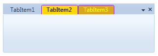

::: {style="DISPLAY: none"}
{#d2h_url_template}{#d2h_package_url style="WIDTH: 0px; DISPLAY: none; HEIGHT: 0px"}
:::

:::: {.d2h_secondary_topic style="PADDING-BOTTOM: 10pt; MARGIN: 0pt; PADDING-LEFT: 0pt; PADDING-RIGHT: 0pt; PADDING-TOP: 0pt"}
#### Customization {#customization style="tab-stops: 0pt"}

The style of the TabControlExt control can be customized by the customization properties. The following table lists the details of the customization properties.

 

Table 17: Customization Properties

::: {align="center"}
+----------------------------+------------------------------------------------------------------+---------------------+-----------------+
| Property                   | Description                                                      | Type                | Data Type       |
+----------------------------+------------------------------------------------------------------+---------------------+-----------------+
| TabItemSelectedBackground  | Used to set the background color of the selected tab item.       | Dependency property | Brush           |
|                            |                                                                  |                     |                 |
|                            |                                                                  |                     |                 |
+----------------------------+------------------------------------------------------------------+---------------------+-----------------+
| TabItemSelectedBorderBrush | Used to set the border color of the selected tab item.           | Dependency property | Brush           |
|                            |                                                                  |                     |                 |
|                            |                                                                  |                     |                 |
+----------------------------+------------------------------------------------------------------+---------------------+-----------------+
| TabItemSelectedForeground  | Used to set the foreground color of the selected tab item.       | Dependency property | Brush           |
|                            |                                                                  |                     |                 |
|                            |                                                                  |                     |                 |
+----------------------------+------------------------------------------------------------------+---------------------+-----------------+
| TabItemHoverBackground     | Used to set the background color of the tab item in Hover state. | Dependency property | Brush           |
|                            |                                                                  |                     |                 |
|                            |                                                                  |                     |                 |
+----------------------------+------------------------------------------------------------------+---------------------+-----------------+
| TabItemHoverBorderBrush    | Used to set the border color of the tab item in Hover state.     | Dependency property | Brush           |
|                            |                                                                  |                     |                 |
|                            |                                                                  |                     |                 |
+----------------------------+------------------------------------------------------------------+---------------------+-----------------+
| TabItemHoverForeground     | Used to set the foreground color of the tab item in Hover state. | Dependency property | Brush           |
|                            |                                                                  |                     |                 |
|                            |                                                                  |                     |                 |
+============================+==================================================================+=====================+=================+
:::

 

The following code example shows how to use the customization properties in the TabControlExt control.

+--------------------------------------------------------------------------------------------------------------------------------------------------------------------------------------------------------------------------------------------------------------------------------------------------------------------------------------------------------------------------------------------------------------------------------------------------------------------------------------------------------------------------------------------------------------------------------------------------------------------------------------------------------------+
| **[\[XAML\]]{style="FONT-FAMILY: 'Courier New'"}**                                                                                                                                                                                                                                                                                                                                                                                                                                                                                                                                                                                                           |
|                                                                                                                                                                                                                                                                                                                                                                                                                                                                                                                                                                                                                                                              |
| [\<]{style="FONT-FAMILY: 'Courier New'; COLOR: blue"}[sync]{style="FONT-FAMILY: 'Courier New'; COLOR: #a31515"}[:]{style="FONT-FAMILY: 'Courier New'; COLOR: blue"}[TabControlExt]{style="FONT-FAMILY: 'Courier New'; COLOR: #a31515"}[ TabItemSelectedBackground]{style="FONT-FAMILY: 'Courier New'; COLOR: red"}[=\"Gold\"]{style="FONT-FAMILY: 'Courier New'; COLOR: blue"}[ Height]{style="FONT-FAMILY: 'Courier New'; COLOR: red"}[=\"100\"]{style="FONT-FAMILY: 'Courier New'; COLOR: blue"}[ Margin]{style="FONT-FAMILY: 'Courier New'; COLOR: red"}[=\"100\"]{style="FONT-FAMILY: 'Courier New'; COLOR: blue"}[]{style="FONT-FAMILY: 'Courier New'"} |
|                                                                                                                                                                                                                                                                                                                                                                                                                                                                                                                                                                                                                                                              |
| [                           [ TabItemSelectedBorderBrush]{style="COLOR: red"}[=\"BlueViolet\"]{style="COLOR: blue"} ]{style="FONT-FAMILY: 'Courier New'"}                                                                                                                                                                                                                                                                                                                                                                                                                                                                                                    |
|                                                                                                                                                                                                                                                                                                                                                                                                                                                                                                                                                                                                                                                              |
| [                           [ TabItemSelectedForeground]{style="COLOR: red"}[=\"Black\"]{style="COLOR: blue"} ]{style="FONT-FAMILY: 'Courier New'"}                                                                                                                                                                                                                                                                                                                                                                                                                                                                                                          |
|                                                                                                                                                                                                                                                                                                                                                                                                                                                                                                                                                                                                                                                              |
| [                           [ TabItemHoverBackground]{style="COLOR: red"}[=\"Goldenrod\"]{style="COLOR: blue"} ]{style="FONT-FAMILY: 'Courier New'"}                                                                                                                                                                                                                                                                                                                                                                                                                                                                                                         |
|                                                                                                                                                                                                                                                                                                                                                                                                                                                                                                                                                                                                                                                              |
| [                           [ TabItemHoverBorderBrush]{style="COLOR: red"}[=\"BlueViolet\"]{style="COLOR: blue"} ]{style="FONT-FAMILY: 'Courier New'"}                                                                                                                                                                                                                                                                                                                                                                                                                                                                                                       |
|                                                                                                                                                                                                                                                                                                                                                                                                                                                                                                                                                                                                                                                              |
| [                           [ TabItemHoverForeground]{style="COLOR: red"}[=\"Yellow\"\>]{style="COLOR: blue"}]{style="FONT-FAMILY: 'Courier New'"}                                                                                                                                                                                                                                                                                                                                                                                                                                                                                                           |
|                                                                                                                                                                                                                                                                                                                                                                                                                                                                                                                                                                                                                                                              |
| [                ]{style="FONT-FAMILY: 'Courier New'; COLOR: #a31515"}[\<]{style="FONT-FAMILY: 'Courier New'; COLOR: blue"}[sync]{style="FONT-FAMILY: 'Courier New'; COLOR: #a31515"}[:]{style="FONT-FAMILY: 'Courier New'; COLOR: blue"}[TabItemExt]{style="FONT-FAMILY: 'Courier New'; COLOR: #a31515"}[ Header]{style="FONT-FAMILY: 'Courier New'; COLOR: red"}[=\"TabItem1\"/\>]{style="FONT-FAMILY: 'Courier New'; COLOR: blue"}[]{style="FONT-FAMILY: 'Courier New'"}                                                                                                                                                                                  |
|                                                                                                                                                                                                                                                                                                                                                                                                                                                                                                                                                                                                                                                              |
| [                ]{style="FONT-FAMILY: 'Courier New'; COLOR: #a31515"}[\<]{style="FONT-FAMILY: 'Courier New'; COLOR: blue"}[sync]{style="FONT-FAMILY: 'Courier New'; COLOR: #a31515"}[:]{style="FONT-FAMILY: 'Courier New'; COLOR: blue"}[TabItemExt]{style="FONT-FAMILY: 'Courier New'; COLOR: #a31515"}[ Header]{style="FONT-FAMILY: 'Courier New'; COLOR: red"}[=\"TabItem2\"/\>]{style="FONT-FAMILY: 'Courier New'; COLOR: blue"}[]{style="FONT-FAMILY: 'Courier New'"}                                                                                                                                                                                  |
|                                                                                                                                                                                                                                                                                                                                                                                                                                                                                                                                                                                                                                                              |
| [                ]{style="FONT-FAMILY: 'Courier New'; COLOR: #a31515"}[\<]{style="FONT-FAMILY: 'Courier New'; COLOR: blue"}[sync]{style="FONT-FAMILY: 'Courier New'; COLOR: #a31515"}[:]{style="FONT-FAMILY: 'Courier New'; COLOR: blue"}[TabItemExt]{style="FONT-FAMILY: 'Courier New'; COLOR: #a31515"}[ Header]{style="FONT-FAMILY: 'Courier New'; COLOR: red"}[=\"TabItem3\"/\>]{style="FONT-FAMILY: 'Courier New'; COLOR: blue"}[              ]{style="FONT-FAMILY: 'Courier New'; COLOR: #a31515"}[]{style="FONT-FAMILY: 'Courier New'"}                                                                                                              |
|                                                                                                                                                                                                                                                                                                                                                                                                                                                                                                                                                                                                                                                              |
| [\</]{style="FONT-FAMILY: 'Courier New'; COLOR: blue"}[sync]{style="FONT-FAMILY: 'Courier New'; COLOR: #a31515"}[:]{style="FONT-FAMILY: 'Courier New'; COLOR: blue"}[TabControlExt]{style="FONT-FAMILY: 'Courier New'; COLOR: #a31515"}[\>]{style="FONT-FAMILY: 'Courier New'; COLOR: blue"}                                                                                                                                                                                                                                                                                                                                                                 |
+--------------------------------------------------------------------------------------------------------------------------------------------------------------------------------------------------------------------------------------------------------------------------------------------------------------------------------------------------------------------------------------------------------------------------------------------------------------------------------------------------------------------------------------------------------------------------------------------------------------------------------------------------------------+

 

The following screenshot is the sample output for the above code example.

 

{border="0"}

Figure 1013: TabControlExt - Customization

 

[]{#related-topics}
::::
