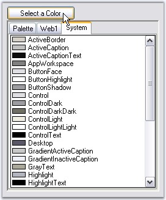
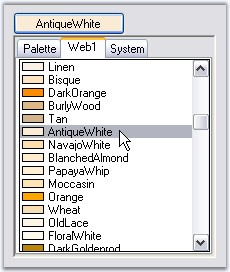

::: {style="DISPLAY: none"}
{#d2h_url_template}{#d2h_package_url style="WIDTH: 0px; DISPLAY: none; HEIGHT: 0px"}
:::

:::: {.d2h_secondary_topic style="PADDING-BOTTOM: 10pt; MARGIN: 0pt; PADDING-LEFT: 0pt; PADDING-RIGHT: 0pt; PADDING-TOP: 0pt"}
##### Customization Settings {#customization-settings style="tab-stops: 0pt"}

[]{style="COLOR: #15428b"} 

ColorPickerButton displays the ColorUIControl as its dropdown. ColorPickerButton has properties to customize the ColorUIControl. Refer the [User Guide]{.UGHyperlink} for ColorUIControl. The size for the dropdown, i.e, ColorUIControl can be set using **ColorUISize** property.

[]{style="COLOR: #15428b"} 

+-----------------------------------------------------------------------------------------------------------------------------------------------------------------------------------------------------------------+
| **[\[C#\]]{style="FONT-FAMILY: 'Courier New'; COLOR: black"}**                                                                                                                                                  |
|                                                                                                                                                                                                                 |
| []{style="COLOR: black"}                                                                                                                                                                                        |
|                                                                                                                                                                                                                 |
| [this]{style="FONT-FAMILY: 'Courier New'; COLOR: blue"}[.colorPickerButton1.ColorUISize = [new]{style="COLOR: blue"} System.Drawing.[Size]{style="COLOR: teal"}(250, 280);]{style="FONT-FAMILY: 'Courier New'"} |
+-----------------------------------------------------------------------------------------------------------------------------------------------------------------------------------------------------------------+

[]{style="COLOR: #15428b"} 

+---------------------------------------------------------------------------------------------------------------------------------------------------------------------------------------------------------------+
| **[\[VB.NET\]]{style="FONT-FAMILY: 'Courier New'; COLOR: black"}**                                                                                                                                            |
|                                                                                                                                                                                                               |
| []{style="COLOR: #15428b"}                                                                                                                                                                                    |
|                                                                                                                                                                                                               |
| [Me]{style="FONT-FAMILY: 'Courier New'; COLOR: blue"}[.colorPickerButton1.ColorUISize = [New]{style="COLOR: blue"} System.Drawing.[Size]{style="COLOR: black"}(250, 280)]{style="FONT-FAMILY: 'Courier New'"} |
+---------------------------------------------------------------------------------------------------------------------------------------------------------------------------------------------------------------+

**[]{style="COLOR: #15428b"}** 

{border="0"}

**[]{style="COLOR: #15428b"}** 

Figure 306: ColorUISize-Width = 250, Height = 280

[]{style="COLOR: #15428b"} 

ColorPicker Appearance

[]{style="COLOR: #15428b"} 

The appearance and behavior of the ColorPickerButton can be controlled using the below properties.

[]{style="COLOR: #15428b"} 

::: {align="center"}
  ------------------------------ ----------------------------------------------------------------------------------------
  ColorPickerButton Properties   Description
  SelectedAsBackColor            Specifies whether **ColorPickerButton.SelectedColor** is set as the button backcolor.
  SelectedAsText                 Specifies whether **ColorPickerButton.SelectedColor** is set as the button text value.
  ------------------------------ ----------------------------------------------------------------------------------------
:::

[]{style="COLOR: #15428b"} 

+---------------------------------------------------------------------------------------------------------------------------------------------------------------------+
| **[\[C#\]]{style="FONT-FAMILY: 'Courier New'; COLOR: black"}**                                                                                                      |
|                                                                                                                                                                     |
| []{style="COLOR: #15428b"}                                                                                                                                          |
|                                                                                                                                                                     |
| [this]{style="FONT-FAMILY: 'Courier New'; COLOR: blue"}[.colorPickerButton1.SelectedAsBackcolor = [true]{style="COLOR: blue"};]{style="FONT-FAMILY: 'Courier New'"} |
|                                                                                                                                                                     |
| [this]{style="FONT-FAMILY: 'Courier New'; COLOR: blue"}[.colorPickerButton1.SelectedAsText = [true]{style="COLOR: blue"};]{style="FONT-FAMILY: 'Courier New'"}      |
+---------------------------------------------------------------------------------------------------------------------------------------------------------------------+

[]{style="COLOR: #15428b"} 

+------------------------------------------------------------------------------------------------------------------------------------------------------------------+
| **[\[VB.NET\]]{style="FONT-FAMILY: 'Courier New'; COLOR: black"}**                                                                                               |
|                                                                                                                                                                  |
| []{style="COLOR: #15428b"}                                                                                                                                       |
|                                                                                                                                                                  |
| [Me]{style="FONT-FAMILY: 'Courier New'; COLOR: blue"}[.colorPickerButton1.SelectedAsBackcolor = [True]{style="COLOR: blue"}]{style="FONT-FAMILY: 'Courier New'"} |
|                                                                                                                                                                  |
| [Me]{style="FONT-FAMILY: 'Courier New'; COLOR: blue"}[.colorPickerButton1.SelectedAsText = [True]{style="COLOR: blue"}]{style="FONT-FAMILY: 'Courier New'"}      |
+------------------------------------------------------------------------------------------------------------------------------------------------------------------+

**[]{style="COLOR: #15428b"}** 

{border="0"}

[]{style="COLOR: #15428b"} 

Figure 307: AntiqueWhite Text and Background color for ColorPickerButton

[]{style="COLOR: #15428b"} 

See Also

[]{style="COLOR: #15428b"} 

[Color Groups,]{.UGHyperlink}[ ]{.UGHyperlink}[Tab Text]{.UGHyperlink}[, ]{.UGHyperlink}[ColorUIControl]{.UGHyperlink}[ ]{.UGHyperlink}[Appearance]{.UGHyperlink}[, ]{.UGHyperlink}[Runtime Settings]{.UGHyperlink}[ of ColorUIControl.]{.UGHyperlink}

[]{#related-topics}
::::
