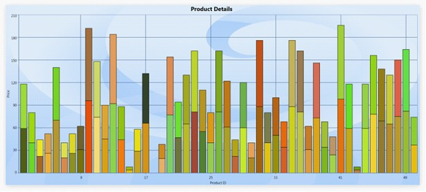

::: {style="DISPLAY: none"}
{#d2h_url_template}{#d2h_package_url style="WIDTH: 0px; DISPLAY: none; HEIGHT: 0px"}
:::

::: {.d2h_secondary_topic style="PADDING-BOTTOM: 10pt; MARGIN: 0pt; PADDING-LEFT: 0pt; PADDING-RIGHT: 0pt; PADDING-TOP: 0pt"}
##### Customization support for FastChart types {#customization-support-for-fastchart-types style="tab-stops: 0pt"}

This enables the users to customize the Fast chat types like **FastScatter**, **FastColumn**, **FastStackingColumn**, and **FastHiLoOpenClose**.  Using this feature, users can customize the **Stroke**, **Stroke thickness**, and interior of each chart segment of the series[.]{style="FONT-FAMILY: 'Calibri','sans-serif'; FONT-SIZE: 12pt"}

 

Adding Customization Support

[ ]{style="FONT-FAMILY: 'Calibri','sans-serif'; FONT-SIZE: 12pt"}Add customization support for FastChart types, by using the following code.

[]{style="FONT-FAMILY: 'Courier New'; COLOR: #15428b"} 

+--------------------------------------------------------------------------------------------------------------------------------------------------------------------------------------------------------------------------------------------------------------------------------------------------------------------------------------------------------------------------------------------------------------------------------------------------------------------------------------------------------------------------------------------------------------------------------------------------------------+
| **[\[Xaml\] ]{style="FONT-FAMILY: 'Courier New'"}**                                                                                                                                                                                                                                                                                                                                                                                                                                                                                                                                                          |
|                                                                                                                                                                                                                                                                                                                                                                                                                                                                                                                                                                                                              |
| []{style="FONT-FAMILY: 'Courier New'"}                                                                                                                                                                                                                                                                                                                                                                                                                                                                                                                                                                       |
|                                                                                                                                                                                                                                                                                                                                                                                                                                                                                                                                                                                                              |
| [  ]{style="FONT-FAMILY: 'Courier New'; COLOR: #a31515"}[\<]{style="FONT-FAMILY: 'Courier New'; COLOR: blue"}[syncfusion]{style="FONT-FAMILY: 'Courier New'; COLOR: #a31515"}[:]{style="FONT-FAMILY: 'Courier New'; COLOR: blue"}[ChartSeries]{style="FONT-FAMILY: 'Courier New'; COLOR: #a31515"}[ Name]{style="FONT-FAMILY: 'Courier New'; COLOR: red"}[=\"series1\"]{style="FONT-FAMILY: 'Courier New'; COLOR: blue"}[ Type]{style="FONT-FAMILY: 'Courier New'; COLOR: red"}[=\"FastStackingColumn\"]{style="FONT-FAMILY: 'Courier New'; COLOR: blue"}[ ]{style="FONT-FAMILY: 'Courier New'; COLOR: red"} |
|                                                                                                                                                                                                                                                                                                                                                                                                                                                                                                                                                                                                              |
| [FastSegmentProperties]{style="FONT-FAMILY: 'Courier New'; COLOR: red"}[=\"{]{style="FONT-FAMILY: 'Courier New'; COLOR: blue"}[Binding]{style="FONT-FAMILY: 'Courier New'; COLOR: #a31515"}[ Converter]{style="FONT-FAMILY: 'Courier New'; COLOR: red"}[={]{style="FONT-FAMILY: 'Courier New'; COLOR: blue"}[StaticResource]{style="FONT-FAMILY: 'Courier New'; COLOR: #a31515"}[ interiorConverter]{style="FONT-FAMILY: 'Courier New'; COLOR: red"}[} }\"]{style="FONT-FAMILY: 'Courier New'; COLOR: blue"}[ ]{style="FONT-FAMILY: 'Courier New'; COLOR: red"}                                              |
|                                                                                                                                                                                                                                                                                                                                                                                                                                                                                                                                                                                                              |
| [Stroke]{style="FONT-FAMILY: 'Courier New'; COLOR: red"}[=\"Black\"]{style="FONT-FAMILY: 'Courier New'; COLOR: blue"}[ DataSource]{style="FONT-FAMILY: 'Courier New'; COLOR: red"}[=\"{]{style="FONT-FAMILY: 'Courier New'; COLOR: blue"}[Binding]{style="FONT-FAMILY: 'Courier New'; COLOR: #a31515"}[}\"/\>]{style="FONT-FAMILY: 'Courier New'; COLOR: blue"}                                                                                                                                                                                                                                              |
+--------------------------------------------------------------------------------------------------------------------------------------------------------------------------------------------------------------------------------------------------------------------------------------------------------------------------------------------------------------------------------------------------------------------------------------------------------------------------------------------------------------------------------------------------------------------------------------------------------------+

[]{style="FONT-FAMILY: 'Courier New'; COLOR: blue"} 

+----------------------------------------------------------------------------------------------------------------------------------------------------------------------------------------------------------------------------+
| **[\[C#\] ]{style="FONT-FAMILY: 'Courier New'"}**                                                                                                                                                                          |
|                                                                                                                                                                                                                            |
| []{style="FONT-FAMILY: 'Courier New'"}                                                                                                                                                                                     |
|                                                                                                                                                                                                                            |
| [FastSegmnetPropertiesCollection]{style="FONT-FAMILY: 'Courier New'; COLOR: #2b91af"}[ list = [new]{style="COLOR: blue"} [FastSegmnetPropertiesCollection]{style="COLOR: #2b91af"}();]{style="FONT-FAMILY: 'Courier New'"} |
|                                                                                                                                                                                                                            |
| [  [FastSegmnetProperties]{style="COLOR: #2b91af"} segmentProperty = [new]{style="COLOR: blue"} [FastSegmnetProperties]{style="COLOR: #2b91af"} { Stroke=Brushes.Black,]{style="FONT-FAMILY: 'Courier New'"}               |
|                                                                                                                                                                                                                            |
| [StrokeThickness=1, Interior = brush };]{style="FONT-FAMILY: 'Courier New'"}                                                                                                                                               |
|                                                                                                                                                                                                                            |
| [list.Add(segmentProperty);]{style="FONT-FAMILY: 'Courier New'"}                                                                                                                                                           |
|                                                                                                                                                                                                                            |
| [series1.FastSegmentProperties= list;]{style="FONT-FAMILY: 'Courier New'"}                                                                                                                                                 |
+----------------------------------------------------------------------------------------------------------------------------------------------------------------------------------------------------------------------------+

[]{style="FONT-FAMILY: 'Courier New'; COLOR: blue"} 

{border="0"}

Figure 110: Customization support for FastChart types

[]{#related-topics}
:::
