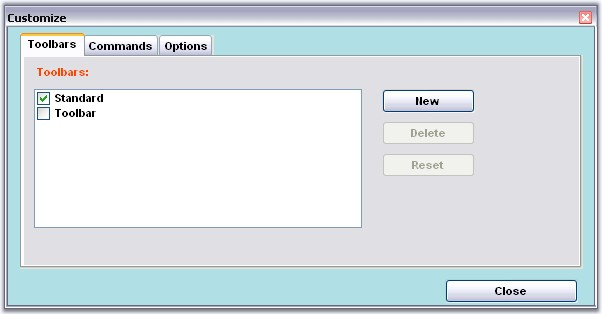

::: {style="DISPLAY: none"}
{#d2h_url_template}{#d2h_package_url style="WIDTH: 0px; DISPLAY: none; HEIGHT: 0px"}
:::

::: {.d2h_secondary_topic style="PADDING-BOTTOM: 10pt; MARGIN: 0pt; PADDING-LEFT: 0pt; PADDING-RIGHT: 0pt; PADDING-TOP: 0pt"}
##### Customize Dialog Appearance {#customize-dialog-appearance style="tab-stops: 0pt"}

 

Foreground and Background Settings

[]{style="COLOR: #15428b"} 

Fore color, back color and the Font style can be set for the [Customize Dialog]{.UGHyperlink} using **ForeColor**, **BackColor** and **Font** properties respectively.

[]{style="COLOR: #15428b"} 

+--------------------------------------------------------------------------------------------------------------------------------------------------------------------------------------------------------------------------------------------+
| **[\[C#\]]{style="FONT-FAMILY: 'Courier New'; COLOR: black"}**                                                                                                                                                                             |
|                                                                                                                                                                                                                                            |
| **[]{style="FONT-FAMILY: 'Courier New'; COLOR: black"}**                                                                                                                                                                                   |
|                                                                                                                                                                                                                                            |
| [//to change ForeColor]{style="FONT-FAMILY: 'Courier New'; COLOR: green"}                                                                                                                                                                  |
|                                                                                                                                                                                                                                            |
| [this]{style="FONT-FAMILY: 'Courier New'; COLOR: blue"}[.mainFrameBarManager1.CustomizationDialog.ForeColor = [Color]{style="COLOR: teal"}.OrangeRed;]{style="FONT-FAMILY: 'Courier New'"}                                                 |
|                                                                                                                                                                                                                                            |
| []{style="FONT-FAMILY: 'Courier New'"}                                                                                                                                                                                                     |
|                                                                                                                                                                                                                                            |
| [//to change BackColor]{style="FONT-FAMILY: 'Courier New'; COLOR: green"}                                                                                                                                                                  |
|                                                                                                                                                                                                                                            |
| [this]{style="FONT-FAMILY: 'Courier New'; COLOR: blue"}[.mainFrameBarManager1.CustomizationDialog.BackColor = [Color]{style="COLOR: teal"}.PowderBlue;]{style="FONT-FAMILY: 'Courier New'"}                                                |
|                                                                                                                                                                                                                                            |
| []{style="FONT-FAMILY: 'Courier New'"}                                                                                                                                                                                                     |
|                                                                                                                                                                                                                                            |
| [//Change the font,font style and size]{style="FONT-FAMILY: 'Courier New'; COLOR: green"}                                                                                                                                                  |
|                                                                                                                                                                                                                                            |
| [mainFrameBarManager1.CustomizationDialog.Font = [new]{style="COLOR: blue"} [Font]{style="COLOR: teal"}([\"Arial\"]{style="COLOR: maroon"}, 8, System.Drawing.[FontStyle]{style="COLOR: teal"}.Bold);]{style="FONT-FAMILY: 'Courier New'"} |
+--------------------------------------------------------------------------------------------------------------------------------------------------------------------------------------------------------------------------------------------+

**[]{style="COLOR: black"}** 

+----------------------------------------------------------------------------------------------------------------------------------------------------------------------------------------------+
| **[\[VB.NET\]]{style="FONT-FAMILY: 'Courier New'; COLOR: black"}**                                                                                                                           |
|                                                                                                                                                                                              |
| **[]{style="FONT-FAMILY: 'Courier New'; COLOR: black"}**                                                                                                                                     |
|                                                                                                                                                                                              |
| [\'to change ForeColor]{style="FONT-FAMILY: 'Courier New'; COLOR: green"}                                                                                                                    |
|                                                                                                                                                                                              |
| [Me]{style="FONT-FAMILY: 'Courier New'; COLOR: blue"}[.mainFrameBarManager1.CustomizationDialog.ForeColor = [Color]{style="COLOR: black"}.OrangeRed]{style="FONT-FAMILY: 'Courier New'"}     |
|                                                                                                                                                                                              |
| []{style="FONT-FAMILY: 'Courier New'"}                                                                                                                                                       |
|                                                                                                                                                                                              |
| [\'to change BackColor]{style="FONT-FAMILY: 'Courier New'; COLOR: green"}                                                                                                                    |
|                                                                                                                                                                                              |
| [Me]{style="FONT-FAMILY: 'Courier New'; COLOR: blue"}[.mainFrameBarManager1.CustomizationDialog.BackColor = [Color]{style="COLOR: black"}.PowderBlue]{style="FONT-FAMILY: 'Courier New'"}    |
|                                                                                                                                                                                              |
| []{style="FONT-FAMILY: 'Courier New'"}                                                                                                                                                       |
|                                                                                                                                                                                              |
| [\'Change the font,font style and size ]{style="FONT-FAMILY: 'Courier New'; COLOR: green"}                                                                                                   |
|                                                                                                                                                                                              |
| [mainFrameBarManager1.CustomizationDialog.Font = [New]{style="COLOR: blue"} Font([\"Arial\"]{style="COLOR: maroon"}, 8, System.Drawing.FontStyle.Bold) ]{style="FONT-FAMILY: 'Courier New'"} |
+----------------------------------------------------------------------------------------------------------------------------------------------------------------------------------------------+

[]{style="COLOR: #15428b"} 

{border="0"}

[]{style="COLOR: #15428b"} 

Figure 843: ForeColor = \"OrangeRed\"; BackColor = \"PowderBlue\"; FontStyle = \"Arial, 8f\"

**[]{style="COLOR: #15428b"}** 

Size Settings

**[]{style="COLOR: #15428b"}** 

Size and the client size of the Customize Dialog can be controlled using the Size property as follows.

[]{style="COLOR: #15428b"} 

+-----------------------------------------------------------------------------------------------------------------------------------------------------------------------------------------------------------------------+
| **[\[C#\]]{style="FONT-FAMILY: 'Courier New'; COLOR: black"}**                                                                                                                                                        |
|                                                                                                                                                                                                                       |
| **[]{style="FONT-FAMILY: 'Courier New'; COLOR: black"}**                                                                                                                                                              |
|                                                                                                                                                                                                                       |
| [//to change the size of entire dialog]{style="FONT-FAMILY: 'Courier New'; COLOR: green"}                                                                                                                             |
|                                                                                                                                                                                                                       |
| [this]{style="FONT-FAMILY: 'Courier New'; COLOR: blue"}[.mainFrameBarManager1.CustomizationDialog.Size = [new]{style="COLOR: blue"} [Size]{style="COLOR: teal"}(700, 800);]{style="FONT-FAMILY: 'Courier New'"}       |
|                                                                                                                                                                                                                       |
| [//to change the client area]{style="FONT-FAMILY: 'Courier New'; COLOR: green"}                                                                                                                                       |
|                                                                                                                                                                                                                       |
| [this]{style="FONT-FAMILY: 'Courier New'; COLOR: blue"}[.mainFrameBarManager1.CustomizationDialog.ClientSize = [new]{style="COLOR: blue"} [Size]{style="COLOR: teal"}(600, 700);]{style="FONT-FAMILY: 'Courier New'"} |
+-----------------------------------------------------------------------------------------------------------------------------------------------------------------------------------------------------------------------+

**[]{style="COLOR: black"}** 

+---------------------------------------------------------------------------------------------------------------------------------------------------------------------------------------------+
| **[\[VB.NET\]]{style="FONT-FAMILY: 'Courier New'; COLOR: black"}**                                                                                                                          |
|                                                                                                                                                                                             |
| **[]{style="FONT-FAMILY: 'Courier New'; COLOR: black"}**                                                                                                                                    |
|                                                                                                                                                                                             |
| [\'to change the size of entire dialog ]{style="FONT-FAMILY: 'Courier New'; COLOR: green"}                                                                                                  |
|                                                                                                                                                                                             |
| [Me]{style="FONT-FAMILY: 'Courier New'; COLOR: blue"}[.mainFrameBarManager1.CustomizationDialog.Size = [New]{style="COLOR: blue"} Size(700, 800)]{style="FONT-FAMILY: 'Courier New'"}       |
|                                                                                                                                                                                             |
| [\'to change the client area ]{style="FONT-FAMILY: 'Courier New'; COLOR: green"}                                                                                                            |
|                                                                                                                                                                                             |
| [Me]{style="FONT-FAMILY: 'Courier New'; COLOR: blue"}[.mainFrameBarManager1.CustomizationDialog.ClientSize = [New]{style="COLOR: blue"} Size(600, 700)]{style="FONT-FAMILY: 'Courier New'"} |
+---------------------------------------------------------------------------------------------------------------------------------------------------------------------------------------------+

[]{#related-topics}
:::
