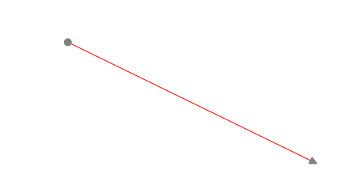

::: {style="DISPLAY: none"}
{#d2h_url_template}{#d2h_package_url style="WIDTH: 0px; DISPLAY: none; HEIGHT: 0px"}
:::

::::: {#nsbanner .d2h_main_nsbanner style="BORDER-BOTTOM: #999999 1px solid; POSITION: relative; PADDING-BOTTOM: 0px; BACKGROUND-COLOR: transparent; PADDING-LEFT: 0px; PADDING-RIGHT: 0px; DISPLAY: none; BORDER-TOP: #999999 1px solid; PADDING-TOP: 0px; LEFT: 0px"}
:::: {#TitleRow .d2h_main_titlerow style="PADDING-BOTTOM: 4px; BACKGROUND-COLOR: transparent; PADDING-LEFT: 22px; WIDTH: 100%; PADDING-RIGHT: 10px; DISPLAY: none; PADDING-TOP: 4px"}
::: {#ienav .d2h_main_ienav style="DISPLAY: none"}
{#D2HPrevious .D2HPreviousEnabled}  {#D2HNext .D2HNextEnabled}
:::
::::
:::::

::::: {#nstext .d2h_main_nstext style="PADDING-BOTTOM: 10px; BACKGROUND-COLOR: transparent; PADDING-LEFT: 22px; PADDING-RIGHT: 10px; HEIGHT: 100%; OVERFLOW: auto; PADDING-TOP: 5px" hasuserbackground="true" valign="bottom"}
::: {#d2h_breadcrumbs .d2h_breadcrumbs}
[Essential Studio User Guide Documentation](ms-xhelp:///?Id=12457748-09e3-4d74-a240-8e049cedf030){.d2h_breadcrumbsNormal}[ \> ]{.d2h_breadcrumbsLinkSeparator}[User Interface Edition](ms-xhelp:///?Id=c29296b7-531c-413b-a0ec-488ca1f7f669){.d2h_breadcrumbsNormal}[ \> ]{.d2h_breadcrumbsLinkSeparator}[Essential WPF](ms-xhelp:///?Id=7f4f82c5-151c-4262-94d0-75c4626c77bc){.d2h_breadcrumbsNormal}[ \> ]{.d2h_breadcrumbsLinkSeparator}[Essential Diagram]{.d2h_breadcrumbsContentsOnly}[ \> ]{.d2h_breadcrumbsLinkSeparator}[Concepts and Features](ms-xhelp:///?Id=8625d466-6e21-495a-b811-4ecee754da81){.d2h_breadcrumbsNormal}[ \> ]{.d2h_breadcrumbsLinkSeparator}[Line Connectors](ms-xhelp:///?Id=aa573b6b-29bb-4c85-aa22-7ebc69ffbdcc){.d2h_breadcrumbsNormal}
:::

### Customize Line Connectors {#customize-line-connectors style="tab-stops: 0pt"}

[]{style="FONT-FAMILY: 'Trebuchet MS','sans-serif'; COLOR: #15428b; FONT-SIZE: 9pt"} 

This topic describes two properties:

[·      ]{style="FONT-FAMILY: Symbol"}LineStyle

[·      ]{style="FONT-FAMILY: Symbol"}DecoratorStyle

[]{style="FONT-FAMILY: 'Trebuchet MS','sans-serif'; COLOR: #15428b; FONT-SIZE: 9pt"} 

Line Style

A connector can be customized by specifying the values under the **LineStyle** property. The various properties under LineStyle are,

[]{style="FONT-FAMILY: 'Trebuchet MS','sans-serif'; COLOR: #15428b; FONT-SIZE: 9pt"} 

[·      ]{style="FONT-FAMILY: Symbol"}**Fill -** Specifies the color used to fill the connector.

[·      ]{style="FONT-FAMILY: Symbol"}**StrokeThickness -** Specifies the thickness value for the connector\'s border.

[·      ]{style="FONT-FAMILY: Symbol"}**Stroke** - Specifies the color used for the border of the connector.

[·      ]{style="FONT-FAMILY: Symbol"}**StrokeStartLineCap -** Specifies the shape to be used at the start of a line or segment.

[·      ]{style="FONT-FAMILY: Symbol"}**StrokeEndLineCap** - Specifies the shape at the end of a line or segment.

[·      ]{style="FONT-FAMILY: Symbol"}**StrokeLineJoin -** Specifies the shape that joins two lines or segments.

[·      ]{style="FONT-FAMILY: Symbol"}**StrokeDashArray -** Specifies a collection of double values that indicate the pattern of dashes and gaps used to outline shapes.

[]{style="FONT-FAMILY: 'Trebuchet MS','sans-serif'; COLOR: #15428b; FONT-SIZE: 9pt"} 

As an example, the **Stroke** property can be applied as follows.

[]{style="FONT-FAMILY: 'Trebuchet MS','sans-serif'; COLOR: #15428b; FONT-SIZE: 9pt"} 

+--------------------------------------------------------------------------------------------------------------------------------------------------------------------------------------+
| **[\[C#\]]{style="FONT-FAMILY: 'Courier New'; COLOR: black"}**                                                                                                                       |
|                                                                                                                                                                                      |
| []{style="FONT-FAMILY: 'Courier New'"}                                                                                                                                               |
|                                                                                                                                                                                      |
| [LineConnector]{style="FONT-FAMILY: 'Courier New'; COLOR: #2b91af"}[ l1 = [new]{style="COLOR: blue"} [LineConnector]{style="COLOR: #2b91af"}();]{style="FONT-FAMILY: 'Courier New'"} |
|                                                                                                                                                                                      |
| [l1.HeadNode = n1;]{style="FONT-FAMILY: 'Courier New'"}                                                                                                                              |
|                                                                                                                                                                                      |
| [l1.TailNode = n2;]{style="FONT-FAMILY: 'Courier New'"}                                                                                                                              |
|                                                                                                                                                                                      |
| [l1.ConnectorType = [ConnectorType]{style="COLOR: #2b91af"}.Bezier;]{style="FONT-FAMILY: 'Courier New'"}                                                                             |
|                                                                                                                                                                                      |
| [l1.LineStyle.Stroke = [Brushes]{style="COLOR: #2b91af"}.Red;]{style="FONT-FAMILY: 'Courier New'"}                                                                                   |
|                                                                                                                                                                                      |
| [diagramModel.Connections.Add(l1);]{style="FONT-FAMILY: 'Courier New'"}                                                                                                              |
+--------------------------------------------------------------------------------------------------------------------------------------------------------------------------------------+

[]{style="FONT-FAMILY: 'Trebuchet MS','sans-serif'; COLOR: #15428b; FONT-SIZE: 9pt"} 

+------------------------------------------------------------------------------------------------------------------------------------------------------------------------------------------------+
| **[\[VB\]]{style="FONT-FAMILY: 'Courier New'; COLOR: black"}**                                                                                                                                 |
|                                                                                                                                                                                                |
| []{style="FONT-FAMILY: 'Courier New'"}                                                                                                                                                         |
|                                                                                                                                                                                                |
| [Dim]{style="FONT-FAMILY: 'Courier New'; COLOR: blue"}[ l1 [As]{style="COLOR: blue"} [New]{style="COLOR: blue"} [LineConnector]{style="COLOR: #2b91af"}()]{style="FONT-FAMILY: 'Courier New'"} |
|                                                                                                                                                                                                |
| [l1.HeadNode = n1]{style="FONT-FAMILY: 'Courier New'"}                                                                                                                                         |
|                                                                                                                                                                                                |
| [l1.TailNode = n2]{style="FONT-FAMILY: 'Courier New'"}                                                                                                                                         |
|                                                                                                                                                                                                |
| [l1.ConnectorType = ConnectorType.Bezier]{style="FONT-FAMILY: 'Courier New'"}                                                                                                                  |
|                                                                                                                                                                                                |
| [l1.LineStyle.Stroke = Brushes.Red]{style="FONT-FAMILY: 'Courier New'"}                                                                                                                        |
|                                                                                                                                                                                                |
| [diagramModel.Connections.Add(l1)]{style="FONT-FAMILY: 'Courier New'"}[]{style="FONT-FAMILY: 'Courier New'"}                                                                                   |
+------------------------------------------------------------------------------------------------------------------------------------------------------------------------------------------------+

[]{style="FONT-FAMILY: 'Trebuchet MS','sans-serif'; COLOR: #15428b; FONT-SIZE: 9pt"} 

{border="0"}

Figure 78: LineStyle

 

CustomPathStyle

A connector can be customized using CustomPathStyle. The *CustomPathStyle* property enables you to customize the appearance of LineConnector.

 

Properties

Table 37: Property/ies Table

::: {align="center"}
  ----------------- ---------------------------------------------- --------------------- ----------- -----------------
  Property          Description                                    Type                  Data Type   Reference links
  CustomPathStyle   Get or Set CustomPathStyle for LineConnector   Dependency Property   Style       NA
  ----------------- ---------------------------------------------- --------------------- ----------- -----------------
:::

 

[]{style="COLOR: #c00000"} 

Applying Style for CustomPathStyle

Appearance of the LineConnector can be customized by applying style for the *CustomPathStyle* property. Style can be applied for *CustomPathStyle* as illustrated in the following code:

[]{style="COLOR: #c00000"} 

[·      ]{style="FONT-FAMILY: Symbol"}Through XAML

[]{style="COLOR: #c00000"} 

+------------------------------------------------------------------------------------------------------------------------------------------------------------------------------------------------------------------------------------------------------------------------------------------------------------------------------------------------------------------------------------------------------------------------------------------------------------------------------------------------------------------------------------------------------------------------------------------------------------------------------------------------------------------------------------------------------------------------------------------------------------------------------------------------+
| **[\[XAML\]]{style="FONT-FAMILY: 'Courier New'"}**                                                                                                                                                                                                                                                                                                                                                                                                                                                                                                                                                                                                                                                                                                                                             |
|                                                                                                                                                                                                                                                                                                                                                                                                                                                                                                                                                                                                                                                                                                                                                                                                |
| [\<]{style="FONT-FAMILY: 'Courier New'; COLOR: blue"}[Window.Resources]{style="FONT-FAMILY: 'Courier New'; COLOR: #a31515"}[\>]{style="FONT-FAMILY: 'Courier New'; COLOR: blue"}[]{style="FONT-FAMILY: 'Courier New'"}                                                                                                                                                                                                                                                                                                                                                                                                                                                                                                                                                                         |
|                                                                                                                                                                                                                                                                                                                                                                                                                                                                                                                                                                                                                                                                                                                                                                                                |
| [      \<]{style="FONT-FAMILY: 'Courier New'; COLOR: blue"}[Style]{style="FONT-FAMILY: 'Courier New'; COLOR: #a31515"}[ TargetType]{style="FONT-FAMILY: 'Courier New'; COLOR: red"}[=\"{]{style="FONT-FAMILY: 'Courier New'; COLOR: blue"}[x]{style="FONT-FAMILY: 'Courier New'; COLOR: #a31515"}[:]{style="FONT-FAMILY: 'Courier New'; COLOR: blue"}[Type]{style="FONT-FAMILY: 'Courier New'; COLOR: #a31515"}[ Path]{style="FONT-FAMILY: 'Courier New'; COLOR: red"}[}\"]{style="FONT-FAMILY: 'Courier New'; COLOR: blue"}[ x]{style="FONT-FAMILY: 'Courier New'; COLOR: red"}[:]{style="FONT-FAMILY: 'Courier New'; COLOR: blue"}[Key]{style="FONT-FAMILY: 'Courier New'; COLOR: red"}[=\"Deco1\"\>]{style="FONT-FAMILY: 'Courier New'; COLOR: blue"}[]{style="FONT-FAMILY: 'Courier New'"} |
|                                                                                                                                                                                                                                                                                                                                                                                                                                                                                                                                                                                                                                                                                                                                                                                                |
| [            ]{style="FONT-FAMILY: 'Courier New'; COLOR: #a31515"}[\<]{style="FONT-FAMILY: 'Courier New'; COLOR: blue"}[Setter]{style="FONT-FAMILY: 'Courier New'; COLOR: #a31515"}[ Property]{style="FONT-FAMILY: 'Courier New'; COLOR: red"}[=\"Stroke\"]{style="FONT-FAMILY: 'Courier New'; COLOR: blue"}[ Value]{style="FONT-FAMILY: 'Courier New'; COLOR: red"}[=\"Red\" /\>]{style="FONT-FAMILY: 'Courier New'; COLOR: blue"}[                        ]{style="FONT-FAMILY: 'Courier New'; COLOR: #a31515"}                                                                                                                                                                                                                                                                              |
|                                                                                                                                                                                                                                                                                                                                                                                                                                                                                                                                                                                                                                                                                                                                                                                                |
| [      \</]{style="FONT-FAMILY: 'Courier New'; COLOR: blue"}[Style]{style="FONT-FAMILY: 'Courier New'; COLOR: #a31515"}[\>]{style="FONT-FAMILY: 'Courier New'; COLOR: blue"}[]{style="FONT-FAMILY: 'Courier New'"}                                                                                                                                                                                                                                                                                                                                                                                                                                                                                                                                                                             |
|                                                                                                                                                                                                                                                                                                                                                                                                                                                                                                                                                                                                                                                                                                                                                                                                |
| [\</]{style="FONT-FAMILY: 'Courier New'; COLOR: blue"}[Window.Resources]{style="FONT-FAMILY: 'Courier New'; COLOR: #a31515"}[\>]{style="FONT-FAMILY: 'Courier New'; COLOR: blue"}[]{style="FONT-FAMILY: 'Courier New'"}                                                                                                                                                                                                                                                                                                                                                                                                                                                                                                                                                                        |
|                                                                                                                                                                                                                                                                                                                                                                                                                                                                                                                                                                                                                                                                                                                                                                                                |
| **[]{style="FONT-FAMILY: 'Courier New'"}**                                                                                                                                                                                                                                                                                                                                                                                                                                                                                                                                                                                                                                                                                                                                                     |
|                                                                                                                                                                                                                                                                                                                                                                                                                                                                                                                                                                                                                                                                                                                                                                                                |
| [         \<]{style="FONT-FAMILY: 'Courier New'; COLOR: blue"}[Style]{style="FONT-FAMILY: 'Courier New'; COLOR: #a31515"}[ TargetType]{style="FONT-FAMILY: 'Courier New'; COLOR: red"}[=\"{]{style="FONT-FAMILY: 'Courier New'; COLOR: blue"}[x]{style="FONT-FAMILY: 'Courier New'; COLOR: #a31515"}[:]{style="FONT-FAMILY: 'Courier New'; COLOR: blue"}[Type]{style="FONT-FAMILY: 'Courier New'; COLOR: #a31515"}[ syncfusion]{style="FONT-FAMILY: 'Courier New'; COLOR: red"}[:]{style="FONT-FAMILY: 'Courier New'; COLOR: blue"}[LineConnector]{style="FONT-FAMILY: 'Courier New'; COLOR: red"}[}\"]{style="FONT-FAMILY: 'Courier New'; COLOR: blue"}[ [ \>]{style="COLOR: blue"}]{style="FONT-FAMILY: 'Courier New'"}                                                                      |
|                                                                                                                                                                                                                                                                                                                                                                                                                                                                                                                                                                                                                                                                                                                                                                                                |
| [            ]{style="FONT-FAMILY: 'Courier New'; COLOR: #a31515"}[\<]{style="FONT-FAMILY: 'Courier New'; COLOR: blue"}[Setter]{style="FONT-FAMILY: 'Courier New'; COLOR: #a31515"}[ Property]{style="FONT-FAMILY: 'Courier New'; COLOR: red"}[=\"HeadDecoratorShape\"]{style="FONT-FAMILY: 'Courier New'; COLOR: blue"}[ [ Value]{style="COLOR: red"}[=\"Diamond\" /\>]{style="COLOR: blue"}]{style="FONT-FAMILY: 'Courier New'"}                                                                                                                                                                                                                                                                                                                                                             |
|                                                                                                                                                                                                                                                                                                                                                                                                                                                                                                                                                                                                                                                                                                                                                                                                |
| [            ]{style="FONT-FAMILY: 'Courier New'; COLOR: #a31515"}[\<]{style="FONT-FAMILY: 'Courier New'; COLOR: blue"}[Setter]{style="FONT-FAMILY: 'Courier New'; COLOR: #a31515"}[ Property]{style="FONT-FAMILY: 'Courier New'; COLOR: red"}[=\"TailDecoratorShape\"]{style="FONT-FAMILY: 'Courier New'; COLOR: blue"}[ Value]{style="FONT-FAMILY: 'Courier New'; COLOR: red"}[=\"Diamond\"/\>]{style="FONT-FAMILY: 'Courier New'; COLOR: blue"}[ ]{style="FONT-FAMILY: 'Courier New'; COLOR: #a31515"}                                                                                                                                                                                                                                                                                      |
|                                                                                                                                                                                                                                                                                                                                                                                                                                                                                                                                                                                                                                                                                                                                                                                                |
| [            ]{style="FONT-FAMILY: 'Courier New'; COLOR: #a31515"}[\<!\--set the stroke color\--\>]{style="FONT-FAMILY: 'Courier New'; COLOR: green"}                                                                                                                                                                                                                                                                                                                                                                                                                                                                                                                                                                                                                                          |
|                                                                                                                                                                                                                                                                                                                                                                                                                                                                                                                                                                                                                                                                                                                                                                                                |
| [            ]{style="FONT-FAMILY: 'Courier New'; COLOR: #a31515"}[\<]{style="FONT-FAMILY: 'Courier New'; COLOR: blue"}[Setter]{style="FONT-FAMILY: 'Courier New'; COLOR: #a31515"}[ Property]{style="FONT-FAMILY: 'Courier New'; COLOR: red"}[=\"CustomPathStyle\" ]{style="FONT-FAMILY: 'Courier New'; COLOR: blue"}                                                                                                                                                                                                                                                                                                                                                                                                                                                                         |
|                                                                                                                                                                                                                                                                                                                                                                                                                                                                                                                                                                                                                                                                                                                                                                                                |
| [                        Value]{style="FONT-FAMILY: 'Courier New'; COLOR: red"}[ =\"{]{style="FONT-FAMILY: 'Courier New'; COLOR: blue"}[StaticResource]{style="FONT-FAMILY: 'Courier New'; COLOR: #a31515"}[ Deco1]{style="FONT-FAMILY: 'Courier New'; COLOR: red"}[}]{style="FONT-FAMILY: 'Courier New'; COLOR: blue"}[\>]{style="FONT-FAMILY: 'Courier New'; COLOR: blue"}[                ]{style="FONT-FAMILY: 'Courier New'; COLOR: #a31515"}[]{style="FONT-FAMILY: 'Courier New'; COLOR: blue"}                                                                                                                                                                                                                                                                                          |
|                                                                                                                                                                                                                                                                                                                                                                                                                                                                                                                                                                                                                                                                                                                                                                                                |
| [            ]{style="FONT-FAMILY: 'Courier New'; COLOR: #a31515"}[\</]{style="FONT-FAMILY: 'Courier New'; COLOR: blue"}[Setter]{style="FONT-FAMILY: 'Courier New'; COLOR: #a31515"}[\>]{style="FONT-FAMILY: 'Courier New'; COLOR: blue"}[            ]{style="FONT-FAMILY: 'Courier New'; COLOR: #a31515"}                                                                                                                                                                                                                                                                                                                                                                                                                                                                                    |
|                                                                                                                                                                                                                                                                                                                                                                                                                                                                                                                                                                                                                                                                                                                                                                                                |
| [         ]{style="FONT-FAMILY: 'Courier New'; COLOR: #a31515"}[\</]{style="FONT-FAMILY: 'Courier New'; COLOR: blue"}[Style]{style="FONT-FAMILY: 'Courier New'; COLOR: #a31515"}[\>]{style="FONT-FAMILY: 'Courier New'; COLOR: blue"}**[]{style="FONT-FAMILY: 'Courier New'"}**                                                                                                                                                                                                                                                                                                                                                                                                                                                                                                                |
+------------------------------------------------------------------------------------------------------------------------------------------------------------------------------------------------------------------------------------------------------------------------------------------------------------------------------------------------------------------------------------------------------------------------------------------------------------------------------------------------------------------------------------------------------------------------------------------------------------------------------------------------------------------------------------------------------------------------------------------------------------------------------------------------+

 

[·      ]{style="FONT-FAMILY: Symbol"}Through Code-behind

 

+----------------------------------------------------------------------------------------------------------------------------------------------------------------------------------------------------+
| **[\[C#\]]{style="FONT-FAMILY: 'Courier New'; COLOR: black"}**[]{style="FONT-FAMILY: 'Courier New'"}                                                                                               |
|                                                                                                                                                                                                    |
| [LineConnector]{style="FONT-FAMILY: 'Courier New'; COLOR: #2b91af"}[ l1 = [new]{style="COLOR: blue"} [LineConnector]{style="COLOR: #2b91af"}();]{style="FONT-FAMILY: 'Courier New'"}               |
|                                                                                                                                                                                                    |
| [l1.ConnecorType = [ConnectorType]{style="COLOR: #2b91af"}.Bezier;]{style="FONT-FAMILY: 'Courier New'"}                                                                                            |
|                                                                                                                                                                                                    |
| [l1.HeadDecoratorShape = [DecoratorShape]{style="COLOR: #2b91af"}.Custom;]{style="FONT-FAMILY: 'Courier New'"}                                                                                     |
|                                                                                                                                                                                                    |
| [l1.StartPointPosition = [New]{style="COLOR: blue"} [Point]{style="COLOR: #2b91af"}(100, 100);]{style="FONT-FAMILY: 'Courier New'"}                                                                |
|                                                                                                                                                                                                    |
| [l1.EndPointPosition = [New]{style="COLOR: blue"} [Point]{style="COLOR: #2b91af"}(200, 200);]{style="FONT-FAMILY: 'Courier New'"}                                                                  |
|                                                                                                                                                                                                    |
| [l1.CustomPathStyle = [this]{style="COLOR: blue"}.Resources\[[\"Deco1\"]{style="COLOR: #a31515"}\] [as]{style="COLOR: blue"} [Style]{style="COLOR: #2b91af"};]{style="FONT-FAMILY: 'Courier New'"} |
|                                                                                                                                                                                                    |
| [diagramModel.Connections.Add(l1); ]{style="FONT-FAMILY: 'Courier New'"}                                                                                                                           |
+----------------------------------------------------------------------------------------------------------------------------------------------------------------------------------------------------+

 

+------------------------------------------------------------------------------------------------------------------------------------------------------------------------------------------------------+
| **[\[VB\]]{style="FONT-FAMILY: 'Courier New'; COLOR: black"}**[]{style="FONT-FAMILY: 'Courier New'"}                                                                                                 |
|                                                                                                                                                                                                      |
| [Dim]{style="FONT-FAMILY: 'Courier New'; COLOR: blue"}[ l1 [As]{style="COLOR: blue"} [New]{style="COLOR: blue"} [LineConnector]{style="COLOR: #2b91af"}()]{style="FONT-FAMILY: 'Courier New'"}       |
|                                                                                                                                                                                                      |
| [l1.ConnectorType = [ConnectorType]{style="COLOR: #2b91af"}.Bezier]{style="FONT-FAMILY: 'Courier New'"}                                                                                              |
|                                                                                                                                                                                                      |
| [l1.HeadDecoratorShape = [DecoratorShape]{style="COLOR: #2b91af"}.Custom]{style="FONT-FAMILY: 'Courier New'"}                                                                                        |
|                                                                                                                                                                                                      |
| [l1.StartPointPosition = [New]{style="COLOR: blue"} [Point]{style="COLOR: #2b91af"}(100, 100)]{style="FONT-FAMILY: 'Courier New'"}                                                                   |
|                                                                                                                                                                                                      |
| [l1.EndPointPosition = [New]{style="COLOR: blue"} [Point]{style="COLOR: #2b91af"}(200, 200)]{style="FONT-FAMILY: 'Courier New'"}                                                                     |
|                                                                                                                                                                                                      |
| [l1.CustomPathStyle = [TryCast]{style="COLOR: blue"}([Me]{style="COLOR: blue"}.Resources([\"Deco1\"]{style="COLOR: #a31515"}), [Style]{style="COLOR: #2b91af"})]{style="FONT-FAMILY: 'Courier New'"} |
|                                                                                                                                                                                                      |
| [diagramModel.Connections.Add(l1) ]{style="FONT-FAMILY: 'Courier New'"}                                                                                                                              |
+------------------------------------------------------------------------------------------------------------------------------------------------------------------------------------------------------+

 

{border="0"}

Figure 79: Customized LineConnector

 

 

 

**[]{style="FONT-FAMILY: 'Trebuchet MS','sans-serif'; COLOR: #15428b; FONT-SIZE: 9pt"}** 

DecoratorStyle

**[]{style="FONT-FAMILY: 'Trebuchet MS','sans-serif'; COLOR: #15428b; FONT-SIZE: 9pt"}** 

The decorator shapes used for the connector can be customized by specifying the property values under the **DecoratorStyle** property. To change the decorator style, the **HeadDecoratorStyle** and **TailDecoratorStyle** properties can be used.

[]{style="FONT-FAMILY: 'Trebuchet MS','sans-serif'; COLOR: #15428b; FONT-SIZE: 9pt"} 

The various properties under the DecoratorStyle property are as follows.

[]{style="FONT-FAMILY: 'Trebuchet MS','sans-serif'; COLOR: #15428b; FONT-SIZE: 9pt"} 

[·      ]{style="FONT-FAMILY: Symbol"}**Fill** - Specifies the color to be used to fill the decorator.

[·      ]{style="FONT-FAMILY: Symbol"}**StrokeThickness** - Specifies the thickness value for the decorator\'s border.

[·      ]{style="FONT-FAMILY: Symbol"}**Stroke -** Specifies the color to be used for the border of the decorator.

[·      ]{style="FONT-FAMILY: Symbol"}**StrokeStartLineCap** - Specifies the shape used at the start of a line or segment.

[·      ]{style="FONT-FAMILY: Symbol"}**StrokeEndLineCap -** Specifies the shape at the end of a line or segment.

[·      ]{style="FONT-FAMILY: Symbol"}**StrokeLineJoin** - Specifies the shape that joins two lines or segments.

[·      ]{style="FONT-FAMILY: Symbol"}**StrokeDashArray** - Specifies a collection of double values that indicate the pattern of dashes and gaps used to outline shapes.

[]{style="FONT-FAMILY: 'Trebuchet MS','sans-serif'; COLOR: #15428b; FONT-SIZE: 9pt"} 

An example of the **Stroke** property can be applied to the head decorator as follows.

[]{style="FONT-FAMILY: 'Trebuchet MS','sans-serif'; COLOR: #15428b; FONT-SIZE: 9pt"} 

+--------------------------------------------------------------------------------------------------------------------------------------------------------------------------------------+
| **[\[C#\]]{style="FONT-FAMILY: 'Courier New'; COLOR: black"}**                                                                                                                       |
|                                                                                                                                                                                      |
| []{style="FONT-FAMILY: 'Courier New'"}                                                                                                                                               |
|                                                                                                                                                                                      |
| [LineConnector]{style="FONT-FAMILY: 'Courier New'; COLOR: #2b91af"}[ l1 = [new]{style="COLOR: blue"} [LineConnector]{style="COLOR: #2b91af"}();]{style="FONT-FAMILY: 'Courier New'"} |
|                                                                                                                                                                                      |
| [l1.HeadNode = n1;]{style="FONT-FAMILY: 'Courier New'"}                                                                                                                              |
|                                                                                                                                                                                      |
| [l1.TailNode = n2;]{style="FONT-FAMILY: 'Courier New'"}                                                                                                                              |
|                                                                                                                                                                                      |
| [l1.ConnectorType = [ConnectorType]{style="COLOR: #2b91af"}.Bezier;]{style="FONT-FAMILY: 'Courier New'"}                                                                             |
|                                                                                                                                                                                      |
| [l1.HeadDecoratorStyle.Stroke = [Brushes]{style="COLOR: #2b91af"}.Red;]{style="FONT-FAMILY: 'Courier New'"}                                                                          |
|                                                                                                                                                                                      |
| [l1.TailDecoratorStyle.Stroke = [Brushes]{style="COLOR: #2b91af"}.Red;]{style="FONT-FAMILY: 'Courier New'"}                                                                          |
|                                                                                                                                                                                      |
| [diagramModel.Connections.Add(l1);]{style="FONT-FAMILY: 'Courier New'"}                                                                                                              |
+--------------------------------------------------------------------------------------------------------------------------------------------------------------------------------------+

[]{style="FONT-FAMILY: 'Trebuchet MS','sans-serif'; COLOR: #15428b; FONT-SIZE: 9pt"} 

+------------------------------------------------------------------------------------------------------------------------------------------------------------------------------------------------+
| **[\[VB\]]{style="FONT-FAMILY: 'Courier New'; COLOR: black"}**                                                                                                                                 |
|                                                                                                                                                                                                |
| []{style="FONT-FAMILY: 'Courier New'"}                                                                                                                                                         |
|                                                                                                                                                                                                |
| [Dim]{style="FONT-FAMILY: 'Courier New'; COLOR: blue"}[ l1 [As]{style="COLOR: blue"} [New]{style="COLOR: blue"} [LineConnector]{style="COLOR: #2b91af"}()]{style="FONT-FAMILY: 'Courier New'"} |
|                                                                                                                                                                                                |
| [l1.HeadNode = n1]{style="FONT-FAMILY: 'Courier New'"}                                                                                                                                         |
|                                                                                                                                                                                                |
| [l1.TailNode = n2]{style="FONT-FAMILY: 'Courier New'"}                                                                                                                                         |
|                                                                                                                                                                                                |
| [l1.ConnectorType = ConnectorType.Bezier]{style="FONT-FAMILY: 'Courier New'"}                                                                                                                  |
|                                                                                                                                                                                                |
| [l1.HeadDecoratorStyle.Stroke = Brushes.Red]{style="FONT-FAMILY: 'Courier New'"}                                                                                                               |
|                                                                                                                                                                                                |
| [l1.TailDecoratorStyle.Stroke = Brushes.Red]{style="FONT-FAMILY: 'Courier New'"}                                                                                                               |
|                                                                                                                                                                                                |
| [diagramModel.Connections.Add(l1)]{style="FONT-FAMILY: 'Courier New'"}[]{style="FONT-FAMILY: 'Courier New'"}                                                                                   |
+------------------------------------------------------------------------------------------------------------------------------------------------------------------------------------------------+

[]{style="FONT-FAMILY: 'Trebuchet MS','sans-serif'; COLOR: #15428b; FONT-SIZE: 9pt"} 

{border="0"}

Figure 80: DecoratorStyle

More:

[ ]{#related-topics}

[{border="0" align="absMiddle"}First Segment Orientation](ms-xhelp:///?Id=1aa03ed0-337a-4f96-a691-7db9e85bf6f1){style="TEXT-DECORATION: none"}
:::::
