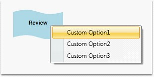

::: {style="DISPLAY: none"}
{#d2h_url_template}{#d2h_package_url style="WIDTH: 0px; DISPLAY: none; HEIGHT: 0px"}
:::

::::: {#nsbanner .d2h_main_nsbanner style="BORDER-BOTTOM: #999999 1px solid; POSITION: relative; PADDING-BOTTOM: 0px; BACKGROUND-COLOR: transparent; PADDING-LEFT: 0px; PADDING-RIGHT: 0px; DISPLAY: none; BORDER-TOP: #999999 1px solid; PADDING-TOP: 0px; LEFT: 0px"}
:::: {#TitleRow .d2h_main_titlerow style="PADDING-BOTTOM: 4px; BACKGROUND-COLOR: transparent; PADDING-LEFT: 22px; WIDTH: 100%; PADDING-RIGHT: 10px; DISPLAY: none; PADDING-TOP: 4px"}
::: {#ienav .d2h_main_ienav style="DISPLAY: none"}
{#D2HPrevious .D2HPreviousEnabled}  {#D2HNext .D2HNextEnabled}
:::
::::
:::::

::::: {#nstext .d2h_main_nstext style="PADDING-BOTTOM: 10px; BACKGROUND-COLOR: transparent; PADDING-LEFT: 22px; PADDING-RIGHT: 10px; HEIGHT: 100%; OVERFLOW: auto; PADDING-TOP: 5px" hasuserbackground="true" valign="bottom"}
::: {#d2h_breadcrumbs .d2h_breadcrumbs}
[Essential Studio User Guide Documentation](ms-xhelp:///?Id=12457748-09e3-4d74-a240-8e049cedf030){.d2h_breadcrumbsNormal}[ \> ]{.d2h_breadcrumbsLinkSeparator}[User Interface Edition](ms-xhelp:///?Id=c29296b7-531c-413b-a0ec-488ca1f7f669){.d2h_breadcrumbsNormal}[ \> ]{.d2h_breadcrumbsLinkSeparator}[Essential WPF](ms-xhelp:///?Id=7f4f82c5-151c-4262-94d0-75c4626c77bc){.d2h_breadcrumbsNormal}[ \> ]{.d2h_breadcrumbsLinkSeparator}[Essential Diagram]{.d2h_breadcrumbsContentsOnly}[ \> ]{.d2h_breadcrumbsLinkSeparator}[Concepts and Features](ms-xhelp:///?Id=8625d466-6e21-495a-b811-4ecee754da81){.d2h_breadcrumbsNormal}[ \> ]{.d2h_breadcrumbsLinkSeparator}[General](ms-xhelp:///?Id=5cdb06d0-b5a4-46bf-8756-7abe84af0530){.d2h_breadcrumbsNormal}
:::

### Customize the Context Menu of Nodes and Line Connectors {#customize-the-context-menu-of-nodes-and-line-connectors style="tab-stops: 0pt"}

Essential Diagram for WPF provides support for the display of context menus for nodes and connectors on right-clicking the node or connector. The context menu contains the default commands, Z-order BringToFront, SendToBack, MoveForward, SendBackward, Grouping (Group and Ungroup), and Delete. The context menu can be customized so that you can add some custom options to the context menu. This can be done using the **ContextMenu** property of the nodes and the line connectors.

[]{style="FONT-FAMILY: 'Trebuchet MS','sans-serif'; COLOR: #15428b; FONT-SIZE: 9pt"} 

The following code snippet illustrates addition of custom options to the context menu.

[]{style="FONT-FAMILY: 'Cambria','serif'; FONT-SIZE: 12pt"} 

+-------------------------------------------------------------------------------------------------------------------------------------------------------------------------------------------------------------------------------------------------------+
| **[\[C#\]]{style="FONT-FAMILY: 'Courier New'; COLOR: black"}**                                                                                                                                                                                        |
|                                                                                                                                                                                                                                                       |
| **[]{style="FONT-FAMILY: 'Courier New'; COLOR: black"}**                                                                                                                                                                                              |
|                                                                                                                                                                                                                                                       |
| [Node]{style="FONT-FAMILY: 'Courier New'; COLOR: #2b91af"}[ node1 = [new]{style="COLOR: blue"} [Node]{style="COLOR: #2b91af"}([Guid]{style="COLOR: #2b91af"}.NewGuid(), [\"Register\"]{style="COLOR: #a31515"});]{style="FONT-FAMILY: 'Courier New'"} |
|                                                                                                                                                                                                                                                       |
| [            node1.Shape = [Shapes]{style="COLOR: #2b91af"}.RoundedSquare;]{style="FONT-FAMILY: 'Courier New'"}                                                                                                                                       |
|                                                                                                                                                                                                                                                       |
| [            node1.Width = 150;]{style="FONT-FAMILY: 'Courier New'"}                                                                                                                                                                                  |
|                                                                                                                                                                                                                                                       |
| [            node1.Height = 50;]{style="FONT-FAMILY: 'Courier New'"}                                                                                                                                                                                  |
|                                                                                                                                                                                                                                                       |
| [            node1.OffsetX = 250;]{style="FONT-FAMILY: 'Courier New'"}                                                                                                                                                                                |
|                                                                                                                                                                                                                                                       |
| [            node1.OffsetY = 100;]{style="FONT-FAMILY: 'Courier New'"}                                                                                                                                                                                |
|                                                                                                                                                                                                                                                       |
| []{style="FONT-FAMILY: 'Courier New'"}                                                                                                                                                                                                                |
|                                                                                                                                                                                                                                                       |
| [ContextMenu]{style="FONT-FAMILY: 'Courier New'; COLOR: #2b91af"}[ menu = [new]{style="COLOR: blue"} [ContextMenu]{style="COLOR: #2b91af"}();]{style="FONT-FAMILY: 'Courier New'"}                                                                    |
|                                                                                                                                                                                                                                                       |
| [            [MenuItem]{style="COLOR: #2b91af"} item1 = [new]{style="COLOR: blue"} [MenuItem]{style="COLOR: #2b91af"}();]{style="FONT-FAMILY: 'Courier New'"}                                                                                         |
|                                                                                                                                                                                                                                                       |
| [            item1.Header = [\"Custom Option1\"]{style="COLOR: #a31515"};]{style="FONT-FAMILY: 'Courier New'"}                                                                                                                                        |
|                                                                                                                                                                                                                                                       |
| [            [MenuItem]{style="COLOR: #2b91af"} item2 = [new]{style="COLOR: blue"} [MenuItem]{style="COLOR: #2b91af"}();]{style="FONT-FAMILY: 'Courier New'"}                                                                                         |
|                                                                                                                                                                                                                                                       |
| [            item2.Header = [\"Custom Option2\"]{style="COLOR: #a31515"};]{style="FONT-FAMILY: 'Courier New'"}                                                                                                                                        |
|                                                                                                                                                                                                                                                       |
| [            [MenuItem]{style="COLOR: #2b91af"} item3 = [new]{style="COLOR: blue"} [MenuItem]{style="COLOR: #2b91af"}();]{style="FONT-FAMILY: 'Courier New'"}                                                                                         |
|                                                                                                                                                                                                                                                       |
| [            item3.Header = [\"Custom Option3\"]{style="COLOR: #a31515"};]{style="FONT-FAMILY: 'Courier New'"}                                                                                                                                        |
|                                                                                                                                                                                                                                                       |
| [            menu.Items.Add(item1);]{style="FONT-FAMILY: 'Courier New'"}                                                                                                                                                                              |
|                                                                                                                                                                                                                                                       |
| [            menu.Items.Add(item2);]{style="FONT-FAMILY: 'Courier New'"}                                                                                                                                                                              |
|                                                                                                                                                                                                                                                       |
| [            menu.Items.Add(item3);]{style="FONT-FAMILY: 'Courier New'"}                                                                                                                                                                              |
|                                                                                                                                                                                                                                                       |
| [            node1.ContextMenu = menu;]{style="FONT-FAMILY: 'Courier New'"}                                                                                                                                                                           |
+-------------------------------------------------------------------------------------------------------------------------------------------------------------------------------------------------------------------------------------------------------+

[]{style="FONT-FAMILY: 'Courier New'"} 

+--------------------------------------------------------------------------------------------------------------------------------------------------------------------------------------------------------------------------------------------------------------------------+
| **[\[VB\]]{style="FONT-FAMILY: 'Courier New'; COLOR: black"}**                                                                                                                                                                                                           |
|                                                                                                                                                                                                                                                                          |
| **[]{style="FONT-FAMILY: 'Courier New'; COLOR: black"}**                                                                                                                                                                                                                 |
|                                                                                                                                                                                                                                                                          |
| [Dim]{style="FONT-FAMILY: 'Courier New'; COLOR: blue"}[ node1 [As]{style="COLOR: blue"} [New]{style="COLOR: blue"} [Node]{style="COLOR: #2b91af"}([Guid]{style="COLOR: #2b91af"}.NewGuid(), [\"Register\"]{style="COLOR: #a31515"})]{style="FONT-FAMILY: 'Courier New'"} |
|                                                                                                                                                                                                                                                                          |
| [            node1.Shape = Shapes.RoundedSquare]{style="FONT-FAMILY: 'Courier New'"}                                                                                                                                                                                     |
|                                                                                                                                                                                                                                                                          |
| [            node1.Width = 150]{style="FONT-FAMILY: 'Courier New'"}                                                                                                                                                                                                      |
|                                                                                                                                                                                                                                                                          |
| [            node1.Height = 50]{style="FONT-FAMILY: 'Courier New'"}                                                                                                                                                                                                      |
|                                                                                                                                                                                                                                                                          |
| [            node1.OffsetX = 250]{style="FONT-FAMILY: 'Courier New'"}                                                                                                                                                                                                    |
|                                                                                                                                                                                                                                                                          |
| [            node1.OffsetY = 100]{style="FONT-FAMILY: 'Courier New'"}                                                                                                                                                                                                    |
|                                                                                                                                                                                                                                                                          |
| []{style="FONT-FAMILY: 'Courier New'"}                                                                                                                                                                                                                                   |
|                                                                                                                                                                                                                                                                          |
| [Dim]{style="FONT-FAMILY: 'Courier New'; COLOR: blue"}[ menu [As]{style="COLOR: blue"} [New]{style="COLOR: blue"} [ContextMenu]{style="COLOR: #2b91af"}()]{style="FONT-FAMILY: 'Courier New'"}                                                                           |
|                                                                                                                                                                                                                                                                          |
| [Dim]{style="FONT-FAMILY: 'Courier New'; COLOR: blue"}[ item1 [As]{style="COLOR: blue"} [New]{style="COLOR: blue"} [MenuItem]{style="COLOR: #2b91af"}()]{style="FONT-FAMILY: 'Courier New'"}                                                                             |
|                                                                                                                                                                                                                                                                          |
| [            item1.Header = \"Custom [Option]{style="COLOR: blue"}1\"]{style="FONT-FAMILY: 'Courier New'"}                                                                                                                                                               |
|                                                                                                                                                                                                                                                                          |
| [Dim]{style="FONT-FAMILY: 'Courier New'; COLOR: blue"}[ item2 [As]{style="COLOR: blue"} [New]{style="COLOR: blue"} [MenuItem]{style="COLOR: #2b91af"}()]{style="FONT-FAMILY: 'Courier New'"}                                                                             |
|                                                                                                                                                                                                                                                                          |
| [            item2.Header = \"Custom [Option]{style="COLOR: blue"}2\"]{style="FONT-FAMILY: 'Courier New'"}                                                                                                                                                               |
|                                                                                                                                                                                                                                                                          |
| [Dim]{style="FONT-FAMILY: 'Courier New'; COLOR: blue"}[ item3 [As]{style="COLOR: blue"} [New]{style="COLOR: blue"} [MenuItem]{style="COLOR: #2b91af"}()]{style="FONT-FAMILY: 'Courier New'"}                                                                             |
|                                                                                                                                                                                                                                                                          |
| [            item3.Header = \"Custom [Option]{style="COLOR: blue"}3\"]{style="FONT-FAMILY: 'Courier New'"}                                                                                                                                                               |
|                                                                                                                                                                                                                                                                          |
| [            menu.Items.Add(item1)]{style="FONT-FAMILY: 'Courier New'"}                                                                                                                                                                                                  |
|                                                                                                                                                                                                                                                                          |
| [            menu.Items.Add(item2)]{style="FONT-FAMILY: 'Courier New'"}                                                                                                                                                                                                  |
|                                                                                                                                                                                                                                                                          |
| [            menu.Items.Add(item3)]{style="FONT-FAMILY: 'Courier New'"}                                                                                                                                                                                                  |
|                                                                                                                                                                                                                                                                          |
| [            node1.ContextMenu = menu]{style="FONT-FAMILY: 'Courier New'"}[]{style="FONT-FAMILY: 'Courier New'"}                                                                                                                                                         |
+--------------------------------------------------------------------------------------------------------------------------------------------------------------------------------------------------------------------------------------------------------------------------+

[]{style="FONT-FAMILY: 'Courier New'"} 

Similarly we can set it for the connectors as follows:

[]{style="FONT-FAMILY: 'Courier New'"} 

+----------------------------------------------------------------------------------------------------------------------------------------------------------------------------------------+
| **[\[C#\]]{style="FONT-FAMILY: 'Courier New'; COLOR: black"}**                                                                                                                         |
|                                                                                                                                                                                        |
| **[]{style="FONT-FAMILY: 'Courier New'; COLOR: black"}**                                                                                                                               |
|                                                                                                                                                                                        |
| [LineConnector]{style="FONT-FAMILY: 'Courier New'; COLOR: #2b91af"}[ line = [new]{style="COLOR: blue"} [LineConnector]{style="COLOR: #2b91af"}();]{style="FONT-FAMILY: 'Courier New'"} |
|                                                                                                                                                                                        |
| [line.ContextMenu = menu;]{style="FONT-FAMILY: 'Courier New'"}                                                                                                                         |
+----------------------------------------------------------------------------------------------------------------------------------------------------------------------------------------+

[]{style="FONT-FAMILY: 'Courier New'"} 

+--------------------------------------------------------------------------------------------------------------------------------------------------------------------------------------------------+
| **[\[VB\]]{style="FONT-FAMILY: 'Courier New'; COLOR: black"}**                                                                                                                                   |
|                                                                                                                                                                                                  |
| **[]{style="FONT-FAMILY: 'Courier New'; COLOR: black"}**                                                                                                                                         |
|                                                                                                                                                                                                  |
| [Dim]{style="FONT-FAMILY: 'Courier New'; COLOR: blue"}[ line [As]{style="COLOR: blue"} [New]{style="COLOR: blue"} [LineConnector]{style="COLOR: #2b91af"}()]{style="FONT-FAMILY: 'Courier New'"} |
|                                                                                                                                                                                                  |
| [line.ContextMenu = menu]{style="FONT-FAMILY: 'Courier New'"}[]{style="FONT-FAMILY: 'Courier New'"}                                                                                              |
+--------------------------------------------------------------------------------------------------------------------------------------------------------------------------------------------------+

[]{style="FONT-FAMILY: 'Courier New'"} 

{border="0"}

Figure 210: Custom Context Menu[]{style="FONT-FAMILY: 'Courier New'"}

***[]{style="FONT-FAMILY: 'Trebuchet MS','sans-serif'; COLOR: #15428b; FONT-SIZE: 9pt"}*** 

[]{style="FONT-FAMILY: 'Courier New'"} 

The context menu can also be specified for all the nodes on the page using the **NodeContextMenu** property. Similarly to specify custom context menu for all the lines on the page, the **LineConnectorContextMenu** property of DiagramView can be used as follows:

[]{style="FONT-FAMILY: 'Trebuchet MS','sans-serif'; COLOR: #15428b; FONT-SIZE: 9pt"} 

+-------------------------------------------------------------------------------------------------------------------------------------------------------------------------------------+
| **[\[C#\]]{style="FONT-FAMILY: 'Courier New'; COLOR: black"}**                                                                                                                      |
|                                                                                                                                                                                     |
| **[]{style="FONT-FAMILY: 'Courier New'; COLOR: black"}**                                                                                                                            |
|                                                                                                                                                                                     |
| [ContextMenu]{style="FONT-FAMILY: 'Courier New'; COLOR: #2b91af"}[ menu1 = [new]{style="COLOR: blue"} [ContextMenu]{style="COLOR: #2b91af"}();]{style="FONT-FAMILY: 'Courier New'"} |
|                                                                                                                                                                                     |
| [            [MenuItem]{style="COLOR: #2b91af"} item11 = [new]{style="COLOR: blue"} [MenuItem]{style="COLOR: #2b91af"}();]{style="FONT-FAMILY: 'Courier New'"}                      |
|                                                                                                                                                                                     |
| [            item11.Header = [\"Custom Option11\"]{style="COLOR: #a31515"};]{style="FONT-FAMILY: 'Courier New'"}                                                                    |
|                                                                                                                                                                                     |
| [            [MenuItem]{style="COLOR: #2b91af"} item21 = [new]{style="COLOR: blue"} [MenuItem]{style="COLOR: #2b91af"}();]{style="FONT-FAMILY: 'Courier New'"}                      |
|                                                                                                                                                                                     |
| [            item21.Header = [\"Custom Option21\"]{style="COLOR: #a31515"};]{style="FONT-FAMILY: 'Courier New'"}                                                                    |
|                                                                                                                                                                                     |
| [            [MenuItem]{style="COLOR: #2b91af"} item31 = [new]{style="COLOR: blue"} [MenuItem]{style="COLOR: #2b91af"}();]{style="FONT-FAMILY: 'Courier New'"}                      |
|                                                                                                                                                                                     |
| [            item31.Header = [\"Custom Option31\"]{style="COLOR: #a31515"};]{style="FONT-FAMILY: 'Courier New'"}                                                                    |
|                                                                                                                                                                                     |
| [            menu1.Items.Add(item11);]{style="FONT-FAMILY: 'Courier New'"}                                                                                                          |
|                                                                                                                                                                                     |
| [            menu1.Items.Add(item21);]{style="FONT-FAMILY: 'Courier New'"}                                                                                                          |
|                                                                                                                                                                                     |
| [            menu1.Items.Add(item31);]{style="FONT-FAMILY: 'Courier New'"}                                                                                                          |
|                                                                                                                                                                                     |
| [            diagramView.NodeContextMenu = menu1;]{style="FONT-FAMILY: 'Courier New'"}                                                                                              |
|                                                                                                                                                                                     |
| [diagramView.LineConnectorContextMenu = menu1;]{style="FONT-FAMILY: 'Courier New'"}                                                                                                 |
+-------------------------------------------------------------------------------------------------------------------------------------------------------------------------------------+

[  ]{style="FONT-FAMILY: 'Courier New'"}

+-------------------------------------------------------------------------------------------------------------------------------------------------------------------------------------------------+
| **[\[VB\]]{style="FONT-FAMILY: 'Courier New'; COLOR: black"}**                                                                                                                                  |
|                                                                                                                                                                                                 |
| **[]{style="FONT-FAMILY: 'Courier New'; COLOR: black"}**                                                                                                                                        |
|                                                                                                                                                                                                 |
| [Dim]{style="FONT-FAMILY: 'Courier New'; COLOR: blue"}[ menu1 [As]{style="COLOR: blue"} [New]{style="COLOR: blue"} [ContextMenu]{style="COLOR: #2b91af"}()]{style="FONT-FAMILY: 'Courier New'"} |
|                                                                                                                                                                                                 |
| [Dim]{style="FONT-FAMILY: 'Courier New'; COLOR: blue"}[ item11 [As]{style="COLOR: blue"} [New]{style="COLOR: blue"} [MenuItem]{style="COLOR: #2b91af"}()]{style="FONT-FAMILY: 'Courier New'"}   |
|                                                                                                                                                                                                 |
| [            item11.Header = \"Custom [Option]{style="COLOR: blue"}11\"]{style="FONT-FAMILY: 'Courier New'"}                                                                                    |
|                                                                                                                                                                                                 |
| [Dim]{style="FONT-FAMILY: 'Courier New'; COLOR: blue"}[ item21 [As]{style="COLOR: blue"} [New]{style="COLOR: blue"} [MenuItem]{style="COLOR: #2b91af"}()]{style="FONT-FAMILY: 'Courier New'"}   |
|                                                                                                                                                                                                 |
| [            item21.Header = \"Custom [Option]{style="COLOR: blue"}21\"]{style="FONT-FAMILY: 'Courier New'"}                                                                                    |
|                                                                                                                                                                                                 |
| [Dim]{style="FONT-FAMILY: 'Courier New'; COLOR: blue"}[ item31 [As]{style="COLOR: blue"} [New]{style="COLOR: blue"} [MenuItem]{style="COLOR: #2b91af"}()]{style="FONT-FAMILY: 'Courier New'"}   |
|                                                                                                                                                                                                 |
| [            item31.Header = \"Custom [Option]{style="COLOR: blue"}31\"]{style="FONT-FAMILY: 'Courier New'"}                                                                                    |
|                                                                                                                                                                                                 |
| [            menu1.Items.Add(item11)]{style="FONT-FAMILY: 'Courier New'"}                                                                                                                       |
|                                                                                                                                                                                                 |
| [            menu1.Items.Add(item21)]{style="FONT-FAMILY: 'Courier New'"}                                                                                                                       |
|                                                                                                                                                                                                 |
| [            menu1.Items.Add(item31)]{style="FONT-FAMILY: 'Courier New'"}                                                                                                                       |
|                                                                                                                                                                                                 |
| [            diagramView.NodeContextMenu = menu1]{style="FONT-FAMILY: 'Courier New'"}                                                                                                           |
|                                                                                                                                                                                                 |
| [diagramView.LineConnectorContextMenu = menu1]{style="FONT-FAMILY: 'Courier New'"}[]{style="FONT-FAMILY: 'Courier New'"}                                                                        |
+-------------------------------------------------------------------------------------------------------------------------------------------------------------------------------------------------+

[]{style="FONT-FAMILY: 'Courier New'"} 

::: {style="BORDER-BOTTOM: windowtext 1pt solid; BORDER-LEFT: medium none; PADDING-BOTTOM: 1pt; MARGIN-TOP: 9pt; PADDING-LEFT: 0pt; PADDING-RIGHT: 0pt; MARGIN-BOTTOM: 9pt; BORDER-TOP: windowtext 1pt solid; BORDER-RIGHT: medium none; PADDING-TOP: 1pt"}
[{border="0"}]{style="FONT-FAMILY: 'Courier New'"} Note: If any node's context menu is assigned using the ContextMenu property of that node, then it will take precedence over the DiagramView's NodeContextMenu property. The same applies to Line Connectors.
:::

[]{#related-topics}
:::::
