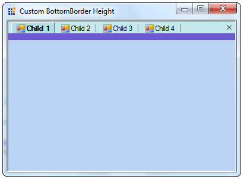

::: {style="DISPLAY: none"}
{#d2h_url_template}{#d2h_package_url style="WIDTH: 0px; DISPLAY: none; HEIGHT: 0px"}
:::

::: {.d2h_secondary_topic style="PADDING-BOTTOM: 10pt; MARGIN: 0pt; PADDING-LEFT: 0pt; PADDING-RIGHT: 0pt; PADDING-TOP: 0pt"}
#### Customize the Distance between the Tab and the Control in TabbedMDIManager {#customize-the-distance-between-the-tab-and-the-control-in-tabbedmdimanager style="MARGIN-LEFT: 18pt; tab-stops: 18.0pt"}

 

The height between the Tab and the Control can be set using the **BottomBorderHeigh**t property of the TabHost. This property can be accessed by overriding the TabbdedMDIManager as shown in the code snippet.

[]{style="COLOR: #15428b"} 

{border="0"}[]{style="FONT-FAMILY: 'Calibri','sans-serif'; FONT-SIZE: 11pt"}

Figure 1105: Custom BottomBorder Height

**** 

+-----------------------------------------------------------------------------------------------------------------------------------------------------------------------------------------------------------------------------+
| **[\[C#\]]{style="FONT-FAMILY: 'Courier New'"}**                                                                                                                                                                            |
|                                                                                                                                                                                                                             |
| **[]{style="FONT-FAMILY: 'Courier New'"}**                                                                                                                                                                                  |
|                                                                                                                                                                                                                             |
| [    public]{style="FONT-FAMILY: 'Courier New'; COLOR: blue"}[ [class]{style="COLOR: blue"} [TabbedMDIManagerExt]{style="COLOR: #2b91af"} : [TabbedMDIManager]{style="COLOR: #2b91af"}]{style="FONT-FAMILY: 'Courier New'"} |
|                                                                                                                                                                                                                             |
| [    {]{style="FONT-FAMILY: 'Courier New'"}                                                                                                                                                                                 |
|                                                                                                                                                                                                                             |
| [        [public]{style="COLOR: blue"} TabbedMDIManagerExt() : [base]{style="COLOR: blue"}(){ }]{style="FONT-FAMILY: 'Courier New'"}                                                                                        |
|                                                                                                                                                                                                                             |
| []{style="FONT-FAMILY: 'Courier New'"}                                                                                                                                                                                      |
|                                                                                                                                                                                                                             |
| [        [public]{style="COLOR: blue"} TabbedMDIManagerExt([IContainer]{style="COLOR: #2b91af"} container): [base]{style="COLOR: blue"}(container){}]{style="FONT-FAMILY: 'Courier New'"}                                   |
|                                                                                                                                                                                                                             |
| []{style="FONT-FAMILY: 'Courier New'"}                                                                                                                                                                                      |
|                                                                                                                                                                                                                             |
| [        [protected]{style="COLOR: blue"} [override]{style="COLOR: blue"} [TabHost]{style="COLOR: #2b91af"} CreateTabHost()]{style="FONT-FAMILY: 'Courier New'"}                                                            |
|                                                                                                                                                                                                                             |
| [        {]{style="FONT-FAMILY: 'Courier New'"}                                                                                                                                                                             |
|                                                                                                                                                                                                                             |
| [            [TabHost]{style="COLOR: #2b91af"} tabHost = [base]{style="COLOR: blue"}.CreateTabHost();]{style="FONT-FAMILY: 'Courier New'"}                                                                                  |
|                                                                                                                                                                                                                             |
| []{style="FONT-FAMILY: 'Courier New'"}                                                                                                                                                                                      |
|                                                                                                                                                                                                                             |
| [            [// Sets the Height in pixels.]{style="COLOR: green"}]{style="FONT-FAMILY: 'Courier New'"}                                                                                                                     |
|                                                                                                                                                                                                                             |
| [            tabHost.BottomBorderHeight = 10;]{style="FONT-FAMILY: 'Courier New'"}                                                                                                                                          |
|                                                                                                                                                                                                                             |
| [            tabHost.BottomBorderColor = [Color]{style="COLOR: #2b91af"}.SlateBlue;]{style="FONT-FAMILY: 'Courier New'"}                                                                                                    |
|                                                                                                                                                                                                                             |
| [            [return]{style="COLOR: blue"} tabHost;]{style="FONT-FAMILY: 'Courier New'"}                                                                                                                                    |
|                                                                                                                                                                                                                             |
| [        }]{style="FONT-FAMILY: 'Courier New'"}                                                                                                                                                                             |
|                                                                                                                                                                                                                             |
| []{style="FONT-FAMILY: 'Courier New'"}                                                                                                                                                                                      |
|                                                                                                                                                                                                                             |
| [        [protected]{style="COLOR: blue"} [override]{style="COLOR: blue"} [MDITabPanel]{style="COLOR: #2b91af"} CreateMDITabPanel()]{style="FONT-FAMILY: 'Courier New'"}                                                    |
|                                                                                                                                                                                                                             |
| [        {]{style="FONT-FAMILY: 'Courier New'"}                                                                                                                                                                             |
|                                                                                                                                                                                                                             |
| [            [MDITabPanel]{style="COLOR: #2b91af"} tabPanel = [base]{style="COLOR: blue"}.CreateMDITabPanel();]{style="FONT-FAMILY: 'Courier New'"}                                                                         |
|                                                                                                                                                                                                                             |
| [            tabPanel.ActiveTabColor = [Color]{style="COLOR: #2b91af"}.PowderBlue;]{style="FONT-FAMILY: 'Courier New'"}                                                                                                     |
|                                                                                                                                                                                                                             |
| [            [return]{style="COLOR: blue"} tabPanel;]{style="FONT-FAMILY: 'Courier New'"}                                                                                                                                   |
|                                                                                                                                                                                                                             |
| [        }]{style="FONT-FAMILY: 'Courier New'"}                                                                                                                                                                             |
|                                                                                                                                                                                                                             |
| [    }]{style="FONT-FAMILY: 'Courier New'"}                                                                                                                                                                                 |
+-----------------------------------------------------------------------------------------------------------------------------------------------------------------------------------------------------------------------------+

[]{style="COLOR: #c00000"} 

**** 

+-----------------------------------------------------------------------------------------------------------------------------------------------------------------------------------------------------------------+
| **[\[VB\]]{style="FONT-FAMILY: 'Courier New'"}**                                                                                                                                                                |
|                                                                                                                                                                                                                 |
| **[]{style="FONT-FAMILY: 'Courier New'"}**                                                                                                                                                                      |
|                                                                                                                                                                                                                 |
| [  ]{style="FONT-FAMILY: 'Courier New'"}[Public]{style="FONT-FAMILY: 'Courier New'; COLOR: blue"}[ [Class]{style="COLOR: blue"} TabbedMDIManagerExt]{style="FONT-FAMILY: 'Courier New'"}                        |
|                                                                                                                                                                                                                 |
| [   [Inherits]{style="COLOR: blue"} TabbedMDIManager]{style="FONT-FAMILY: 'Courier New'"}                                                                                                                       |
|                                                                                                                                                                                                                 |
| [         [Public]{style="COLOR: blue"} [Sub]{style="COLOR: blue"} [New]{style="COLOR: blue"}()]{style="FONT-FAMILY: 'Courier New'"}                                                                            |
|                                                                                                                                                                                                                 |
| [               [MyBase]{style="COLOR: blue"}.New()]{style="FONT-FAMILY: 'Courier New'"}                                                                                                                        |
|                                                                                                                                                                                                                 |
| [         [End]{style="COLOR: blue"} [Sub]{style="COLOR: blue"}]{style="FONT-FAMILY: 'Courier New'"}                                                                                                            |
|                                                                                                                                                                                                                 |
| []{style="FONT-FAMILY: 'Courier New'"}                                                                                                                                                                          |
|                                                                                                                                                                                                                 |
| [         [Public]{style="COLOR: blue"} [Sub]{style="COLOR: blue"} [New]{style="COLOR: blue"}([ByVal]{style="COLOR: blue"} container [As]{style="COLOR: blue"} IContainer)]{style="FONT-FAMILY: 'Courier New'"} |
|                                                                                                                                                                                                                 |
| [               [MyBase]{style="COLOR: blue"}.New(container)]{style="FONT-FAMILY: 'Courier New'"}                                                                                                               |
|                                                                                                                                                                                                                 |
| [         [End]{style="COLOR: blue"} [Sub]{style="COLOR: blue"}]{style="FONT-FAMILY: 'Courier New'"}                                                                                                            |
|                                                                                                                                                                                                                 |
| []{style="FONT-FAMILY: 'Courier New'"}                                                                                                                                                                          |
|                                                                                                                                                                                                                 |
| [         [Protected]{style="COLOR: blue"} [Overrides]{style="COLOR: blue"} [Function]{style="COLOR: blue"} CreateTabHost() [As]{style="COLOR: blue"} TabHost]{style="FONT-FAMILY: 'Courier New'"}              |
|                                                                                                                                                                                                                 |
| [               [Dim]{style="COLOR: blue"} tabHost [As]{style="COLOR: blue"} TabHost = [MyBase]{style="COLOR: blue"}.CreateTabHost()]{style="FONT-FAMILY: 'Courier New'"}                                       |
|                                                                                                                                                                                                                 |
| []{style="FONT-FAMILY: 'Courier New'"}                                                                                                                                                                          |
|                                                                                                                                                                                                                 |
| [               \' Sets the Height in pixels.]{style="FONT-FAMILY: 'Courier New'; COLOR: green"}[]{style="FONT-FAMILY: 'Courier New'"}                                                                          |
|                                                                                                                                                                                                                 |
| [               tabHost.BottomBorderHeight = 10]{style="FONT-FAMILY: 'Courier New'"}                                                                                                                            |
|                                                                                                                                                                                                                 |
| [               tabHost.BottomBorderColor = Color.SlateBlue]{style="FONT-FAMILY: 'Courier New'"}                                                                                                                |
|                                                                                                                                                                                                                 |
| [               [Return]{style="COLOR: blue"} tabHost]{style="FONT-FAMILY: 'Courier New'"}                                                                                                                      |
|                                                                                                                                                                                                                 |
| [         [End]{style="COLOR: blue"} [Function]{style="COLOR: blue"}]{style="FONT-FAMILY: 'Courier New'"}                                                                                                       |
|                                                                                                                                                                                                                 |
| []{style="FONT-FAMILY: 'Courier New'"}                                                                                                                                                                          |
|                                                                                                                                                                                                                 |
| [         [Protected]{style="COLOR: blue"} [Overrides]{style="COLOR: blue"} [Function]{style="COLOR: blue"} CreateMDITabPanel() [As]{style="COLOR: blue"} MDITabPanel]{style="FONT-FAMILY: 'Courier New'"}      |
|                                                                                                                                                                                                                 |
| [               [Dim]{style="COLOR: blue"} tabPanel [As]{style="COLOR: blue"} MDITabPanel = [MyBase]{style="COLOR: blue"}.CreateMDITabPanel()]{style="FONT-FAMILY: 'Courier New'"}                              |
|                                                                                                                                                                                                                 |
| [               tabPanel.ActiveTabColor = Color.PowderBlue]{style="FONT-FAMILY: 'Courier New'"}                                                                                                                 |
|                                                                                                                                                                                                                 |
| [               [Return]{style="COLOR: blue"} tabPanel]{style="FONT-FAMILY: 'Courier New'"}                                                                                                                     |
|                                                                                                                                                                                                                 |
| [         [End]{style="COLOR: blue"} [Function]{style="COLOR: blue"}]{style="FONT-FAMILY: 'Courier New'"}                                                                                                       |
|                                                                                                                                                                                                                 |
| [End]{style="FONT-FAMILY: 'Courier New'; COLOR: blue"}[ [Class]{style="COLOR: blue"}]{style="FONT-FAMILY: 'Courier New'"}                                                                                       |
+-----------------------------------------------------------------------------------------------------------------------------------------------------------------------------------------------------------------+

[]{style="COLOR: #c00000"} 

 

[]{#p944} 

[]{#related-topics}
:::
