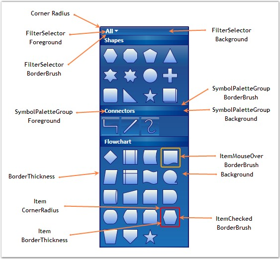
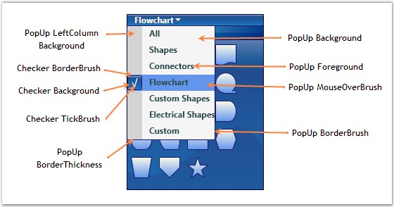

::: {style="DISPLAY: none"}
{#d2h_url_template}{#d2h_package_url style="WIDTH: 0px; DISPLAY: none; HEIGHT: 0px"}
:::

::::: {#nsbanner .d2h_main_nsbanner style="BORDER-BOTTOM: #999999 1px solid; POSITION: relative; PADDING-BOTTOM: 0px; BACKGROUND-COLOR: transparent; PADDING-LEFT: 0px; PADDING-RIGHT: 0px; DISPLAY: none; BORDER-TOP: #999999 1px solid; PADDING-TOP: 0px; LEFT: 0px"}
:::: {#TitleRow .d2h_main_titlerow style="PADDING-BOTTOM: 4px; BACKGROUND-COLOR: transparent; PADDING-LEFT: 22px; WIDTH: 100%; PADDING-RIGHT: 10px; DISPLAY: none; PADDING-TOP: 4px"}
::: {#ienav .d2h_main_ienav style="DISPLAY: none"}
{#D2HPrevious .D2HPreviousEnabled}  {#D2HNext .D2HNextEnabled}
:::
::::
:::::

::::: {#nstext .d2h_main_nstext style="PADDING-BOTTOM: 10px; BACKGROUND-COLOR: transparent; PADDING-LEFT: 22px; PADDING-RIGHT: 10px; HEIGHT: 100%; OVERFLOW: auto; PADDING-TOP: 5px" hasuserbackground="true" valign="bottom"}
::: {#d2h_breadcrumbs .d2h_breadcrumbs}
[Essential Studio User Guide Documentation](ms-xhelp:///?Id=12457748-09e3-4d74-a240-8e049cedf030){.d2h_breadcrumbsNormal}[ \> ]{.d2h_breadcrumbsLinkSeparator}[User Interface Edition](ms-xhelp:///?Id=c29296b7-531c-413b-a0ec-488ca1f7f669){.d2h_breadcrumbsNormal}[ \> ]{.d2h_breadcrumbsLinkSeparator}[Essential WPF](ms-xhelp:///?Id=7f4f82c5-151c-4262-94d0-75c4626c77bc){.d2h_breadcrumbsNormal}[ \> ]{.d2h_breadcrumbsLinkSeparator}[Essential Diagram]{.d2h_breadcrumbsContentsOnly}[ \> ]{.d2h_breadcrumbsLinkSeparator}[Concepts and Features](ms-xhelp:///?Id=8625d466-6e21-495a-b811-4ecee754da81){.d2h_breadcrumbsNormal}[ \> ]{.d2h_breadcrumbsLinkSeparator}[SymbolPalette](ms-xhelp:///?Id=20dbf28d-6928-4d19-a722-5f6779ab36c2){.d2h_breadcrumbsNormal}
:::

### Customize the SymbolPalette {#customize-the-symbolpalette style="tab-stops: 0pt"}

The appearance of the SymbolPalette can be customized to suit any application. Several properties have been provided in the **SymbolPalette** class to enable its customization.

 

The following properties can be used to customize the SymbolPalette in your application.\
\

Table 83: Property Table

::: {align="center"}
+-----------------------------------+-----------------------------------------------------------------------------------------------------+----------------------+------------------+---------------------------------------------------+
| Property                          | Description                                                                                         | Type of the property | Value it accepts | Any other dependencies/ sub properties associated |
+-----------------------------------+-----------------------------------------------------------------------------------------------------+----------------------+------------------+---------------------------------------------------+
| Background                        | Specifies the background color of the SymbolPalette.                                                | Dependency property  | Brush            | No                                                |
|                                   |                                                                                                     |                      |                  |                                                   |
|                                   | The default color is *Beige*.                                                                       |                      |                  |                                                   |
+-----------------------------------+-----------------------------------------------------------------------------------------------------+----------------------+------------------+---------------------------------------------------+
| BorderThickness                   | Gets or sets the border thickness of the SymbolPalette.                                             | Dependency property  | Thickness        | No                                                |
|                                   |                                                                                                     |                      |                  |                                                   |
|                                   | The default value is 1.                                                                             |                      |                  |                                                   |
+-----------------------------------+-----------------------------------------------------------------------------------------------------+----------------------+------------------+---------------------------------------------------+
| BorderBrush                       | Specifies the border color of the SymbolPalette.                                                    | Dependency property  | Brush            | No                                                |
|                                   |                                                                                                     |                      |                  |                                                   |
|                                   | The default color is *Brown*.                                                                       |                      |                  |                                                   |
+-----------------------------------+-----------------------------------------------------------------------------------------------------+----------------------+------------------+---------------------------------------------------+
| SymbolPaletteGroupBackground      | Specifies the background color of the SymbolPalette Group.                                          | Dependency property  | Brush            | No                                                |
|                                   |                                                                                                     |                      |                  |                                                   |
|                                   | The default color is *Bisque*.                                                                      |                      |                  |                                                   |
+-----------------------------------+-----------------------------------------------------------------------------------------------------+----------------------+------------------+---------------------------------------------------+
| SymbolPaletteGroupForeground      | Specifies the foreground color of the SymbolPalette Group.                                          | Dependency property  | Brush            | No                                                |
|                                   |                                                                                                     |                      |                  |                                                   |
|                                   | The default color is *SaddleBrown.*                                                                 |                      |                  |                                                   |
+-----------------------------------+-----------------------------------------------------------------------------------------------------+----------------------+------------------+---------------------------------------------------+
| SymbolPaletteGroupBorderBrush     | Specifies the border color of the SymbolPalette Group.                                              | Dependency property  | Brush            | No                                                |
|                                   |                                                                                                     |                      |                  |                                                   |
|                                   | The default color is *Chocolate.*                                                                   |                      |                  |                                                   |
+-----------------------------------+-----------------------------------------------------------------------------------------------------+----------------------+------------------+---------------------------------------------------+
| ItemBorderThickness               | Gets or sets the border thickness of the SymbolPalette Item.                                        | Dependency property  | Thickness        | No                                                |
|                                   |                                                                                                     |                      |                  |                                                   |
|                                   | The default value is 1.                                                                             |                      |                  |                                                   |
+-----------------------------------+-----------------------------------------------------------------------------------------------------+----------------------+------------------+---------------------------------------------------+
| ItemCornerRadius                  | Gets or sets the corner radius of the SymbolPalette Item.                                           | Dependency property  | CornerRadius     | No                                                |
|                                   |                                                                                                     |                      |                  |                                                   |
|                                   | The default value is 2.                                                                             |                      |                  |                                                   |
+-----------------------------------+-----------------------------------------------------------------------------------------------------+----------------------+------------------+---------------------------------------------------+
| ItemMouseOverBorderBrush          | Specifies the border color of the SymbolPalette Item over which the mouse pointer rests.            | Dependency property  | Brush            | No                                                |
|                                   |                                                                                                     |                      |                  |                                                   |
|                                   | The default value is *Orange*.                                                                      |                      |                  |                                                   |
+-----------------------------------+-----------------------------------------------------------------------------------------------------+----------------------+------------------+---------------------------------------------------+
| ItemCheckedBorderBrush            | Specifies the border color of the SymbolPalette Item that is selected.                              | Dependency property  | Brush            | No                                                |
|                                   |                                                                                                     |                      |                  |                                                   |
|                                   | The default value is *Red*.                                                                         |                      |                  |                                                   |
+-----------------------------------+-----------------------------------------------------------------------------------------------------+----------------------+------------------+---------------------------------------------------+
| ItemCheckedMouseOverBorderBrush   | Specifies the border color of the selected SymbolPalette Item over which the mouse pointer rests.   | Dependency property  | Brush            | No                                                |
|                                   |                                                                                                     |                      |                  |                                                   |
|                                   | The default value is *Green*.                                                                       |                      |                  |                                                   |
+-----------------------------------+-----------------------------------------------------------------------------------------------------+----------------------+------------------+---------------------------------------------------+
| FilterSelectorBackground          | Specifies the background color of the SymbolPalette Filter.                                         | Dependency property  | Brush            | No                                                |
|                                   |                                                                                                     |                      |                  |                                                   |
|                                   | The default value is *Chocolate*.                                                                   |                      |                  |                                                   |
+-----------------------------------+-----------------------------------------------------------------------------------------------------+----------------------+------------------+---------------------------------------------------+
| FilterSelectorForeground          | Specifies the foreground color of the SymbolPalette Filter.                                         | Dependency property  | Brush            | No                                                |
|                                   |                                                                                                     |                      |                  |                                                   |
|                                   | The default value is *DarkSlateGray*.                                                               |                      |                  |                                                   |
+-----------------------------------+-----------------------------------------------------------------------------------------------------+----------------------+------------------+---------------------------------------------------+
| FilterSelectorBorderThickness     | Gets or sets the border thickness of the SymbolPalette Filter.                                      | Dependency property  | Thickness        | No                                                |
|                                   |                                                                                                     |                      |                  |                                                   |
|                                   | The default value is (0,0,0,1).                                                                     |                      |                  |                                                   |
+-----------------------------------+-----------------------------------------------------------------------------------------------------+----------------------+------------------+---------------------------------------------------+
| FilterSelectorMouseOverForeground | Specifies the foreground color of the SymbolPalette Filter over which the mouse pointer rests.      | Dependency property  | Brush            | No                                                |
|                                   |                                                                                                     |                      |                  |                                                   |
|                                   | The default value is *OldLace*.                                                                     |                      |                  |                                                   |
+-----------------------------------+-----------------------------------------------------------------------------------------------------+----------------------+------------------+---------------------------------------------------+
| FilterSelectorBorderBrush         | specifies the border color of the SymbolPalette Filter                                              | Dependency property  | Brush            | No                                                |
|                                   |                                                                                                     |                      |                  |                                                   |
|                                   | The default value is *Chocolate*.                                                                   |                      |                  |                                                   |
+-----------------------------------+-----------------------------------------------------------------------------------------------------+----------------------+------------------+---------------------------------------------------+
| PopUpBackground                   | Specifies the background color of the SymbolPalette Pop-up.                                         | Dependency property  | Brush            | No                                                |
|                                   |                                                                                                     |                      |                  |                                                   |
|                                   | The default value is *WhiteSmoke*.                                                                  |                      |                  |                                                   |
+-----------------------------------+-----------------------------------------------------------------------------------------------------+----------------------+------------------+---------------------------------------------------+
| PopUpForeground                   | Specifies the foreground color of the SymbolPalette Pop-up.                                         | Dependency property  | Brush            | No                                                |
|                                   |                                                                                                     |                      |                  |                                                   |
|                                   | The default value is *DarkSlateGray*.                                                               |                      |                  |                                                   |
+-----------------------------------+-----------------------------------------------------------------------------------------------------+----------------------+------------------+---------------------------------------------------+
| PopUpBorderThickness              | Gets or sets the border thickness of the SymbolPalette Pop-up                                       | Dependency property  | Thickness        | No                                                |
|                                   |                                                                                                     |                      |                  |                                                   |
|                                   | The default value is (0,1,1,1).                                                                     |                      |                  |                                                   |
+-----------------------------------+-----------------------------------------------------------------------------------------------------+----------------------+------------------+---------------------------------------------------+
| PopUpMouseOverBrush               | Specifies the background color of the SymbolPalette pop-up Item over which the mouse pointer rests. | Dependency property  | Brush            | No                                                |
|                                   |                                                                                                     |                      |                  |                                                   |
|                                   | The default value is *LightSalmon*.                                                                 |                      |                  |                                                   |
+-----------------------------------+-----------------------------------------------------------------------------------------------------+----------------------+------------------+---------------------------------------------------+
| PopUpBorderBrush                  | Specifies the border color of the SymbolPalette pop-up.                                             | Dependency property  | Brush            | No                                                |
|                                   |                                                                                                     |                      |                  |                                                   |
|                                   | The default value is *Chocolate*.                                                                   |                      |                  |                                                   |
+-----------------------------------+-----------------------------------------------------------------------------------------------------+----------------------+------------------+---------------------------------------------------+
| PopUpLeftColumnBackground         | Specifies the background color of the Check Box Column in the SymbolPalette pop-up.                 | Dependency property  | Brush            | No                                                |
|                                   |                                                                                                     |                      |                  |                                                   |
|                                   | The default value is *LightGray*.                                                                   |                      |                  |                                                   |
+-----------------------------------+-----------------------------------------------------------------------------------------------------+----------------------+------------------+---------------------------------------------------+
| CheckerBackground                 | Specifies the the background color of the Check Boxes in the SymbolPalette pop-up.                  | Dependency property  | Brush            | No                                                |
|                                   |                                                                                                     |                      |                  |                                                   |
|                                   | The default value is *Bisque*.                                                                      |                      |                  |                                                   |
+-----------------------------------+-----------------------------------------------------------------------------------------------------+----------------------+------------------+---------------------------------------------------+
| CheckerBorderBrush                | Specifies the the border color of the Check Boxes in the SymbolPalette pop-up.                      | Dependency property  | Brush            | No                                                |
|                                   |                                                                                                     |                      |                  |                                                   |
|                                   | The default value is *DarkSlateGray.*                                                               |                      |                  |                                                   |
+-----------------------------------+-----------------------------------------------------------------------------------------------------+----------------------+------------------+---------------------------------------------------+
| CheckerTickBrush                  | Specifies the Tick color of the selected Check Box in the SymbolPalette pop-up.                     | Dependency property  | Brush            | No                                                |
|                                   |                                                                                                     |                      |                  |                                                   |
|                                   | The default value is *DarkSlateGray.*                                                               |                      |                  |                                                   |
+-----------------------------------+-----------------------------------------------------------------------------------------------------+----------------------+------------------+---------------------------------------------------+
:::

[]{style="FONT-FAMILY: 'Trebuchet MS','sans-serif'; COLOR: #15428b; FONT-SIZE: 9pt"} 

The following code example illustrates how to set some of the SymbolPalette properties.

[]{style="FONT-FAMILY: 'Trebuchet MS','sans-serif'; COLOR: #15428b; FONT-SIZE: 9pt"} 

+--------------------------------------------------------------------------------------------------------------------------------------------------------------------------------------------------------------------------------------------------------------------------------------------------------------------------------------+
| **[\[C#\]]{style="FONT-FAMILY: 'Courier New'; COLOR: black"}**                                                                                                                                                                                                                                                                       |
|                                                                                                                                                                                                                                                                                                                                      |
| []{style="FONT-FAMILY: 'Courier New'; COLOR: black"}                                                                                                                                                                                                                                                                                 |
|                                                                                                                                                                                                                                                                                                                                      |
| [DiagramControl]{style="FONT-FAMILY: 'Courier New'; COLOR: #2b91af"}[ diagramControl = [new]{style="COLOR: blue"} [DiagramControl]{style="COLOR: #2b91af"}(); diagramControl.SymbolPalette.BorderThickness = [new]{style="COLOR: blue"} [Thickness]{style="COLOR: #2b91af"}(2);]{style="FONT-FAMILY: 'Courier New'"}                 |
|                                                                                                                                                                                                                                                                                                                                      |
| [diagramControl.SymbolPalette.BorderBrush = [Brushes]{style="COLOR: #2b91af"}.MidnightBlue;]{style="FONT-FAMILY: 'Courier New'"}                                                                                                                                                                                                     |
|                                                                                                                                                                                                                                                                                                                                      |
| [diagramControl.SymbolPalette.Background = [Brushes]{style="COLOR: #2b91af"}.Blue; diagramControl.SymbolPalette.SymbolPaletteGroupBackground = [Brushes]{style="COLOR: #2b91af"}.DarkBlue; diagramControl.SymbolPalette.SymbolPaletteGroupForeground = [Brushes]{style="COLOR: #2b91af"}.White;]{style="FONT-FAMILY: 'Courier New'"} |
|                                                                                                                                                                                                                                                                                                                                      |
| [diagramControl.SymbolPalette.SymbolPaletteGroupBorderBrush = [Brushes]{style="COLOR: #2b91af"}.SlateBlue;]{style="FONT-FAMILY: 'Courier New'"}                                                                                                                                                                                      |
|                                                                                                                                                                                                                                                                                                                                      |
| [diagramControl.SymbolPalette.FilterSelectorBackground = [Brushes]{style="COLOR: #2b91af"}.SkyBlue; diagramControl.SymbolPalette.FilterSelectorForeground = [Brushes]{style="COLOR: #2b91af"}.White;]{style="FONT-FAMILY: 'Courier New'"}                                                                                            |
|                                                                                                                                                                                                                                                                                                                                      |
| [diagramControl.SymbolPalette.FilterSelectorBorderBrush = [Brushes]{style="COLOR: #2b91af"}.Blue; diagramControl.SymbolPalette.FilterSelectorBorderThickness = [new]{style="COLOR: blue"} [Thickness]{style="COLOR: #2b91af"}(0);]{style="FONT-FAMILY: 'Courier New'"}                                                               |
|                                                                                                                                                                                                                                                                                                                                      |
| [diagramControl.SymbolPalette.CheckerTickBrush = [Brushes]{style="COLOR: #2b91af"}.White;]{style="FONT-FAMILY: 'Courier New'"}                                                                                                                                                                                                       |
|                                                                                                                                                                                                                                                                                                                                      |
| [diagramControl.SymbolPalette.CheckerBorderBrush = [Brushes]{style="COLOR: #2b91af"}.MidnightBlue;]{style="FONT-FAMILY: 'Courier New'"}                                                                                                                                                                                              |
|                                                                                                                                                                                                                                                                                                                                      |
| [diagramControl.SymbolPalette.CheckerBackground = [Brushes]{style="COLOR: #2b91af"}.LightBlue; diagramControl.SymbolPalette.PopUpItemMouseOverBrush = [Brushes]{style="COLOR: #2b91af"}.CornflowerBlue;]{style="FONT-FAMILY: 'Courier New'"}                                                                                         |
|                                                                                                                                                                                                                                                                                                                                      |
| [diagramControl.SymbolPalette.PopUpBorderBrush = [Brushes]{style="COLOR: #2b91af"}.MidnightBlue;]{style="FONT-FAMILY: 'Courier New'"}                                                                                                                                                                                                |
|                                                                                                                                                                                                                                                                                                                                      |
| [diagramControl.SymbolPalette.ItemBorderThickness = [new]{style="COLOR: blue"} [Thickness]{style="COLOR: #2b91af"}(2);]{style="FONT-FAMILY: 'Courier New'"}                                                                                                                                                                          |
+--------------------------------------------------------------------------------------------------------------------------------------------------------------------------------------------------------------------------------------------------------------------------------------------------------------------------------------+
| **[\[VB\]]{style="FONT-FAMILY: 'Courier New'; COLOR: black"}**                                                                                                                                                                                                                                                                       |
|                                                                                                                                                                                                                                                                                                                                      |
| **[]{style="FONT-FAMILY: 'Courier New'; COLOR: black"}**                                                                                                                                                                                                                                                                             |
|                                                                                                                                                                                                                                                                                                                                      |
| [Dim]{style="FONT-FAMILY: 'Courier New'; COLOR: blue"}[ diagramControl [As]{style="COLOR: blue"} [New]{style="COLOR: blue"} [DiagramControl]{style="COLOR: #2b91af"}()]{style="FONT-FAMILY: 'Courier New'"}                                                                                                                          |
|                                                                                                                                                                                                                                                                                                                                      |
| [diagramControl.SymbolPalette.BorderThickness = [New]{style="COLOR: blue"} Thickness(2)]{style="FONT-FAMILY: 'Courier New'"}                                                                                                                                                                                                         |
|                                                                                                                                                                                                                                                                                                                                      |
| [diagramControl.SymbolPalette.BorderBrush = Brushes.MidnightBlue]{style="FONT-FAMILY: 'Courier New'"}                                                                                                                                                                                                                                |
|                                                                                                                                                                                                                                                                                                                                      |
| [diagramControl.SymbolPalette.Background = Brushes.Blue]{style="FONT-FAMILY: 'Courier New'"}                                                                                                                                                                                                                                         |
|                                                                                                                                                                                                                                                                                                                                      |
| [diagramControl.SymbolPalette.SymbolPaletteGroupBackground = Brushes.DarkBlue]{style="FONT-FAMILY: 'Courier New'"}                                                                                                                                                                                                                   |
|                                                                                                                                                                                                                                                                                                                                      |
| [diagramControl.SymbolPalette.SymbolPaletteGroupForeground = Brushes.White]{style="FONT-FAMILY: 'Courier New'"}                                                                                                                                                                                                                      |
|                                                                                                                                                                                                                                                                                                                                      |
| [diagramControl.SymbolPalette.SymbolPaletteGroupBorderBrush = Brushes.SlateBlue]{style="FONT-FAMILY: 'Courier New'"}                                                                                                                                                                                                                 |
|                                                                                                                                                                                                                                                                                                                                      |
| [diagramControl.SymbolPalette.FilterSelectorBackground = Brushes.SkyBlue]{style="FONT-FAMILY: 'Courier New'"}                                                                                                                                                                                                                        |
|                                                                                                                                                                                                                                                                                                                                      |
| [diagramControl.SymbolPalette.FilterSelectorForeground = Brushes.White]{style="FONT-FAMILY: 'Courier New'"}                                                                                                                                                                                                                          |
|                                                                                                                                                                                                                                                                                                                                      |
| [diagramControl.SymbolPalette.FilterSelectorBorderBrush = Brushes.Blue]{style="FONT-FAMILY: 'Courier New'"}                                                                                                                                                                                                                          |
|                                                                                                                                                                                                                                                                                                                                      |
| [diagramControl.SymbolPalette.FilterSelectorBorderThickness = [New]{style="COLOR: blue"} Thickness(0)]{style="FONT-FAMILY: 'Courier New'"}                                                                                                                                                                                           |
|                                                                                                                                                                                                                                                                                                                                      |
| [diagramControl.SymbolPalette.CheckerTickBrush = Brushes.White]{style="FONT-FAMILY: 'Courier New'"}                                                                                                                                                                                                                                  |
|                                                                                                                                                                                                                                                                                                                                      |
| [diagramControl.SymbolPalette.CheckerBorderBrush = Brushes.MidnightBlue]{style="FONT-FAMILY: 'Courier New'"}                                                                                                                                                                                                                         |
|                                                                                                                                                                                                                                                                                                                                      |
| [diagramControl.SymbolPalette.CheckerBackground = Brushes.LightBlue]{style="FONT-FAMILY: 'Courier New'"}                                                                                                                                                                                                                             |
|                                                                                                                                                                                                                                                                                                                                      |
| [diagramControl.SymbolPalette.PopUpItemMouseOverBrush = Brushes.CornflowerBlue]{style="FONT-FAMILY: 'Courier New'"}                                                                                                                                                                                                                  |
|                                                                                                                                                                                                                                                                                                                                      |
| [diagramControl.SymbolPalette.PopUpBorderBrush = Brushes.MidnightBlue]{style="FONT-FAMILY: 'Courier New'"}                                                                                                                                                                                                                           |
|                                                                                                                                                                                                                                                                                                                                      |
| [diagramControl.SymbolPalette.ItemBorderThickness = [New]{style="COLOR: blue"} Thickness(2)]{style="FONT-FAMILY: 'Courier New'"}**[]{style="FONT-FAMILY: 'Courier New'; COLOR: black"}**                                                                                                                                             |
+--------------------------------------------------------------------------------------------------------------------------------------------------------------------------------------------------------------------------------------------------------------------------------------------------------------------------------------+

[]{style="FONT-FAMILY: 'Trebuchet MS','sans-serif'; COLOR: #15428b; FONT-SIZE: 9pt"} 

The following screen shot illustrates the various customization options that are available for the SymbolPalette Item, Group and Filter Selector.

[]{style="FONT-FAMILY: 'Trebuchet MS','sans-serif'; COLOR: #15428b; FONT-SIZE: 9pt"} 

{border="0"}

Figure 199: SymbolPalette Item, Group and Filter Selector Customization Properties[]{style="FONT-FAMILY: 'Trebuchet MS','sans-serif'; COLOR: #15428b"}

[]{style="FONT-FAMILY: 'Trebuchet MS','sans-serif'; COLOR: #15428b; FONT-SIZE: 9pt"} 

***[]{style="FONT-FAMILY: 'Trebuchet MS','sans-serif'; COLOR: #15428b; FONT-SIZE: 9pt"}*** 

The following screen shot illustrates the various customization options available for the SymbolPalette PopUp.

[]{style="FONT-FAMILY: 'Trebuchet MS','sans-serif'; COLOR: #15428b; FONT-SIZE: 9pt"} 

{border="0"}

Figure 200: SymbolPalette PopUp Customization Properties[]{style="FONT-FAMILY: 'Trebuchet MS','sans-serif'; COLOR: #15428b"}

[]{#p98} 

[]{#related-topics}
:::::
