::: {style="DISPLAY: none"}
{#d2h_url_template}{#d2h_package_url style="WIDTH: 0px; DISPLAY: none; HEIGHT: 0px"}
:::

:::::: {.d2h_secondary_topic style="PADDING-BOTTOM: 10pt; MARGIN: 0pt; PADDING-LEFT: 0pt; PADDING-RIGHT: 0pt; PADDING-TOP: 0pt"}
##### Customizing appearance through CSS {#customizing-appearance-through-css style="tab-stops: 0pt"}

[]{style="FONT-FAMILY: 'Trebuchet MS','sans-serif'; COLOR: #15428b; FONT-SIZE: 9pt"} 

The look-and-feel of the Splitter can be customized using the css properties to enrich the appearance settings which has been discussed below.

You need to create new css file and set **CustomCSS** property of Splitter to the path of this css file. After this setting, the default css setting will no more be applied to the Splitter control.

Splitter, SplitterBar, SlitPane, SlidingZone, SlidingPane are inherited from WebControl, so, you can use WebControl style properties for customization Splitter appearance (CssClass, BackColor, ForeColor, BorderColor, BorderStyle, BorderWidth, etc).

Also you can use SplitterBarSize property of Splitter to set the size in pixels of the split bar.

Moreover, the SplitterBar can be customized and the styles can be set using the following properties.

[]{style="FONT-FAMILY: 'Trebuchet MS','sans-serif'; COLOR: #15428b; FONT-SIZE: 9pt"} 

::: {align="center"}
  ---------------------------- -------------------------------------------------------------------------------
           Property            Description
  HoverCssClass                CSS Class name applied to the SplitterBar on mouse over.
  ExpandCollapseAreaCssClass   CSS Class name applied to the expand/collapse image container of SplitterBar.
  ExpandCollapseImageWidth     The width of the expand/collapse images.
  ExpandCollapseImageHeight    The height of the expand/collapse images.
  ExpandImageUrl               Specifies the image for expand button in SplitterBar.
  CollapseImageUrl             Specifies the image for collapse button in SplitterBar.
  ExpandImageHoverUrl          Specifies the image for expand button in SplitterBar on mouse over.
  CollapseImageHoverUrl        Specifies the image for collapse button in SplitterBar on mouse over.
  ---------------------------- -------------------------------------------------------------------------------
:::

[]{style="FONT-FAMILY: 'Trebuchet MS','sans-serif'; COLOR: #15428b; FONT-SIZE: 9pt"} 

[·      ]{style="FONT-FAMILY: Symbol"}**DragSplitterBar_Default**: css classname that is applied to the SplitterBar\'s drag effect html element

[·      ]{style="FONT-FAMILY: Symbol"}**ErrorDragSplitterBar_Default**: css classname that is applied to the SplitterBar\'s drag effect html element, when the user moves the SplitterBar outside the allowed dragging area

[]{style="FONT-FAMILY: 'Trebuchet MS','sans-serif'; COLOR: #15428b; FONT-SIZE: 9pt"} 

The following code example demonstrates how to use these properties for customizing Splitter appearance.

[]{style="FONT-FAMILY: 'Trebuchet MS','sans-serif'; COLOR: #15428b; FONT-SIZE: 9pt"} 

+--------------------------------------------------------------------------------------------------------------------------------------------------------------------------------------------------------------------------------------------------------------------------------------------------------------------------------------------------------------------------------------------------------------------------------------------------------------------------------------------------------------------------------------------------------------------------------------------------------------------------+
| **[\[aspx\]]{style="FONT-FAMILY: 'Courier New'"}**                                                                                                                                                                                                                                                                                                                                                                                                                                                                                                                                                                       |
|                                                                                                                                                                                                                                                                                                                                                                                                                                                                                                                                                                                                                          |
| **[]{style="FONT-FAMILY: '@Arial Unicode MS','sans-serif'"}**                                                                                                                                                                                                                                                                                                                                                                                                                                                                                                                                                            |
|                                                                                                                                                                                                                                                                                                                                                                                                                                                                                                                                                                                                                          |
| [\<]{style="FONT-FAMILY: 'Courier New'; COLOR: blue"}[cc1]{style="FONT-FAMILY: 'Courier New'; COLOR: maroon"}[:]{style="FONT-FAMILY: 'Courier New'; COLOR: blue"}[Splitter]{style="FONT-FAMILY: 'Courier New'; COLOR: maroon"}[ [runat]{style="COLOR: red"}[=\"server\"]{style="COLOR: blue"} [ID]{style="COLOR: red"}[=\"Splitter1\"]{style="COLOR: blue"} **[Width]{style="COLOR: red"}[=\"300px\"]{style="COLOR: blue"} [Height]{style="COLOR: red"}[=\"150px\"]{style="COLOR: blue"}** **[CustomCSS]{style="COLOR: red"}[=\"../CSS/Splitter_style.css\"]{style="COLOR: blue"}**]{style="FONT-FAMILY: 'Courier New'"} |
|                                                                                                                                                                                                                                                                                                                                                                                                                                                                                                                                                                                                                          |
| [    **[SplitterBarSize]{style="COLOR: red"}[=\"10\"]{style="COLOR: blue"} [BorderColor]{style="COLOR: red"}[=\"#8FB7D1\"]{style="COLOR: blue"} [BorderStyle]{style="COLOR: red"}[=\"Solid\"]{style="COLOR: blue"} [BorderWidth]{style="COLOR: red"}[=\"1px\"]{style="COLOR: blue"}**[\>]{style="COLOR: blue"}]{style="FONT-FAMILY: 'Courier New'"}                                                                                                                                                                                                                                                                      |
|                                                                                                                                                                                                                                                                                                                                                                                                                                                                                                                                                                                                                          |
| [    [\<]{style="COLOR: blue"}[cc1]{style="COLOR: maroon"}[:]{style="COLOR: blue"}[SplitPane]{style="COLOR: maroon"} [runat]{style="COLOR: red"}[=\"server\"]{style="COLOR: blue"} [ID]{style="COLOR: red"}[=\"BottomPane\"]{style="COLOR: blue"} **[BackColor]{style="COLOR: red"}[=\"#E7F3FC\"]{style="COLOR: blue"}**[\>]{style="COLOR: blue"}]{style="FONT-FAMILY: 'Courier New'"}                                                                                                                                                                                                                                   |
|                                                                                                                                                                                                                                                                                                                                                                                                                                                                                                                                                                                                                          |
| [        Left pane]{style="FONT-FAMILY: 'Courier New'"}                                                                                                                                                                                                                                                                                                                                                                                                                                                                                                                                                                  |
|                                                                                                                                                                                                                                                                                                                                                                                                                                                                                                                                                                                                                          |
| [    [\</]{style="COLOR: blue"}[cc1]{style="COLOR: maroon"}[:]{style="COLOR: blue"}[SplitPane]{style="COLOR: maroon"}[\>]{style="COLOR: blue"}]{style="FONT-FAMILY: 'Courier New'"}                                                                                                                                                                                                                                                                                                                                                                                                                                      |
|                                                                                                                                                                                                                                                                                                                                                                                                                                                                                                                                                                                                                          |
| [    [\<]{style="COLOR: blue"}[cc1]{style="COLOR: maroon"}[:]{style="COLOR: blue"}[SplitterBar]{style="COLOR: maroon"} [runat]{style="COLOR: red"}[=\"server\"]{style="COLOR: blue"} [ID]{style="COLOR: red"}[=\"SplitterBar1\"]{style="COLOR: blue"} [CollapseMode]{style="COLOR: red"}[=\"Both\"]{style="COLOR: blue"} **[CssClass]{style="COLOR: red"}[=\"SplitterBar_Default\"]{style="COLOR: blue"}**]{style="FONT-FAMILY: 'Courier New'"}                                                                                                                                                                          |
|                                                                                                                                                                                                                                                                                                                                                                                                                                                                                                                                                                                                                          |
| [        **[HoverCssClass]{style="COLOR: red"}[=\"SplitterBar_Hover\"]{style="COLOR: blue"} [ExpandCollapseImageWidth]{style="COLOR: red"}[=\"10\"]{style="COLOR: blue"} [ExpandCollapseImageHeight]{style="COLOR: red"}[=\"34\"]{style="COLOR: blue"}**]{style="FONT-FAMILY: 'Courier New'"}                                                                                                                                                                                                                                                                                                                            |
|                                                                                                                                                                                                                                                                                                                                                                                                                                                                                                                                                                                                                          |
| [        **[ExpandImageUrl]{style="COLOR: red"}[=\"../images/expandimage_default.gif\"]{style="COLOR: blue"} [ExpandHoverImageUrl]{style="COLOR: red"}[=\"../images/expandimage_hover.gif\"]{style="COLOR: blue"}**]{style="FONT-FAMILY: 'Courier New'"}                                                                                                                                                                                                                                                                                                                                                                 |
|                                                                                                                                                                                                                                                                                                                                                                                                                                                                                                                                                                                                                          |
| [        **[CollapseImageUrl]{style="COLOR: red"}[=\"../images/collapseimage_default.gif\"]{style="COLOR: blue"} [CollapseHoverImageUrl]{style="COLOR: red"}[=\"../images/collapseimage_hover.gif\"]{style="COLOR: blue"}** [/\>]{style="COLOR: blue"}]{style="FONT-FAMILY: 'Courier New'"}                                                                                                                                                                                                                                                                                                                              |
|                                                                                                                                                                                                                                                                                                                                                                                                                                                                                                                                                                                                                          |
| [    [\<]{style="COLOR: blue"}[cc1]{style="COLOR: maroon"}[:]{style="COLOR: blue"}[SplitPane]{style="COLOR: maroon"} [runat]{style="COLOR: red"}[=\"server\"]{style="COLOR: blue"} [ID]{style="COLOR: red"}[=\"MiddlePane\"]{style="COLOR: blue"} **[BackColor]{style="COLOR: red"}[=\"#E7F3FC\"]{style="COLOR: blue"}**[\>]{style="COLOR: blue"}]{style="FONT-FAMILY: 'Courier New'"}                                                                                                                                                                                                                                   |
|                                                                                                                                                                                                                                                                                                                                                                                                                                                                                                                                                                                                                          |
| [        Middle pane[\</]{style="COLOR: blue"}[cc1]{style="COLOR: maroon"}[:]{style="COLOR: blue"}[SplitPane]{style="COLOR: maroon"}[\>]{style="COLOR: blue"}]{style="FONT-FAMILY: 'Courier New'"}                                                                                                                                                                                                                                                                                                                                                                                                                       |
|                                                                                                                                                                                                                                                                                                                                                                                                                                                                                                                                                                                                                          |
| [    [\<]{style="COLOR: blue"}[cc1]{style="COLOR: maroon"}[:]{style="COLOR: blue"}[SplitterBar]{style="COLOR: maroon"} [runat]{style="COLOR: red"}[=\"server\"]{style="COLOR: blue"} [ID]{style="COLOR: red"}[=\"SplitterBar2\"]{style="COLOR: blue"} [CollapseMode]{style="COLOR: red"}[=\"Both\"]{style="COLOR: blue"}**[CssClass]{style="COLOR: red"}[=\"SplitterBar_Default\"]{style="COLOR: blue"}**]{style="FONT-FAMILY: 'Courier New'"}                                                                                                                                                                           |
|                                                                                                                                                                                                                                                                                                                                                                                                                                                                                                                                                                                                                          |
| [        **[HoverCssClass]{style="COLOR: red"}[=\"SplitterBar_Hover\"]{style="COLOR: blue"} [ExpandCollapseImageWidth]{style="COLOR: red"}[=\"10\"]{style="COLOR: blue"} [ExpandCollapseImageHeight]{style="COLOR: red"}[=\"34\"]{style="COLOR: blue"}**]{style="FONT-FAMILY: 'Courier New'"}                                                                                                                                                                                                                                                                                                                            |
|                                                                                                                                                                                                                                                                                                                                                                                                                                                                                                                                                                                                                          |
| [        **[ExpandImageUrl]{style="COLOR: red"}[=\"../images/expandimage_default.gif\"]{style="COLOR: blue"} [ExpandHoverImageUrl]{style="COLOR: red"}[=\"../images/expandimage_hover.gif\"]{style="COLOR: blue"}**]{style="FONT-FAMILY: 'Courier New'"}                                                                                                                                                                                                                                                                                                                                                                 |
|                                                                                                                                                                                                                                                                                                                                                                                                                                                                                                                                                                                                                          |
| [        **[CollapseImageUrl]{style="COLOR: red"}[=\"../images/collapseimage_default.gif\"]{style="COLOR: blue"} [CollapseHoverImageUrl]{style="COLOR: red"}[=\"../images/collapseimage_hover.gif\"]{style="COLOR: blue"}** [/\>]{style="COLOR: blue"}]{style="FONT-FAMILY: 'Courier New'"}                                                                                                                                                                                                                                                                                                                              |
|                                                                                                                                                                                                                                                                                                                                                                                                                                                                                                                                                                                                                          |
| [    [\<]{style="COLOR: blue"}[cc1]{style="COLOR: maroon"}[:]{style="COLOR: blue"}[SplitPane]{style="COLOR: maroon"} [runat]{style="COLOR: red"}[=\"server\"]{style="COLOR: blue"} [ID]{style="COLOR: red"}[=\"LeftPane\"]{style="COLOR: blue"} **[BackColor]{style="COLOR: red"}[=\"#E7F3FC\"]{style="COLOR: blue"}**[\>]{style="COLOR: blue"}]{style="FONT-FAMILY: 'Courier New'"}                                                                                                                                                                                                                                     |
|                                                                                                                                                                                                                                                                                                                                                                                                                                                                                                                                                                                                                          |
| [        Right pane]{style="FONT-FAMILY: 'Courier New'"}                                                                                                                                                                                                                                                                                                                                                                                                                                                                                                                                                                 |
|                                                                                                                                                                                                                                                                                                                                                                                                                                                                                                                                                                                                                          |
| [    [\</]{style="COLOR: blue"}[cc1]{style="COLOR: maroon"}[:]{style="COLOR: blue"}[SplitPane]{style="COLOR: maroon"}[\>]{style="COLOR: blue"}]{style="FONT-FAMILY: 'Courier New'"}                                                                                                                                                                                                                                                                                                                                                                                                                                      |
|                                                                                                                                                                                                                                                                                                                                                                                                                                                                                                                                                                                                                          |
| [\</]{style="FONT-FAMILY: 'Courier New'; COLOR: blue"}[cc1]{style="FONT-FAMILY: 'Courier New'; COLOR: maroon"}[:]{style="FONT-FAMILY: 'Courier New'; COLOR: blue"}[Splitter]{style="FONT-FAMILY: 'Courier New'; COLOR: maroon"}[\>]{style="FONT-FAMILY: 'Courier New'; COLOR: blue"}                                                                                                                                                                                                                                                                                                                                     |
+--------------------------------------------------------------------------------------------------------------------------------------------------------------------------------------------------------------------------------------------------------------------------------------------------------------------------------------------------------------------------------------------------------------------------------------------------------------------------------------------------------------------------------------------------------------------------------------------------------------------------+

[]{style="FONT-FAMILY: 'Trebuchet MS','sans-serif'; COLOR: #15428b; FONT-SIZE: 9pt"} 

Images

[]{style="FONT-FAMILY: 'Trebuchet MS','sans-serif'; COLOR: #15428b; FONT-SIZE: 9pt"} 

Expand image Default

[]{style="FONT-FAMILY: 'Trebuchet MS','sans-serif'; COLOR: #15428b; FONT-SIZE: 9pt"} 

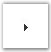{border="0"}

[]{style="FONT-FAMILY: 'Trebuchet MS','sans-serif'; COLOR: #15428b; FONT-SIZE: 9pt"} 

Collapse Image

[]{style="FONT-FAMILY: 'Trebuchet MS','sans-serif'; COLOR: #15428b; FONT-SIZE: 9pt"} 

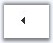{border="0"}

[]{style="FONT-FAMILY: 'Trebuchet MS','sans-serif'; COLOR: #15428b; FONT-SIZE: 9pt"} 

Expand Image Hover

[]{style="FONT-FAMILY: 'Trebuchet MS','sans-serif'; COLOR: #15428b; FONT-SIZE: 9pt"} 

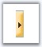{border="0"}

[]{style="FONT-FAMILY: 'Trebuchet MS','sans-serif'; COLOR: #15428b; FONT-SIZE: 9pt"} 

Collapse Image Hover

[]{style="FONT-FAMILY: 'Trebuchet MS','sans-serif'; COLOR: #15428b; FONT-SIZE: 9pt"} 

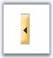{border="0"}

[]{style="FONT-FAMILY: 'Trebuchet MS','sans-serif'; COLOR: #15428b; FONT-SIZE: 9pt"} 

Splitter_style.css file

**[]{style="FONT-FAMILY: 'Trebuchet MS','sans-serif'; COLOR: #15428b"}** 

+----------------------------------------------------------------------------------------------------------------------------------------------------------------------+
| **[\[CSS\]]{style="FONT-FAMILY: 'Courier New'"}**                                                                                                                    |
|                                                                                                                                                                      |
| **[]{style="FONT-FAMILY: '@Arial Unicode MS','sans-serif'"}**                                                                                                        |
|                                                                                                                                                                      |
| [SplitterBar_Default]{style="FONT-FAMILY: 'Courier New'; COLOR: maroon"}                                                                                             |
|                                                                                                                                                                      |
| [{]{style="FONT-FAMILY: 'Courier New'"}                                                                                                                              |
|                                                                                                                                                                      |
| [    [background-image]{style="COLOR: red"}:[url(../images/splitterbar_bg_default.gif)]{style="COLOR: blue"};]{style="FONT-FAMILY: 'Courier New'"}                   |
|                                                                                                                                                                      |
| [    [border-left]{style="COLOR: red"}:[1px]{style="COLOR: blue"} [solid]{style="COLOR: blue"} [#8FB7D1]{style="COLOR: blue"};]{style="FONT-FAMILY: 'Courier New'"}  |
|                                                                                                                                                                      |
| [    [border-right]{style="COLOR: red"}:[1px]{style="COLOR: blue"} [solid]{style="COLOR: blue"} [#8FB7D1]{style="COLOR: blue"};]{style="FONT-FAMILY: 'Courier New'"} |
|                                                                                                                                                                      |
| [}]{style="FONT-FAMILY: 'Courier New'"}                                                                                                                              |
+----------------------------------------------------------------------------------------------------------------------------------------------------------------------+

[]{style="FONT-FAMILY: 'Trebuchet MS','sans-serif'; COLOR: #15428b; FONT-SIZE: 9pt"} 

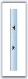{border="0"}

Figure 397: Default Splitter Bar

[]{style="FONT-FAMILY: 'Trebuchet MS','sans-serif'; COLOR: #15428b; FONT-SIZE: 9pt"} 

+----------------------------------------------------------------------------------------------------------------------------------------------------------------------+
| **[\[CSS\]]{style="FONT-FAMILY: 'Courier New'"}**                                                                                                                    |
|                                                                                                                                                                      |
| **[]{style="FONT-FAMILY: '@Arial Unicode MS','sans-serif'"}**                                                                                                        |
|                                                                                                                                                                      |
| [SplitterBar_Hover]{style="FONT-FAMILY: 'Courier New'; COLOR: maroon"}                                                                                               |
|                                                                                                                                                                      |
| [{]{style="FONT-FAMILY: 'Courier New'"}                                                                                                                              |
|                                                                                                                                                                      |
| [    [background-color]{style="COLOR: red"}:[#FEEECD]{style="COLOR: blue"};            ]{style="FONT-FAMILY: 'Courier New'"}                                         |
|                                                                                                                                                                      |
| [    [border-left]{style="COLOR: red"}:[1px]{style="COLOR: blue"} [solid]{style="COLOR: blue"} [#8FB7D1]{style="COLOR: blue"};]{style="FONT-FAMILY: 'Courier New'"}  |
|                                                                                                                                                                      |
| [    [border-right]{style="COLOR: red"}:[1px]{style="COLOR: blue"} [solid]{style="COLOR: blue"} [#8FB7D1]{style="COLOR: blue"};]{style="FONT-FAMILY: 'Courier New'"} |
|                                                                                                                                                                      |
| [}]{style="FONT-FAMILY: 'Courier New'"}                                                                                                                              |
+----------------------------------------------------------------------------------------------------------------------------------------------------------------------+

[]{style="FONT-FAMILY: 'Trebuchet MS','sans-serif'; COLOR: #15428b; FONT-SIZE: 9pt"} 

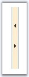{border="0"}

Figure 398: Hover Splitter Bar

[]{style="FONT-FAMILY: 'Trebuchet MS','sans-serif'; COLOR: #15428b; FONT-SIZE: 9pt"} 

+-----------------------------------------------------------------------------------------------------------------------------------------------------------------+
| **[\[CSS\]]{style="FONT-FAMILY: 'Courier New'"}**                                                                                                               |
|                                                                                                                                                                 |
| **[]{style="FONT-FAMILY: '@Arial Unicode MS','sans-serif'"}**                                                                                                   |
|                                                                                                                                                                 |
| [DragSplitterBar_Default]{style="FONT-FAMILY: 'Courier New'; COLOR: maroon"}                                                                                    |
|                                                                                                                                                                 |
| [{]{style="FONT-FAMILY: 'Courier New'"}                                                                                                                         |
|                                                                                                                                                                 |
| [    [z-index]{style="COLOR: red"} : [500]{style="COLOR: blue"};]{style="FONT-FAMILY: 'Courier New'"}                                                           |
|                                                                                                                                                                 |
| [    [background-color]{style="COLOR: red"}: [#D2E3F0]{style="COLOR: blue"};]{style="FONT-FAMILY: 'Courier New'"}                                               |
|                                                                                                                                                                 |
| [    [filter]{style="COLOR: red"}:[progid:DXImageTransform.Microsoft.Alpha(opacity=60)]{style="COLOR: blue"}; ]{style="FONT-FAMILY: 'Courier New'"}             |
|                                                                                                                                                                 |
| [    [opacity]{style="COLOR: red"}: [0.6]{style="COLOR: blue"};]{style="FONT-FAMILY: 'Courier New'"}                                                            |
|                                                                                                                                                                 |
| [    [border]{style="COLOR: red"}: [1px]{style="COLOR: blue"} [solid]{style="COLOR: blue"} [#8FB7D1]{style="COLOR: blue"};]{style="FONT-FAMILY: 'Courier New'"} |
|                                                                                                                                                                 |
| [}]{style="FONT-FAMILY: 'Courier New'"}                                                                                                                         |
+-----------------------------------------------------------------------------------------------------------------------------------------------------------------+

[]{style="FONT-FAMILY: 'Trebuchet MS','sans-serif'; COLOR: #15428b; FONT-SIZE: 9pt"} 

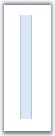{border="0"}

Figure 399: Default DragSplitterBar

[]{style="FONT-FAMILY: 'Trebuchet MS','sans-serif'; COLOR: #15428b; FONT-SIZE: 9pt"} 

+-------------------------------------------------------------------------------------------------------------------------------------------------------------+
| **[\[CSS\]]{style="FONT-FAMILY: 'Courier New'"}**                                                                                                           |
|                                                                                                                                                             |
| **[]{style="FONT-FAMILY: '@Arial Unicode MS','sans-serif'"}**                                                                                               |
|                                                                                                                                                             |
| [ErrorDragSplitterBar_Default]{style="FONT-FAMILY: 'Courier New'; COLOR: maroon"}                                                                           |
|                                                                                                                                                             |
| [{]{style="FONT-FAMILY: 'Courier New'"}                                                                                                                     |
|                                                                                                                                                             |
| [    [z-index]{style="COLOR: red"} : [500]{style="COLOR: blue"};]{style="FONT-FAMILY: 'Courier New'"}                                                       |
|                                                                                                                                                             |
| [    [border]{style="COLOR: red"}: [1px]{style="COLOR: blue"} [solid]{style="COLOR: blue"} [red]{style="COLOR: blue"};]{style="FONT-FAMILY: 'Courier New'"} |
|                                                                                                                                                             |
| [    [background-color]{style="COLOR: red"}: [#f60]{style="COLOR: blue"};]{style="FONT-FAMILY: 'Courier New'"}                                              |
|                                                                                                                                                             |
| [    [filter]{style="COLOR: red"}:[progid:DXImageTransform.Microsoft.Alpha(opacity=60)]{style="COLOR: blue"}; ]{style="FONT-FAMILY: 'Courier New'"}         |
|                                                                                                                                                             |
| [    [opacity]{style="COLOR: red"}: [0.6]{style="COLOR: blue"};]{style="FONT-FAMILY: 'Courier New'"}                                                        |
|                                                                                                                                                             |
| [}]{style="FONT-FAMILY: 'Courier New'"}                                                                                                                     |
+-------------------------------------------------------------------------------------------------------------------------------------------------------------+

[]{style="FONT-FAMILY: 'Trebuchet MS','sans-serif'; COLOR: #15428b; FONT-SIZE: 9pt"} 

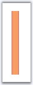{border="0"}

Figure 400: Default DragSplitterBar for errors

[]{style="FONT-FAMILY: 'Trebuchet MS','sans-serif'; COLOR: #15428b; FONT-SIZE: 9pt"} 

Images

[]{style="FONT-FAMILY: 'Trebuchet MS','sans-serif'; COLOR: #15428b; FONT-SIZE: 9pt"} 

The result will be like this.

[]{style="FONT-FAMILY: 'Trebuchet MS','sans-serif'; COLOR: #15428b; FONT-SIZE: 9pt"} 

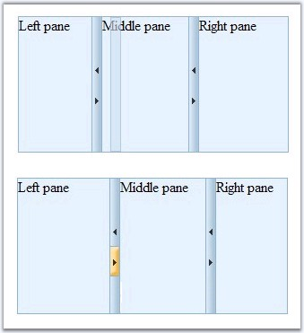{border="0"}

Figure 401

[]{style="FONT-FAMILY: 'Trebuchet MS','sans-serif'; COLOR: #15428b; FONT-SIZE: 9pt"} 

SlidingPane\'s additional css properties to enrich the appearance settings.

[]{style="FONT-FAMILY: 'Trebuchet MS','sans-serif'; COLOR: #15428b; FONT-SIZE: 9pt"} 

::: {align="center"}
  ------------------- -----------------------------------------------------------------------------------------------------------------------------------------------------
  Property            Description
  TabAppearanceMode   Specifies enum values: TextOnly, ImageOnly, TextAndImage.
  ImageUrl            Specifies the image to be displayed on slide. This image will be displayed only if we set **TabAppearanceMode** property to TextandImage/ImageOnly.
  DockImageUrl        Specifies the url for the dock image for the pane.
  UnDockImageUrl      Specifies the url for the undock image for the pane.
  CollapseImageUrl    Specifies the url for the collapse image for the pane.
  ------------------- -----------------------------------------------------------------------------------------------------------------------------------------------------
:::

[]{style="FONT-FAMILY: 'Trebuchet MS','sans-serif'; COLOR: #15428b; FONT-SIZE: 9pt"} 

::: {align="center"}
  ---------------------------------------- ---------------------------------------------------------------------------------------------------------------------------------------------------------
  Class                                    Description
  SlidingPaneCollapseHeaderCssClass        This collapse header part will get affected by setting these properties - SlidingPaneCollapseHeaderCssClass and SlidingPaneCollapseHeaderHoverCssClass.
  SlidingPaneCollapseHeaderHoverCssClass   Specifies the css class for a collapsed sliding pane when hovered.
  SlidingPaneExpandHeaderCssClass          This expand header part will get affected by setting these properties - SlidingPaneCollapseHeaderCssClass and SlidingPaneCollapseHeaderHoverCssClass.
  SlidingPaneExpandHeaderHoverCssClass     Specifies the css class for an expanded sliding pane when hovered.
  SlidingPaneResizeBarCssClass             Specifies the resize bar css class of the sliding pane.
  SlidingPaneResizeBarHoverCssClass        Specifies the resize bar hover css class of the sliding pane.
  ---------------------------------------- ---------------------------------------------------------------------------------------------------------------------------------------------------------
:::

[]{style="FONT-FAMILY: 'Trebuchet MS','sans-serif'; COLOR: #15428b; FONT-SIZE: 9pt"} 

TabAppearanceMode

[]{style="FONT-FAMILY: 'Trebuchet MS','sans-serif'; COLOR: #15428b; FONT-SIZE: 9pt"} 

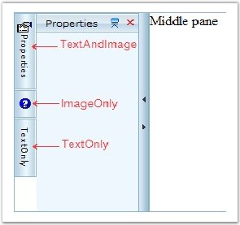{border="0"}

[]{style="FONT-FAMILY: 'Trebuchet MS','sans-serif'; COLOR: #15428b; FONT-SIZE: 9pt"} 

ImageURL

[]{style="FONT-FAMILY: 'Trebuchet MS','sans-serif'; COLOR: #15428b; FONT-SIZE: 9pt"} 

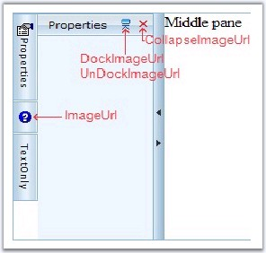{border="0"}

**[]{style="FONT-FAMILY: 'Trebuchet MS','sans-serif'; COLOR: #15428b; FONT-SIZE: 9pt"}** 

SlidingPaneCollapseHeaderCssClass

**[]{style="FONT-FAMILY: 'Trebuchet MS','sans-serif'; COLOR: #15428b; FONT-SIZE: 9pt"}** 

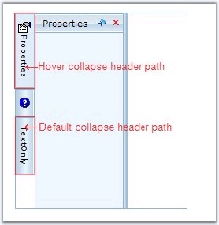{border="0"}

**[]{style="FONT-FAMILY: 'Trebuchet MS','sans-serif'; COLOR: #15428b; FONT-SIZE: 9pt"}** 

SlidingPaneExpandHeaderCssClass

**[]{style="FONT-FAMILY: 'Trebuchet MS','sans-serif'; COLOR: #15428b; FONT-SIZE: 9pt"}** 

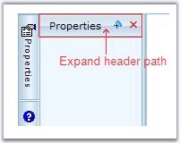{border="0"}

[]{style="FONT-FAMILY: 'Trebuchet MS','sans-serif'; COLOR: #15428b; FONT-SIZE: 9pt"} 

SlidingPaneResizeBarCssClass

[]{style="FONT-FAMILY: 'Trebuchet MS','sans-serif'; COLOR: #15428b; FONT-SIZE: 9pt"} 

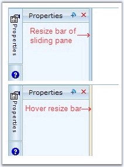{border="0"}

 

 

 

[]{#related-topics}
::::::
